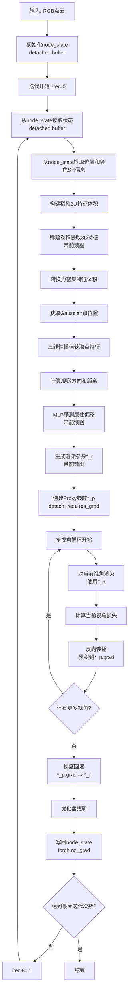

# StreetForward 模型设计文档

## 概述

本文档讨论并设计一个新的3D Gaussian Splatting模型——**StreetForward**。该模型从点云初始化开始，通过3D特征提取、特征插值、MLP预测偏移，最终渲染图像并计算损失。StreetForward采用多次迭代优化机制，与EVolSplat类似，但使用不同的特征提取和偏移预测策略。模型使用VanillaGaussians节点存储3DGS参数，在每次迭代中更新节点属性。

**关键特性**：
- 每次迭代都进行渲染和反向传播
- 支持多target视角的监督，通过Proxy参数+梯度回灌机制避免显存爆炸和二次反传共享图问题
- StreetForward网络输出偏移量，生成渲染参数，使用Proxy参数进行渲染，梯度回灌到前馈网络

## 核心思想

1. **点云初始化**：从RGB点云初始化VanillaGaussians节点
2. **迭代优化**：通过多次迭代逐步优化3DGS参数
3. **3D特征提取**：构建稀疏3D特征体积，通过稀疏卷积提取特征（不使用freeze_volume机制）
4. **特征插值**：从3D特征体积中插值获取每个Gaussian点的特征
5. **MLP预测偏移量**：通过MLP head预测3DGS各属性的偏移量（不是属性本身）
6. **生成渲染参数**：将偏移量应用到node_state（detached buffer），生成带前馈图的渲染参数`*_r`
7. **创建Proxy参数**：创建Proxy参数`*_p = *_r.detach().requires_grad_(True)`用于渲染
8. **多视角渲染与梯度累积**：对每个target视角使用Proxy参数渲染，逐视角`loss.backward()`累积梯度到`*_p.grad`
9. **梯度回灌**：view loop结束后，使用`torch.autograd.backward`一次性将`*_p.grad`回灌到`*_r`，进而回传到前馈网络
10. **优化器更新**：更新feed-forward网络参数，并用`*_r.detach()`写回node_state（必须`torch.no_grad()`）
11. **迭代循环**：重复步骤3-10，每次迭代都进行完整的渲染和反向传播

---

## 算法流程

### 整体流程图



### 详细步骤

#### 步骤1: 点云初始化 (`init_node_from_pointcloud`)

**参考代码**: `models/trainers/evolsplat.py:359-439`

**功能**：从RGB点云初始化node_state（detached buffer）

**输入**：

- `scene_id`: 场景ID
- `segment_id`: 段ID
- `pointcloud`: Open3D点云或包含背景点的字典

**处理流程**：

1. **提取点云数据**：

   ```python
   if isinstance(pointcloud, dict):
       background = pointcloud.get("background", np.zeros((0, 6), dtype=np.float32))
       points = background[:, :3]  # [N, 3]
       colors = background[:, 3:] / 255.0  # [N, 3]
   else:
       points = np.asarray(pointcloud.points)  # [N, 3]
       colors = np.asarray(pointcloud.colors)  # [N, 3]
       if colors.max() > 1.0:
           colors = colors / 255.0
   ```
2. **转换为张量**：

   ```python
   means = torch.from_numpy(points).float().to(device)  # [N, 3]
   colors_rgb = torch.from_numpy(colors).float().to(device)  # [N, 3]
   ```
3. **创建VanillaGaussians节点（用于初始化）**：

   ```python
   node = VanillaGaussians(
       class_name="Background",
       ctrl=ctrl_cfg,
       scene_scale=30.0,
       scene_origin=torch.zeros(3, device=device),
       num_train_images=300,
       device=device,
   )
   ```
4. **从点云初始化**：

   ```python
   node.create_from_pcd(means, colors_rgb)
   ```
5. **计算初始尺度**（使用KNN）：

   ```python
   distances, _ = k_nearest_sklearn(means.cpu(), k=3)
   avg_dist = distances.mean(dim=-1, keepdim=True)
   initial_scales = torch.log(avg_dist.repeat(1, 3))
   ```
6. **创建node_state（detached buffer）**：

   ```python
   # 创建node_state，所有字段都是detached buffer
   node_state = NodeState()
   with torch.no_grad():
       node_state.means = node._means.detach().clone()
       node_state.scales_log = node._scales.detach().clone()
       node_state.quats = node._quats.detach().clone()
       node_state.opacity_logit = node._opacities.detach().clone()
       node_state.sh_dc = node._features_dc.detach().clone()
       node_state.sh_rest = node._features_rest.detach().clone()
   ```

**输出**：

- `node_state`: 初始化完成的node_state（所有字段都是detached buffer）
- node_state包含初始的means、scales_log、quats、opacity_logit、sh_dc、sh_rest等属性

**注意**：
- node_state的所有字段都是detached buffer，不参与autograd
- 在迭代优化过程中，node_state参数会在每次迭代后更新（通过`copy_`操作，必须`torch.no_grad()`）
- 下一次迭代会从node_state读取更新后的参数（detached）

---

#### 步骤2: 从node_state获取当前参数（迭代中）

**功能**：在每次迭代开始时，从node_state（detached buffer）获取当前的3DGS参数，并提取位置和颜色信息用于3D特征提取

**重要说明**：
- `node_state`只作为场景状态缓存，所有字段都是**detached buffer**，不参与autograd
- `node_state`不与feed-forward网络连接，只是输入状态
- 禁止让`node_state`字段`requires_grad=True`，避免被optimizer管理

**处理流程**：

```python
# 从node_state获取当前参数（第一次迭代使用初始值，后续迭代使用更新后的值）
# node_state: 全部是detached buffer，不参与autograd
means_s = node_state.means            # [N, 3] - 当前Gaussian点位置（detached）
scales_log_s = node_state.scales_log  # [N, 3] (log尺度，detached)
quats_s = node_state.quats            # [N, 4] (detached)
opacity_logit_s = node_state.opacity_logit  # [N, 1] (logit，detached)
sh_dc_s = node_state.sh_dc            # [N, 3] - SH DC项（detached）
sh_rest_s = node_state.sh_rest         # [N, num_sh_bases-1, 3] - SH高阶项（detached）

# 从SH系数提取RGB特征用于3D特征提取
anchor_feats_rgb = SH2RGB(sh_dc_s)  # [N, 3] - 将SH DC项转换为RGB
```

**输出**：

- `means_s`: 当前Gaussian点位置 [N, 3]（detached），用于构建3D特征体积和预测偏移
- `anchor_feats_rgb`: RGB特征 [N, 3]，用于构建3D特征体积
- 其他node_state参数（scales_log_s, quats_s, opacity_logit_s, sh_dc_s, sh_rest_s）用于后续的偏移计算

**注意**：
- RGB点云由当前的node_state提供，只提取位置（`means_s`）和颜色SH信息（`sh_dc_s`转换为RGB）
- 第一次迭代时，node_state参数来自初始化；后续迭代时，node_state参数来自上一次迭代的写回结果（detached）
- node_state的所有字段都是detached buffer，不会与前馈网络的计算图连接
- **设计选择**：使用旧的`means_s`构建3D特征体积，这是截断的迭代优化设计（见步骤6说明）。当前iteration的offset学习完全依赖旧状态的特征，position update对特征的影响要等到下一iteration

---

#### 步骤3: 3D特征提取

**参考代码**: `models/trainers/evolsplat.py:684-698`

**功能**：从点云构建3D特征体积并提取特征

**输入**：

- `means`: Gaussian点位置 [N, 3]
- `anchor_feats_rgb`: 点云RGB特征 [N, 3]

**处理流程**：

1. **构建稀疏张量**：

   ```python
   sparse_feat, vol_dim, valid_coords = construct_sparse_tensor(
       raw_coords=means.clone(),
       feats=anchor_feats_rgb,
       Bbx_max=bbx_max,
       Bbx_min=bbx_min,
       voxel_size=voxel_size,
   )
   ```

   - 将点云位置和RGB特征转换为稀疏体素表示
   - `sparse_feat`: 稀疏特征张量
   - `vol_dim`: 体积维度 [D, H, W]（深度、高度、宽度）
   - `valid_coords`: 有效体素坐标
2. **稀疏卷积提取特征**：

   ```python
   feat_3d = sparse_conv(sparse_feat)  # 需要梯度！
   ```

   - 使用稀疏3D卷积网络提取特征
   - 输出特征维度：`[num_voxels, sparse_conv_outdim]`
3. **转换为密集体积**：

   ```python
   dense_volume = sparse_to_dense_volume(
       sparse_tensor=feat_3d,
       coords=valid_coords,
       vol_dim=vol_dim,
   ).unsqueeze(dim=0)  # [1, H, W, D, C]
   # 转换为PyTorch grid_sample标准格式: (N, C, D, H, W)
   dense_volume = rearrange(dense_volume, "B H W D C -> B C D H W")  # [1, C, D, H, W]
   ```

**输出**：

- `dense_volume`: 密集3D特征体积 [1, C, D, H, W]（PyTorch grid_sample标准格式）
- `vol_dim`: 体积维度 [D, H, W]（注意顺序：深度、高度、宽度）
- `valid_coords`: 有效坐标

**注意**：

- 本设计**不使用freeze_volume机制**，每次前向传播都重新计算特征体积
- 训练时保持梯度，以便端到端优化
- **设计选择**：当前iteration的3D特征体积使用**旧的`means_s`**（从node_state读取）构建，这是截断的迭代优化设计（见步骤6说明）

---

#### 步骤4: 获取Gaussian点对应特征

**参考代码**: `models/trainers/evolsplat.py:705-708`

**功能**：从3D特征体积中插值获取每个Gaussian点的特征

**输入**：

- `means_crop`: Gaussian点位置 [num_points, 3]（世界坐标）
- `dense_volume`: 密集特征体积 [1, C, D, H, W]（PyTorch grid_sample标准格式）
- `bbx_min`: 边界框最小值
- `voxel_size`: 体素大小
- `vol_dim`: 体积维度 [D, H, W]（深度、高度、宽度）

**处理流程**：

1. **计算网格坐标**：

   ```python
   def get_grid_coords(position_w, bbx_min, vol_dim, voxel_size):
       """
       计算grid_sample所需的归一化坐标
       
       Args:
           position_w: 世界坐标 [N, 3] (x, y, z)
           bbx_min: 边界框最小值 [3]
           vol_dim: 体积维度 [D, H, W]（深度、高度、宽度）
           voxel_size: 体素大小
       
       Returns:
           grid_coords: 归一化坐标 [N, 3] (x, y, z)，对应(W, H, D)
       """
       pts = position_w - bbx_min  # [N, 3]
       x_index = pts[..., 0] / voxel_size  # 对应W维度
       y_index = pts[..., 1] / voxel_size  # 对应H维度
       z_index = pts[..., 2] / voxel_size  # 对应D维度
       
       # 归一化到[-1, 1]（align_corners=True）
       # vol_dim顺序: [D, H, W]
       W, H, D = vol_dim[2], vol_dim[1], vol_dim[0]
       x_norm = x_index / (W - 1) * 2 - 1  # x对应W
       y_norm = y_index / (H - 1) * 2 - 1  # y对应H
       z_norm = z_index / (D - 1) * 2 - 1  # z对应D
       
       # grid_sample要求最后一维顺序是(x, y, z)，对应(W, H, D)
       grid_coords = torch.stack([x_norm, y_norm, z_norm], dim=-1)  # [N, 3]
       return grid_coords

   grid_coords = get_grid_coords(means_crop, bbx_min, vol_dim, voxel_size)
   # grid_coords: [num_points, 3] (x, y, z)，对应(W, H, D)
   ```
2. **三线性插值**：

   ```python
   def interpolate_features(grid_coords, feature_volume):
       """
       从3D特征体积中插值获取点特征
       
       Args:
           grid_coords: 归一化坐标 [N, 3] (x, y, z)
           feature_volume: 特征体积 [1, C, D, H, W]
       
       Returns:
           feature: 点特征 [N, C]
       """
       # grid_sample要求输入: (N, C, D, H, W) 和 (N, ..., 3)
       # 扩展grid_coords维度: [1, 1, 1, num_points, 3]
       grid_coords_expanded = grid_coords[None, None, None, ...]  # [1, 1, 1, N, 3]
       
       feature = torch.nn.functional.grid_sample(
           feature_volume,  # [1, C, D, H, W]
           grid_coords_expanded,
           mode="bilinear",
           align_corners=True,
           padding_mode="zeros",
       )
       # 输出形状: [1, C, 1, 1, N]
       # 最简单安全的提取方式: [0, :, 0, 0, :].T -> [N, C]
       feature = feature[0, :, 0, 0, :].T  # [N, C]
       return feature

   feat_3d_crop = interpolate_features(grid_coords, dense_volume)
   # feat_3d_crop: [num_points, C]
   ```

**输出**：

- `feat_3d_crop`: 每个Gaussian点的3D特征 [num_points, C]
- `C = sparse_conv_outdim`（通常为32或64）

---

#### 步骤5: MLP Head预测属性偏移

**功能**：通过MLP head预测3DGS各属性的偏移值

**输入**：

- `feat_3d_crop`: 3D特征 [num_points, C]（只使用3D特征，不使用观察信息）

**MLP Head设计**：

需要为以下属性分别设计MLP head：

1. **位置偏移 (Position Offset)**
2. **尺度偏移 (Scale Offset)**
3. **旋转偏移 (Rotation Offset)**
4. **不透明度偏移 (Opacity Offset)**
5. **颜色偏移 (Color Offset)**

---

### 偏移设计讨论

#### 4.1 位置偏移 (Position Offset)

**设计选项**：

**选项B: 预测归一化偏移（推荐）**

```python
offset_pos = mlp_offset_pos(feat_3d)  # [num_points, 3], 输出范围[-1, 1]
offset_pos = offset_max * torch.tanh(offset_pos)  # 限制在[-offset_max, offset_max]
means_new = means + offset_pos
```

- **优点**：偏移范围可控，训练稳定
- **缺点**：需要设置合适的 `offset_max`


#### 4.2 尺度偏移 (Scale Offset)

**设计选项**：

**选项A: 预测对数尺度偏移（推荐）**

```python
offset_scale = mlp_offset_scale(feat_3d_crop)  # [num_points, 3]，只使用feat_3d_crop
scales_log_s = node_state.scales_log  # [num_points, 3] (log尺度，detached)
scales_log_r = scales_log_s + offset_scale  # 带前馈图
scales_activated = torch.exp(scales_log_r)  # 转换为实际尺度
```

- **优点**：在log空间操作，数值稳定
- **缺点**：需要从node_state读取当前尺度

---

#### 4.3 旋转偏移 (Rotation Offset)

**设计选项**：

**选项A: 预测四元数增量（推荐）**

```python
offset_quat = mlp_offset_rot(feat_3d_crop)  # [num_points, 4]，只使用feat_3d_crop
offset_quat = offset_quat / offset_quat.norm(dim=-1, keepdim=True)  # 归一化
# 从node_state读取当前旋转（detached）
quats_s = node_state.quats  # [num_points, 4] (detached)
# 四元数乘法组合旋转（带前馈图）
quats_r = normalize_quat(quaternion_multiply(quats_s, offset_quat))
```

- **优点**：旋转组合自然，数值稳定
- **缺点**：需要四元数乘法实现

---

#### 4.4 不透明度偏移 (Opacity Offset)

**设计选项**：

**选项A: 预测logit偏移（推荐）**

```python
offset_opacity = mlp_opacity(feat_3d_crop)  # [num_points, 1]，只使用feat_3d_crop
opacity_logit_s = node_state.opacity_logit  # [num_points, 1] (logit，detached)
opacity_logit_r = opacity_logit_s + offset_opacity  # 带前馈图
opacity_activated = torch.sigmoid(opacity_logit_r)  # [0, 1]
```

- **优点**：在logit空间操作，数值稳定
- **缺点**：需要从node_state读取当前不透明度logit

---

#### 4.5 颜色偏移 (Color Offset)

**设计选项**：

**选项A: 预测SH系数偏移（推荐）**

```python
# 只使用3D特征
offset_sh = gaussion_decoder(feat_3d_crop)  # [num_points, 3 * num_sh_bases]
offset_sh_dc = offset_sh[:, :3]  # DC项
offset_sh_rest = offset_sh[:, 3:].reshape(num_points, -1, 3)  # 高阶项

# 从node_state读取当前SH系数（detached）
sh_dc_s = node_state.sh_dc  # [num_points, 3] (detached)
sh_rest_s = node_state.sh_rest  # [num_points, num_sh_bases-1, 3] (detached)

# 应用偏移（带前馈图）
sh_dc_r = sh_dc_s + offset_sh_dc
sh_rest_r = sh_rest_s + offset_sh_rest
```

- **优点**：直接操作SH系数，与3DGS标准一致
- **缺点**：需要处理SH系数的数值范围

---

### MLP Head架构设计

**位置偏移MLP**：

```python
mlp_offset_pos = nn.Sequential(
    nn.Linear(sparse_conv_outdim, 64),
    nn.ReLU(),
    nn.Linear(64, 32),
    nn.ReLU(),
    nn.Linear(32, 3),  # 输出3D偏移
)
```

**尺度/旋转/不透明度MLP**（只使用3D特征）：

```python
mlp_conv = nn.Sequential(
    nn.Linear(sparse_conv_outdim, 64),  # 只使用feat_3d_crop
    nn.ReLU(),
    nn.Linear(64, 32),
    nn.ReLU(),
    nn.Linear(32, 7),  # 输出scales(3) + quats(4)
)
mlp_opacity = nn.Sequential(
    nn.Linear(sparse_conv_outdim, 64),  # 只使用feat_3d_crop
    nn.ReLU(),
    nn.Linear(64, 32),
    nn.ReLU(),
    nn.Linear(32, 1),  # 输出不透明度偏移
)
```

**颜色MLP**（只使用3D特征）：

```python
gaussion_decoder = nn.Sequential(
    nn.Linear(sparse_conv_outdim, 64),  # 只使用feat_3d_crop
    nn.ReLU(),
    nn.Linear(64, 32),
    nn.ReLU(),
    nn.Linear(32, 3 * num_sh_bases),  # 输出SH系数
)
```

---

#### 步骤6: 生成渲染参数（修正版）

**功能**：将预测的偏移量应用到node_state（detached buffer），生成本iteration的渲染参数`*_r`（带前馈图）

**重要说明**：
- StreetForward网络输出的是**偏移量**（offset），不是3DGS属性本身
- node_state不参与autograd，只是输入状态（全部是detached buffer）
- 前馈网络输出的渲染参数`*_r`才是需要梯度的张量，连接到前馈网络
- **禁止**：`node_state.means = node_state.means + offset_pos`（这会把图挂到node_state上，导致跨iteration串图/泄漏）

**设计选择：截断的迭代优化（Truncated BPTT）**：
- **当前iteration的3D特征体积**使用**旧的`means_s`**（从node_state读取）构建
- **当前iteration的渲染**使用**更新后的`means_r`**（应用offset后）
- 这意味着：当前iteration的offset学习完全依赖旧状态的特征（不受本iteration的position update影响）
- position update对特征的影响要等到下一iteration（通过写回node_state）
- 这是**设计选择**（截断的迭代优化/truncated BPTT），不是疏漏，通常OK且更稳定

**处理流程**：

```python
# node_state: 全部是detached buffer，不参与autograd
means_s        = node_state.means            # [N, 3], no grad
scales_log_s   = node_state.scales_log       # [N, 3], no grad
quats_s        = node_state.quats            # [N, 4], no grad
opacity_logit_s= node_state.opacity_logit    # [N, 1], no grad
sh_dc_s        = node_state.sh_dc            # [N, 3], no grad
sh_rest_s      = node_state.sh_rest          # [N, num_sh_bases-1, 3], no grad

# 前馈网络预测offsets（带前馈图，只使用feat_3d_crop）
offset_pos     = offset_max * torch.tanh(mlp_offset_pos(feat_3d_crop))          # [N, 3]
offset_scales  = mlp_scales(feat_3d_crop)                                       # [N, 3]
offset_quat    = mlp_rot(feat_3d_crop)                                          # [N, 4]
offset_opacity = mlp_opacity(feat_3d_crop)                                      # [N, 1]
offset_sh      = gaussion_decoder(feat_3d_crop)                                 # [N, 3*num_sh_bases]

offset_quat = offset_quat / (offset_quat.norm(dim=-1, keepdim=True) + 1e-8)

# 得到本iteration的"渲染参数"（带前馈图）—— 注意：这里仍然不写回node_state
means_r        = means_s + offset_pos
scales_log_r   = scales_log_s + offset_scales
quats_r        = normalize_quat(quaternion_multiply(quats_s, offset_quat))
opacity_logit_r= opacity_logit_s + offset_opacity
sh_dc_r        = sh_dc_s + offset_sh[:, :3]
sh_rest_r      = sh_rest_s + offset_sh[:, 3:].reshape(N, -1, 3)

# 激活到renderer需要的形式（仍属于*_r图的一部分）
scales_r    = torch.exp(scales_log_r)
opacities_r = torch.sigmoid(opacity_logit_r).squeeze(-1)
colors_r    = torch.cat([sh_dc_r[:, None, :], sh_rest_r], dim=1)
```

**输出**：

- **渲染参数`*_r`**：`means_r`, `scales_r`, `quats_r`, `opacities_r`, `colors_r`（带前馈图，连接到sparse_conv和MLP heads）
- **未激活参数**：`scales_log_r`, `opacity_logit_r`, `sh_dc_r`, `sh_rest_r`（用于后续写回node_state）

**注意**：
- 渲染参数`*_r`通过偏移量连接到前馈网络，可以接收梯度
- node_state不参与autograd，只是输入状态
- 这里不写回node_state，写回操作在步骤8（必须detach/no_grad）

---

#### 步骤7: Proxy渲染 + 多视角梯度累积 + 梯度回灌（修正版）

**参考代码**: `models/trainers/evolsplat.py:812-831, 868-916`

**功能**：使用Proxy参数对每个target视角进行渲染，逐视角累积梯度到Proxy，最后一次性回灌到前馈网络

**输入**：

- `*_r`: 渲染参数（带前馈图）：`means_r`, `scales_r`, `quats_r`, `opacities_r`, `colors_r`
- `target_views`: 多个视角的相机参数
- `gt_images`: 对应的真实图像

**处理流程**：

##### 7.1 创建Proxy参数（用于渲染）

```python
# Proxy：detach前馈图，只在proxy上积累渲染梯度
means_p     = means_r.detach().requires_grad_(True)
scales_p    = scales_r.detach().requires_grad_(True)
quats_p     = quats_r.detach().requires_grad_(True)
opacities_p = opacities_r.detach().requires_grad_(True)
colors_p    = colors_r.detach().requires_grad_(True)
```

> **说明**：Proxy的`grad`表示的是**损失对渲染输入参数的梯度**`dL/d(means, scales, ...)`，这是我们要回灌给前馈网络的"桥梁"。

##### 7.2 多视角逐个backward（只反传渲染图）

```python
target_views = batch["target_views"]  # 多个视角
gt_images = batch["gt_images"]         # 对应的真实图像

V = len(target_views)
total_loss = 0.0
all_outputs = []

for view_idx, (view, gt_img) in enumerate(zip(target_views, gt_images)):
    # 获取当前视角的相机参数
    viewmat_view = get_viewmat(view.camtoworlds)
    K_view = view.Ks[0:1] if hasattr(view, 'Ks') else view.K
    H_view, W_view = gt_img.shape[:2]
    
    # 渲染（使用Proxy参数，只反传渲染图）
    render, alpha, info = rasterization(
        means=means_p,
        quats=quats_p,
        scales=scales_p,
        opacities=opacities_p,
        colors=colors_p,
        viewmats=viewmat_view,
        Ks=K_view,
        width=W_view,
        height=H_view,
        tile_size=16,
        packed=False,
        near_plane=0.01,
        far_plane=1e10,
        render_mode="RGB",
        sh_degree=sh_degree,
        sparse_grad=False,
        absgrad=True,
        rasterize_mode="classic",
    )
    
    rgb = render[:, ..., :3].squeeze(0)  # [H, W, 3]
    acc = alpha.squeeze(0)              # [H, W]
    
    # 计算损失（归一化）
    loss_dict = compute_loss(
        outputs={"rgb": rgb, "accumulation": acc},
        gt_image=gt_img,
    )
    loss = loss_dict["main_loss"] / V  # 归一化
    total_loss += loss
    
    # 关键：这里只会给proxy.grad累积梯度，不会二次反传前馈图
    loss.backward()
    
    # 保存输出（用于可视化或监控）
    all_outputs.append({
        "rgb": rgb.detach(),
        "accumulation": acc.detach(),
        "loss": loss.item(),
    })
    
    # 释放当前视角的中间变量
    del render, alpha, info, rgb, acc
```

##### 7.3 梯度回灌（一次性反传前馈图）

```python
# 回灌：用proxy.grad作为外部梯度，把梯度传回*_r，从而传到sparse_conv / MLP
torch.autograd.backward(
    tensors=[means_r, scales_r, quats_r, opacities_r, colors_r],
    grad_tensors=[means_p.grad, scales_p.grad, quats_p.grad, opacities_p.grad, colors_p.grad],
)
```

> **说明**：这一步之后，`sparse_conv`、`mlp_*`参数上就有了正确的梯度（等价于多视角loss求和后对前馈网络参数求导）。

**输出**：

- `total_loss`: 所有视角的累积损失（标量）
- `all_outputs`: 每个视角的渲染结果和损失（用于可视化或监控）
- **梯度已回灌**：通过`torch.autograd.backward`，梯度已回传到`*_r`，进而回传到前馈网络

**注意**：

- 使用Proxy参数进行渲染，Proxy参数detach了前馈图，只保留渲染图
- 每个视角的`loss.backward()`只会累积到`*_p.grad`，不会触碰前馈图，因此**不会出现二次反传共享图**
- 每个视角的计算图只包含renderer + loss，`backward()`后立刻释放，不需要`retain_graph=True`
- view loop结束后，通过梯度回灌一次性将梯度传回前馈网络，只反传一次前馈图，显存安全

---

#### 步骤8: 优化器更新 + 写回node_state（修正版）

**功能**：更新feed-forward网络参数，并用`*_r.detach()`写回node_state（必须`torch.no_grad()`）

**输入**：

- `*_r`: 渲染参数（带前馈图）：`means_r`, `scales_log_r`, `quats_r`, `opacity_logit_r`, `sh_dc_r`, `sh_rest_r`
- `optimizer`: 优化器（用于更新前馈网络参数）
- `node_state`: node状态缓存（detached buffer）

**处理流程**：

```python
# 1. 更新前馈网络参数
optimizer.step()
optimizer.zero_grad(set_to_none=True)

# 2. 写回node_state：只写detach结果，禁止把图存进node_state
with torch.no_grad():
    node_state.means.copy_(means_r.detach())
    node_state.scales_log.copy_(scales_log_r.detach())
    node_state.quats.copy_(quats_r.detach())
    node_state.opacity_logit.copy_(opacity_logit_r.detach())
    node_state.sh_dc.copy_(sh_dc_r.detach())
    node_state.sh_rest.copy_(sh_rest_r.detach())
```

> **注意**：写回用`copy_`而不是`=`，避免把buffer替换成新对象导致引用/分配混乱。

**输出**：

- **node_state已更新**：node_state的各个字段已被更新为本次iteration的结果（detached）
- **前馈网络已更新**：前馈网络参数已通过optimizer更新

**注意**：

- 写回操作必须在`torch.no_grad()`上下文中进行，确保不会把计算图存进node_state
- 使用`copy_`而不是`=`，避免替换buffer对象
- node_state的所有字段都是detached buffer，不会与前馈网络的计算图连接
- 下一次iteration会从node_state读取更新后的状态（detached）

---

## 多视角梯度累积机制（Proxy参数 + 梯度回灌版）

### 问题背景

在训练StreetForward时，我们希望在一次iteration内对多个target view监督，同时：

* **不使用`retain_graph=True`**
* 每个视角渲染的中间图能及时释放，避免显存爆炸
* **梯度仍能端到端回到**`sparse_conv + MLP heads`（前馈网络）

### 解决方案

使用**Proxy参数 + 梯度回灌**机制：

1. **Feed-forward网络预测偏移量**：网络预测3DGS各属性的偏移量（不是属性本身）
2. **生成渲染参数`*_r`**：将偏移量应用到node_state（detached buffer），生成带前馈图的渲染参数
3. **创建Proxy参数`*_p`**：`*_p = *_r.detach().requires_grad_(True)`，用于渲染
4. **多视角渲染**：对每个视角使用Proxy参数进行渲染
5. **逐视角backward**：每个视角计算损失并调用`loss.backward()`，梯度累积到`*_p.grad`（只反传渲染图）
6. **梯度回灌**：view loop结束后，使用`torch.autograd.backward`一次性将`*_p.grad`回灌到`*_r`，进而回传到前馈网络
7. **优化器更新**：更新前馈网络参数，并用`*_r.detach()`写回node_state（必须`torch.no_grad()`）

### 机制结论

* 多视角的**渲染梯度**（`dL/d(gaussian_params)`）通过逐view `loss.backward()`自动累积在Proxy的`.grad`上
* 前馈网络的梯度不在view loop内反传，而是在view loop后**统一回灌**，只反传一次前馈图

### 显存与正确性

* 每个view的计算图只包含renderer + loss，`backward()`后立刻释放
* 不需要`retain_graph=True`
* 最终得到的梯度与"把所有view loss求和再对前馈网络反传"数学等价

### 实现细节

#### 步骤1: Feed-forward网络预测偏移量

```python
# Feed-forward网络预测偏移量（不是3DGS属性本身，只使用feat_3d_crop）
offset_pos = offset_max * torch.tanh(mlp_offset_pos(feat_3d_crop))  # [N, 3] - 位置偏移量
scales_offset, quats_offset = mlp_conv(feat_3d_crop).split([3, 4], dim=-1)  # [N, 3], [N, 4]
offset_scale = scales_offset  # [N, 3] - 尺度偏移量（log空间）
offset_quat = quats_offset / (quats_offset.norm(dim=-1, keepdim=True) + 1e-8)  # [N, 4] - 旋转偏移量（四元数）
offset_opacity = mlp_opacity(feat_3d_crop)  # [N, 1] - 不透明度偏移量（logit空间）
offset_sh = gaussion_decoder(feat_3d_crop)  # [N, 3*num_sh_bases] - 颜色偏移量（SH系数）
```

**注意**：StreetForward网络输出的是**偏移量**（offset），不是3DGS属性本身。

#### 步骤2: 生成渲染参数`*_r`（不写回node_state）

```python
# 从node_state读取状态（detached buffer）
means_s = node_state.means
scales_log_s = node_state.scales_log
quats_s = node_state.quats
opacity_logit_s = node_state.opacity_logit
sh_dc_s = node_state.sh_dc
sh_rest_s = node_state.sh_rest

# 生成渲染参数（带前馈图）
means_r = means_s + offset_pos
scales_log_r = scales_log_s + offset_scale
quats_r = normalize_quat(quaternion_multiply(quats_s, offset_quat))
opacity_logit_r = opacity_logit_s + offset_opacity
sh_dc_r = sh_dc_s + offset_sh[:, :3]
sh_rest_r = sh_rest_s + offset_sh[:, 3:].reshape(N, -1, 3)

# 激活到renderer需要的形式
scales_r = torch.exp(scales_log_r)
opacities_r = torch.sigmoid(opacity_logit_r).squeeze(-1)
colors_r = torch.cat([sh_dc_r[:, None, :], sh_rest_r], dim=1)
```

**注意**：渲染参数`*_r`通过偏移量连接到前馈网络，可以接收梯度。这里不写回node_state。

#### 步骤3: 创建Proxy参数`*_p`

```python
# Proxy：detach前馈图，只在proxy上积累渲染梯度
means_p     = means_r.detach().requires_grad_(True)
scales_p    = scales_r.detach().requires_grad_(True)
quats_p     = quats_r.detach().requires_grad_(True)
opacities_p = opacities_r.detach().requires_grad_(True)
colors_p    = colors_r.detach().requires_grad_(True)
```

**注意**：Proxy的`grad`表示的是**损失对渲染输入参数的梯度**`dL/d(means, scales, ...)`。

#### 步骤4: 多视角逐个backward（只反传渲染图）

```python
V = len(target_views)
total_loss = 0.0

for view, gt_img in zip(target_views, gt_images):
    # 渲染（使用Proxy参数）
    pred = render(means_p, scales_p, quats_p, opacities_p, colors_p, view)
    
    # 计算损失（归一化）
    loss = compute_loss(pred, gt_img) / V
    total_loss += loss
    
    # 关键：这里只会给proxy.grad累积梯度，不会二次反传前馈图
    loss.backward()
    
    # 释放当前视角的中间变量
    del pred, loss
```

**注意**：通过`loss.backward()`，梯度会累积到`*_p.grad`，不会触碰前馈图，因此**不会出现二次反传共享图**。

#### 步骤5: 梯度回灌（一次性反传前馈图）

```python
# 回灌：用proxy.grad作为外部梯度，把梯度传回*_r，从而传到sparse_conv / MLP
torch.autograd.backward(
    tensors=[means_r, scales_r, quats_r, opacities_r, colors_r],
    grad_tensors=[means_p.grad, scales_p.grad, quats_p.grad, opacities_p.grad, colors_p.grad],
)
```

**注意**：这一步只执行一次，因此前馈图只反传一次，显存安全。

### 优势

1. **显存效率**：不需要`retain_graph=True`，每个视角的计算图在计算完梯度后立即释放
2. **数学等价**：梯度是"真梯度"，等价于将所有视角loss求和后对前馈网络参数求导
3. **避免二次反传**：Proxy参数detach了前馈图，不会出现二次反传共享图问题
4. **代码简洁**：不需要修改renderer内核，只需在外部处理梯度回灌
5. **灵活性**：可以按micro-batch处理视角，进一步优化显存

### 实现注意事项（Torch梯度相关）

1. **Proxy的`.grad`清理**：Proxy每iteration会新建一次，所以不需要手动`zero_`；但不要复用proxy对象跨iteration。

2. **不要让node_state字段`requires_grad=True`**：node_state是缓存，不要被optimizer管，不要进autograd。

3. **tensors/grad_tensors必须一一对应**：形状、dtype、device必须一致；否则回灌会报错或silent cast（不建议）。

4. **关于quats的梯度稳定性**：`normalize(quat)`会引入梯度耦合，建议用`eps`防止除零，并监控梯度爆炸。如有需要可把rotation参数化改成so(3) exponential map（但这是建模层面，不影响本机制成立）。

---

## 完整前向传播流程（修正版）

### Python伪代码

```python
def forward(self, batch, node_state):
    """
    StreetForward前向传播（多次迭代优化，Proxy参数 + 梯度回灌版）
  
    Args:
        batch: 包含target图像和相机参数的batch
        node_state: node状态缓存（detached buffer）
  
    Returns:
        outputs: 渲染结果和损失
    """
    # 步骤1: 初始化node_state（仅在第一次调用时）
    scene_id = batch["scene_id"]
    segment_id = batch["segment_id"]
    
    if (scene_id, segment_id) not in self.node_states:
        node_state = self.init_node_from_pointcloud(
            scene_id=scene_id,
            segment_id=segment_id,
            pointcloud=batch["pointcloud"],
        )
    else:
        node_state = self.node_states[(scene_id, segment_id)]
  
    # 迭代优化循环
    max_iterations = self.config.get("max_iterations", 3)  # 默认3次迭代
    target_views = batch["target_views"]
    gt_images = batch["gt_images"]
    
    for iteration in range(max_iterations):
        # ===== 1) 从node_state取状态（detached buffer）=====
        means_s = node_state.means
        anchor_rgb = SH2RGB(node_state.sh_dc)
      
        # ===== 2) 特征体积（带前馈图）=====
        # 注意：使用旧的means_s构建特征体积（截断的迭代优化设计）
        sparse_feat, vol_dim, valid_coords = construct_sparse_tensor(
            raw_coords=means_s,  # 使用旧的means_s
            feats=anchor_rgb,
            Bbx_max=self.bbx_max,
            Bbx_min=self.bbx_min,
            voxel_size=self.voxel_size,
        )
        feat_3d = self.sparse_conv(sparse_feat)  # 保持梯度
        dense_volume = sparse_to_dense_volume(
            sparse_tensor=feat_3d,
            coords=valid_coords,
            vol_dim=vol_dim,
        ).unsqueeze(dim=0)  # [1, H, W, D, C]
        # 转换为PyTorch grid_sample标准格式: (N, C, D, H, W)
        dense_volume = rearrange(dense_volume, "B H W D C -> B C D H W")  # [1, C, D, H, W]
      
        # ===== 3) 获取点特征 =====
        # 注意：仍然使用旧的means_s进行插值（截断的迭代优化设计）
        grid_coords = self.get_grid_coords(means_s, self.bbx_min, vol_dim, self.voxel_size)
        feat_3d_crop = self.interpolate_features(grid_coords, dense_volume)
        # feat_3d_crop: [N, C]
      
        # ===== 4) 预测offsets -> 渲染参数*_r（带前馈图）=====
        # 只使用feat_3d_crop，不使用ob_view/ob_dist
        # 位置偏移量
        offset_pos = self.offset_max * torch.tanh(self.mlp_offset_pos(feat_3d_crop))
        
        # 尺度、旋转偏移量
        scales_offset, quats_offset = self.mlp_conv(feat_3d_crop).split([3, 4], dim=-1)
        quats_offset = quats_offset / (quats_offset.norm(dim=-1, keepdim=True) + 1e-8)
      
        # 不透明度偏移量
        opacity_offset = self.mlp_opacity(feat_3d_crop)
      
        # 颜色偏移量
        sh_offset = self.gaussion_decoder(feat_3d_crop)
        
        # 生成渲染参数*_r（带前馈图）
        means_r = node_state.means + offset_pos
        scales_log_r = node_state.scales_log + scales_offset
        quats_r = normalize_quat(quaternion_multiply(node_state.quats, quats_offset))
        opacity_logit_r = node_state.opacity_logit + opacity_offset
        sh_dc_r = node_state.sh_dc + sh_offset[:, :3]
        sh_rest_r = node_state.sh_rest + sh_offset[:, 3:].reshape(N, -1, 3)
        
        # 激活到renderer需要的形式
        scales_r = torch.exp(scales_log_r)
        opacities_r = torch.sigmoid(opacity_logit_r).squeeze(-1)
        colors_r = torch.cat([sh_dc_r[:, None, :], sh_rest_r], dim=1)
        
        # ===== 5) Proxy（渲染用）=====
        means_p     = means_r.detach().requires_grad_(True)
        scales_p    = scales_r.detach().requires_grad_(True)
        quats_p     = quats_r.detach().requires_grad_(True)
        opacities_p = opacities_r.detach().requires_grad_(True)
        colors_p    = colors_r.detach().requires_grad_(True)
        
        # ===== 6) 多视角逐个backward（只积proxy.grad）=====
        V = len(target_views)
        total_loss = 0.0
        all_outputs = []
        
        for view, gt_img in zip(target_views, gt_images):
            # 获取当前视角的相机参数
            viewmat_view = get_viewmat(view.camtoworlds)
            K_view = view.Ks[0:1] if hasattr(view, 'Ks') else view.K
            H_view, W_view = gt_img.shape[:2]
            
            # 渲染（使用Proxy参数）
            render, alpha, info = rasterization(
                means=means_p,
                quats=quats_p,
                scales=scales_p,
                opacities=opacities_p,
                colors=colors_p,
                viewmats=viewmat_view,
                Ks=K_view,
                width=W_view,
                height=H_view,
                tile_size=16,
                packed=False,
                near_plane=0.01,
                far_plane=1e10,
                render_mode="RGB",
                sh_degree=self.sh_degree,
                sparse_grad=False,
                absgrad=True,
                rasterize_mode="classic",
            )
            
            rgb = render[:, ..., :3].squeeze(0)  # [H, W, 3]
            acc = alpha.squeeze(0)                # [H, W]
            
            # 计算损失（归一化）
            loss_dict = self.compute_loss(
                outputs={"rgb": rgb, "accumulation": acc},
                gt_image=gt_img,
            )
            loss = loss_dict["main_loss"] / V
            total_loss += loss
            
            # 关键：这里只会给proxy.grad累积梯度，不会二次反传前馈图
            loss.backward()
            
            # 保存输出（用于可视化或监控）
            all_outputs.append({
                "rgb": rgb.detach(),
                "accumulation": acc.detach(),
                "loss": loss.item(),
            })
            
            # 释放当前视角的中间变量
            del render, alpha, info, rgb, acc
        
        # ===== 7) 回灌：一次性反传前馈图 =====
        torch.autograd.backward(
            tensors=[means_r, scales_r, quats_r, opacities_r, colors_r],
            grad_tensors=[means_p.grad, scales_p.grad, quats_p.grad, opacities_p.grad, colors_p.grad],
        )
        
        # ===== 8) 更新前馈网络 =====
        self.optimizer.step()
        self.optimizer.zero_grad(set_to_none=True)
        
        # ===== 9) 写回node_state（detach/no_grad）=====
        with torch.no_grad():
            node_state.means.copy_(means_r.detach())
            node_state.scales_log.copy_(scales_log_r.detach())
            node_state.quats.copy_(quats_r.detach())
            node_state.opacity_logit.copy_(opacity_logit_r.detach())
            node_state.sh_dc.copy_(sh_dc_r.detach())
            node_state.sh_rest.copy_(sh_rest_r.detach())
    
    # 迭代结束，返回结果
    return {
        "outputs": all_outputs,
        "total_loss": total_loss.item(),
        "node_state": node_state,  # 返回更新后的node_state
    }
```

---

## 与EVolSplat的对比

| 特性                 | EVolSplat                          | StreetForward          |
| -------------------- | ---------------------------------- | ---------------------- |
| **优化机制**   | 迭代优化（多次前向传播累积offset） | 迭代优化（多次前向传播更新节点参数） |
| **3D特征体积** | 可冻结（freeze_volume）            | 每次迭代重新计算（不使用freeze_volume） |
| **参数存储**   | 使用offset缓存（detach）           | 使用VanillaGaussians节点存储参数 |
| **参数更新**   | 保存offset到缓存                   | 直接更新节点属性       |
| **渲染时机**   | 每次迭代都渲染                     | 每次迭代都渲染         |
| **反向传播**   | 每次迭代都反向传播                 | 每次迭代都反向传播     |
| **多视角监督** | 支持（标准方式）                   | 支持（梯度累积机制，避免显存爆炸） |
| **训练速度**   | 较慢（需要多次迭代）               | 较慢（需要多次迭代）   |
| **推理速度**   | 较慢                               | 较慢                   |
| **适用场景**   | 高质量重建                         | 高质量重建（未来可扩展） |
| **动态场景**   | 支持（通过时间编码）               | 暂不支持（未来可扩展） |

---

## 未来扩展方向

1. **动态场景支持**：

   - 添加时间编码到特征提取
   - 预测时间相关的属性偏移
2. **多尺度特征**：

   - 使用多分辨率3D特征体积
   - 融合不同尺度的特征
3. **注意力机制**：

   - 在特征提取中加入注意力
   - 自适应特征聚合
4. **正则化项**：

   - 偏移平滑性损失
   - 属性一致性损失

---

## 总结

本文档设计了**StreetForward**模型，一个基于迭代优化的3DGS模型，通过以下步骤实现：

1. **点云初始化**：从RGB点云创建node_state（detached buffer）
2. **迭代优化循环**（每次迭代都进行完整的渲染和损失计算）：
   - **从node_state获取参数**：从node_state（detached buffer）获取当前参数，提取位置和颜色SH信息
   - **3D特征提取**：构建稀疏特征体积并提取特征（每次迭代重新计算，不使用freeze_volume）
   - **特征插值**：从3D体积中插值获取点特征
   - **MLP预测偏移**：为各属性预测偏移值
   - **生成渲染参数`*_r`**：将偏移量应用到node_state，生成带前馈图的渲染参数
   - **创建Proxy参数`*_p`**：`*_p = *_r.detach().requires_grad_(True)`，用于渲染
   - **多视角渲染与梯度累积**：对每个target视角使用Proxy参数渲染，逐视角`loss.backward()`累积梯度到`*_p.grad`
   - **梯度回灌**：view loop结束后，使用`torch.autograd.backward`一次性将`*_p.grad`回灌到`*_r`，进而回传到前馈网络
   - **优化器更新**：更新前馈网络参数，并用`*_r.detach()`写回node_state（必须`torch.no_grad()`）

**关键特性**：

- **每次迭代都渲染**：每次迭代都进行完整的渲染和损失计算
- **多视角监督**：支持一次迭代中接受多个target视角的监督
- **Proxy参数 + 梯度回灌**：使用Proxy参数进行渲染，避免二次反传共享图问题，显存安全
- **node_state存储**：使用node_state（detached buffer）存储和更新3DGS参数，每次迭代从node_state读取状态，迭代结束后写回node_state

StreetForward采用多次迭代优化机制，与EVolSplat类似，但使用不同的特征提取策略和梯度传播机制。每次迭代都重新计算3D特征体积，不使用freeze_volume机制，确保特征提取网络能够端到端训练。RGB点云由当前的node_state提供，只提取位置和颜色SH信息用于3D特征提取。通过Proxy参数+梯度回灌机制，避免了多视角监督时的显存爆炸和二次反传共享图问题。未来可以扩展支持动态场景和多尺度特征。
