# IForward Stage 2_0：BigGS Parent-Lifting Event Decoder 详细实现方案

版本：stage2_0_biggs_parent_lifting  
目标：在不改 scheduler、posterior updater、delta update、监督和 history/ADC 的前提下，把 IForward 的 2D lifting 主体从 fine GS 切换为 parent / BigGS，并通过 parent event decode 回 fine event，再沿用原 posterior updater 预测 fine delta。

---

## 0. 结论先行

Stage 2_0 的主线应当是：

```text
fine LocalGSState, N fine GS
    │
    │ fixed child_to_parent, branch-aware voxel + cap
    ▼
BigGS parent scene, M parent GS, M << N
    │
    │ parent GS 直接参与 source render residual + alpha/T 2D lifting
    ▼
parent feat_2d / acc_w / obs_code: [M, C], [M], [M, 2]
    │
    ▼
AnchorTokenBuilder + parent xCPE / sparse voxel block / far MLP
    │
    ▼
parent_event: [M, event_dim]
    │
    ▼
BigGS-to-Fine Event Decoder
    │
    ▼
fine_event: [N, event_dim]
    │
    ▼
原 Stage6PosteriorUpdater
    │
    ▼
fine delta
    │
    ▼
原 LocalGSState.apply_delta + 原 render/loss/validation
```

Stage 2_0 明确不做：

```text
不改 scheduler
不改 supervision / loss 角色
不改 posterior_updater 接口
不直接 decode delta
不加 history gate
不加 ADC
不做动态 reclustering
不加 trainable child fine observation skip
先只验证单帧 / 当前帧效果
```

核心判断：**parent GS 必须参加 2D lifting / alpha blending**。因此 stage 2_0 的 observation tensor 应该是：

```text
feat_2d_parent_bg:       [M_bg, C]
feat_2d_parent_distant:  [M_d, C]
feat_2d_parent_rigid_S:  [M_rS, C]
```

而不是：

```text
feat_2d_fine_bg:         [N_bg, C]
```

这点决定了 stage 2_0 是否真正减少 2D lifting 后的 token 数和显存。

---

## 1. Stage 2_0 总体实现方案

### 1.1 当前基线代码路径

根据现有代码，IForward 通过 `IForwardStage6Bridge` 调用 Stage6 runtime。核心路径是：

```text
models/iforward/bridge.py

bridge.observe(...)
    -> runtime._observe_v4_measurement(...)

bridge.build_event(...)
    -> runtime._build_stage6_event_from_measurement(...)

bridge.predict_delta / apply_update(...)
    -> runtime.stage6_posterior_updater(...)
    -> LocalGSState.apply_delta(...)
```

当前 Stage6 observe/event 主要在：

```text
models/streetforward/minimal_trainer_stage6_0.py

_observe_v4_measurement(...)
    -> _local_to_node_states_detached(local_state)
    -> _route_rigid_source_points(...)
    -> _compute_2d_features_all_branches_once_routed(...)
    -> _split_obs_code(...)

_build_stage6_event_from_measurement(...)
    -> _build_stage6_struct_input_near(...)
    -> _build_stage6_struct_input_far(...)
    -> stage6_struct_event_decoder(...)
```

Stage 2_0 的最小侵入点：

```text
A. observe 阶段：新增 BigGS parent observation path
B. event 阶段：新增 parent_event -> fine_event decode path
C. posterior / delta / apply / loss：保持原路径
```

### 1.2 新路径与旧路径的关系

新增 mode：

```text
model.iforward.version: stage2_0_biggs_parent_lifting
model.iforward.biggs.enable: true
```

Bridge 调用上建议保持接口不变：

```python
measurement = bridge.observe(...)
event = bridge.build_event(...)
delta = bridge.predict_delta(...)
```

但 `measurement` 内部包含 BigGS parent tensors：

```python
measurement = {
    "biggs_enabled": True,
    "biggs_mode": "parent_lifting_event_decode",

    "parent_feat_2d_bg": Tensor[M_bg, C],
    "parent_acc_w_bg": Tensor[M_bg],
    "parent_obs_bg": Tensor[M_bg, 2],
    "parent_params_bg": Dict[str, Tensor],
    "parent_coords_bg": Tensor[M_bg, 3],
    "assign_bg": BigGSBranchAssignment,

    "parent_feat_2d_distant": Tensor[M_d, C] | None,
    "parent_acc_w_distant": Tensor[M_d] | None,
    "parent_obs_distant": Tensor[M_d, 2] | None,
    "parent_params_distant": Dict[str, Tensor] | None,
    "parent_coords_distant": Tensor[M_d, 3] | None,
    "assign_distant": BigGSBranchAssignment | None,

    "parent_feat_2d_rigid_S": Tensor[M_rS, C] | None,
    "parent_acc_w_rigid_S": Tensor[M_rS] | None,
    "parent_obs_rigid_S": Tensor[M_rS, 2] | None,
    "parent_params_rigid_S": Dict[str, Tensor] | None,
    "parent_coords_rigid_S": Tensor[M_rS, 3] | None,
    "assign_rigid_S": BigGSRigidActiveAssignment | None,

    "route": original_fine_route,
    "source_frame_idx": int,
}
```

`_build_stage6_event_from_measurement()` 内新增分支：

```python
if bool(measurement.get("biggs_enabled", False)):
    return self._build_stage2_0_biggs_event_from_measurement(
        local_state=local_state,
        measurement=measurement,
    )
return self._build_stage6_event_from_measurement_original(...)
```

最终返回的仍是原 `EventPack` 格式：

```python
EventPack(
    event_bg=Tensor[N_bg, event_dim],
    event_distant=Tensor[N_d, event_dim] | None,
    event_rigid=Tensor[len(route.S), event_dim] | None,
    support_bg=Tensor[N_bg],
    support_distant=Tensor[N_d] | None,
    support_rigid=Tensor[len(route.S)] | None,
    valid_bg=Tensor[N_bg],
    valid_distant=Tensor[N_d] | None,
    valid_rigid=Tensor[len(route.S)] | None,
    obs_code_bg=Tensor[N_bg, 2],
    obs_code_distant=Tensor[N_d, 2] | None,
    obs_code_rigid=Tensor[len(route.S), 2] | None,
    route=original_fine_route,
    aux={...},
)
```

这样原 posterior updater 和 delta update 不需要知道 BigGS 存在。

---

## 2. 全新配置方案

建议新增配置节点：

```yaml
model:
  iforward:
    version: stage2_0_biggs_parent_lifting

    # stage 2_0 主开关
    biggs:
      enable: true
      mode: parent_lifting_event_decode
      fixed_assignment_within_episode: true
      rebuild_policy: episode_init       # episode_init | segment_init | manual_cache
      parent_params_update_policy: every_observe  # 每次 observe 根据当前 fine state 重算 parent params

      # 2D observation 语义
      observe:
        parent_scene_for_cnn: true        # source render residual 用 parent scene
        parent_scene_for_lifting: true    # alpha/T lifting 用 parent scene
        diagnostic_fine_scene_for_cnn: false
        diagnostic_parent_vs_fine_render: true
        return_debug_stats: true

      # child 当前帧 skip；主线关闭
      child_observation_skip:
        enable: false
        type: frozen_dinov2_low_channel
        channels: 8
        no_grad: true
        store_across_repeat: false
        gate_init: 0.0

      assignment:
        method: branch_aware_voxel_cap
        mass_init: tau_area               # tau_area | opacity_area | uniform
        sort_children: morton             # morton | xyz | none
        min_child_mass: 1.0e-8
        cache_on_cpu: true

        bg:
          enable: true
          voxel_size: 0.55
          target_children_per_parent: 8
          max_children_per_parent: 16
          min_children_per_parent: 1
          max_parent_radius: 1.20
          max_parent_scale: 1.20
          split_longest_axis: true
          forbid_cross_branch: true

        distant:
          enable: true
          voxel_size: 4.0
          target_children_per_parent: 32
          max_children_per_parent: 64
          min_children_per_parent: 1
          max_parent_radius: 8.0
          max_parent_scale: 8.0
          split_longest_axis: true

        rigid:
          enable: true
          space: canonical_object
          per_instance: true
          voxel_size: 0.35
          target_children_per_parent: 4
          max_children_per_parent: 8
          min_parents_per_instance: 4
          max_parents_per_instance: 128
          split_longest_axis: true

      parent_projector:
        type: weighted_moment_match
        detach_fine_params_in_observe: true
        covariance_eps: 1.0e-6
        min_scale: 1.0e-3
        max_scale_bg: 1.50
        max_scale_distant: 10.0
        max_scale_rigid: 1.00
        opacity_space: optical_thickness
        opacity_cap: 0.98
        sh_merge: weighted_mean
        color_detach: true
        finite_check: true

      parent_encoder:
        # 第一版复用 Stage6StructEventDecoder 的结构：near xCPE + far MLP
        use_stage6_struct_event_decoder: true
        event_dim: 48
        token_dim: 48
        near:
          voxel_size: 0.35
          num_blocks: 2
          kernel_size: 3
          residual_scale_init: 5.0e-3
          sparse_backend: spconv
        far:
          hidden_dim: 48
          num_layers: 2

      child_decoder:
        enable: true
        mode: low_rank_basis              # broadcast | residual_mlp | low_rank_basis
        event_dim: 48
        rank: 4
        hidden_dim: 64
        num_layers: 2
        residual_scale_init: 1.0e-3
        residual_scale_learnable: true
        mean_preserve: true
        final_norm: identity              # identity | layernorm
        zero_init_last: true

        child_code:
          use_parent_local_xyz: true
          use_parent_local_xyz_square: true
          use_relative_log_scale: true
          use_relative_opacity: true
          use_log_mass_ratio: true
          use_child_count: true
          use_branch_embed: true
          use_route_inout_flag: true
          use_child_morton_pe: true
          use_child_2d_feat_residual: false

      support_decode:
        mode: broadcast                   # broadcast | mass_scaled
        mass_scale_min: 0.25
        mass_scale_max: 4.0

      logging:
        enable: true
        interval: 50
        log_counts: true
        log_parent_params: true
        log_parent_lifting: true
        log_parent_render_diag: true
        log_decoder_stats: true
        log_memory: true
        log_child_count_histogram: false

      validation:
        enable_single_frame_suite: true
        compare_fine_baseline: true
        compare_parent_render: true
        ablations:
          - broadcast
          - residual_mlp
          - low_rank_basis
        max_batches: 8

    # stage 2_0 主线禁用 history/ADC
    history_gate:
      enable: false
    history_gate_v2:
      enable: false
    adc_lite:
      enable: false
```

训练组配置建议：

```yaml
training:
  iforward:
    allow_missing_carried_state_reset: true

model:
  iforward:
    trainability:
      train_biggs_parent_encoder: true
      train_biggs_child_decoder: true
      train_stage6_struct_decoder: true
      train_vsm_ctx_adapter: false
      train_point_gru: false
      train_history_gate: false
      train_measurement_frontend: true
      unfreeze_updater_base_after_step: 0
      train_stage6_posterior_updater_base: true

optimizer:
  lr:
    default: 1.0e-4
    stage6_struct_decoder: 1.0e-4
    biggs_child_decoder: 1.0e-4
    stage6_posterior_updater_base: 1.0e-5
    measurement_frontend: 1.0e-4
```

说明：

1. 如果 parent encoder 直接复用 `runtime.stage6_struct_event_decoder`，则它已经属于现有 optimizer group `stage6_struct_decoder`。
2. 新增的 `BigGSToFineEventDecoder` 需要新 optimizer group：`biggs_child_decoder`。
3. `BigGSAssignment` 和 `BigGSParentProjector` 默认无 trainable 参数，不进 optimizer。
4. `posterior_updater` 是否训练取决于实验目标。若只测试 parent observation + decoder 对 pretrained updater 的兼容性，可先冻结 updater；若单帧目标优先，可小 LR 共同训练。

---

## 3. 日志方案

日志前缀建议统一为：

```text
iforward/biggs/...
stage2_0/...
```

### 3.1 parent 数量与压缩日志

每个 step 记录：

```text
iforward/biggs/num_fine_bg
iforward/biggs/num_parent_bg
iforward/biggs/compression_bg
iforward/biggs/num_fine_distant
iforward/biggs/num_parent_distant
iforward/biggs/compression_distant
iforward/biggs/num_fine_rigid_S
iforward/biggs/num_parent_rigid_S
iforward/biggs/compression_rigid_S
iforward/biggs/num_parent_total
iforward/biggs/compression_total_active
```

child group 分布：

```text
iforward/biggs/child_count_mean_bg
iforward/biggs/child_count_p50_bg
iforward/biggs/child_count_p95_bg
iforward/biggs/child_count_max_bg
iforward/biggs/singleton_ratio_bg
```

同样记录 distant / rigid。

### 3.2 parent 参数日志

```text
iforward/biggs/parent_scale_mean_bg
iforward/biggs/parent_scale_p95_bg
iforward/biggs/parent_scale_max_bg
iforward/biggs/parent_opacity_mean_bg
iforward/biggs/parent_opacity_p95_bg
iforward/biggs/parent_opacity_saturation_ratio_bg
iforward/biggs/parent_cov_finite_bg
iforward/biggs/parent_cov_eig_min_bg
iforward/biggs/parent_cov_eig_max_bg
```

`opacity_saturation_ratio` 定义：

```python
(parent_opacity > opacity_cap * 0.98).float().mean()
```

如果这个值高，说明 parent opacity 太容易 saturate，2D lifting 会失去区分度。

### 3.3 parent lifting 日志

沿用 `AlphaTWeightExtractorV4` debug stats，并加 branch split：

```text
iforward/biggs/lifting_num_gaussians_parent
iforward/biggs/lifting_pairs_total
iforward/biggs/lifting_pairs_after_mask
iforward/biggs/lifting_pairs_after_threshold
iforward/biggs/lifting_nnz_total
iforward/biggs/lifting_isects_total
iforward/biggs/lifting_streaming_total_ms
iforward/biggs/lifting_fused_backproject_total_ms
iforward/biggs/parent_support_mean_bg
iforward/biggs/parent_support_p95_bg
iforward/biggs/parent_valid_ratio_bg
iforward/biggs/parent_obs_rho_log_mean_bg
iforward/biggs/parent_obs_overlap_mean_bg
```

### 3.4 parent render 诊断日志

Stage 2_0 主路径建议 source render residual 使用 parent scene。为了定位问题，需要可选 no-grad 诊断：

```text
iforward/biggs/parent_source_render_l1
iforward/biggs/parent_source_render_psnr
iforward/biggs/fine_source_render_l1_diag
iforward/biggs/fine_vs_parent_render_l1_diag
iforward/biggs/fine_vs_parent_render_psnr_diag
```

注意：诊断路径不能默认参与训练，也不能在每步都开，否则显存和时间会抬高。

### 3.5 child decoder 日志

```text
iforward/biggs/decoder_mode
iforward/biggs/decoder_rank
iforward/biggs/parent_event_norm_bg
iforward/biggs/fine_event_norm_bg
iforward/biggs/child_residual_norm_bg
iforward/biggs/child_coeff_norm_bg
iforward/biggs/child_basis_norm_bg
iforward/biggs/mean_preserve_error_bg
iforward/biggs/event_parent_to_fine_ratio_bg
```

`mean_preserve_error`：

```python
parent_recon = scatter_weighted_mean(fine_event_i, parent_id, weight=child_mass)
error = || parent_recon - parent_event ||_2.mean()
```

如果 `final_norm=layernorm`，这个误差只对 pre-norm event 精确成立，所以日志应同时记录：

```text
iforward/biggs/mean_preserve_error_pre_norm_bg
iforward/biggs/mean_preserve_error_post_norm_bg
```

主线建议 `final_norm=identity`，因为 parent_event 已经经过 Stage6 parent encoder 的 LayerNorm，child residual 又是 small + centered。

### 3.6 显存和时间日志

```text
iforward/biggs/time_assignment_ms
iforward/biggs/time_parent_project_ms
iforward/biggs/time_parent_render_cnn_ms
iforward/biggs/time_parent_lifting_ms
iforward/biggs/time_parent_encoder_ms
iforward/biggs/time_child_decode_ms
iforward/biggs/time_event_total_ms
iforward/biggs/cuda_alloc_gb_after_lifting
iforward/biggs/cuda_peak_gb_after_event
```

现有 `STAGE6_MEM_DEBUG` 可以继续使用，但建议 BigGS 内部再加轻量 timer，避免只看到大阶段。

---

## 4. Validation 方案

Stage 2_0 只验证单帧当前效果，不验证 history preservation。原因是当前阶段没有 history gate、没有 ADC，也不改 scheduler；先证明 parent lifting + decode 能保持单帧优化能力。

### 4.1 单帧 validation suite

比较以下版本：

```text
A. Fine baseline：原 IForward / Stage6 event path
B. BigGS broadcast：parent lifting + parent_event broadcast 到 child
C. BigGS residual_mlp：parent lifting + centered child residual MLP
D. BigGS low_rank_basis：parent lifting + parent-conditioned low-rank basis decoder
E. 可选：BigGS low_rank_basis + frozen low-channel child DINOv2 skip
```

指标：

```text
current_psnr
current_ssim
current_lpips
current_l1
current_delta_reg
means_delta_norm
scale_delta_norm
opacity_delta_norm
sh_delta_norm
peak_cuda_memory_gb
event_construction_ms
observe_lifting_ms
posterior_update_ms
```

关键判断标准：

```text
BigGS low_rank_basis 单帧效果接近 Fine baseline；
同时 peak memory / event construction memory 明显下降；
parent render diagnostic 不显著崩坏。
```

### 4.2 parent render validation

因为 parent scene 同时参与 source residual 和 lifting，所以必须单独评估：

```text
parent scene render vs gt
fine scene render vs gt
parent scene render vs fine scene render
```

如果：

```text
parent render 明显差，但 parent lifting + decoder 仍差
```

优先怀疑 parent merge / opacity / scale，而不是 child decoder。

如果：

```text
parent render 还可以，但 fine delta 后当前帧差
```

优先怀疑 child decoder 或 posterior input distribution。

### 4.3 parent lifting shape validation

Stage 2_0 必须有 hard assert：

```python
assert measurement["parent_feat_2d_bg"].shape[0] == M_bg
assert measurement["parent_feat_2d_bg"].shape[0] != N_bg unless M_bg == N_bg diagnostic mode
assert "feat_2d_bg" not in measurement or measurement["feat_2d_bg"].shape[0] == N_bg only in disabled/fine baseline path
```

目标是避免不小心走回：

```text
fine lifting [N, C] -> pooling [M, C]
```

Stage 2_0 的主线必须是：

```text
parent lifting [M, C]
```

### 4.4 decode precision validation

记录：

```text
parent_event -> fine_event weighted mean error
fine_event norm distribution
posterior delta norm distribution
child group 内 delta variance
```

如果 `broadcast` 已经接近 baseline，说明 parent grouping 足够细，decoder 可以很轻。  
如果 `broadcast` 很差而 `low_rank_basis` 明显恢复，说明 child geometry code 有价值。  
如果 `low_rank_basis` 仍很差，优先检查 parent assignment 和 parent GS 参数，而不是加更大 decoder。

---

## 5. 测试方案

### 5.1 单元测试

新增文件建议：

```text
tests/test_iforward_biggs_assignment.py
tests/test_iforward_biggs_parent_projector.py
tests/test_iforward_biggs_child_decoder.py
tests/test_iforward_stage2_0_biggs_event.py
tests/test_alpha_t_extractor_v4_parent_lifting.py
```

#### assignment 测试

覆盖：

```text
branch 不混合
rigid instance 不混合
child_to_parent shape 正确
parent_count <= max_children_per_parent
episode 内 parent_id 固定
empty branch 不报错
singleton parent 支持
child_order / parent_start / parent_count 可还原 child set
```

#### parent projector 测试

覆盖：

```text
parent mean weighted mean 正确
covariance finite and positive
scale clamp 生效
opacity cap 生效
SH weighted mean shape 正确
N=0 / M=0 branch 正确
rigid canonical -> world transform shape 正确
```

#### child decoder 测试

覆盖：

```text
broadcast / residual_mlp / low_rank_basis shape 正确
mean-preserving residual 在 pre-norm 下误差接近 0
zero-init 时 fine_event 接近 parent_event[parent_id]
empty branch 正确
route.S row order 保持
```

#### EventPack 测试

覆盖：

```text
event_bg row count == N_bg
event_distant row count == N_distant
event_rigid row count == len(route.S)
route 仍是 original fine route
support / valid / obs_code row count 与 event 对齐
posterior_updater 可直接消费 EventPack
```

### 5.2 CUDA / gsplat 测试

新增 parent lifting 测试：

```text
输入 parent gaussians M=128
调用 AlphaTWeightExtractorV4 fused multi-camera obs path
输出 feat_2d shape == [M, C]
acc_w shape == [M]
obs_code shape == [M, 2]
```

如果 CI 无 CUDA，跳过：

```python
pytest.mark.skipif(not torch.cuda.is_available(), reason="requires CUDA gsplat fused op")
```

### 5.3 集成测试

用 fake measurement 或 tiny local state 测：

```text
IForwardModel version=stage2_0_biggs_parent_lifting
bridge.observe 返回 biggs measurement
bridge.build_event 返回 fine EventPack
bridge.predict_delta 不改
```

至少要有一个测试保证：

```text
biggs disable -> 原路径完全可用
biggs enable -> 不生成 fine feat_2d [N,C] 主路径
```

### 5.4 回归测试

```text
test_iforward_biggs_disabled_matches_old_event_path
test_iforward_biggs_optimizer_groups_include_child_decoder
test_iforward_biggs_config_fast_fail_when_history_gate_enabled
test_iforward_biggs_config_fast_fail_when_adc_enabled
```

Stage 2_0 配置应该 fast-fail：

```text
history_gate.enable=true       -> error
history_gate_v2.enable=true    -> error
adc_lite.enable=true           -> error
child_observation_skip.enable=true and trainable=true -> error
parent_scene_for_lifting=false -> error in stage2_0主线
```

---

## 6. gsplat 中的改动方案

### 6.1 P0 结论：Stage 2_0 不需要新增 CUDA kernel

当前 gsplat / alpha_t_extractor_v4 已经支持核心需求：

```text
给定任意 gaussians_scene，fused multi-camera rasterize + backproject 输出：
feat_out: [num_gaussians, C]
weight_sum_support: [num_gaussians]
obs_code: [num_gaussians, 2]
```

只要传入的是 parent gaussians：

```python
num_gaussians = M_parent_total
```

输出自然就是：

```text
[M_parent_total, C]
```

现有 CUDA 路径：

```text
gsplat/cuda/_wrapper.py
    rasterize_and_backproject_multi_camera_obs_in_range(...)

gsplat/cuda/csrc/Rasterization.cpp
    rasterize_and_backproject_3dgs_multi_camera_obs(...)

gsplat/cuda/csrc/RasterizeAndBackproject3DGSMulti.cu
    rasterize_and_backproject_3dgs_multi_camera_kernel(...)
    compute_current_obs_code_kernel(...)
```

该 kernel 使用：

```text
packed_global_gaussian_ids[g_local] -> g_global
atomicAdd feat_sum[g_global]
atomicAdd weight_sum_feature[g_global]
atomicAdd weight_sum_support[g_global]
```

因此 parent scene 不需要 parent_id mapping。因为 parent 本身就是参与 splatting 的 primitive。

### 6.2 P0 需要做的不是改 gsplat，而是改调用方

IForward 侧要新增：

```python
parent_gaussians_scene = {
    "means": parent_means,
    "scales": parent_scales,
    "quats": parent_quats,
    "opacities": parent_opacities,
    "colors": parent_colors,
}
```

然后走现有 extractor：

```python
feat_parent_all, acc_parent_all, obs_parent_all, stats = alpha_t_extractor_v4.render_and_backproject_streaming_fused_multi_camera(
    gaussians=parent_gaussians_scene,
    cameras=source_views,
    features_2d=features_2d,
    height=height,
    width=width,
    num_gaussians=int(M_parent_total),
    backprojector=self.feature_backprojector,
    source_pair_valid_mask=source_pair_valid_mask,
    return_accumulated_weights=True,
    return_obs_code=True,
    return_debug_stats=True,
)
```

然后根据 parent split 切分：

```python
parent_feat_2d_bg = feat_parent_all[:M_bg]
parent_feat_2d_distant = feat_parent_all[M_bg:M_bg+M_d]
parent_feat_2d_rigid_S = feat_parent_all[M_bg+M_d:]
```

### 6.3 P0 可选小改：Extractor 返回 raw sums

当前 `AlphaTWeightExtractorV4` 内部已有：

```text
feat_sum
weight_sum_feature
weight_sum_support
obs_code
```

但对外通常返回的是：

```text
feat_out = feat_sum / (weight_sum_feature + eps)
```

为了 debug parent lifting 质量，可以加非破坏性选项：

```python
return_raw_sums: bool = False
```

返回：

```python
feat_out, weight_sum_support, obs_code, stats, raw = ...
raw = {
    "feat_sum": feat_sum,
    "weight_sum_feature": weight_sum_feature,
    "weight_sum_support": weight_sum_support,
}
```

这不是必须项。Stage 2_0 主线不依赖 raw sums。

### 6.4 P1 可选改动：parent render diagnostic helper

如果频繁要比较 parent/fine render，可在 IForward 而不是 gsplat 中加 helper：

```python
def render_source_scene_for_diag(gaussians_scene, views, images, masks):
    ...
```

不建议在 gsplat 里加 StreetForward-specific diagnostic。

### 6.5 不建议的 gsplat 改动

Stage 2_0 暂时不要做：

```text
不要在 CUDA kernel 里做 fine->parent scatter pooling
不要在 CUDA kernel 里同时 rasterize fine 和 parent 两套 GS
不要加入 child_to_parent 参数
不要实现 parent/child alphaT distillation kernel
不要改 rasterize order 或 blending 规则
```

原因：stage 2_0 的核心假设是 parent GS 自己参与 alpha blending。如果在 kernel 内继续用 fine α/T 再聚合到 parent，就回到了另一条路线，并且会重新引入 fine lifting 计算。

---

## 7. 模型详细实现方案

### 7.1 新增文件建议

```text
models/iforward/biggs_assignment.py
models/iforward/biggs_parent_projector.py
models/iforward/biggs_observe.py
models/iforward/biggs_event_decoder.py
models/iforward/biggs_state.py
```

或者如果想更贴近 Stage6 runtime：

```text
models/streetforward/stage6_0/biggs_assignment.py
models/streetforward/stage6_0/biggs_parent_projector.py
models/streetforward/stage6_0/biggs_event_decoder.py
```

我更建议放在：

```text
models/iforward/
```

因为 BigGS 是 IForward stage 2_0 的 optimizer-token compression 机制，不是 Stage6 phase A 的通用组件。

---

## 8. BigGSAssignment 设计

### 8.1 数据结构

```python
from dataclasses import dataclass
from typing import Optional
import torch

@dataclass
class BigGSBranchAssignment:
    branch: str
    child_to_parent: torch.Tensor      # [N_child], int64, global parent id in this branch
    child_order: torch.Tensor          # [N_child], children sorted by parent and morton/local order
    parent_start: torch.Tensor         # [M], int64 start into child_order
    parent_count: torch.Tensor         # [M], int64
    child_mass: torch.Tensor           # [N_child], float32, static mass for grouping/decode
    num_children: int
    num_parents: int
    object_id: Optional[torch.Tensor] = None  # rigid optional [N_child]
    parent_object_id: Optional[torch.Tensor] = None # rigid optional [M]
```

Rigid active assignment：

```python
@dataclass
class BigGSRigidActiveAssignment:
    # route.S row space
    fine_S: torch.Tensor                    # [N_S], original fine rigid indices
    child_to_active_parent_S: torch.Tensor  # [N_S], compact active parent row id
    active_parent_global: torch.Tensor      # [M_rS], global rigid parent id
    active_parent_count: torch.Tensor       # [M_rS]
    active_parent_start: torch.Tensor       # [M_rS]
    active_child_order_S: torch.Tensor      # [N_S], rows in S sorted by active parent
    child_mass_S: torch.Tensor              # [N_S]

    # near/far path split in parent row space
    parent_inside_mask: torch.Tensor        # [M_rS], bool
    child_inside_mask_S: torch.Tensor       # [N_S], original route.inside_mask_S
```

### 8.2 生成策略：branch-aware voxel + cap

#### bg

```text
world coordinates
voxel_size ~ 0.4-0.8m
target_children_per_parent = 8
max_children_per_parent = 16
max_parent_radius = 1.2m
```

流程：

```text
1. 根据 means 计算 voxel key。
2. 每个 voxel 内聚为候选 group。
3. 如果 group child_count > max_children，用 longest-axis median split / FPS split。
4. 如果 group radius > max_parent_radius，继续 split。
5. 生成 child_to_parent。
6. parent 内 child 按 Morton/local xyz 排序。
```

#### distant

```text
world coordinates
voxel_size ~ 3-8m
target_children_per_parent = 32
max_children_per_parent = 64
```

Distant 可以更激进，因为它主要提供远景/低频信息。

#### rigid

```text
canonical object space
per instance clustering
voxel_size ~ 0.25-0.5m
target_children_per_parent = 4
max_children_per_parent = 8 or 16
```

必须保证：

```text
不同 rigid instance 不混合。
```

### 8.3 生成多少 parent

不要直接指定固定 `M`。Stage 2_0 应该由约束产生 parent 数量：

```text
max_children_per_parent
max_parent_radius
max_parent_scale
voxel_size
```

初始推荐压缩比：

```text
bg:       约 8x
rigid:    约 4x - 8x
distant:  约 16x - 32x
```

不要一开始追求 full attention 所需的 2k-6k token。单帧先保质量。

---

## 9. BigGSParentProjector 设计

### 9.1 weighted moment matching

对 parent `k` 的 child set `C_k`：

```python
pi_i = mass_i / sum_j mass_j
mu_k = sum_i pi_i * mu_i
Sigma_k = sum_i pi_i * (Sigma_i + outer(mu_i - mu_k, mu_i - mu_k))
```

其中 fine child covariance：

```python
Sigma_i = R(q_i) @ diag(scale_i ** 2) @ R(q_i).T
```

parent scale/quat：

```python
eigvals, eigvecs = torch.linalg.eigh(Sigma_k)
scale_k = sqrt(clamp(eigvals, min=min_scale**2, max=max_scale**2))
quat_k = rotmat_to_quat(eigvecs)
```

### 9.2 mass 定义

第一版用静态 mass：

```python
opacity_i = sigmoid(opacity_logit_i)
tau_i = -log(1 - opacity_i + eps)
area_i = product(largest_two_scales_i)
mass_i = tau_i * area_i
```

如果 parent grouping 需要更保守，可以改成：

```python
mass_i = opacity_i * area_i
```

不要用 uniform 作为主线。

### 9.3 parent opacity

不要简单平均 opacity。建议在 optical thickness 空间：

```python
tau_parent = sum_i tau_i * area_i / (area_parent + eps)
opacity_parent = 1 - exp(-tau_parent)
opacity_parent = clamp(opacity_parent, max=opacity_cap)
```

其中：

```python
area_parent = product(largest_two_parent_scales)
```

如果发现 parent opacity saturation ratio 高，优先降低 `opacity_cap` 或调整 `tau_parent` 估计。

### 9.4 parent SH / color

```python
sh_dc_parent = weighted_mean(sh_dc_child, mass)
sh_rest_parent = weighted_mean(sh_rest_child, mass)
```

注意：color 不决定 alpha/T，但会影响 source render residual。因此 parent color 不能完全忽略。

### 9.5 每次 observe 重算 parent params

Stage 2_0 推荐：

```text
child_to_parent 固定
parent params 每次 observe 根据当前 fine LocalGSState 重算
```

这避免 fine delta 更新后 parent scene 与 fine state 脱节。

---

## 10. BigGS observe 设计

### 10.1 新增 observe path

在 `MinimalStreetForwardStage6_0` 或 IForward runtime adapter 中新增：

```python
def _observe_stage2_0_biggs_measurement(
    self,
    *,
    local_state: LocalGSState,
    batch: Dict[str, Any],
    source_indices: List[int],
    source_frame_idx: int,
) -> Dict[str, Any]:
    ...
```

或者在现有 `_observe_v4_measurement()` 开头分支：

```python
if self.stage2_0_biggs_enabled:
    return self._observe_stage2_0_biggs_measurement(...)
```

### 10.2 observe 步骤

```text
1. 从 local_state 得到 fine node states。
2. 获取 / 初始化 BigGSAssignment。
3. route fine rigid points，保留 original fine route。
4. 根据 fine LocalGSState + fixed assignment moment-match parent GS。
5. 构造 parent gaussians_scene。
6. 用 parent scene render source residual / CNN input。
7. 用 parent scene 调用 AlphaTWeightExtractorV4 进行 2D lifting。
8. split parent feature 到 bg / distant / rigid_S。
9. 返回 measurement，包含 parent tensors + original route + assignment。
```

### 10.3 parent scene row order

建议 parent scene 拼接顺序固定为：

```text
[parent_bg, parent_distant, parent_rigid_active]
```

对应 split：

```python
M_bg = parent_bg.num_parents
M_d = parent_distant.num_parents
M_rS = active_rigid_parent_count
```

parent feature split：

```python
start = 0
feat_bg = feat_all[start:start+M_bg]
start += M_bg
feat_distant = feat_all[start:start+M_d]
start += M_d
feat_rigid_S = feat_all[start:start+M_rS]
```

### 10.4 rigid active parent 处理

Stage 2_0 为了保持原 fine route 语义，建议 rigid active parent 按 route split 构造：

```text
child route.S 是当前 frame 可见 fine rigid rows。
对 route.S 内 child 的 parent_global_id 做 compact。
如果同一个 global parent 同时包含 S_in 和 S_out child，stage 2_0 可拆成两个 active parent token。
```

这样能保证：

```text
near path 使用 child route.S_in 对应的 active parent
far path 使用 child route.S_out 对应的 active parent
```

不建议第一版用 parent center 去重新判定 child 的 near/far，因为这会改变原 posterior route 语义。

---

## 11. Parent encoder 设计

Stage 2_0 可以复用现有 `Stage6RoutedStructEventDecoder` 的结构：

```text
Stage6StructInput(parent rows)
    -> Stage6NearXcpeEventDecoder for bg + rigid_in parents
    -> Stage6FarMLPEventDecoder for distant + rigid_out parents
    -> parent EventPack
```

也就是：

```python
parent_near_in = Stage6StructInput(
    feat_2d=torch.cat([parent_feat_bg, parent_feat_rigid_in], dim=0),
    acc_w=torch.cat([parent_acc_bg, parent_acc_rigid_in], dim=0),
    obs_code=torch.cat([parent_obs_bg, parent_obs_rigid_in], dim=0),
    coords=torch.cat([parent_coords_bg, parent_coords_rigid_in], dim=0),
    branch_id=torch.cat([zeros(M_bg), ones(M_rigid_in)]),
    params_for_embed=cat_param_dict(parent_params_bg, parent_params_rigid_in),
    split_0=M_bg,
    split_1=M_rigid_in,
)
```

far 同理：

```python
parent_far_in = Stage6StructInput(
    feat_2d=torch.cat([parent_feat_distant, parent_feat_rigid_out], dim=0),
    ...
    split_0=M_distant,
    split_1=M_rigid_out,
)
```

输出：

```python
parent_event_pack = self.stage6_struct_event_decoder(
    near_in=parent_near_in,
    far_in=parent_far_in,
    route=parent_route,
    aabb_min=aabb_min,
    aabb_max=aabb_max,
    near_batch_offsets=...,
    far_batch_offsets=...,
)
```

这里 `parent_route` 只在 parent encoder 内部使用，用于把 rigid parent near/out 合并成 parent rigid active row order。最终 fine EventPack 必须恢复 original fine route。

---

## 12. BigGS-to-Fine Event Decoder 设计

### 12.1 为什么 decode event，不 decode delta

Stage 2_0 采用：

```text
parent_event -> fine_event -> 原 posterior_updater -> fine_delta
```

不采用：

```text
parent_event -> parent_delta -> fine_delta
```

原因：

1. 用户明确要求 delta update 不改。
2. posterior_updater 已经学习 fine event -> delta。
3. event decode 的错误还能被 posterior 吸收；delta decode 错误会直接写坏 GS。
4. delta decode 需要额外处理 means / scale / quat / opacity / SH 守恒，stage 2_0 风险太高。

### 12.2 decoder 主版本：parent-conditioned low-rank basis

父 token：

```python
e_k = parent_event[k]  # [E]
```

parent 生成 basis：

```python
B_k = basis_mlp(e_k).reshape(rank, E)  # [R, E]
```

child 用 geometry code 生成 coefficient：

```python
a_i = coeff_mlp(child_code_i)  # [R]
```

mean-preserving：

```python
pi_i = child_mass_i / sum_parent_child_mass
abar_k = scatter_sum(pi_i * a_i, parent_id_i)
a_centered_i = a_i - abar_parent(i)
```

decode：

```python
res_i = einsum("r,re->e", a_centered_i, B_parent(i))
fine_event_i = parent_event[parent_id_i] + gamma * res_i
```

其中：

```text
rank = 4 first; 可 ablate rank=8
gamma init = 1e-3 or 5e-3
basis_mlp last layer zero-init or small-init
coeff_mlp last layer zero-init or small-init
final_norm 默认 identity
```

### 12.3 child_code

child 不拿 trainable fine 2D lifting。child code 只包含几何、形状、parent 内相对位置和 route 信息：

```text
normalized_relative_xyz
normalized_relative_xyz^2
relative_log_scale
relative_opacity_logit or relative_tau
log_mass_ratio
child_count_parent
branch embedding
route_inout flag
child Morton positional encoding
```

parent local coordinate：

```python
r_i = R_parent.T @ (mu_child - mu_parent) / scale_parent
```

第一版如果不想处理旋转，可用：

```python
r_i = (mu_child - mu_parent) / scale_parent
```

但后续建议使用 parent local frame。

### 12.4 support / valid / obs_code decode

第一版直接 broadcast：

```python
support_i = support_parent[parent_id_i]
valid_i = valid_parent[parent_id_i]
obs_i = obs_parent[parent_id_i]
```

可选 mass-scaled support：

```python
support_i = support_parent[parent_id_i] * clamp(mass_i / mean_mass_parent, 0.25, 4.0)
```

Stage 2_0 主线建议 broadcast，减少变量。

---

## 13. Runtime / Bridge 修改方案

### 13.1 IForwardStage6Bridge

`bridge.observe()` 保持接口，但 runtime 内分支：

```python
def observe(...):
    return self.runtime._observe_v4_measurement(...)
```

runtime 的 `_observe_v4_measurement` 内根据配置判断：

```python
if getattr(self, "stage2_0_biggs_enabled", False):
    return self._observe_stage2_0_biggs_measurement(...)
```

或者 bridge 直接显式调用新函数：

```python
if self.biggs_enabled:
    return self.runtime._observe_stage2_0_biggs_measurement(...)
return self.runtime._observe_v4_measurement(...)
```

我建议放在 runtime 内，因为 `_observe_stage2_0_biggs_measurement` 需要大量 Stage6 helper：source subset、render for CNN、backproject、rigid transform、AABB 等。

### 13.2 Event builder

新增：

```python
def _build_stage2_0_biggs_event_from_measurement(
    self,
    *,
    local_state: LocalGSState,
    measurement: Dict[str, Any],
) -> EventPack:
    parent_event_pack = self._encode_parent_event_from_biggs_measurement(...)
    fine_event_pack = self.biggs_to_fine_event_decoder(
        parent_event_pack=parent_event_pack,
        local_state=local_state,
        measurement=measurement,
        original_route=measurement["route"],
    )
    return fine_event_pack
```

原 `_build_stage6_event_from_measurement` 加开关即可。

### 13.3 IForwardState

Stage 2_0 需要保存 assignment：

```python
IForwardState
    .biggs_state: Optional[IForwardBigGSState]
```

新增：

```python
@dataclass
class IForwardBigGSState:
    bg: Optional[BigGSBranchAssignment]
    distant: Optional[BigGSBranchAssignment]
    rigid: Optional[BigGSBranchAssignment]
    episode_key: Optional[str]
    segment_key: Optional[str]
    source_scene_id: Optional[int]
    built_at_global_step: int
```

但为了最小改动，第一版也可以在 runtime cache：

```python
self._biggs_assignment_cache[(scene_id, segment_id, branch, num_points)] = assignment
```

更推荐放入 IForwardState，因为未来短序列 memory 需要 parent token identity 稳定。

---

## 14. Optimizer group 修改

在 `models/iforward/trainer.py` 的 optimizer group 收集处增加：

```python
"biggs_child_decoder": self._named_params(getattr(self.model, "biggs_child_decoder", None), "biggs_child_decoder")
```

如果 parent encoder 不是复用 runtime `stage6_struct_event_decoder`，而是 IForward 内新建 `biggs_parent_encoder`，则还需要：

```python
"biggs_parent_encoder": self._named_params(getattr(self.model, "biggs_parent_encoder", None), "biggs_parent_encoder")
```

学习率：

```python
"biggs_child_decoder": cfg_get(lr_cfg, "biggs_child_decoder", fallback)
"biggs_parent_encoder": cfg_get(lr_cfg, "biggs_parent_encoder", cfg_get(lr_cfg, "stage6_struct_decoder", fallback))
```

Trainability schedule：

```python
self._set_group_requires_grad("biggs_child_decoder", train_biggs_child_decoder)
self._set_group_requires_grad("biggs_parent_encoder", train_biggs_parent_encoder)
```

Stage 2_0 初始推荐：

```text
train_biggs_child_decoder = true
train_stage6_struct_decoder = true
train_stage6_posterior_updater_base = true with small LR 或 freeze first 500-1000 steps
```

---

## 15. 实现顺序

### 15.1 P0：数据结构 + fake test

```text
1. BigGSBranchAssignment
2. BigGSParentProjector
3. BigGSToFineEventDecoder
4. 用 fake parent_event 验证 decode 输出 fine EventPack
```

目标：不依赖 gsplat，不依赖真实 trainer。

### 15.2 P1：parent observe path

```text
1. 构建 parent gaussians_scene
2. 调用现有 AlphaTWeightExtractorV4
3. 确认输出 [M,C]
4. split parent branches
5. 返回 biggs measurement
```

目标：确认 parent lifting 主路径不生成 fine [N,C] feature。

### 15.3 P2：parent event encoder + fine decode

```text
1. parent measurement -> parent Stage6StructInput
2. stage6_struct_event_decoder -> parent_event_pack
3. BigGSToFineEventDecoder -> fine EventPack
4. posterior_updater 原样消费
```

目标：跑通单帧 train_step。

### 15.4 P3：单帧 validation / ablation

按顺序跑：

```text
A. broadcast
B. residual_mlp
C. low_rank_basis
D. optional frozen DINOv2 child skip
```

先不要上 history、ADC、Mamba、attention。

---

## 16. 关键风险与对应诊断

### 风险 1：parent GS render 太差

表现：

```text
parent_source_render_psnr 很低
parent residual feature 分布异常
parent lifting support 大面积 saturate 或 invalid
```

优先处理：

```text
降低压缩比
降低 max_children_per_parent
限制 parent projected radius
修正 parent opacity thickness
修正 parent covariance clamp
```

不要第一时间加 child DINOv2 skip。

### 风险 2：parent opacity saturate

表现：

```text
parent_opacity_saturation_ratio 高
parent_valid_ratio 高但 feature 没区分度
single-frame delta 异常大
```

处理：

```text
opacity_cap 降到 0.95
tau_parent 乘 scale，例如 0.5
parent group 更小
```

### 风险 3：child decode 不足

表现：

```text
broadcast 差
low_rank_basis 也差
mean_preserve_error 小但 PSNR 差
```

说明 parent 信息本身可能不足，不是 decoder 乱。

处理：

```text
提高 M
减小 bg/rigid target_children
增加 child_code 几何项
rank 4 -> 8
最后才考虑 frozen DINOv2 skip
```

### 风险 4：posterior updater 输入分布变了

表现：

```text
fine_event_norm 正常但 delta_norm 异常
posterior confidence/noop 分布异常
```

处理：

```text
fine_event 不做 final LayerNorm 或保持原 event norm 分布
小 LR unfreeze posterior
加入 event norm matching log，不先加 loss
```

---

## 17. 最终推荐主线

Stage 2_0 的主实现应是：

```text
IForward BigGS Parent-Lifting Event Decoder
```

主线配置：

```text
parent GS 参与 source residual render 和 2D alpha/T lifting
child 不做 trainable fine observation skip
parent encoder 使用 AnchorTokenBuilder + xCPE / sparse voxel block
child decoder 使用 mean-preserving low-rank basis
posterior_updater / delta / loss / scheduler 原样
history gate / ADC 禁用
先验证单帧
```

这版可以直接回答最关键的问题：

```text
IForward 是否真的需要 N 个 fine GS 都参加 2D observation 和 3D event reasoning？
还是只需要 M 个 parent GS 参加 alpha/T lifting，然后把 event 解回 fine GS 即可？
```

如果 stage 2_0 单帧能接近 fine baseline，同时显存/时间明显下降，那么后续再接：

```text
stage 2_1: parent-level short memory / Mamba
stage 2_2: parent-level local/global attention
stage 2_3: history-aware parent split/merge
stage 2_4: parent alphaT distillation / optional parent-only faster render path
```

但 stage 2_0 不应提前引入这些复杂度。

---

## 18. 暂存区实现说明

本节对照上文设计方案，记录当前 **git 暂存区** 中已落地的代码。统计：14 个文件，约 +3189 行。

### 18.1 实现进度对照

| 阶段 | 方案章节 | 状态 | 说明 |
|------|----------|------|------|
| P0 | §15.1 数据结构 + fake test | **已完成** | assignment / projector / child decoder / state 均已实现并有单元测试 |
| P1 | §15.2 parent observe path | **已完成** | parent scene render + V4 alpha/T lifting，输出 `[M,C]` 而非 fine `[N,C]` |
| P2 | §15.3 parent encode + fine decode | **已完成** | parent struct encoder → `BigGSToFineEventDecoder` → fine `EventPack`，posterior updater 原样消费 |
| P3 | §15.4 单帧 validation / ablation | **未做** | 配置里 `iforward_validation.enable=true`，但 broadcast/residual_mlp 等 ablation 脚本尚未接入 |

### 18.2 变更文件清单

```text
configs/iforward/iforward_stage2_0_biggs_parent_lifting.yaml   # 新增：IForward BigGS Stage 2.0 专用入口
configs/minimal_streetforward_stage2_0.yaml                      # 注释：与 BigGS 版区分
models/iforward/biggs_state.py                                   # 新增：assignment / episode cache 数据结构
models/iforward/biggs_assignment.py                              # 新增：branch-aware voxel + cap 建图
models/iforward/biggs_parent_projector.py                        # 新增：weighted moment matching 投影 parent GS
models/iforward/biggs_event_decoder.py                           # 新增：parent → fine EventPack 解码
models/iforward/__init__.py                                      # 导出 BigGS 类型
models/iforward/bridge.py                                        # observe 透传 biggs_state / scene ids
models/iforward/model.py                                         # stage2_0 版本开关、配置校验、state 携带
models/iforward/state.py                                         # IForwardState.biggs_state
models/iforward/trainer.py                                       # biggs_child_decoder 优化器组
models/streetforward/minimal_trainer_stage5_4.py                 # backproject 可选 return_debug_stats
models/streetforward/minimal_trainer_stage6_0.py                 # observe + event 主路径（见 §18.4）
tests/test_iforward_biggs_stage2_0.py                            # 合并单元 / 集成 / CUDA 测试
```

**与 §7.1 方案差异**：未新增独立 `biggs_observe.py`；observe / event 逻辑直接写在 `minimal_trainer_stage6_0.py` 的 `_observe_stage2_0_biggs_measurement` 与 `_build_stage2_0_biggs_event_from_measurement` 中。BigGS 模块仍放在 `models/iforward/`，与方案建议一致。

### 18.3 配置入口

训练入口配置：

```text
configs/iforward/iforward_stage2_0_biggs_parent_lifting.yaml
```

关键开关：

```yaml
model:
  iforward:
    version: stage2_0_biggs_parent_lifting
    biggs:
      enable: true
      observe:
        parent_scene_for_lifting: true
        parent_scene_for_cnn: true
      child_decoder:
        mode: low_rank_basis   # 亦支持 broadcast / residual_mlp
```

与旧版 `configs/minimal_streetforward_stage2_0.yaml`（Minimal StreetForward 多 target 实验）明确分离；后者文件头已加注释指向 BigGS 配置。

**fast-fail 契约**（`model.py` 与 `minimal_trainer_stage6_0.py` 双重校验）：

```text
biggs.enable 必须为 true
history_gate / history_gate_v2 / adc_lite 必须关闭
parent_scene_for_lifting 必须为 true
禁止 trainable child_observation_skip
stage2_0 + no_grad_v4 时 2D frontend 必须冻结且 detach_v4_outputs=true
```

### 18.4 已实现数据流

```text
IForwardModel.forward_rollout
  │
  ├─ 注入 batch scene_id / segment_id / episode_id（BigGS assignment cache 需要）
  ├─ bridge.observe(..., biggs_state=state.biggs_state)
  │     └─ runtime._observe_v4_measurement
  │           └─ _observe_stage2_0_biggs_measurement   # biggs_enabled 时短路
  │                 ├─ build_biggs_assignments（episode 内 child→parent 固定，按 scene/segment 缓存）
  │                 ├─ project_biggs_parents / project_biggs_active_rigid_parents
  │                 ├─ 拼接 parent_scene [M_bg+M_d+M_r]
  │                 ├─ parent source render → CNN residual
  │                 └─ AlphaTWeightExtractorV4 fused multi-cam → parent_feat_2d [M,C]
  │
  ├─ bridge.build_event → _build_stage6_event_from_measurement
  │     └─ _build_stage2_0_biggs_event_from_measurement   # measurement.biggs_enabled 时
  │           ├─ parent Stage6StructInput（near: bg+rigid_in, far: distant+rigid_out）
  │           ├─ stage6_struct_event_decoder → parent EventPack [M,*]
  │           └─ BigGSToFineEventDecoder → fine EventPack [N,*]
  │
  ├─ memory bypass（stage2_0 不建 fine memory）
  └─ stage6_posterior_updater → LocalGSState.apply_delta（与 fine baseline 相同）
```

**`IForwardState.biggs_state`**：每次 observe 后从 measurement 写回；`detach()` 时 assignment 落 CPU，episode 内 parent id 稳定。

**日志**：observe 返回 `iforward/biggs/*`、`num_parent_*` 等标量；`IForwardModel` 在 rollout 结束时聚合为 `*_last` / `*_mean`。

### 18.5 各模块实现要点

#### `biggs_assignment.py`

- `build_biggs_branch_assignment`：`branch_aware_voxel_cap`，按 branch 独立 voxel，rigid 按 `object_id` 分组。
- `build_rigid_active_assignment`：仅对当前 source frame 的 `route.S` 子集建 active parent 映射。
- child mass：`mass_init=tau_area`（`opacity * scale_xy_area`）。
- 超 cap 时沿最长轴二分 `_split_group`；空 branch / singleton parent 不报错。

#### `biggs_parent_projector.py`

- `project_biggs_parents`：scatter weighted mean（means / SH）+ moment matching covariance → scales / quats。
- `opacity_cap`、`max_scale_{bg,distant,rigid}` 可配置。
- rigid active 路径用 world-space `means_world_S` / `quats_world_S`，只投影当前帧可见 child。

#### `biggs_event_decoder.py`

- `BigGSToFineEventDecoder`：`broadcast` / `residual_mlp` / `low_rank_basis`（默认 `low_rank_basis`）。
- `mean_preserve=true` 时 residual 在 pre-norm 空间做均值保持；`zero_init_last=true` 初始 fine≈parent broadcast。
- `detach_child_code_inputs` / `detach_child_params` / `detach_parent_params` 默认 true。
- 输出 fine `EventPack` 行数对齐 `N_bg`、`N_distant`、`len(route.S)`；`route` 仍为原始 fine rigid route。

#### `minimal_trainer_stage6_0.py` 钩子

| 方法 | 作用 |
|------|------|
| `_stage2_0_get_or_build_biggs_state` | scene/segment/child 数匹配则复用 cache，否则重建 assignment |
| `_observe_stage2_0_biggs_measurement` | 完整 parent observe；返回 `biggs_enabled=True` 的 measurement dict |
| `_build_stage2_0_parent_struct_input_near/far` | parent feat/acc/obs/coords → `Stage6StructInput` |
| `_build_stage2_0_biggs_event_from_measurement` | parent encode + child decode |
| `_observe_v4_measurement` | `stage2_0_biggs_enabled` 时走 BigGS 分支 |
| `_build_stage6_event_from_measurement` | `measurement["biggs_enabled"]` 时走 BigGS 分支 |

#### `trainer.py`

- stage2_0 优化器组：`vsm_ctx_adapter`、`stage6_posterior_updater_base`、`stage6_struct_decoder`、`biggs_child_decoder`。
- **不要求** fine `memory` 模块（与 v6 / v3 类似）。
- `train_biggs_child_decoder` 默认 true；LR 键 `optimizer.lr.biggs_child_decoder`。

#### `minimal_trainer_stage5_4.py`

- `_backproject_scene_features_multi_camera` 新增 `return_debug_stats`；BigGS observe 可通过配置关闭 debug stats 以降低开销。

### 18.6 测试（`tests/test_iforward_biggs_stage2_0.py`）

方案 §5 建议拆成多个文件；实现合并为单文件，覆盖：

| 测试 | 对应方案 |
|------|----------|
| `test_biggs_assignment_caps_empty_singleton_instance_and_state_to_detach` | §5.1 assignment |
| `test_biggs_parent_projector_weighted_mean_clamps_opacity_and_sh_shape` | §5.1 projector |
| `test_biggs_active_rigid_projection_uses_active_child_subset` | §5.1 rigid active |
| `test_biggs_child_decoder_modes_shapes_and_zero_init_broadcast` | §5.1 decoder 三 mode |
| `test_biggs_low_rank_decoder_mean_preserves_residual` | §5.1 mean-preserve |
| `test_biggs_low_rank_zero_init_has_nonzero_gradient` | zero-init 可训练性 |
| `test_stage2_0_biggs_event_builder_returns_fine_event_and_updater_consumes` | §5.1 EventPack + updater |
| `test_stage6_event_builder_disabled_path_uses_legacy_struct_event` | 非 BigGS 路径回归 |
| `test_iforward_state_detach_keeps_biggs_assignment` | state 持久化 |
| `test_iforward_trainer_biggs_child_decoder_group_and_trainability` | §14 optimizer |
| `test_stage2_0_biggs_config_conflicts_fast_fail` | 配置契约 |
| `test_stage2_0_biggs_observe_cuda_parent_shape` | §5.2 CUDA parent lifting shape |

运行：

```bash
pytest tests/test_iforward_biggs_stage2_0.py -q
# CUDA observe 测试：
pytest tests/test_iforward_biggs_stage2_0.py::test_stage2_0_biggs_observe_cuda_parent_shape -q
```

### 18.7 尚未实现 / 后续工作

对照方案文档，暂存区 **未包含**：

```text
独立 biggs_observe.py 模块（逻辑已内联 stage6 runtime）
§3 完整日志字段（parent render PSNR 对比、显存 aux 等；部分 compression 指标已有）
§4 validation suite（parent render / lifting shape / decode precision 自动化）
broadcast vs low_rank ablation 脚本（§15.4 P3）
gsplat 侧改动（§6 结论：仍不需要新 kernel）
diagnostic_fine_scene_for_cnn / diagnostic_parent_vs_fine_render 配置项
child_observation_skip frozen DINOv2 路径
history / ADC / Mamba（stage 2_0 刻意禁用）
```

建议下一步：在真实 nuScenes segment 上跑 `iforward_stage2_0_biggs_parent_lifting.yaml`，对照 fine baseline 验证 `iforward/biggs/compression_total_active` 与单帧 PSNR，再推进 §15.4 ablation。

---

## 19. 流程图

下文 **Stage 1** 指 IForward fine-GS 基线（`model.iforward.version: v1`，如 `configs/iforward/iforward_v5_baseline.yaml`）；**Stage 2** 指 BigGS parent-lifting（`stage2_0_biggs_parent_lifting`）。

### 19.1 Stage 1 vs Stage 2 总览

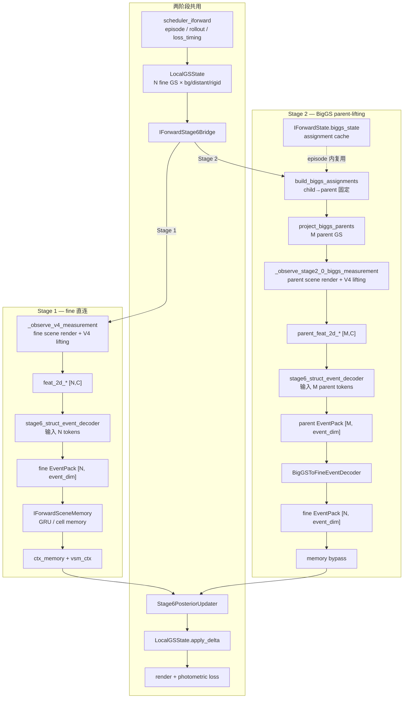

### 19.2 Stage 2 单步 rollout 详图

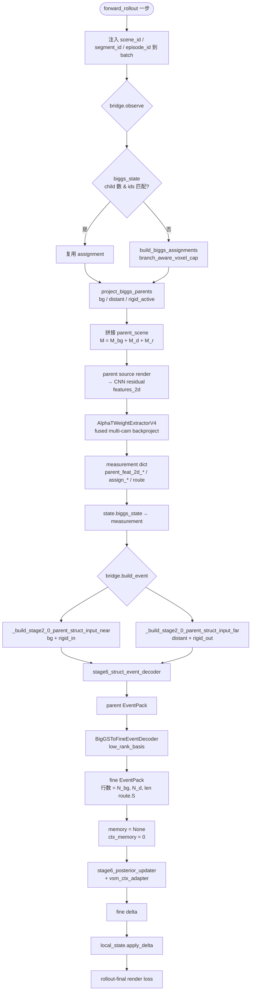

### 19.3 Observe 阶段分支对比

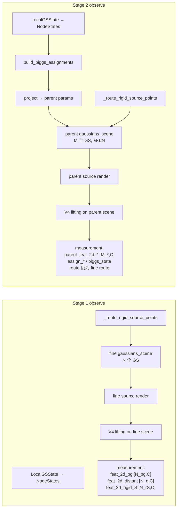

### 19.4 Event 阶段分支对比

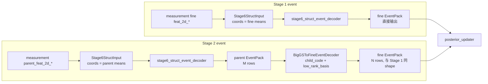

---

## 20. 关键组件对照表（Stage 1 vs Stage 2）

### 20.1 总览差异

| 维度 | Stage 1（`version: v1`） | Stage 2（`stage2_0_biggs_parent_lifting`） |
|------|--------------------------|--------------------------------------------|
| 配置入口 | `iforward_v5_baseline.yaml` 等 | `iforward_stage2_0_biggs_parent_lifting.yaml` |
| 2D lifting 参与 GS | **N** 个 fine GS | **M** 个 parent GS（`M ≪ N`，压缩比见 `compression_total_active`） |
| 2D 特征张量 | `feat_2d_bg` `[N_bg,C]` | `parent_feat_2d_bg` `[M_bg,C]` |
| Struct encoder 输入规模 | N tokens（near/far 各按 fine 分行） | M tokens（parent coords / params） |
| Event 产出路径 | struct_decoder → fine EventPack | struct_decoder → parent EventPack → **child decoder** → fine EventPack |
| Posterior / delta | 相同 `Stage6PosteriorUpdater` + `apply_delta` | 相同（消费 fine EventPack，不感知 BigGS） |
| IForward memory | `IForwardSceneMemory`（GRU + cell keys） | **禁用**（`memory=None`，`ctx_memory=0`） |
| History gate / ADC | 可选（v3/v4 配置） | **强制关闭** |
| 2D frontend 训练 | 通常 `train_2d_detach_alpha`，可训 UNet/fusion | `no_grad_v4`，frontend **冻结** |
| 新增可训练模块 | `memory` + struct_decoder + updater | `biggs_child_decoder` + struct_decoder + updater |
| 跨 step 额外状态 | `IForwardMemoryState` + short window history | `IForwardState.biggs_state`（assignment cache，CPU detach） |
| Scheduler / loss 角色 | `scheduler_iforward`，current-only 或 +history | 相同 scheduler；stage2_0 配置为 **current-only** |

### 20.2 组件 / 函数 / 变量明细

| 组件 | 文件 / 入口 | 功能 | 关键变量 / 数据结构 | Stage 1 | Stage 2 |
|------|-------------|------|---------------------|---------|---------|
| Rollout 编排 | `models/iforward/model.py` · `IForwardModel.forward_rollout` | 解析 batch、逐步 observe→event→memory→update | `resolved.steps`, `local_state`, `state` | ✓ | ✓（额外注入 scene/segment id，写回 `biggs_state`） |
| Bridge | `models/iforward/bridge.py` · `IForwardStage6Bridge` | 薄封装 Stage6 runtime | `observe()`, `build_event()`, `predict_delta()` | ✓ | ✓（observe 多传 `biggs_state`, `biggs_scene_id` 等） |
| Fine 场景状态 | `stage6_0/local_gs_state.py` · `LocalGSState` | 持久化 fine GS 参数 | `bg/distant/rigid` branches，`N_*` 行数 | ✓ 唯一几何状态 | ✓ 唯一几何状态（delta 仍写回 fine） |
| Observe（fine） | `minimal_trainer_stage6_0.py` · `_observe_v4_measurement` | fine render + V4 lifting | `feat_2d_bg`, `acc_w_bg`, `obs_bg`, `route` | ✓ 默认路径 | ✗（`stage2_0_biggs_enabled` 时短路） |
| Observe（BigGS） | `minimal_trainer_stage6_0.py` · `_observe_stage2_0_biggs_measurement` | assignment → project → parent render → parent lifting | `parent_feat_2d_*`, `assign_*`, `biggs_state`, `num_parent_*` | ✗ | ✓ |
| Rigid 路由 | `minimal_trainer_stage6_0.py` · `_route_rigid_source_points` | 当前帧可见 rigid 子集 | `route.S`, `route.S_in`, `route.S_out`, `inside_mask_S` | ✓ | ✓（lifting 在 parent 上，route 语义不变） |
| Assignment | `biggs_assignment.py` · `build_biggs_assignments` | fine→parent 分组（voxel+cap） | `child_to_parent`, `parent_count`, `child_mass` | — | ✓ |
| Assignment 状态 | `biggs_state.py` · `IForwardBigGSState` | episode 内固定 child→parent | `bg/distant/rigid: BigGSBranchAssignment`, `scene_id`, `segment_id` | — | ✓（挂在 `IForwardState`） |
| Parent 投影 | `biggs_parent_projector.py` · `project_biggs_parents` | moment matching → parent GS 参数 | `BigGSParentProjection.params`（means, scales_log, quats, opacity, SH） | — | ✓ |
| Rigid active 投影 | `project_biggs_active_rigid_parents` | 仅 `route.S` 子集投影到 active parent | `assign_rigid_active`, `parent_params_rigid_active` | — | ✓ |
| V4 Backproject | `minimal_trainer_stage5_4.py` · `_backproject_scene_features_multi_camera` | alpha/T 加权反投影 2D 特征 | `feat_2d_all [?,C]`, `acc_w`, `obs_code` | 输入 fine scene，`? = N` | 输入 parent scene，`? = M` |
| Struct 输入（near） | `_build_stage6_struct_input_near` / `_build_stage2_0_parent_struct_input_near` | 组装 `Stage6StructInput` | `feat_2d`, `coords`, `branch_id`, `split_0/1` | fine coords | parent coords |
| Struct 输入（far） | `_build_stage6_struct_input_far` / `_build_stage2_0_parent_struct_input_far` | distant + rigid_out | 同上 | fine | parent |
| Event encoder | `stage6_struct_event_decoder` | xCPE near + point MLP far → EventPack | `event_bg [*,D]`, `event_distant`, `event_rigid`, `D=event_dim` | `* = N_*` | 中间态 `* = M_*` |
| Child decoder | `biggs_event_decoder.py` · `BigGSToFineEventDecoder` | parent event 解回 fine 行数 | `child_to_parent`, `child_code`, `mode=low_rank_basis` | — | ✓ |
| Event 汇总 | `_build_stage6_event_from_measurement` | 按 `biggs_enabled` 分支 | `measurement["biggs_enabled"]` | `False` → legacy | `True` → `_build_stage2_0_biggs_event_from_measurement` |
| Memory | `models/iforward/memory.py` · `IForwardSceneMemory` | 历史 event → ctx_memory | `IForwardMemoryState`, `ctx_bg/distant/rigid` | ✓ | ✗ bypass |
| Context adapter | `context_adapter.py` · `IForwardContextAdapter` | event + memory → updater 输入 | `vsm_ctx` | ✓ | ✓（无 memory 项） |
| Posterior | `stage6_0` · `Stage6PosteriorUpdater` | fine event → delta | `delta` per branch | ✓ | ✓ |
| Trainer 参数组 | `models/iforward/trainer.py` · `IForwardTrainer` | AdamW 分组 | `memory`, `stage6_struct_decoder`, `biggs_child_decoder` | 含 `memory` | 含 `biggs_child_decoder`，**不含** `memory` |
| 配置开关 | `model.iforward.version` | 选择代码路径 | `v1` vs `stage2_0_biggs_parent_lifting` | `v1` | `stage2_0_biggs_parent_lifting` |
| BigGS 配置 | `model.iforward.biggs.*` | assignment / projector / decoder 超参 | `assignment.bg.voxel_size`, `child_decoder.rank` | 不存在 | ✓ |

### 20.3 关键张量 shape 对照

| 符号 | 含义 | Stage 1 | Stage 2 |
|------|------|---------|---------|
| `N_bg`, `N_d`, `N_rS` | fine GS 行数（bg / distant / rigid 当前帧） | lifting & event 全程使用 | 仅 child decoder 输出 & updater 输入使用 |
| `M_bg`, `M_d`, `M_rS` | parent GS 行数 | — | lifting & struct encoder 使用 |
| `C` | 2D 特征维 | `feat_2d_channels`（通常 24） | 相同 |
| `D` | event 维 | `struct_event_decoder.event_dim`（通常 48） | parent/fine EventPack 均为 `D` |
| `child_to_parent` | fine i → parent j | — | `[N_branch]` long，episode 内固定 |
| `route.S` | 当前帧 rigid fine 索引 | `[N_rS]` | 相同；decoder 输出 `event_rigid` 行数 = `len(S)` |
| `compression_total_active` | `(N_bg+N_d+N_rS) / (M_bg+M_d+M_rS)` | ≈ 1（无压缩） | 日志指标，目标 > 1 |

### 20.4 `measurement` dict 字段对照

| 字段 | Stage 1 | Stage 2 |
|------|---------|---------|
| `biggs_enabled` | 无 / `False` | `True` |
| `feat_2d_bg` | `[N_bg, C]` | 不使用 |
| `parent_feat_2d_bg` | 不使用 | `[M_bg, C]` |
| `acc_w_bg` / `parent_acc_w_bg` | fine `[N_bg]` | parent `[M_bg]` |
| `obs_bg` / `parent_obs_bg` | fine `[N_bg, 2]` | parent `[M_bg, 2]` |
| `assign_bg` | 无 | `BigGSBranchAssignment` |
| `biggs_state` | 无 | `IForwardBigGSState`（写回 `IForwardState`） |
| `route` | fine rigid route | **相同** fine rigid route |
| `iforward/biggs/*` 指标 | 无 | 压缩比、parent 统计、timing 等 |

### 20.5 不变部分（两阶段相同）

```text
scheduler_iforward（episode / rollout / loss_timing）
LocalGSState 初始化与 apply_delta（fine GS 仍是唯一可写几何）
Stage6PosteriorUpdater 接口与 branch clamps
render + photometric / mask / delta_regularization loss 结构
bridge.predict_delta / apply_update 调用链
gsplat / AlphaTWeightExtractorV4（无新 kernel，仅换 gaussians_scene 规模）
```

Stage 2 的核心假设：**posterior updater 仍按 N 个 fine GS 做 delta 预测**；BigGS 只压缩 observe + 3D event reasoning 阶段的 token 数，不改变最终状态空间维度。

---

## 21. Scheduler 调度逻辑（`iforward_stage2_0_biggs_parent_lifting.yaml`）

实现：`datasets/train_scheduler_iforward.py` · `TrainSchedulerIForward`（`version: iforward_v1`）。

本节针对当前 Stage 2.0 配置中的 `scheduler_iforward` 块；与模型路径无关，Stage 1 v1 基线共用同一 scheduler 实现，仅超参不同。

### 21.1 当前配置关键参数

| 节点 | 值 | 含义 |
|------|-----|------|
| `traversal.traversal_mode` | `episode_serial` | 一次只跑完一个 episode 的全部 rollout，再切下一个 episode |
| `traversal.scene_order` / `segment_order` | `shuffle_per_epoch` | 每个 epoch 打乱 scene / segment 顺序 |
| `episode.blocks_per_episode` | 8 | 每个 episode 含 8 个连续 keyframe block |
| `episode.episode_stride` | 8 | 沿 segment keyframe 轴不重叠滑窗（步长 = 窗长） |
| `episode.rollouts_per_episode` | 8 | 每个 episode **固定 8 次** optimizer step（8 个 rollout） |
| `episode.block_source_frame_policy` | `random_within_keyframe_per_rollout` | **每个 rollout** 在其 block 的 keyframe 内重新随机选一帧作 source |
| `episode.reset_scene_state_policy` | `episode_begin` | 仅 episode 第 1 个 rollout 重置 3D 状态 |
| `rollout.block_selection_policy` | `random_start_contiguous` | 每次 rollout 在 episode 内**随机选一个起始 block**（本配置 `blocks_per_rollout=1` 即随机单 block） |
| `rollout.shapes` | `b1_r8/r6/r4/r2` | 每次 rollout 只覆盖 **1 个 block**，重复 8/6/4/2 次 → `inner_K` = 8/6/4/2 |
| `rollout.max_inner_K` | 8 | 限制单 rollout 最多 8 个 observe 步 |
| `evidence.camera_policy` | `all_cams` | 每步 3 相机 (cam 0,1,2) 同时作 evidence |
| `loss_timing.policy` | `rollout_final_only` | 仅 rollout 最后一步 backward + render loss |
| `supervision.current` | enable | 监督 = rollout 输入帧 × 3 cam；`nearby` / `history_replay` 关闭 |
| `memory.*` | episode_begin + carry | Stage 2 模型侧 memory 已 bypass；scheduler 仍下发 step 级 memory 标志 |

**本配置下的数量关系**：

```text
inner_K = blocks_per_rollout × repeats_per_block = 1 × {8,6,4,2}
每 rollout 只访问 1 个 block，但重复 K 次（同帧多步 observe→event→update）
每 episode = 8 rollouts → 8 次 optimizer step
```

### 21.2 全局调度流程

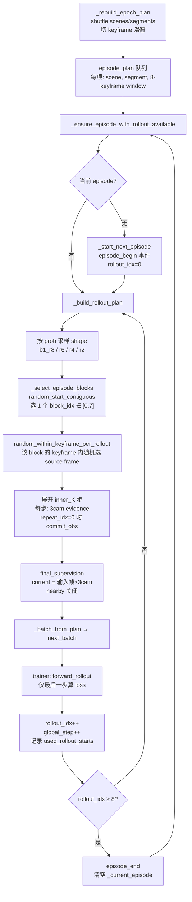

### 21.3 Episode 窗口如何切出

假设某 segment 有 keyframe 索引 `[kf0, kf1, …, kf23]`，`blocks_per_episode=8`，`episode_stride=8`，`allow_short_last_episode=false`：

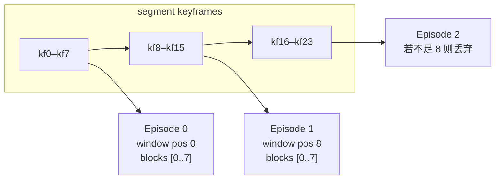

每个 episode 内部 block 编号恒为 `0..7`，对应 8 个 keyframe；`episode_id` / `scene_id` / `segment_id` 在 episode 内不变（BigGS assignment cache 依赖此三元组）。

### 21.4 单次 Rollout 内部（以 `b1_r8` 为例）

假设 episode 有 8 个 block，本次采样到 shape=`b1_r8`，随机选中 **block 3**（keyframe `kf3`），keyframe 内候选 train frames `{12, 13, 14}`，随机到 **frame 13**：

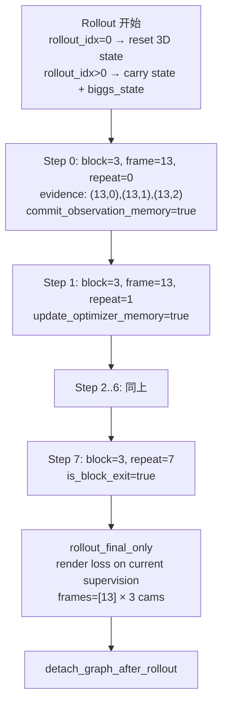

**delivery_order_policy=chronological**：多 block 时按 block 序号交付；本配置 `blocks_per_rollout=1`，每 rollout 只有 1 个 block，K 步全是同一 block 的重复访问。

### 21.5 示例 A：一个 Episode 的 8 次 Rollout 时间线

虚构 segment `scene=14, seg=0`，keyframe window = `[100,105,110,115,120,125,130,135]`（block 0..7）：

```mermaid
gantt
    title Episode（8 rollouts，状态在 rollout 间 carry）
    dateFormat X
    axisFormat %s

    section Rollout0
    reset state :milestone, r0, 0, 0
    b1_r8 block2 frame102 :r0work, 0, 8

    section Rollout1
    carry state :milestone, r1, 8, 8
    b1_r6 block5 frame127 :r1work, 8, 14

    section Rollout2
    b1_r4 block2 frame101 :r2work, 14, 18

    section Rollout3
    b1_r8 block7 frame138 :r3work, 18, 26

    section Rollout4
    b1_r2 block0 frame100 :r4work, 26, 28

    section Rollout5
    b1_r6 block4 frame122 :r5work, 28, 34

    section Rollout6
    b1_r8 block1 frame106 :r6work, 34, 42

    section Rollout7
    b1_r4 block6 frame133 :r7work, 42, 46
    episode_end :milestone, end, 46, 46
```

要点：

- **block 可重复**：rollout 0 与 rollout 2 都访问 block 2，但 `random_within_keyframe_per_rollout` 可能选不同 frame（102 vs 101）。
- **起始 block 去重**：`used_rollout_starts` 尽量覆盖未用过的 block；8 次 rollout + 8 个 block 时，倾向于每个 block 至少被选中一次（随机，非保证）。
- **避免连续相邻起点**：若上次从 block 2 开始，下次优先不从 block 3 开始（`last_rollout_start_block_idx + blocks_per_rollout` 被排除）。

### 21.6 示例 B：`random_start_contiguous` 选 block

`blocks_per_rollout=1` 时，有效起点 = `{0,1,2,3,4,5,6,7}`：

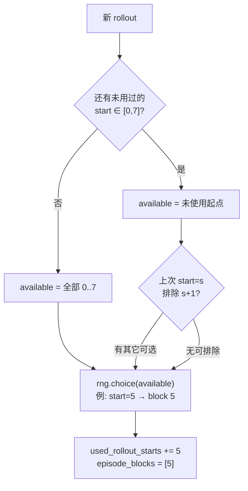

与 `next_contiguous`（按 `block_cursor` 顺序扫完 episode）不同：本配置 **不保证** 8 个 rollout 按时间顺序覆盖 block 0→7，而是**随机单 block 重复 K 次**。

### 21.7 示例 C：Shape 采样与 `inner_K`

| 采样结果 | blocks | repeats | inner_K | 单 rollout 计算量 |
|----------|--------|---------|---------|-------------------|
| `b1_r8` (35%) | 1 | 8 | 8 | 8 次 observe→event→update，1 次 loss |
| `b1_r6` (30%) | 1 | 6 | 6 | 6 步 |
| `b1_r4` (25%) | 1 | 4 | 4 | 4 步 |
| `b1_r2` (10%) | 1 | 2 | 2 | 2 步 |

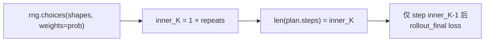

`max_inner_K=8` 与最大 shape 一致，不会截断。

### 21.8 Step 级 memory / loss 标志（scheduler → model）

| Step 字段 | 本配置取值 | 含义 |
|-----------|------------|------|
| `commit_observation_memory` | `repeat_idx == 0` | 每个 block 第一次 repeat 提交 observation memory |
| `update_optimizer_memory` | 每步 `true` | 每 repeat 更新 optimizer memory 槽 |
| `allow_step_render_loss` | `false` | 中间步不算 loss |
| `is_block_enter` / `is_block_exit` | repeat 0 / last | 供模型侧 block 边界逻辑（HSP 等；Stage 2 多数 bypass） |
| `reset_scene_state_before_rollout` | 仅 `rollout_idx==0` | 初始化 `LocalGSState`；Stage 2 同时重建/复用 `biggs_state` |
| `carry_scene_state_after_rollout` | `rollout_idx < 7` | rollout 间保留 fine GS + detached biggs assignment |
| `detach_graph_after_rollout` | `true` | 每次 rollout backward 后断图 |

Stage 2 模型：`memory=None`，但 scheduler 契约不变，便于与 Stage 1 共用 dataloader / trainer 管线。

### 21.9 Supervision 与 Evidence

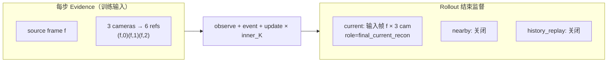

`mask_policy: non_sky_non_egocar`：sky / egocar 区域不参与 photometric loss。

### 21.10 与 Stage 1 v1 基线 scheduler 的差异（同实现、不同超参）

| 维度 | Stage 2 当前 yaml | 典型 Stage 1（如 `iforward_v5_baseline`） |
|------|-------------------|------------------------------------------|
| `rollouts_per_episode` | 8（显式预算） | 常不设置 → 扫完 block_cursor 才结束 |
| `block_selection_policy` | `random_start_contiguous` | 常 `next_contiguous` |
| `blocks_per_rollout` | 1 | 2~4（一次 rollout 覆盖多 block） |
| `block_source_frame_policy` | `per_rollout` 重采样 | 常 `once_per_episode` 固定 frame_chain |
| `supervision.nearby` | 关闭 | 常开启 |
| `memory`（模型） | bypass | `IForwardSceneMemory` 生效 |

**训练命令入口**（scheduler 由 dataset materializer 构造）：

```bash
python tools/train_iforward.py \
  --config_file configs/iforward/iforward_stage2_0_biggs_parent_lifting.yaml
```

---

## 22. 三分支（bg / distant / rigid）梯度反传与 Mask 对比

实现入口：`minimal_trainer_stage6_0.py`、`stage6_0/struct_event_decoder.py`、`stage6_0/posterior_updater.py`、`stage6_0/phase_a_losses.py`、`iforward/model.py`。

Stage 2.0 与 Stage 1 **共用** posterior / render / branch_scope 路径；差异主要在 observe（parent lifting）、`detach_v4_outputs`、memory bypass。

### 22.1 端到端梯度路径总览

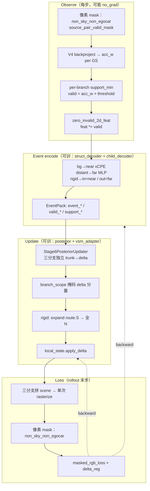

**要点**：render loss 是 **整场景一次光栅化**，像素 mask **不按分支**；梯度按 alpha blending 自动分配到可见的 bg / distant / rigid GS。

### 22.2 Mask 类型对照表

| Mask 层级 | 作用域 | bg | distant | rigid | 是否阻断梯度 |
|-----------|--------|-----|---------|-------|--------------|
| `source_pair_valid_mask` | 2D 像素（每 cam） | 共用 | 共用 | 共用 | 被 mask 像素不参与 backproject → 该 GS `acc_w` 低 |
| `src_backproject_support_min` | per-GS（分支阈值） | `branches.bg` | `branches.distant` | `branches.rigid` | `valid=false` 时 `feat_2d` 置零 → struct 输入梯度≈0 |
| `zero_invalid_2d_feat` | per-GS 特征 | near 路径 | far 路径 | in→near / out→far | 同上（乘法 mask） |
| `EventPack.valid_*` | per-GS event 行 | `valid_bg` | `valid_distant` | `valid_rigid`（`len(S)`） | **不**直接挡 posterior；Stage1 memory 写入门控 |
| `EventPack.support_*` | per-GS 标量 | `acc_w` 或 log1p | 同左 | 同左 | memory `hard_support_min` 写入门控 |
| `route.inside_mask_S` | rigid 路由 | — | — | AABB 内→near | 决定 event 走 near 还是 far encoder |
| `_stage6_rigid_point_valid_mask` | rigid 渲染子集 | — | — | 当前 `frame_idx` 可见实例 | 不可见帧 rigid **不参与该帧 render** |
| `branch_scope` | delta 分量 | 见 §22.3 | 仅 opacity+SH | 全属性（配置可调） | **硬零**被禁用的 delta 分量 |
| `posterior noop` gate | per-GS delta 幅度 | 三分支均有 | 同左 | 同左 | `gate=1-noop` 缩放全部 delta head |
| `target_valid_mask` | loss 像素 | 共用 | 共用 | 共用 | sky/egocar 像素 loss=0 |

当前 Stage 2.0 配置（`iforward_stage2_0_biggs_parent_lifting.yaml`）：

```yaml
branches:
  bg:      { src_backproject_support_min: 1.0e-2 }
  distant: { src_backproject_support_min: 1.0e-2 }
  rigid:   { src_backproject_support_min: 1.0e-2 }
posterior_updater.branch_scope:
  bg:      { update_means/scales/quat/opacity/sh: true }
  distant: { update_means/scales/quat: false, update_opacity/sh: true }
  rigid:   { update_means/scales/quat/opacity/sh: true }
base_measurement:
  detach_v4_outputs: true   # Stage2：feat_2d 进 encoder 前 detach
```

### 22.3 三分支核心对比

| 维度 | **bg**（背景 / near） | **distant**（远景 / far） | **rigid**（动态刚体） |
|------|----------------------|---------------------------|----------------------|
| Struct 路径 | `near` xCPE sparse conv | `far` point MLP | `S_in`→near；`S_out`→far |
| `branch_id` | 0（near）/ 0（far 无） | 0（far） | 1（near & far 内均为 rigid 嵌入） |
| Observe 行数 | `N_bg` 或 parent `M_bg` | `N_d` 或 `M_d` | 仅 `route.S`（当前帧可见 fine 点） |
| support 阈值 meta 键 | `support_threshold_bg` | `support_threshold_distant` | `support_threshold_rigid` / `rigid_out` |
| Posterior 输入行数 | `N_bg` | `N_d`（可无 distant 分支） | `len(route.S)` |
| `branch_scope` 默认 | **全参数可更新** | **仅 opacity + SH** | **全参数可更新** |
| Render 拼 scene | 始终加入 | 有 distant 则加入 | 仅 `_stage6_rigid_point_valid_mask(frame)` 为真的点，再变到 world |
| Delta 行对齐 | 1:1 `N_bg` | 1:1 `N_d` | `route.S` 子集 → `_expand_branch_delta` 填满 `N_rigid` |
| Stage2 parent lifting | parent scene 的 bg 段 | parent distant 段 | active rigid parent 段 |
| Stage2 2D 梯度 | **切断**（`detach_v4_outputs`） | 同左 | 同左 |
| Stage2 memory | bypass | bypass | bypass |

### 22.4 各阶段梯度是否到达

| 模块 | bg | distant | rigid | 说明 |
|------|----|---------|-------|------|
| DINOv2 / UNet（2D frontend） | ✗ Stage2 | ✗ | ✗ | `no_grad_v4` + `detach_v4_outputs` |
| V4 backproject（gsplat） | 无参数 | 无参数 | 无参数 | 仅影响 `acc_w` 统计量 |
| `stage6_struct_event_decoder` | ✓ | ✓ | ✓（in/out 两路） | `valid` 行 `feat_2d` 被置零，有效行有梯度 |
| `biggs_child_decoder` | ✓ | ✓（有 distant 时） | ✓ | broadcast parent `valid/support` 到 fine 行 |
| `stage6_posterior_updater` | ✓ | ✓（有 event 时） | ✓ | 每分支独立 MLP；`noop` gate 可微 |
| `vsm_ctx_adapter` | ✓（Stage2 常关闭 VSM→0） | ✓ | ✓ | `ctx_memory=None` 时仅 event 进 trunk |
| `apply_delta` → `local_state` | 全属性 | **仅 opacity+SH** 写入 | 全属性（仅 `route.S` 行非零 delta） |
| Render loss → GS 参数 | ✓ 经光栅化 | ✓ | ✓（可见帧点） | **不按分支拆 loss**；distant 的 means 仍参与渲染、可收渲染梯度，但 **delta 不更新 means** |
| `delta_regularization` | ✓ 计入均值 | ✓ | ✓ | 三分支 delta L2 平均；`scale_barrier` 对三分支 `scales_log` |

### 22.5 rigid 分支特殊逻辑（流程图）

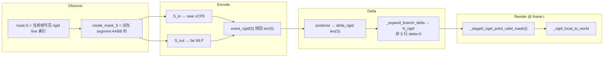

- **Observe / event 只用 `route.S`**，不是全部 `N_rigid`。
- **Delta 先算 `len(S)` 行，再 scatter 到全长**；非当前帧活跃点本步 delta 恒为 0。
- **Render 按目标帧再滤一次**；与 observe 用的 `source_frame_idx` 可不同（rollout-final 监督帧）。

### 22.6 distant 的「渲染有、delta 几何无」

配置 `distant.update_means/scales/quat=false` 时：

```text
渲染：distant GS 仍拼进 gaussians_scene → 参与 photometric loss → means/scales/quat 可收到渲染梯度
更新：posterior 预测的 means/scales/quat delta 被 branch_scope 置零 → apply_delta 不改几何
仅 opacity + SH 经 delta 每步更新
```

这是 **有意设计**：远景主要靠外观（opacity/SH）适配，几何由初始化 / 点云资产固定。

### 22.7 Stage 1 vs Stage 2 在 mask/梯度上的差异

| 项目 | Stage 1（v1 + memory） | Stage 2.0（BigGS） |
|------|------------------------|---------------------|
| 2D feat 梯度 | 可训 frontend 时回传到 UNet/DINO | **切断**（frozen frontend） |
| Observe token 规模 | fine `N_*` | parent `M_*`（压缩） |
| Memory 写入门控 | `valid` + `support` + `hard_valid_required` | memory bypass，**不用** event valid 写 memory |
| History gate | 可用 `valid_now` 调 gate | 强制关闭 |
| Render / branch_scope / rigid 路由 | 相同机制 | 相同机制 |
| Child decoder | 无 | parent `valid/support` broadcast 到 fine `EventPack` |

### 22.8 配置调参速查

| 目标 | 建议改动 |
|------|----------|
| 提高某分支 2D lifting 有效点比例 | 降低对应 `branches.*.src_backproject_support_min` |
| 禁止 distant 几何漂移 | 保持 `distant.update_means/scales/quat=false`（默认） |
| 完全关闭 distant 更新 | `branch_scope.distant.enable=false`（Phase B 模式） |
| 恢复 2D frontend 训练 | `source_evidence_grad_mode=train_2d_detach_alpha` + `detach_v4_outputs=false`（非 Stage2 主线） |
| rigid 仅更新外观 | `branch_scope.rigid.update_means/scales/quat=false` |
| loss 排除动态区域 | `mask_policy=valid_non_sky_non_egocar_non_dynamic`（需 target 带 `dynamic_mask`） |

### 22.9 代码锚点

| 逻辑 | 文件 · 符号 |
|------|-------------|
| per-branch support 阈值 → valid | `struct_event_decoder.py` · `Stage6NearXcpeEventDecoder` / `Stage6FarMLPEventDecoder` |
| rigid in/out 合并 | `struct_event_decoder.py` · `Stage6RoutedStructEventDecoder.forward` |
| branch_scope 掩 delta | `minimal_trainer_stage6_0.py` · `_mask_branch_delta` / `_apply_branch_scope` |
| rigid delta 扩展 | `minimal_trainer_stage6_0.py` · `_expand_branch_delta` |
| 拼 render scene | `minimal_trainer_stage6_0.py` · `_render_params_for_frame` |
| 像素 loss mask | `phase_a_losses.py` · `target_valid_mask` / `masked_rgb_loss` |
| source 像素 mask | `minimal_trainer_stage4_5.py` · `_build_source_pair_valid_mask` |
| Stage1 memory 写入门控 | `iforward/memory.py` · `hard_write = write & valid & support` |
| BigGS valid broadcast | `biggs_event_decoder.py` · `_decode_branch` |
