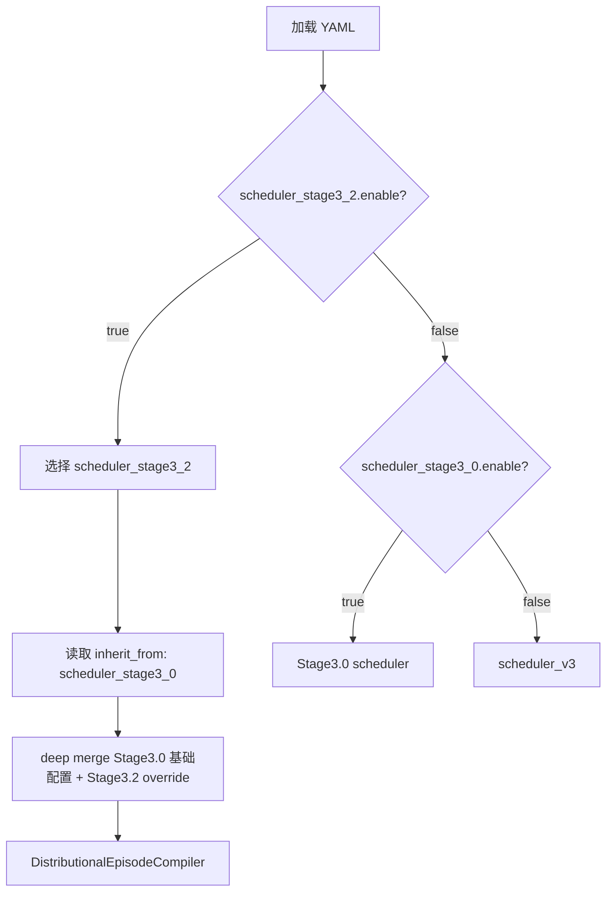
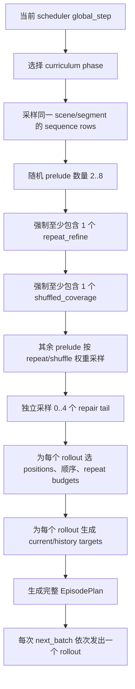
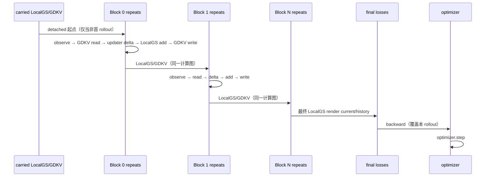
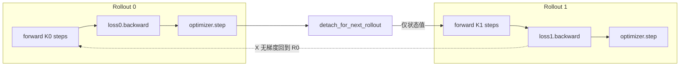
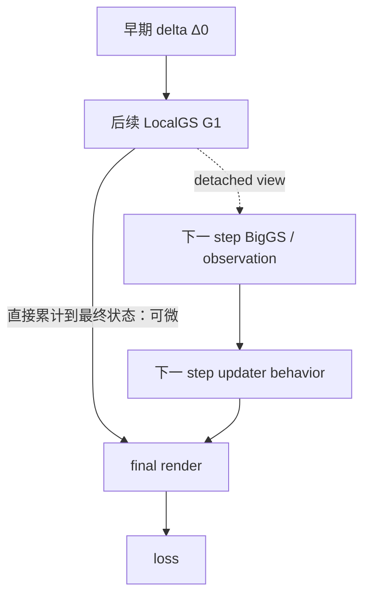
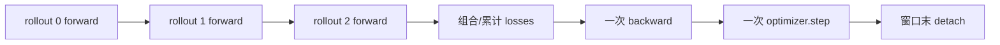

# IForward Stage3.2 Scheduler 与 Rollout 梯度传播审计报告

日期：2026-07-13

审计对象：`configs/iforward/iforward_stage3_2_distributional_episode_gdkv.yaml` 及其当前训练执行链

审计方法：配置继承核对、静态调用链审计、定向 autograd 探针、相关测试回归

## 0. 最终结论

> **当前系统是“episode 内状态值跨 rollout 延续，但计算图只在单个 rollout 内延续”。**

原判断“history 的瓶颈包含 truncated credit assignment”是成立的，但需要纠正边界：

| 判断 | 审计结果 | 精确解释 |
|---|---:|---|
| 同一 rollout 内，梯度应传播到所有更早 repeat | **成立** | step 内没有 detach；最终 render loss 可经最终 `LocalGSState` 回到此前 delta |
| 同一 rollout 内，梯度应跨 block 传播 | **成立，但存在部分反馈支路截断** | block enter 只清 cache，没有 detach LocalGS/GDKV；但 LocalGS→下一步 BigGS/观测的反馈路径被显式 detach |
| episode 内，后续 rollout 的 loss 能回到前面 rollout | **不成立** | 每个 rollout 都独立 `backward + optimizer.step`，随后整个 carry state 被 `detach_for_next_rollout()` |
| `detach_persistent_state_at_block_start: true` 导致逐 block 截断 | **不成立** | 当前代码没有读取该字段；真实 block enter 没有持久状态 detach |
| `parent_optimizer_memory.detach_scope: rollout_boundary` 是实际控制开关 | **字面结果相符，但不是控制源** | 当前 trainer 无条件在 rollout 后 detach；修改这个 YAML 字段不会改变行为 |
| repair 能学会修复当前坏状态 | **成立** | repair rollout 内的 loss 可更新当前 updater/GDKV/可训练模块 |
| repair/history 能定位并惩罚数个 rollout 以前的致坏 update | **不成立** | 坏状态值能带到后面，但过去 activation graph 已被切断 |

因此，当前最长的**时序信用分配长度**不是完整 episode，也不是固定一个 block，而是：

```text
一个 rollout 内的 K 个 step
K = sum(repeat_budgets of all blocks in this rollout)
```

对于 `repeat_refine`，多个 repeat 通常位于同一 rollout，信用链完整；对于需要多个 rollout 才显现的 shuffled/history/repair 效应，链在 rollout 边界被截断。这与“repeat 强、跨 rollout history 弱”的日志模式相容。

---

## 1. 审计口径：先区分四个层级

| 层级 | 当前含义 | 是否一次 backward 的范围 |
|---|---|---:|
| episode | 同一 scene/segment 中的一组 prelude + repair rollouts | 否 |
| rollout | scheduler 每次 `next_batch()` 发出的一个训练 batch | **是** |
| block | rollout 中选择的一个 sequence position/frame | rollout 的一部分 |
| repeat / step | 对同一 block 的一次 observe→update；`K` 为所有 repeat 总和 | rollout 的一部分 |

需要严格区分两种“传播”：

| 传播类型 | 跨 rollout 情况 |
|---|---|
| **状态值传播** | 是：LocalGS、GDKV、history bank 等值被缓存并交给下一 rollout |
| **计算图/梯度传播** | 否：缓存前所有 tensor 被 detach |

状态值仍然包含过去 update 的数值后果，不等于后续 loss 能沿 autograd graph 回到过去的 update。

---

## 2. 当前到底启用了哪个 scheduler

虽然 YAML 同时写了 `scheduler_stage3_0.enable: true` 和 `scheduler_stage3_2.enable: true`，实际选择优先级明确偏向 Stage3.2：



证据：

- 当前 Stage3.2 开关、版本与继承关系：[配置 L180-L184](../../configs/iforward/iforward_stage3_2_distributional_episode_gdkv.yaml#L180)
- 训练入口优先选择 Stage3.2：[train_iforward.py L280-L304](../../tools/train_iforward.py#L280)、[L407-L439](../../tools/train_iforward.py#L407)
- scheduler 对继承配置执行递归 deep merge：[scheduler.py L73-L106](../../datasets/iforward_stage2_3/scheduler.py#L73)

实际版本为：

```text
scheduler = stage3_2_distributional_episode_v1
model.iforward.version = stage3_1_lowrank_gated_delta_kv_lift
optimizer memory = lowrank_gated_delta_kv (GDKV)
```

这里 scheduler 的 Stage3.2 与 model 的 Stage3.1 GDKV 版本号属于两个不同维度，不是冲突。

---

## 3. Scheduler 从 sequence 到 rollout 的完整过程

### 3.1 Episode 编译流程



Episode 是预先编译的，但 trainer 仍然一次只训练其中一个 rollout。构建逻辑见 [distributional_episode.py L359-L450](../../datasets/iforward_stage2_3/distributional_episode.py#L359)，逐 rollout 发出逻辑见 [scheduler.py L1506-L1538](../../datasets/iforward_stage2_3/scheduler.py#L1506)。

### 3.2 Curriculum

| phase | scheduler step | sequence target/min | prelude 权重 repeat/shuffle | repair 概率参数 `p` | trainable-2D maxK：repeat/shuffle | frozen-2D repair maxK |
|---|---:|---:|---:|---:|---:|---:|
| warmup | `[0, 5000)` | 10 / 10，不允许短序列 | 0.35 / 0.55 | 0.10 | 10 / 6 | 15 |
| main | `[5000, 30000)` | 16 / 10，允许短序列 | 0.30 / 0.50 | 0.20 | 10 / 6 | 15 |
| hardening | `[30000, 60010)` | 20 / 8，允许短序列 | 0.22 / 0.56 | 0.22 | 10 / 8 | 12 |

配置证据：[配置 L233-L290](../../configs/iforward/iforward_stage3_2_distributional_episode_gdkv.yaml#L233)。phase 在 **episode 构建时**按当时 step 选择，因此一个已编译 episode 内的所有 rollout 使用同一个 curriculum phase。

### 3.3 三类 rollout 的实际采样语义

| 类型 | B / K / R | position 偏好 | 顺序 | 2D 梯度 | 主要训练意图 |
|---|---|---|---|---|---|
| repeat_refine | B∈{1,2}；先抽总 K∈{2,4,6,8,10}，再把 K 随机正整数分配给 B 个 block | unvisited first | local 0.70 / chronological 0.30 | trainable | 同 block 多次 refinement |
| shuffled_coverage | B∈{3,4,6,8}，R∈{1,2}，再按 phase maxK clamp | unvisited first | local 0.35 / stratified 0.50 / global 0.15 | trainable | 多 block、乱序覆盖 |
| high_block_repair | B∈{6,8,10,12}，R∈{1,2}，优先保 B、必要时降 R | visited first | global shuffle | **frozen + no_grad** | 对已访问位置做高 block 修复 |

采样实现见 [distributional_episode.py L529-L608](../../datasets/iforward_stage2_3/distributional_episode.py#L529)，position 选择及顺序见 [L614-L668](../../datasets/iforward_stage2_3/distributional_episode.py#L614)。

两个容易误读的细节：

1. prelude 固定先放入一份 repeat 和一份 shuffle，再整体打乱；只有剩余名额才按 phase 中的 repeat/shuffle 权重抽取。对应实现见 [L477-L492](../../datasets/iforward_stage2_3/distributional_episode.py#L477)。
2. `high_block_repair` 的 weight 并非与另外两类做一次三选一。代码把它直接当作每个 repair slot 的 Bernoulli 概率，做 4 次独立试验，因此 repair rollout 数近似 `Binomial(4, p)`：

| phase | p | 期望 repair 数 | 至少一个 repair 的概率 |
|---|---:|---:|---:|
| warmup | 0.10 | 0.40 | 34.39% |
| main | 0.20 | 0.80 | 59.04% |
| hardening | 0.22 | 0.88 | 62.98% |

### 3.4 Rollout 内部 step 展开

假设一个 rollout 抽到：

```text
positions = [7, 2, 11]
repeat_budgets = [2, 1, 2]
```

实际执行顺序就是：

```text
Block 7 / repeat 0  (block enter)
Block 7 / repeat 1  (block exit)
Block 2 / repeat 0  (enter + exit)
Block 11 / repeat 0 (block enter)
Block 11 / repeat 1 (block exit)
-------------------
一次 final render loss
一次 backward
一次 optimizer.step
```

每个非 bootstrap repeat 都请求 GDKV read/write；每个 block 只有首个 repeat commit observation memory；scheduler 明确将 step 内 detach 标志设置为 false。实现见 [scheduler.py L640-L770](../../datasets/iforward_stage2_3/scheduler.py#L640)。resolver 还会拒绝任何 rollout 内的 `detach_before_step` / `detach_after_step`，见 [resolver.py L410-L427](../../models/iforward/resolver.py#L410)。

当前继承配置 `bootstrap.end_step: 0`，因此正常训练从 step 0 起直接进入 distributional episode，不会经过 bootstrap rollout，见 [配置 L117-L125](../../configs/iforward/iforward_stage3_2_distributional_episode_gdkv.yaml#L117)。各 phase 的 step 字段实际为：

| step 语义 | assimilation | repair |
|---|---:|---:|
| GDKV read | 每个 repeat | 每个 repeat |
| GDKV write | 每个 repeat | 每个 repeat；当前 last write 也开启 |
| observation commit | 每个 block 的 repeat 0 | 每个 block 的 repeat 0 |
| `physical_time_advance` | true | false |
| `repair_no_commit` metadata | false | true |
| rollout 内 detach | false | false |

注意：当前 `repair_no_commit=true` 只是被 resolver 保存的 metadata，没有阻止 Stage3.2 GDKV write；不要把它理解为“repair 不写 optimizer memory”。

---

## 4. Current 与 History target 是怎么来的

每个 rollout 的监督集合在 scheduler 中这样生成：

| target role | 位置来源 | 是否排除本 rollout current |
|---|---|---:|
| current | 本 rollout 的 `positions` | 不适用 |
| history | 之前 rollout 已访问、但本 rollout 未访问的位置 | 是 |
| repair 特例 | 若 repair 时尚无 history，则使用 sequence 中 current 以外的位置 | 是 |

证据：[distributional_episode.py L392-L413](../../datasets/iforward_stage2_3/distributional_episode.py#L392)、[scheduler.py L823-L836](../../datasets/iforward_stage2_3/scheduler.py#L823)。

关键语义是：**history 表示“渲染哪个历史帧”，不是“保留到哪个历史 activation graph”。** history target 虽然来自以前 rollout 访问的位置，但渲染使用的是当前 rollout 更新完成后的 LocalGS；以前 rollout 的状态只是 detached 起点。

---

## 5. 单个 rollout 内的真实前向与反向

### 5.1 前向时序



模型只有在所有 resolved steps 执行完后才计算 final render loss，见 [model.py L2175-L2185](../../models/iforward/model.py#L2175) 与 [L2848-L2867](../../models/iforward/model.py#L2848)。block enter 只清空 block-local cache / parent runtime cache；没有 detach `local_state` 或 `parent_temporal_state`。

### 5.2 LocalGS 主状态链

每次 updater 输出 delta 后，LocalGS 通过可微加法、四元数更新等形成新状态：

```text
G0 --(+Δ0)--> G1 --(+Δ1)--> G2 ... --(+ΔK-1)--> GK --render--> loss
```

`LocalGSState.apply_delta()` 的属性更新是普通 PyTorch 运算，见 [local_gs_state.py L146-L186](../../models/streetforward/stage6_0/local_gs_state.py#L146)。因此，只要某属性最终对 loss 有有效导数，loss 能沿 LocalGS 主链回到 rollout 中所有更早 block/repeat 的对应 delta。

### 5.3 GDKV 记忆链

当前每个非 bootstrap repeat 都读写 GDKV：

```text
M0 --write(step0)--> M1 --read/write(step1)--> ... --> MK
                         │
                         └──影响后续 event/updater delta──> final loss
```

GDKV write 使用普通 tensor 投影、`torch.where` 与 state update，未在内部 detach，见 [parent_optimizer_gated_delta_kv.py L297-L330](../../models/iforward/stage2_3/parent_optimizer_gated_delta_kv.py#L297) 及 [L1160-L1213](../../models/iforward/stage2_3/parent_optimizer_gated_delta_kv.py#L1160)。模型每 step 的 read/write 调用见 [model.py L2274-L2347](../../models/iforward/model.py#L2274) 与 [L2693-L2739](../../models/iforward/model.py#L2693)。

因此，在同一 rollout 内，后面 step 经 GDKV read 产生的 loss 可以回到更早 step 的 GDKV write 输入及相关参数。

一个重要边界情况是：**每个 rollout 的最后一次 GDKV write 没有后续同 rollout read，而跨 rollout 又会 detach，所以它没有来自 memory-state 路径的训练信用。** 更一般地，任意 write 都只能从本 rollout 中位于它之后的有效 read 获得信用；下一 rollout 的 read 无法训练上一 rollout 的那次 write activation。

---

## 6. Rollout 边界：状态值继续，计算图终止

trainer 的真实边界如下：



对应真实代码顺序：

1. `zero_grad`
2. `forward_rollout`
3. `loss.backward`
4. `optimizer.step`
5. 若 episode 未结束，缓存 `out.next_state.detach_for_next_rollout()`

证据：[trainer.py L718-L750](../../models/iforward/trainer.py#L718)、[L804-L839](../../models/iforward/trainer.py#L804)。

`detach_for_next_rollout()` 不只 detach LocalGS，而是覆盖：

| carry state | rollout 后处理 |
|---|---|
| LocalGS | detach |
| 普通 memory / short history | detach |
| history EMA / gradient bank | detach |
| ADC bank/meta | detach |
| BigGS state | detach |
| GDKV / parent temporal state | detach |
| sequence / stage2.2 / stage2.3 history bank | detach |
| runtime node states | 丢弃为 `None` |

完整实现见 [state.py L367-L411](../../models/iforward/state.py#L367)。

边界状态机还有以下特殊分支：

| rollout 位置/事件 | state cache 行为 |
|---|---|
| episode 首 rollout | scheduler 标记 reset；trainer 清旧 cache 并重新初始化 state |
| episode 中间 rollout | 保存完整 state **值**，但先全量 detach |
| episode 最后 rollout | 不再缓存，清除对应 state/runtime |
| AMP optimizer step 因 overflow 被跳过 | 丢弃 state cache，避免用未提交参数事务产生的 state 继续训练；但 scheduler 不会自动回退到 episode 边界 |

异步 producer 只预先准备后续 batch/episode，queue depth 当前为 1；它不会改变上述 forward/backward/detach 边界。

AMP skip 的特殊风险有直接代码依据：trainer 在 skip 后清 cache，[trainer.py L806-L838](../../models/iforward/trainer.py#L806)；当前配置又设置 `allow_missing_carried_state_reset: false`，[配置 L797-L803](../../configs/iforward/iforward_stage3_2_distributional_episode_gdkv.yaml#L797)。仓库中未发现 scheduler 收到该 skip 后自动重置 episode/cursor 的处理，因此中间 rollout 若发生真实 GradScaler skip，下一非 reset rollout 存在 fail-fast 风险。

### 6.1 为什么 optimizer.step 也决定了边界

当前每个 rollout 都立即更新参数。即使简单去掉 state detach，也不能安全得到跨 rollout BPTT：旧 graph 中的 activation 对应 optimizer.step **之前**的参数版本，后续再沿旧 graph 反传会遇到参数原地修改、graph 生命周期和梯度累计语义问题。

要做 2–4 rollout 短程 BPTT，训练事务也必须一起改成窗口级：窗口内保留 graph、累计/组合 losses，窗口末统一 backward 和 optimizer.step；不能只改一个 YAML detach 字段。

---

## 7. 梯度可达性矩阵

图例：`✓` 可达；`△` 有条件/部分路径；`✗` 被结构边界截断；`—` 不适用。

| loss / 路径 | 同 block 更早 repeat | 同 rollout 更早 block | 更早 rollout activation | 当前 rollout updater | 当前 rollout GDKV | 2D frontend |
|---|---:|---:|---:|---:|---:|---:|
| current final render | ✓ | ✓ | ✗ | ✓ | △：需后续 read 形成有效影响 | assimilation ✓；repair ✗ |
| in-rollout history render | ✓ | ✓ | ✗ | ✓ | △ | assimilation ✓；repair ✗ |
| repair history-bank damage | ✓ | ✓ | ✗，bank baseline 已 detach | ✓ | △ | ✗ |
| delta regularization | ✓，直接作用于各 step delta | ✓ | ✗ | ✓ | 通常非主路径 | 取决于 delta 对 2D 特征的依赖 |
| 后续观测对早期 LocalGS 的反馈 | **△/大部分截断** | **△/大部分截断** | ✗ | — | GDKV 路径仍可用 | — |

“GDKV △”不是指 graph 被 detach，而是必须满足：对应 row 有 valid/support、确实执行 write、后续 step read 到该状态、且 read 最终影响 loss。结构上同 rollout 内可微，数值上不保证每行都非零。

### 7.1 参数共享不等于跨 rollout activation credit

后续 rollout 的 loss 仍会更新同一套 updater/GDKV 参数，因此模型并非“完全无法从历史场景学习”。但是它学习的是：

```text
当前 detached 坏状态 + 当前输入 -> 当前应该如何更新
```

而不是：

```text
数个 rollout 前那一次具体 update activation -> 后来为何造成损害
```

这正是 repair 容易学成“见坏就修”，却难以对原始致坏动作做精确信用分配的原因。

---

## 8. 同 rollout 内仍存在的“部分梯度断路”

“没有 block detach”不等于所有反馈链都完整。当前至少有以下重要例外。

### 8.1 LocalGS → 下一 step BigGS/观测反馈被切断

配置 `parent_projector.grad_to_local_state: false`，见 [配置 L515-L523](../../configs/iforward/iforward_stage3_2_distributional_episode_gdkv.yaml#L515)。observe 时会把 LocalGS 转为 detached view，见 [minimal_trainer_stage6_0.py L3653-L3659](../../models/streetforward/minimal_trainer_stage6_0.py#L3653)。BigGS parent runtime 增量更新也处于 `@torch.no_grad()`，见 [L4713-L4727](../../models/streetforward/minimal_trainer_stage6_0.py#L4713)。

所以存在下面的区别：



也就是说：

- `Δ0 → 最终 LocalGS → final render` 的直接状态累积链存在；
- `Δ0 → 改变下一步观测/event → 改变下一步 updater 决策 → final loss` 的高阶反馈链大部分不存在。

这会削弱模型学习“早期动作如何改变未来可观测条件和未来更新策略”，即便两个动作仍在同一 rollout。

### 8.2 Source render 到 2D CNN 的状态反馈被 detach

配置 `detach_source_render_for_cnn: true`，见 [配置 L640-L653](../../configs/iforward/iforward_stage3_2_distributional_episode_gdkv.yaml#L640)；实现会对 source-render RGB 调用 `.detach()`，见 [minimal_trainer_stage4_5.py L207-L234](../../models/streetforward/minimal_trainer_stage4_5.py#L207)。

2D frontend 在 assimilation rollout 中仍可从最终 loss 学习，因为它生成的 feature 会影响 updater delta；但 loss 不会通过 CNN 输入反向回到用于生成 source render 的 LocalGS。

### 8.3 Repair 明确冻结 2D frontend

Stage3.2 将 high-block repair 标成 `frozen_no_grad`，见 [配置 L291-L304](../../configs/iforward/iforward_stage3_2_distributional_episode_gdkv.yaml#L291)。model 将该 metadata 传入 observe，[model.py L2200-L2225](../../models/iforward/model.py#L2200)；bridge 对 repair 的 2D forward 使用 `torch.no_grad()` 并 detach feature，[minimal_trainer_stage6_0.py L217-L255](../../models/streetforward/minimal_trainer_stage6_0.py#L217)、[L3927-L3969](../../models/streetforward/minimal_trainer_stage6_0.py#L3927)。

repair loss 仍可训练后端 updater、GDKV、允许训练的 parent/child 模块，但不能直接训练 2D frontend。

### 8.4 行、属性与数值条件造成的局部零梯度

| 特殊情况 | 结果 | 证据/说明 |
|---|---|---|
| GDKV row 的传入 valid 为 false，或 support < 0.001 | 该 row 跳过 write，无法获得该次 memory credit | support_min 被接线；valid 在只要传入时就强制参与 mask，见 [GDKV L1117-L1128](../../models/iforward/stage2_3/parent_optimizer_gated_delta_kv.py#L1117) |
| 某属性在 branch delta 中 inactive | 该属性沿用旧值，不经该 delta 分支反传 | [local_gs_state.py L155-L171](../../models/streetforward/stage6_0/local_gs_state.py#L155) |
| bg means 超出 AABB 并被 clamp 饱和 | 对应越界方向的局部梯度可能为 0 | [minimal_trainer_stage6_0.py L4988-L4993](../../models/streetforward/minimal_trainer_stage6_0.py#L4988) |
| 点不可见、被遮挡、mask 无有效 pixel | render 对该 row/属性可能无有效梯度 | 渲染本身的可见性条件 |
| loss 权重为 0 | 该 loss 不提供梯度；history render 甚至会跳过 | 见下一节 |
| GDKV 写入后没有后续有效 read | state 虽可微，但不会影响本 rollout loss | 最后一次 write 尤其常见 |
| 本 episode 的首 rollout | 没有先前 visited positions，通常没有 history targets | current loss 仍有效，history loss 为 0 |
| optimizer step 被 AMP overflow 跳过 | 当前 state 不 carry | trainer 主动丢 cache；当前 `allow_missing_carried_state_reset=false`，若下一 batch 是同 episode 的非 reset rollout，预计会直接报 missing carried state |

因此，“理论图上可达所有 block”应理解为**存在 autograd 路径**，不能保证所有 tensor、所有 row、所有属性每次都得到非零数值梯度。

---

## 9. History 与 damage loss 的启用时间

| loss | base weight | 实际权重时间表 | 对早前 rollout 回传？ |
|---|---:|---|---:|
| current | 1.0 | 全程 1.0 | 否 |
| in-rollout history | 0.5 | `<5000`: 0；`5000→15000`: 线性 0→0.5；`>=15000`: 0.5 | 否 |
| history damage | 0.25 | `<17000`: 0；`17000→27000`: 线性 0→0.25；`>=27000`: 0.25；**当前版本只在 repair phase 形成非零 damage loss** | 否 |
| short-window history | 0.0 | 全程 0 | 否 |
| delta regularization | 1.0 外层权重 | 全程启用，内部正则权重另由 `losses.phase_a.regularization` 控制 | 否 |

配置见 [配置 L610-L622](../../configs/iforward/iforward_stage3_2_distributional_episode_gdkv.yaml#L610)，权重函数见 [model.py L1328-L1363](../../models/iforward/model.py#L1328)。当 history 有效权重为 0 时，正常训练不会执行 history render，见 [model.py L1520-L1546](../../models/iforward/model.py#L1520)。

这意味着：

- 0–5k 完全没有 history render 信号；
- 5k–15k history 信号逐步变强；
- 17k 之前没有 history-damage 信号；17k 后也只有抽到 repair rollout 且 bank 中存在有效历史位置时才有该信号；
- 即使信号启用，它们也只约束**当前 rollout 的更新**如何影响 history，不会回到更早 rollout。

当前 Stage3.2/GDKV 使用的是 `EpisodeHistoryBankV3`：每个 rollout 从 final current/history render 中按 sequence position 汇总 loss，保存该位置历史最优 loss；repair rollout 再计算

```text
relu(repair_loss_now - best_loss_from_bank - margin)
```

实现见 [model.py L2894-L2923](../../models/iforward/model.py#L2894)、[L3022-L3037](../../models/iforward/model.py#L3022) 和 [episode_history_bank_v3.py L77-L106](../../models/iforward/stage2_3/episode_history_bank_v3.py#L77)。bank 中的 loss 在写入时就 detach，rollout 结束又整体 detach，见 [episode_history_bank_v3.py L38-L67](../../models/iforward/stage2_3/episode_history_bank_v3.py#L38) 与 [model.py L3063-L3073](../../models/iforward/model.py#L3063)。

代码中还保留一套“rollout 起点 vs 终点”的 `HistoryDamageProbe`，但其条件是 `is_stage2_1_parent_temporal`；当前版本 `stage3_1_lowrank_gated_delta_kv_lift` 不满足该条件，因此它不是本配置的实际 damage 路径，见 [model.py L550-L558](../../models/iforward/model.py#L550) 与 [L2152-L2172](../../models/iforward/model.py#L2152)。

---

## 10. 配置字段与真实执行语义核对

这是本次审计最重要的真实性核对表。

| 配置/metadata | 字面预期 | 当前是否真正控制行为 | 当前真实控制点 |
|---|---|---:|---|
| `local_G_no_detach_between_steps: true` | rollout step 间不断图 | **未被代码读取** | resolver 禁止 step detach；model 循环直接传 LocalGS |
| `detach_persistent_state_at_block_start: true` | block enter detach 持久状态 | **未被代码读取** | block enter 只清局部 cache，不 detach |
| `parent_optimizer_memory.detach_scope: rollout_boundary` | GDKV 在 rollout 边界 detach | **未被行为代码读取** | trainer 缓存 state 时无条件 `detach_for_next_rollout()` |
| `parent_optimizer_memory.reset_scope: episode` | 控制 GDKV reset scope | **未被该训练链读取** | episode 首 rollout reset 全 state，末 rollout丢 cache |
| `read_every_repeat` / `write_every_repeat` | 控制 GDKV 每 repeat 读写 | **未被行为代码读取** | scheduler 对每个非 bootstrap step 直接设置 read/write=true |
| `write_mask.require_valid: true` | 控制是否检查 valid | **字段未被读取** | 实现只要收到 valid tensor 就总会纳入 mask；无法靠改字段关闭 |
| plan `detach_graph_after_rollout: true` | 控制是否 rollout 后 detach | resolver 会保存，但 trainer **不检查该值** | trainer 只看 carry/end，然后无条件 detach |
| `local_rollout.use_scheduler_inner_K: true` | 控制是否使用 scheduler K | **字段未被读取** | resolver/model 始终按 plan 中展开后的 `steps/inner_K` 执行 |
| `episode_recipe.prelude.cover_target_ratio: 0.65` | 达到 65% coverage 后影响/停止 prelude | **只解析，未用于采样** | prelude 数仅由 2..8 随机数决定 |
| `repair_tail.candidate_policy` | 控制 repair position pool | 被解析，但采样函数当前硬编码 `visited_preferred` | 当前配置恰好同值，因此结果无差异 |
| distribution `high_block_repair.last_update_write` | 控制 repair 最后一次 GDKV write | distribution spec 会解析，但 rollout 构造实际读取继承的 `repair.last_update_write` | 两处当前都为 true，结果一致 |
| step `repair_no_commit: true` | repair 不提交任何记忆 | resolver 只保存，当前 Stage3.2 行为代码不读取 | GDKV 仍由 `optimizer_memory_write=true` 每 repeat 写入 |

以上“未读取”结论来自对仓库调用点的全局检索与实际训练链核对。它们说明：**仅改这些 YAML 字段，不能可靠完成跨 block/跨 rollout 梯度实验。**

Scheduler 自身仍明确生成 `detach_graph_after_rollout=True`，见 [scheduler.py L919-L925](../../datasets/iforward_stage2_3/scheduler.py#L919)；resolver 只保存该值，见 [resolver.py L648-L652](../../models/iforward/resolver.py#L648)；实际 detach 在 [trainer.py L826-L838](../../models/iforward/trainer.py#L826)。

---

## 11. 定向 autograd 探针结果

为了排除“只看代码漏掉隐式 detach”的可能，本次审计对核心状态更新做了四组定向探针。数值为对应中间 delta/token 的梯度绝对值和；非零即证明路径存在。

| 探针 | 结构 | 观测结果 | 结论 |
|---|---|---:|---|
| 跨 block LocalGS | 1 rollout，2 blocks，各 1 repeat，final current loss | block0 `0.0223751`；block1 `0.0213228` | 同 rollout 两个 block 均收到梯度 |
| 跨 repeat + block LocalGS | 1 rollout，2 blocks × 2 repeats | `0.0350542, 0.0334063, 0.0172118, 0.0167121` | 4 个 step 均收到梯度 |
| GDKV memory | 连续 2 次 write 后 read 并构造 loss | token0 `0.6597767`；token1 `0.0534732` | 同 rollout memory 链可微 |
| rollout detach | rollout0 两 step→detach carry→rollout1 两 step→loss | rollout0 grad 均为 `None`；rollout1 为 `0.0470237, 0.0448180` | 跨 rollout graph 确实断开 |

这些探针验证的是结构可达性，不代表真实训练中每个 row 的梯度大小都会相同。

---

## 12. 对最初“history 第一根因”判断的逐句复核

| 原判断 | 复核 |
|---|---|
| “Repeat 同一 block 内能反传，所以 K 越大学得好” | **基本正确。** 同 rollout repeat 主状态链和 GDKV 链都可微。 |
| “跨 block 时 `detach_persistent_state_at_block_start=true`” | **不正确。** 当前字段未接线，block enter 没有 LocalGS/GDKV detach。 |
| “后面的 history/repair 无法完整传回前面造成破坏的 update” | **若‘前面’指更早 rollout，则正确；若指同 rollout 更早 block，则不正确。** |
| “模型只能学当前 block 怎么重建当前帧” | **过强。** final current/history loss 会回到同 rollout 的所有更早 block；但观测反馈链存在 detach。 |
| “repair 只能看到坏状态后修，难学一开始不要破坏” | **对跨 rollout 致坏动作成立。** 对 repair rollout 本身造成的进一步损坏，damage loss 可直接约束。 |
| “值得允许 2–4 block 短程跨 block 梯度” | **当前已经支持同 rollout 跨 block。** 真正缺的是 2–4 **rollout** 的窗口级 credit，或确保相关 blocks 被装入同一 rollout。 |

最准确的因果描述应改为：

> 当前 scheduler 会在一个 episode 中生成多个 rollout；LocalGS/GDKV 的数值后果能跨 rollout 保留，但每个 rollout 都单独 backward、step 并 detach carry。因此，一个 update 若只在后续 rollout 的 history/repair 中显现损害，后续 loss 无法回到该 update 的历史 activation。这是 rollout 级 truncated credit assignment。与此同时，即使在同 rollout 内，LocalGS→后续 BigGS/观测的反馈链也因 detached view/no_grad 而不完整。

---

## 13. 风险排序

| 优先级 | 结构问题 | 对现象的解释力 | 备注 |
|---:|---|---|---|
| P0 | 每 rollout 独立 backward/step + carry 全 detach | 很高 | 直接阻断跨 rollout history/repair 对致坏 update 的信用分配 |
| P1 | 同 rollout 的 LocalGS→后续 observation/BigGS 反馈 detach | 中高 | 主状态链仍在，但无法完整学习 update 对后续决策输入的影响 |
| P1 | history/damage 延迟 warmup | 中 | 0–5k 无 history；0–17k 无 damage，早期模式可能先固化 |
| P1 | AMP skipped step 后 scheduler/cache 不同步 | 运行可靠性风险 | 中间 rollout overflow 会丢 state，但 scheduler 仍前进；当前禁止 missing-state 自动 reset |
| P2 | repair 2D frozen/no_grad | 中 | repair 不能修正 2D frontend，只能训练后端 |
| P2 | scheduler 的 coverage/no-op 配置 | 中 | 实际 episode coverage 可能不同于配置阅读者预期 |
| P3 | row validity、support、clamp、visibility 等局部零梯度 | 局部 | 影响特定点/属性，不是统一的 block 边界问题 |

---

## 14. 建议的下一步实验（本报告未修改训练语义）

### 14.1 先做低风险对照：保持单 rollout，但改变 block 装箱

比较相同总 K、相同 frames 的两种结构：

| 实验 | 结构 | 跨 block credit |
|---|---|---:|
| A | 一个 `B4R1` rollout | 有 |
| B | 四个连续 `B1R1` rollout | 无 |

如果 A 的 history/shuffle 明显优于 B，可直接量化 rollout 边界截断的影响，且无需先实现跨 rollout BPTT。

### 14.2 再实现 2–4 rollout 窗口级 truncated BPTT

所需改动不是简单关闭一个 detach，而是：



实现时至少要同步处理：

1. trainer 的 optimizer transaction 从 rollout 级改为窗口级；
2. state cache 在窗口内保图、窗口末 detach；
3. loss normalization，避免窗口长度改变等效学习率；
4. AMP scaler、grad clipping、OOM fallback；
5. episode end、optimizer skip、resume/checkpoint 边界；
6. GDKV/LocalGS 中间状态显存与 graph 生命周期；
7. 明确 history bank baseline 仍应 detach，避免优化“移动基线”。

### 14.3 单独评估反馈支路

在显存允许的受控小规模实验中，比较：

- `grad_to_local_state=false` vs 可微 projector 路径；
- source render 对 CNN detach vs 不 detach；
- 只恢复 LocalGS→observation 反馈，不改变跨 rollout BPTT。

这样可以区分“rollout credit 长度不够”和“同 rollout 闭环反馈不完整”两类问题。

---

## 15. 回归验证

本次审计相关测试使用仓库规定环境执行：

```bash
conda run -n drivestudio-new env PYTHONPATH=/root/drivestudio-coding pytest \
  tests/test_iforward_v3_rollout.py \
  tests/test_iforward_rollout.py \
  tests/test_iforward_parent_optimizer_gated_delta_kv.py \
  tests/test_iforward_stage3_2_distributional_scheduler.py \
  tests/test_iforward_stage2_3_history.py
```

本报告完成后的整组复跑结果：**53 passed in 5.85s**，无失败。

---

## 16. 一页式结论

```text
Episode
├── Rollout 0: [block/repeat ...] -> final losses -> backward -> step -> DETACH
├── Rollout 1: [block/repeat ...] -> final losses -> backward -> step -> DETACH
├── Rollout 2: [block/repeat ...] -> final losses -> backward -> step -> DETACH
└── Repair:    [block/repeat ...] -> final losses -> backward -> step -> end

同 rollout：
  LocalGS 主状态链       ✓ 跨所有 block/repeat
  GDKV read/write 链     ✓ 结构上可微，有 row/read 条件
  LocalGS→后续观测反馈  △ 大部分被 detached view/no_grad 切断

跨 rollout：
  状态值                 ✓ 保留
  autograd graph         ✗ 全量 detach
  后续 history→过去动作  ✗
  后续 repair→过去动作   ✗
```

**最终判定：history 瓶颈的最高优先级结构问题应命名为“rollout 级信用分配截断”，而不是“block-start detach”。当前所有 block 在同一 rollout 内并没有被统一截断；真正无法传播的是 rollout 之外，以及同 rollout 内被显式 stop-gradient 的观测反馈支路。**
