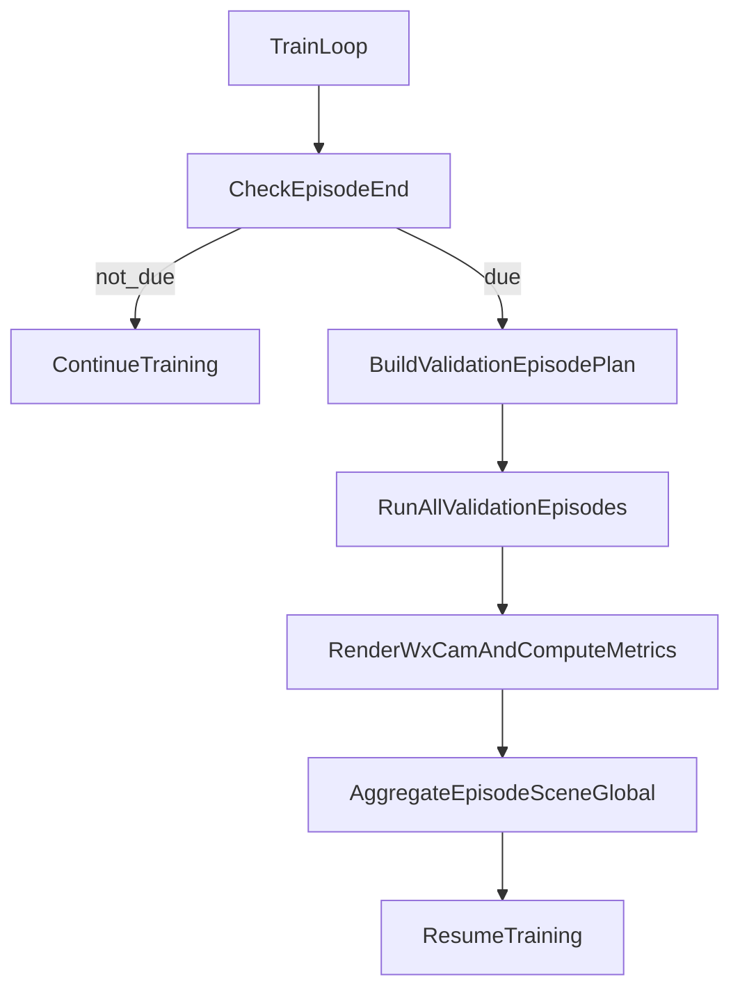

# TrainSchedulerV7 验证阶段设计方案

## 文档目标

本文定义 `TrainSchedulerV7` 在训练过程中的验证阶段（validation phase）设计。  
目标是引入**episode 级、可复现、低干扰**的验证流程，同时严格避免旧版 test split 配置误用。

---

## 1. 设计约束（对应当前需求）

### 1.1 数据来源约束

验证场景仅来自：

- `data.eval_scene_ids`

验证流程**不使用**以下旧配置语义：

- `data.pixel_source.test_image_stride`
- `data.pixel_source.max_test_images`

实现层要求：

- 若 `eval_scene_ids` 为空，validation 直接禁用（或 fast-fail，取决于配置）
- 若检测到 legacy test split 字段被用于 validation，直接报错提示迁移

### 1.2 触发约束

validation 按训练 episode 计数触发：

- 每间隔 `n` 个 train episodes 启动一次 validation
- validation 结束后继续训练，不改变训练主循环语义

### 1.3 验证样本约束

对 `eval_scene_ids` 中每个 scene 的每个 segment：

- 固定选择一个 episode（deterministic）
- 使用 StreetForward 推理模式执行（不优化参数）
- block 推进与训练保持一致（rolling block 切换规则不变）

### 1.4 评估输出约束

在一个验证 episode 完成后、reset 之前：

- 对该 episode 对应的 3DGS 场景执行渲染
- 渲染并保存 `(E+2) x num_cams` 张图
- 计算并记录 `PSNR`、`SSIM`、`LPIPS`
- 汇总所有验证 episode 的指标后结束 validation，并回到训练

### 1.5 缓存约束

验证 episode 涉及资源需长期缓存（至少整个训练期间）：

- segment static
- episode keyframe/frame chain 索引
- image meta
- optional view pack

---

## 2. Validation 主语义

## 2.1 训练-验证关系

- 训练仍由 `TrainSchedulerV7` 主导
- validation 是插入在训练 episode 边界的旁路阶段
- validation 不改变训练 scheduler 的 cursor/预算语义

建议分层：

- `TrainSchedulerV7`: 训练调度
- `ValidationSchedulerV7`（新组件）: 验证样本计划与执行

## 2.2 验证触发点

推荐在训练事件 `episode_end` 后检查：

- 若 `train_episode_counter % validate_every_n_episodes == 0`，触发 validation

这样可以保证：

- 训练 episode 完整闭环后再进入 validation
- 不切断训练中的 rolling chain

---

## 3. 验证 episode 选择策略

## 3.1 目标

每个 `(eval_scene_id, segment_id)` 固定一个 episode，且全程可复现。

## 3.2 固定 episode 选择（deterministic）

对 segment 已有 episode starts（由 `W` 与 keyframe 序列推导）：

- 选择策略默认：`middle`（中间 episode）
- 备选：`first` / `last` / `hash(scene,segment,seed)` / `explicit_map`

建议默认：

- `policy = hash_mod_with_seed`
- 保证多 segment 分布均匀，且同 seed 下稳定

输出结构：

```python
ValidationEpisodeSpecV7(
    scene_id: int,
    segment_id: int,
    episode_start_keyframe_pos: int,
)
```

该映射在训练启动时一次性构建并冻结。

---

## 4. 推理执行语义（与训练 block 对齐）

## 4.1 episode 构建

对每个 `ValidationEpisodeSpecV7`：

1. 取连续 keyframe window，长度 `E+2`
2. 按与训练一致的 policy 采样 frame chain（或固定 middle）
3. 构造 rolling `block_windows`

## 4.2 block 推进

验证 block 推进与训练一致：

- `block b` 使用 `target_frames = frame_chain[b:b+T]`
- 逐 block 推进，保留切换节奏与 batch 组织

区别仅在 runtime policy：

- no backward
- no optimizer step
- 必须更新 node state（按 block 推进持续更新）
- 不做监督 loss，不触发参数梯度与优化器

---

## 5. Episode 完成后的渲染与指标

## 5.1 渲染数量

每个验证 episode 渲染：

- `(E+2) x num_cams` 张图

## 5.2 渲染时机

渲染时机必须在：

- episode 完成后
- reset 之前

保证评估的是该 episode 累积后的 3DGS 状态。

## 5.3 指标

逐图计算：

- PSNR
- SSIM
- LPIPS

聚合维度：

- per-image
- per-episode
- per-scene
- global mean

## 5.4 日志与落盘

建议输出：

- `validation_episode_end` 事件日志（含 scene/segment/episode 标识）
- `validation_metrics.jsonl`（逐 episode）
- 渲染图目录（按 scene/segment/episode 分层）

---

## 6. 验证缓存设计

## 6.1 必须缓存内容

- `ValidationEpisodeSpecV7` 列表（全局冻结）
- 每个 spec 的 `frame_chain` 与 `block_windows`
- 对应 image refs 的 meta（必须）
- 对应 view pack（可选，建议开启）

## 6.2 缓存生命周期

- 从训练开始到结束持续保留
- 不受训练 active scope 清理影响

建议新增独立缓存域：

- `validation_cache_scope`

避免与训练 preload 清理策略互相污染。

## 6.3 预热策略

训练启动后可异步预热验证 episode：

- segment static 先行
- validation frame chain 的 image meta/view pack 低优先级持续预热

---

## 7. 新配置方案（替换旧 test 语义）

## 7.1 顶层配置草案

```yaml
validation_v7:
  eval_enable: true
  trigger:
    by: train_episode_interval
    validate_every_n_episodes: 20
    run_at_train_start: true

  episode_selection:
    policy: middle     

  render:
    save_images: true
    save_dir: validation/episodes

  cache:
    persist_across_training: true
```

## 7.2 与旧配置的关系

validation 阶段明确**不消费**以下旧字段：

- `data.pixel_source.test_image_stride`
- `data.pixel_source.max_test_images`
- `multi_scene.include_test`（不再作为 validation 开关）
- `eval.run_test_at_end`（不再作为 V7 validation 开关）

建议在配置校验中将上述字段列为：

- deprecated-for-v7-validation
- 若被配置为非默认且 `validation_v7.eval_enable=true`，则 fast-fail

---

## 8. 运行流程（高层）



---

## 9. 验收标准（Validation 部分）

满足以下条件视为验证方案落地达标：

1. validation 只基于 `eval_scene_ids` 选取样本
2. 触发机制为每 `n` 个 train episodes 执行一次
3. 每个 eval segment 固定一个 deterministic episode
4. 每个验证 episode 输出 `(E+2) x num_cams` 渲染结果
5. 指标包含 PSNR/SSIM/LPIPS，且支持 episode/scene/global 聚合
6. 验证结束后训练继续，训练调度状态不被污染
7. 验证 episode 缓存可持续复用，避免重复冷启动加载

---

## 10. 与当前配置文件的对齐说明

以 `configs/minimal_streetforward_stage4_4_multi_scene_v7.yaml` 为例：

- 使用 `data.eval_scene_ids` 作为 validation 场景入口
- 不使用 `data.pixel_source.test_image_stride` 与 `max_test_images` 控制 V7 validation
- 建议新增独立 `validation_v7` 配置块，逐步替代旧 test/eval 触发语义

