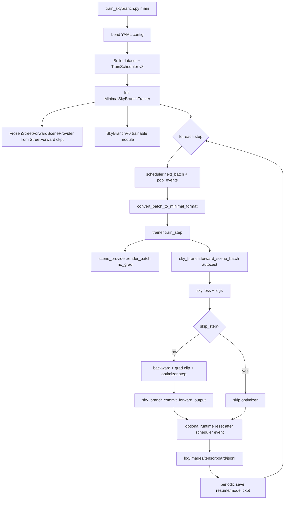

# SkyBranch Stage5.4 Exp002 训练流程说明

本文说明以下命令在当前代码中的执行路径、训练方式与关键组件：

```bash
PYTHONPATH=/root/drivestudio-coding python tools/train_skybranch.py --config_file configs/skybranch_stage5_4_exp002.yaml
```

核心实现文件：
- `tools/train_skybranch.py`
- `models/streetforward/sky_branch/trainer.py`
- `models/streetforward/sky_branch/sky_branch_v0.py`

---

## 1. 入口与总体数据流

`tools/train_skybranch.py` 做了四件事：
1. 读取配置并构建数据集/调度器（`build_multi_scene_dataset_v4` + `build_train_scheduler_v8_from_cfg`）。
2. 构建 `MinimalSkyBranchTrainer`（内部会加载冻结的 StreetForward 渲染提供器 + 可训练 SkyBranch）。
3. 循环取 batch，转成 minimal 格式，执行 `trainer.train_step(...)`。
4. 按策略写日志、导出可视化图、保存 checkpoint。



---

## 2. 训练方式（本配置的实际行为）

以 `configs/skybranch_stage5_4_exp002.yaml` 为准：

- **调度方式**
  - `scheduler_v8.execution.block_order: step_major`
  - `step_major_switch_interval_steps: 4`
  - `reset_policy: episode_end`
  - 含义：训练按 step 推进，不是“每个 block 一次性跑完”；到 episode_end 才触发调度器侧 reset 信号。

- **每块/每回合参数**
  - `block.steps_per_block: 12`
  - `episode.blocks_per_episode: 5`
  - `total_target_frames: 3`
  - `dataset.num_source_keyframes: 1`
  - `dataset.num_target_keyframes: 3`

- **Sky 运行态重置策略**
  - `training.reset_sky_state_policy: segment`
  - 在 `trainer.train_step` 里，如果调度器同步信息给出 `reset_after_block=True`，会执行：
    - `segment`：仅清理当前 `(scene_id, segment_id)` 的 `node_states_sky` 与 `h_cache_sky`
    - `all`：清理全局
    - `never`：不清理

- **优化方式**
  - `optimizer: AdamW(lr=2e-4, wd=1e-4, eps=1e-8)`
  - `amp: false`（本配置禁用混合精度）
  - `grad_clip_norm: 1.0`
  - 仅当 `skip_step == 0` 时才反传和更新。

- **冻结主干 + 训练分支**
  - StreetForward 场景渲染由冻结模型提供（`FrozenStreetForwardSceneProvider`）。
  - 可学习参数仅在 `SkyBranchV0` 内。

---

## 3. `MinimalSkyBranchTrainer` 的职责

`models/streetforward/sky_branch/trainer.py` 的职责可以概括为：

- **组装模块**
  - 创建冻结场景渲染器 `scene_provider`
  - 创建可训练分支 `sky_branch`
  - 创建优化器/GradScaler/训练状态

- **单步训练编排**
  1. `scene_provider.render_batch(...)` 生成目标视角场景底图（无梯度）。
  2. `sky_branch.forward_scene_batch(...)` 产出 sky 渲染、合成图、loss 和统计项。
  3. 若不 skip：
     - backward
     - grad clip
     - optimizer.step
     - `sky_branch.commit_forward_output(out)`（把本步结果写回 runtime state）
  4. 处理调度器驱动的 runtime reset。
  5. 返回结构化日志（loss、PSNR、显存等）。

- **Checkpoint 双形态**
  - `kind=model`：仅模型参数（部署/推理导向）
  - `kind=resume`：额外包含 optimizer、grad_scaler、Sky runtime state（断点续训导向）

---

## 4. `SkyBranchV0` 前向与学习机制

`models/streetforward/sky_branch/sky_branch_v0.py` 是核心学习器，重点如下。

### 4.1 状态表示（按 scene/segment 缓存）

- 缓存 key：`(scene_id, segment_id)`。
- 每个 key 对应：
  - `NodeStateSky`：天空高斯参数（means/scales/quats/opacity/sh）
  - `h_cache_sky`：每个天空节点的 GRU hidden state
- 首次进入 key 会基于半球壳 `fibonacci_shell_means(...)` 初始化。

### 4.2 前向主链路

1. 从 batch 取 source/target 视角与 mask。
2. 用当前节点状态渲染 source sky（`render_views`）。
3. `SkyFeatureExtractor` 输入 `[source_rgb * mask, current_sky_rgb * mask, mask]`，提 2D 特征。
4. 用 fused multi-camera lifting 将 2D 特征回投到 sky 节点，得到：
   - `node_feat`
   - `support`（节点被观测支持强度）
5. `update_sky_state`：
   - `GRUCell([node_feat, param_embed(node_params)], h_old) -> h_new`
   - 头部网络预测 offsets（scale/opacity/sh）
   - 按 `eta` 系数做残差更新得到新渲染参数
6. 可选 `direct_rgb_lift`：直接把 source 的 sky RGB lift 到节点，对 `sh_dc` 做 blend。
7. 用更新后的 sky 参数渲染 target 视角，和 scene 底图做合成：
   - `comp_rgb = scene_rgb*(1-sky_mask) + sky_rgb*sky_mask`
8. `skybranch_loss` 计算损失（comp/sky_direct/alpha 等），并输出日志。

### 4.3 Fast-fail 与 skip 机制

- 若 target sky 有效像素为 0，则返回 `skip_step=1`，loss 置零，不做参数更新。
- 多处输入 shape/长度不匹配会直接 `ValueError`，属于 fast-fail 设计。

---

## 5. 关键组件清单

- **FrozenStreetForwardSceneProvider**
  - 作用：提供冻结场景渲染结果（`scene_pack.target_rgb/target_alpha`）。
  - 价值：将“场景主体建模”与“天空增量学习”解耦。

- **SkyFeatureExtractor（2D CNN + ResBlock）**
  - 作用：从 source 图像与当前 sky 渲染差异中抽取可回投特征。

- **AlphaTWeightExtractorV3 + FeatureBackprojector**
  - 作用：多视角 fused lifting，把 2D 特征聚合到 sky 高斯节点。

- **GRU + 参数头（scale/opacity/SH）**
  - 作用：维护跨 step 的节点记忆，并预测每节点参数偏移量。

- **Direct RGB Lift**
  - 作用：把直接颜色观测写入 `sh_dc`，加速天空颜色收敛。

- **Runtime State 管理**
  - `commit_forward_output`：训练步成功后写回状态
  - `reset_runtime_state(_key)`：配合调度器在段/全局级别清理缓存
  - `runtime_state_dict/load_runtime_state_dict`：支持 resume 恢复

---

## 6. 训练产物与观测面

- **日志**
  - `train.log`：结构化 step/block/episode 日志
  - `metrics_history.jsonl`：可回放训练曲线
  - TensorBoard：`train/*` 标量

- **可视化**
  - `images/train_monitor` 下导出 `comp/gt/scene/sky/error/alpha/mask` 图

- **检查点**
  - 周期：`training.save_checkpoint_freq`
  - 结束：`skybranch_resume_final.pth`、`skybranch_model_final.pth`

---

## 7. 一句话理解这条命令

这条命令是在“冻结 StreetForward 场景渲染主干”的前提下，使用 Scheduler v8 提供的多场景时序 batch，训练一个按 `(scene, segment)` 维护状态的 SkyBranch：通过多视角特征回投 + GRU 递推去更新天空高斯参数，并将天空渲染与场景底图合成后做监督。
