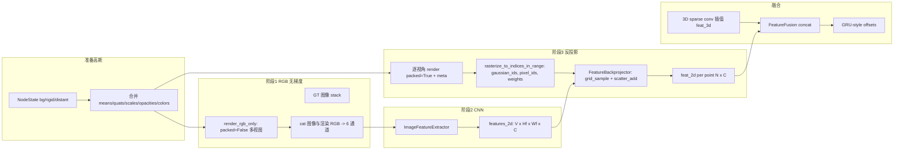

# StreetForward 2D 特征模块参考（供优化与 AI 审阅）

本文档汇总仓库中 **2D 特征提取 / 反投影（alpha-T）** 相关实现、与 **gsplat** 的衔接点、以及下游 **融合与训练器** 契约，便于独立审阅与提出优化方案。

**关联阅读：**

- 流程总览：[StreetForward_Flow.md](StreetForward_Flow.md)（§3.1–3.3 2D 特征与融合）
- Minimal 阶段说明：[StreetForward_Minimal_Stages_Usage.md](StreetForward_Minimal_Stages_Usage.md)
- **`grid_sample` 与 `pixel_id` 对齐（含 `feat_2d_downscale`）**：[StreetForward_2D_Pixel_Grid_Alignment.md](StreetForward_2D_Pixel_Grid_Alignment.md)
- 实现入口：`models/feature_extractors/`、`models/streetforward/feature_volume_mixin.py`、`models/streetforward/trainer.py`、`models/streetforward/minimal_trainer_stage3_2d.py`、`minimal_trainer_stage4_0.py`、`minimal_trainer_stage4_1.py`

---

## 1. 模块目标与约束

**目标：** 在 **source 视角** 上，为每个 3D Gaussian 点关联一个 **2D CNN 特征向量**，再与 **3D 稀疏卷积特征** 拼接（及可选可见性标量），作为 GRU-style offset 头的输入。

**关键设计约束（与优化强相关）：**

1. **双阶段管线**：先 `no_grad` 渲染 RGB（供 6 通道 CNN），再 CNN 前向，再 **逐视角 packed 渲染** 取 `(gaussian_id, pixel_id, weight)` 并反投影。
2. **权重与渲染梯度解耦**：alpha-T 权重在 `FeatureBackprojector` 内 **`weights.detach()`**；2D 分支 **不** 把梯度回传到 gsplat / NodeState（避免图爆炸）。CNN 仍可对 **真实图像 + 渲染 RGB** 的拼接输入求导（若上游未 `no_grad` 图像；当前主路径对渲染与部分步骤显式 `no_grad`）。
3. **权重语义**：CUDA 核中 `weight = T * alpha`（当前像素累积透射率 × 当前高斯 alpha），与经典 alpha 合成一致。
4. **packed vs 非 packed**：RGB 批量预览用 `packed=False` 多视图一次 kernel；反投影权重提取用 `packed=True` 需 `meta`（`means2d`, `conics`, `isect_offsets`, `flatten_ids`）。

---

## 2. 文件与职责一览

| 组件 | 路径 | 职责 |
|------|------|------|
| `AlphaTWeightExtractor` | `models/feature_extractors/alpha_t_extractor.py` | 调 `renderer`（gsplat）拿 RGB 或 packed meta；调 `rasterize_to_indices_in_range` 得到稀疏 `(gaussian_ids, pixel_ids, weights)` |
| `FeatureBackprojector` | `models/feature_extractors/feature_2d_backprojector.py` | 在特征图上 `grid_sample` 采样像素特征；按权重 `scatter_add` 聚合到每个 Gaussian；可选 `weight_threshold` 过滤 |
| `ImageFeatureExtractor` | `models/feature_extractors/image_feature_extractor.py` | 轻量 UNet，`[V,H,W,6]` → `[V,H_feat,W_feat,C]` |
| `FeatureFusion` | `models/feature_extractors/feature_fusion.py` | `concat([feat_3d, feat_2d, visibility])`（默认 `use_visibility=False` 时仅前两段） |
| 特征编排（完整 SF） | `models/streetforward/feature_volume_mixin.py` | `_compute_2d_features` / `_compute_2d_features_all`、`_fuse_features`、`_prepare_gaussians_for_source` / `_prepare_all_gaussians` |
| Minimal 3.2d+ | `minimal_trainer_stage3_2d.py` 等 | `_compute_2d_features_bg_distant`；Stage4 rigid 子集见 `minimal_trainer_stage4_0.py` / `stage4_1.py` |
| gsplat 入口 | `third_party/gsplat/gsplat/rendering.py` | `rasterization(..., packed=...)` 返回 `meta` |
| gsplat 索引核 | `third_party/gsplat/gsplat/cuda/_wrapper.py` | `rasterize_to_indices_in_range` → `rasterize_to_indices_3dgs` |
| CUDA 实现 | `third_party/gsplat/gsplat/cuda/csrc/RasterizeToIndices3DGS.cu` | 每像素按深度排序累乘 T，写出 `T*alpha` |

---

## 3. 端到端数据流（主路径）



**张量形状约定（典型）：**

- `multi_channel_input`: `[V, H, W, 6]`（RGB + 渲染 RGB）
- `features_2d`: `[V, H_feat, W_feat, C]`（UNet 输出为 channels-last `[V,H,W,C]`）
- 反投影输出：`[N_total, C]`，再按 `num_bg / num_rigid / num_distant` 切分

---

## 4. 各子模块要点

### 4.1 `AlphaTWeightExtractor`

**视图矩阵：** `_get_viewmat` 将 `camtoworlds` 转为 gsplat 期望的 `viewmat`（含 OpenGL 风格轴翻转 `* [1,-1,-1]` 于旋转）。

**阶段 1 — `render_rgb_only`：**

- 多视角 **batch**：`viewmats = cat([...])`, `Ks = cat([...])`，`packed=False`。
- 单次 `renderer(...)`，再按相机维拆成 `[H,W,3]` 列表。
- 全程 `torch.no_grad()`，输出 **clamp 到 [0,1]** 并 **detach**。

**阶段 2 — `render_and_backproject_streaming`：**

- **按视角 for 循环**（非 batch）：每视角 `packed=True` 调 `renderer`，取 `meta`；立即 `extract_single_weight` → `del meta` 以省显存。
- 调用 `FeatureBackprojector.backproject_single_view`，累加 `accumulated_feat`、`accumulated_weight_feature`。
- 最终 `feat_out = accumulated_feat / (accumulated_weight_feature.unsqueeze(-1) + eps)`（**按特征聚合权重归一化**，与「每高斯先加权再除权和」一致）。

**`extract_weights` / `extract_single_weight`：**

- `transmittances = ones(H, W)`：与全透明背景合成一致；核内按像素从前往后累积真实 T。
- `isect_offsets` 维数可能与 `image_dims` 不一致时，代码会 **squeeze 多余 leading 1**，以匹配 `rasterize_to_indices_in_range` 断言。

**依赖：** `from gsplat.cuda._wrapper import rasterize_to_indices_in_range`；不可用则构造时直接 `ImportError`。

### 4.2 `FeatureBackprojector`

**像素 → 归一化坐标（单视角）：**

- `pixel_id` 行主序：`x = id % W`, `y = id // W`
- `coord = (x/W, y/H) * 2 - 1`（`align_corners=True` 的 `grid_sample` 约定）

**采样：** `F.grid_sample(feat_hwc -> permute CHW, mode=bilinear, align_corners=True)`。

**聚合：**

- `weighted_feat = sampled * weights`，再 `scatter_add_` 到 `[N, C]` 与 `weight_sum_feature`。
- `weight_threshold > 0` 时 **先过滤小权重对**，减少内存；**Stage4.1 的 rigid 有效特征掩码** 使用 **`weight_threshold=0` 的 override**，避免掩码与“特征聚合近似”耦合（见 `minimal_trainer_stage4_1.py`）。

**`return_support_weight`：** 单独统计 **未过滤** 的 `weights` 之和到每个 Gaussian，用于 `mask_src_feat_valid`（support 强度），与 `weight_threshold` 无关。

### 4.3 `ImageFeatureExtractor`

- 标准 UNet：encoder `Down`（MaxPool+DoubleConv）、decoder `Up`（bilinear upsample + skip）。
- `feature_downscale > 1` 时在 UNet 前对输入做 `interpolate` 降采样，输出分辨率由 `get_feature_resolution` 描述。
- `forward` 输出 **`[B, H, W, C]`**（channels-last），与反投影中 `feat_2d.shape[-1]` 为通道一致。

### 4.4 `FeatureFusion`

- 当前默认实现：**拼接** `feat_3d`、`feat_2d`，若 `use_visibility` 且 `visibility` 非空则再拼一维 **`[N,1]`**。
- Distant 分支在 `feature_volume_mixin` 中可将 **3D 置零** 再与 `feat_2d_distant` 融合（2D-only 语义）。

---

## 5. Trainer 侧编排（`feature_volume_mixin`）

- **`_prepare_gaussians_for_source`**：bg + rigid（source 帧世界坐标）合并为单一 `gaussians` 字典。
- **`_prepare_all_gaussians`**：bg + rigid + distant 合并，顺序固定，用于 `feat_2d_all` 切片。
- **`_compute_2d_features` / `_compute_2d_features_all`**：
  - Phase1：`render_rgb_only` + 拼 6 通道 + `image_feature_extractor`。
  - Phase2：`render_and_backproject_streaming`。
  - rigid：`feat_2d_rigid *= rigid_visible_mask`（若提供）。
- **`_fuse_features`**：可选 `feat_fused_rms`（若 trainer 挂载）在 concat 后做 RMS。

**梯度策略（注释明确）：**

- 渲染 RGB 用于 CNN 时在 `no_grad` 中，且 **`rendered_batch` 必须 detach**，防止 CNN 与 Gaussian 渲染链相连。

---

## 6. Minimal Stage 差异（与 2D 相关）

| Stage | 说明 |
|-------|------|
| 3.2d+ | 强制 `source_views` / `source_images`；`_compute_2d_features_bg_distant` 与 bg+distant 高斯合并 |
| 4.0 | rigid 仅有效点子集 `gaussians_rigid` 单独做 2D；`feat_rigid_input = rigid_feat_proj(feat_2d_rigid)`（2D-only 进 GRU） |
| 4.1 | 在 4.0 上：`mask_src_feat_valid` 来自 **反投影累积 support** `acc_w > src_backproject_support_min`；`mask_update = mask_src_feat_valid & mask_any_tgt`；反投影 **强制 `weight_threshold=0`** 的 `FeatureBackprojector` |

---

## 7. gsplat：渲染与 meta

**文件：** `third_party/gsplat/gsplat/rendering.py` 中 `rasterization`。

**`packed=True` 时：**

- 投影结果为稀疏 `nnz` 条：`means2d`, `conics`, `depths`, `radii` 等；`meta` 含 **`isect_offsets`**、**`flatten_ids`**（与 tile 排序相交有关）。
- 用于后续 `rasterize_to_indices_in_range`。

**`packed=False`（RGB 批量 pass）：**

- 张量形状为 `[..., C, N, ...]`，内存较大但便于 batched 出图。

---

## 8. gsplat：`rasterize_to_indices_in_range`（Python 包装）

**文件：** `third_party/gsplat/gsplat/cuda/_wrapper.py`

**签名要点：**

```python
@torch.no_grad()
def rasterize_to_indices_in_range(
    range_start, range_end,
    transmittances,  # [..., H, W]
    means2d, conics, opacities,
    image_width, image_height, tile_size,
    isect_offsets, flatten_ids,
    return_weights: bool = False,
)
```

- `range_start=0`, `range_end=1e9`：**一次走完** 全部深度 batch（与 StreetForward 用法一致）。
- `return_weights=True` 时返回 **每个 (gaussian, pixel) 的 weight**。
- 输出 `pixel_ids` 为 **行主序** 一维索引；包装内还拆 `image_ids`（多视图 batch 时）。

**注意：** 该函数整体 **`@torch.no_grad()`**，故 **indices/weights 不参与 autograd**。

---

## 9. CUDA 核关键逻辑（`RasterizeToIndices3DGS.cu`）

**核函数：** `rasterize_to_indices_3dgs_kernel`

**与像素相关的量：**

- 像素中心：`(px, py) = (j + 0.5, i + 0.5)`（与光栅化一致）。
- 对每个按深度排序后的 Gaussian：`alpha = min(0.999, opacity * exp(-sigma))`，`sigma` 由 **2D 协方差逆（conic）** 与像素偏差二次型给出。
- **透射率更新：** `next_trans = trans * (1 - alpha)`；若 `next_trans <= 1e-4` 则该像素 **提前结束**（与可见性截断一致）。

**权重（`return_weights=True`）：**

```cpp
const float vis = alpha * trans; // 即 T * alpha（当前步前的 trans）
```

- 先乘上 **当前步之前** 的 `trans`，再写入 `weights`。
- `first_pass`：只统计每像素命中数量；`second pass`：按 `chunk_starts` 写入 `gaussian_ids`、`pixel_ids`、`weights`（两阶段与 `Rasterization.cpp` 中分配有关）。

**优化提示（供 AI）：**

- 共享内存：`id_batch`、`xy_opacity_batch`、`conic_batch`，`tile_size` 过大可能导致 `cudaFuncSetAttribute` 失败（错误信息已提示降低 `tile_size`）。
- 核注释提到 **double vs float** 对 transmittance 精度与速度的权衡。

---

## 10. 配置与超参（常见）

- `model.use_2d_features`：是否走 2D 分支  
- `model.feat_2d_channels`：UNet 输出通道 `C`  
- `model.feat_2d_downscale`：2D 特征分辨率相对输入图像的缩放  
- `AlphaTWeightExtractor.tile_size`：与 gsplat raster 一致（默认 16）  
- `FeatureBackprojector.weight_threshold`：稀疏对过滤；**掩码语义场景下设 0**  
- Stage4.1：`model.branches.rigid.src_backproject_support_min`：support 阈值  

---

## 11. 已知瓶颈与可优化方向（供向 AI 提问用）

下列条目可直接复制到对话中作为「优化问题」上下文。

1. **重复渲染**：同一 `gaussians` 先 `render_rgb_only`（多视图 batch），再 `render_and_backproject_streaming`（每视角 packed）。是否可 **合并为一次投影 + 两种输出** 或复用 `meta` 降低带宽？
2. **循环视角**：反投影为 Python for 循环，每步一次 packed 渲染。多视图时能否 **batch packed**（若 gsplat 支持）或 **减少同步**？
3. **特征分辨率 / 像素网格**：`features_2d` 可与光栅 `H×W` 不同；`pixel_id` 必须用 **全分辨率的 `(H,W)`** 转为 `align_corners=True` 下的 `grid`（`2*k/(S-1)-1`）。旧版 `j/W` 与 PyTorch 约定不一致，已在 `FeatureBackprojector` 修复；说明见 [StreetForward_2D_Pixel_Grid_Alignment.md](StreetForward_2D_Pixel_Grid_Alignment.md)。
4. **稀疏对数量**：高密场景 `M = (gaussian,pixel)` 对极多，`scatter_add` 与 `grid_sample` 成为热点；可否 **tile 内聚合**、**半精度**、或 **截断深度**？
5. **梯度策略**：当前 2D 特征 **不** 回传到渲染；若希望 **端到端** 微调 CNN，需重新设计 `no_grad` 边界与内存。
6. **与 3D 融合**：简单 concat 是否足够；是否需要 **门控 / 注意力 / 按 visibility 校准**（`FeatureFusion` 仅 concat）。
7. **Stage4.1 掩码**：`acc_w` 与 `src_backproject_support_min` 敏感性；阈值与 **训练稳定性** 的关系。

---

## 12. 关键代码摘录（便于对照）

### 12.1 alpha-T 权重定义（CUDA）

```161:167:third_party/gsplat/gsplat/cuda/csrc/RasterizeToIndices3DGS.cu
                int32_t g = id_batch[t]; // flatten index in [I * N]
                const float vis = alpha * trans; // T * alpha weight
                gaussian_ids[base + cnt] = g % N;
                pixel_ids[base + cnt] =
                    pix_id + image_id * image_height * image_width;
                if (weights != nullptr) {
                    weights[base + cnt] = vis;
```

### 12.2 流式反投影归一化

```412:416:models/feature_extractors/alpha_t_extractor.py
        feat_out = accumulated_feat / (accumulated_weight_feature.unsqueeze(-1) + eps)
        if return_accumulated_weights:
            if accumulated_weight_support is None:
                raise RuntimeError("Internal error: accumulated_weight_support is None.")
            return feat_out, accumulated_weight_support
```

### 12.3 6 通道输入与 CNN

```410:417:models/streetforward/feature_volume_mixin.py
        multi_channel_input = torch.cat([image_batch, rendered_batch], dim=-1)  # [V, H, W, 6]
        del rendered_batch, image_batch

        # Phase 2: CNN forward then streaming backprojection
        features_2d = self.image_feature_extractor(multi_channel_input)  # [V, H_feat, W_feat, C]
        del multi_channel_input
```

### 12.4 Stage4.1 无过滤反投影与掩码

```296:328:models/streetforward/minimal_trainer_stage4_1.py
            bp_unfiltered = FeatureBackprojector(
                eps=getattr(self.feature_backprojector, "eps", 1e-8),
                weight_threshold=0.0,
            )
            ...
            feat_S, acc_w = self._compute_2d_features_for_gaussians(
                ...
                return_accumulated_weights=True,
                backprojector_override=bp_unfiltered,
            )
            ...
            mask_src_feat_valid[S] = acc_w > self.src_backproject_support_min
```

---

## 13. 版本说明

- 文档基于当前仓库 `third_party/gsplat` 与 `models/feature_extractors` 实现整理；gsplat 升级时需重新核对 **`meta` 键名** 与 `rasterize_to_indices_in_range` 签名。
