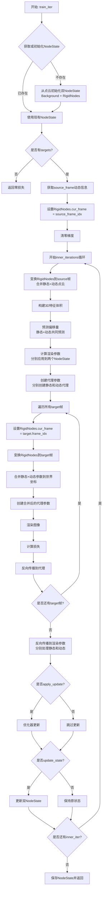

# StreetForward 动态物体实现方案

本文档详细说明如何在 StreetForward 训练器中实现动态物体支持，整合静态背景（Background）和动态物体（RigidNodes），同时保持代理梯度机制。

## 目录
1. [整体架构](#整体架构)
2. [数据结构设计](#数据结构设计)
3. [训练流程详解](#训练流程详解)
4. [关键实现细节](#关键实现细节)
5. [梯度反向传播机制](#梯度反向传播机制)
6. [与 MultiTrainer 的对比](#与-multitrainer-的对比)

---

## 整体架构

### 设计理念

StreetForward 动态物体支持采用**双 NodeState + 合并渲染**的架构：

1. **分离的 NodeState**：
   - `NodeStateBackground`: 存储静态背景的高斯参数（世界坐标系）
   - `NodeStateRigid`: 存储动态物体的高斯参数（局部坐标系）

2. **合并渲染机制**：
   - 参考 `MultiTrainer` 的设计，在渲染前合并静态和动态参数
   - 使用 `torch.cat` 直接合并，保持梯度连接，让 PyTorch 自动处理梯度反向传播

3. **代理梯度机制**：
   - 保持 StreetForward 原有的代理参数机制
   - 支持多视角梯度累积

4. **帧变换机制**：
   - 使用 `RigidNodes.set_cur_frame()` 在不同帧间变换动态物体
   - Source 帧：构建 3D 特征体积时，将动态物体变换到 source 帧
   - Target 帧：渲染时，将动态物体变换到对应的 target 帧

### 架构图

```
┌─────────────────────────────────────────────────────────────┐
│              StreetForwardTrainer (with Dynamic Objects)     │
├─────────────────────────────────────────────────────────────┤
│                                                               │
│  ┌──────────────────┐         ┌──────────────────┐          │
│  │ NodeStateBg      │         │ NodeStateRigid   │          │
│  │ (Detached)       │         │ (Detached)       │          │
│  │ - means          │         │ - means (local)  │          │
│  │ - scales_log     │         │ - scales_log     │          │
│  │ - quats          │         │ - quats          │          │
│  │ - opacity_logit  │         │ - opacity_logit  │          │
│  │ - sh_dc          │         │ - sh_dc          │          │
│  │ - sh_rest        │         │ - sh_rest        │          │
│  └──────────────────┘         └──────────────────┘          │
│           │                              │                  │
│           │                              │                  │
│           └──────────┬───────────────────┘                  │
│                      │                                      │
│           ┌──────────▼──────────┐                          │
│           │  train_iter()        │                          │
│           │  (1 source + N targets)                        │
│           └──────────┬───────────┘                          │
│                      │                                      │
│    ┌─────────────────┼─────────────────┐                   │
│    │                 │                 │                    │
│    ▼                 ▼                 ▼                    │
│ ┌─────────┐   ┌──────────┐   ┌──────────┐                 │
│ │Transform│   │ 3D Vol   │   │ Offsets  │                 │
│ │to Source│──▶│ Builder  │──▶│ Predict  │                 │
│ └─────────┘   └──────────┘   └──────────┘                 │
│                                                               │
│  ┌──────────────────────────────────────────────┐           │
│  │  For each target frame:                      │           │
│  │  1. Transform RigidNodes to target frame    │           │
│  │  2. Merge Background + RigidNodes params     │           │
│  │  3. Create proxy params                      │           │
│  │  4. Render & accumulate gradients             │           │
│  └──────────────────────────────────────────────┘           │
└─────────────────────────────────────────────────────────────┘
```

---

## 数据结构设计

### 1. 扩展的 Batch 数据结构

```python
batch = {
    "scene_id": int,
    "segment_id": int,
    "source_frame_idx": int,  # 场景全局 frame_idx（source 帧）
  
    # 点云数据（包含静态和动态）
    "pointcloud": {
        "background": np.ndarray,  # [N_bg, 6] - 静态背景（世界坐标）
        "dynamic": Dict[int, np.ndarray],  # {instance_id: [N_i, 6]} - 动态物体（局部坐标）
    },
  
    # Source 帧信息（可选，用于监督）
    "source": {
        "frame_idx": int,  # 场景全局 frame_idx（与 source_frame_idx 相同）
        "views": List[View],  # 多个相机视角（可选）
        "gt_images": List[torch.Tensor],  # [H, W, 3]（可选）
    },
  
    # Target 帧信息（每个 target 帧一个）
    "targets": List[{
        "frame_idx": int,  # 场景全局 frame_idx（重要：不是 segment 内的关键帧索引）
        "view": View,
        "gt_image": torch.Tensor,  # [H, W, 3]
    }],
  
    # 动态物体信息（从 dataset 获取，按 frame_idx 索引）
    "dynamic_info": Dict[int, Dict],  # {frame_idx: {instances, poses, frame_info}}
}
```

**关键索引说明：**

- `source_frame_idx` 和 `targets[].frame_idx` 都是**场景的全局 frame_idx**，用于从 `DrivingDataset` 获取动态物体信息
- `pointcloud["dynamic"]` 中的点云是**局部坐标系**（相对于实例的局部坐标系）
- `dynamic_info` 按 frame_idx 索引，包含每帧的实例位姿信息

### 2. 双 NodeState 结构

```python
@dataclass
class NodeStateBackground:
    """静态背景的 NodeState（世界坐标系）"""
    means: torch.Tensor          # [N_bg, 3] - 世界坐标
    scales_log: torch.Tensor     # [N_bg, 3]
    quats: torch.Tensor          # [N_bg, 4] - wxyz格式
    opacity_logit: torch.Tensor  # [N_bg, 1]
    sh_dc: torch.Tensor          # [N_bg, 3]
    sh_rest: torch.Tensor        # [N_bg, num_sh-1, 3]

@dataclass
class NodeStateRigid:
    """动态物体的 NodeState（局部坐标系）"""
    means: torch.Tensor          # [N_rigid, 3] - 局部坐标
    scales_log: torch.Tensor     # [N_rigid, 3]
    quats: torch.Tensor          # [N_rigid, 4] - 局部旋转（wxyz格式）
    opacity_logit: torch.Tensor  # [N_rigid, 1]
    sh_dc: torch.Tensor          # [N_rigid, 3]
    sh_rest: torch.Tensor        # [N_rigid, num_sh-1, 3]
    
    # RigidNodes 特有参数
    point_ids: torch.Tensor      # [N_rigid, 1] - 每个点属于哪个实例
    instances_quats: torch.Tensor # [num_frames, num_instances, 4] - 实例旋转
    instances_trans: torch.Tensor # [num_frames, num_instances, 3] - 实例平移
    instances_fv: torch.Tensor   # [num_frames, num_instances] - 实例可见性
    cur_frame: int               # 当前帧索引（用于变换）
```

**存储结构：**

```python
# 在 StreetForwardTrainer 中
self.node_states_bg: Dict[Tuple[int, int], NodeStateBackground] = {}  # {(scene_id, segment_id): NodeStateBackground}
self.node_states_rigid: Dict[Tuple[int, int], NodeStateRigid] = {}    # {(scene_id, segment_id): NodeStateRigid}
```

### 3. 合并后的高斯参数结构

在渲染前，需要合并静态和动态参数。注意：不需要显式创建 `MergedGaussianParams` 数据结构，直接使用 `torch.cat` 合并即可。

**合并方式：**
```python
# 直接使用 torch.cat 合并，保持梯度连接
merged_means = torch.cat([proxies_bg["means_p"], means_rigid_world], dim=0)
merged_quats = torch.cat([proxies_bg["quats_p"], quats_rigid_world], dim=0)
# ... 其他参数类似
```

**注意：**
- 不需要 `pts_labels` 用于梯度分离，`torch.cat` 会自动处理梯度反向传播
- `pts_labels` 可以用于可视化或后处理阶段分开更新（如果需要）

---

## 训练流程详解

### 主训练循环流程图



### 详细步骤说明

#### 步骤1: NodeState 初始化

**输入：**
- `batch["pointcloud"]["background"]`: `[N_bg, 6]` - 静态背景点云（世界坐标）
- `batch["pointcloud"]["dynamic"]`: `Dict[int, np.ndarray]` - 动态物体点云（局部坐标）

**处理流程：**

```python
def _get_or_init_node_states(self, batch):
    key = (batch["scene_id"], batch["segment_id"])
    
    # 初始化 Background NodeState
    if key not in self.node_states_bg:
        bg_pcd = batch["pointcloud"]["background"]  # [N_bg, 6]
        node_state_bg = self._init_node_state_from_pcd(
            points=bg_pcd[:, :3],  # [N_bg, 3]
            colors=bg_pcd[:, 3:6], # [N_bg, 3]
            is_rigid=False
        )
        self.node_states_bg[key] = node_state_bg
    
    # 初始化 RigidNodes NodeState
    if key not in self.node_states_rigid:
        # 合并所有动态实例的点云
        all_dynamic_points = []
        all_dynamic_colors = []
        point_ids = []  # 记录每个点属于哪个实例
        
        for instance_id, instance_pcd in batch["pointcloud"]["dynamic"].items():
            n_points = instance_pcd.shape[0]
            all_dynamic_points.append(instance_pcd[:, :3])
            all_dynamic_colors.append(instance_pcd[:, 3:6])
            point_ids.extend([instance_id] * n_points)
        
        if len(all_dynamic_points) > 0:
            dynamic_points = np.concatenate(all_dynamic_points, axis=0)  # [N_rigid, 3]
            dynamic_colors = np.concatenate(all_dynamic_colors, axis=0)  # [N_rigid, 3]
            point_ids = torch.tensor(point_ids, dtype=torch.long)  # [N_rigid]
            
            # 获取动态物体信息（用于初始化 instances_quats, instances_trans）
            # 注意：需要确保 dynamic_info 包含所有帧的信息
            dynamic_info = batch.get("dynamic_info", {})
            if not dynamic_info or batch["source_frame_idx"] not in dynamic_info:
                # 如果 dynamic_info 不存在或不完整，从 dataset 获取
                # 这里假设可以从 dataset 获取完整的 dynamic_info
                # 实际实现中需要根据具体情况处理
                raise ValueError(f"dynamic_info not found for frame {batch['source_frame_idx']}")
            
            node_state_rigid = self._init_rigid_node_state_from_pcd(
                points=dynamic_points,
                colors=dynamic_colors,
                point_ids=point_ids,
                dynamic_info=dynamic_info,  # 完整的 dynamic_info，包含所有帧
                num_frames=len(dynamic_info) if dynamic_info else 1
            )
            self.node_states_rigid[key] = node_state_rigid
        else:
            self.node_states_rigid[key] = None  # 无动态物体
    
    return self.node_states_bg[key], self.node_states_rigid[key]
```

**关键点：**
- Background 使用世界坐标初始化
- RigidNodes 使用局部坐标初始化，并记录 `point_ids`
- 需要从 `dynamic_info` 初始化 `instances_quats` 和 `instances_trans`

#### 步骤2: 变换到 Source 帧并构建 3D 特征体积

**目的：** 在 source 帧下构建统一的 3D 特征体积，用于预测偏移量

**处理流程：**

```python
def _build_3d_feature_volume(self, node_state_bg, node_state_rigid, source_frame_idx):
    # 1. 设置 RigidNodes 的当前帧
    if node_state_rigid is not None:
        node_state_rigid.cur_frame = source_frame_idx
    
    # 2. 获取静态背景的点云（已经是世界坐标）
    means_bg = node_state_bg.means  # [N_bg, 3]
    anchor_rgb_bg = _sh_to_rgb(node_state_bg.sh_dc)  # [N_bg, 3]
    
    # 3. 变换动态物体到 source 帧的世界坐标
    if node_state_rigid is not None:
        # 使用 RigidNodes 的变换方法
        means_rigid_local = node_state_rigid.means  # [N_rigid, 3] - 局部坐标
        means_rigid_world = self._transform_rigid_to_world(
            node_state_rigid, means_rigid_local
        )  # [N_rigid, 3] - 世界坐标（source 帧）
        anchor_rgb_rigid = _sh_to_rgb(node_state_rigid.sh_dc)  # [N_rigid, 3]
    else:
        means_rigid_world = torch.empty(0, 3, device=self.device)
        anchor_rgb_rigid = torch.empty(0, 3, device=self.device)
    
    # 4. 合并静态和动态点云
    means_all = torch.cat([means_bg, means_rigid_world], dim=0)  # [N_total, 3]
    anchor_rgb_all = torch.cat([anchor_rgb_bg, anchor_rgb_rigid], dim=0)  # [N_total, 3]
    
    # 5. 构建 3D 特征体积（与原始 StreetForward 相同）
    sparse_feat, vol_dim, valid_coords = self.construct_sparse_tensor(
        raw_coords=means_all.clone(),
        feats=anchor_rgb_all,
        Bbx_max=self.bbx_max,
        Bbx_min=self.bbx_min,
        voxel_size=self.voxel_size,
        device=self.device,
    )
    feat_3d = self.sparse_conv(sparse_feat)
    dense_volume = self.sparse_to_dense_volume(
        sparse_tensor=feat_3d,
        coords=valid_coords,
        vol_dim=vol_dim,
    ).unsqueeze(dim=0)
    dense_volume = dense_volume.permute(0, 4, 3, 2, 1)  # [1, C, D, H, W]
    
    # 6. 为静态和动态点分别插值特征
    grid_coords_bg = self.get_grid_coords(means_bg, self.bbx_min, vol_dim, self.voxel_size)
    feat_3d_crop_bg = self.interpolate_features(grid_coords_bg, dense_volume)  # [N_bg, C]
    
    if node_state_rigid is not None:
        grid_coords_rigid = self.get_grid_coords(means_rigid_world, self.bbx_min, vol_dim, self.voxel_size)
        feat_3d_crop_rigid = self.interpolate_features(grid_coords_rigid, dense_volume)  # [N_rigid, C]
    else:
        feat_3d_crop_rigid = torch.empty(0, feat_3d_crop_bg.shape[1], device=self.device)
    
    return feat_3d_crop_bg, feat_3d_crop_rigid
```

**关键点：**
- 动态物体需要先变换到 source 帧的世界坐标
- 静态和动态点云合并后构建统一的 3D 特征体积
- 但需要分别为静态和动态点插值特征（因为后续要分开应用偏移量）

#### 步骤3: 偏移量预测

**处理流程：**

```python
def _predict_offsets(self, feat_3d_crop_bg, feat_3d_crop_rigid):
    # 静态背景的偏移量
    offsets_bg = {
        "offset_pos": self.offset_max * torch.tanh(self.mlp_offset_pos(feat_3d_crop_bg)),
        "offset_scales": self.scale_max * torch.tanh(self.mlp_conv(feat_3d_crop_bg)[:, :3]),
        "offset_omega": self.omega_max * torch.tanh(self.mlp_conv(feat_3d_crop_bg)[:, 3:6]),
        "offset_opacity": self.opacity_max * torch.tanh(self.mlp_opacity(feat_3d_crop_bg)),
        "offset_sh": self._predict_sh_offset(feat_3d_crop_bg),
    }
    
    # 动态物体的偏移量（使用相同的 MLP）
    if feat_3d_crop_rigid.shape[0] > 0:
        offsets_rigid = {
            "offset_pos": self.offset_max * torch.tanh(self.mlp_offset_pos(feat_3d_crop_rigid)),
            "offset_scales": self.scale_max * torch.tanh(self.mlp_conv(feat_3d_crop_rigid)[:, :3]),
            "offset_omega": self.omega_max * torch.tanh(self.mlp_conv(feat_3d_crop_rigid)[:, 3:6]),
            "offset_opacity": self.opacity_max * torch.tanh(self.mlp_opacity(feat_3d_crop_rigid)),
            "offset_sh": self._predict_sh_offset(feat_3d_crop_rigid),
        }
    else:
        offsets_rigid = None
    
    return offsets_bg, offsets_rigid
```

**关键点：**
- 静态和动态使用**相同的 MLP 网络**预测偏移量
- 在 source 帧下，静态和动态都是确定的，偏移量是共同预测的，不区别对待
- 偏移量分别应用到对应的 NodeState

#### 步骤4: 计算渲染参数

**处理流程：**

```python
def _render_params_from_offsets(self, node_state_bg, node_state_rigid, offsets_bg, offsets_rigid):
    # 静态背景的渲染参数（与原始 StreetForward 相同）
    render_params_bg = {
        "means_r": node_state_bg.means + self.eta_means * offsets_bg["offset_pos"],
        "scales_log_r": node_state_bg.scales_log + self.eta_scales * offsets_bg["offset_scales"],
        "scales_r": torch.exp(render_params_bg["scales_log_r"]),
        "quats_r": _normalize_quat(_quat_multiply(node_state_bg.quats, _axis_angle_to_quat(offsets_bg["offset_omega"]))),
        "opacity_logit_r": node_state_bg.opacity_logit + self.eta_opacity * offsets_bg["offset_opacity"],
        "opacities_r": torch.sigmoid(render_params_bg["opacity_logit_r"]).squeeze(-1),
        "sh_dc_r": node_state_bg.sh_dc + self.eta_sh_dc * offsets_bg["offset_sh"][:, :3],
        "sh_rest_r": node_state_bg.sh_rest + self.eta_sh_rest * offsets_bg["offset_sh"][:, 3:].view(-1, self.num_sh-1, 3),
        "colors_r": torch.cat([render_params_bg["sh_dc_r"][:, None, :], render_params_bg["sh_rest_r"]], dim=1),
    }
    
    # 动态物体的渲染参数（局部坐标系）
    if node_state_rigid is not None and offsets_rigid is not None:
        render_params_rigid = {
            "means_r": node_state_rigid.means + self.eta_means * offsets_rigid["offset_pos"],  # 局部坐标
            "scales_log_r": node_state_rigid.scales_log + self.eta_scales * offsets_rigid["offset_scales"],
            "scales_r": torch.exp(render_params_rigid["scales_log_r"]),
            "quats_r": _normalize_quat(_quat_multiply(node_state_rigid.quats, _axis_angle_to_quat(offsets_rigid["offset_omega"]))),
            "opacity_logit_r": node_state_rigid.opacity_logit + self.eta_opacity * offsets_rigid["offset_opacity"],
            "opacities_r": torch.sigmoid(render_params_rigid["opacity_logit_r"]).squeeze(-1),
            "sh_dc_r": node_state_rigid.sh_dc + self.eta_sh_dc * offsets_rigid["offset_sh"][:, :3],
            "sh_rest_r": node_state_rigid.sh_rest + self.eta_sh_rest * offsets_rigid["offset_sh"][:, 3:].view(-1, self.num_sh-1, 3),
            "colors_r": torch.cat([render_params_rigid["sh_dc_r"][:, None, :], render_params_rigid["sh_rest_r"]], dim=1),
        }
    else:
        render_params_rigid = None
    
    return render_params_bg, render_params_rigid
```

**关键点：**
- 静态背景的渲染参数是**世界坐标**
- 动态物体的渲染参数是**局部坐标**（需要在渲染前变换到目标帧）

#### 步骤5: 多 Target 帧渲染（使用代理参数）

**关键设计：**
- 在循环外创建一次 `proxies_bg` 和 `proxies_rigid`（局部坐标），所有 target 帧共享
- 每个 target 帧通过可微变换将动态物体变换到世界坐标
- 使用 `torch.cat` 直接合并参数，保持梯度连接，让 PyTorch 自动处理梯度反向传播
- 不需要创建 `merged_proxies`，直接使用合并后的参数进行渲染

**处理流程：**

```python
def _render_target_frames(self, render_params_bg, render_params_rigid, node_state_rigid, targets):
    total_loss = 0.0
    
    # 1. 在循环外创建代理参数（所有 target 帧共享）
    proxies_bg = self._create_proxy_params(render_params_bg)
    
    # 为动态物体创建代理参数（局部坐标，所有 target 帧共享）
    if render_params_rigid is not None:
        proxies_rigid = self._create_proxy_params(render_params_rigid)
    else:
        proxies_rigid = None
    
    # 2. 遍历所有 target 帧，累积梯度
    for target in targets:
        target_frame_idx = target["frame_idx"]
        view = target["view"]
        gt_image = target["gt_image"]
        
        # 2.1 设置 RigidNodes 的当前帧
        if node_state_rigid is not None:
            node_state_rigid.cur_frame = target_frame_idx
        
        # 2.2 变换动态物体到 target 帧的世界坐标（保持梯度连接）
        if proxies_rigid is not None:
            # 关键：不 detach，让梯度自动反向传播
            means_rigid_world = self._transform_rigid_to_world(
                node_state_rigid, proxies_rigid["means_p"]  # 共享的局部坐标代理
            )
            quats_rigid_world = self._transform_rigid_quats_to_world(
                node_state_rigid, proxies_rigid["quats_p"]  # 共享的局部坐标代理
            )
        else:
            means_rigid_world = torch.empty(0, 3, device=self.device)
            quats_rigid_world = torch.empty(0, 4, device=self.device)
        
        # 2.3 直接合并参数（使用 torch.cat，保持梯度连接）
        # PyTorch 会自动处理 cat 操作的梯度反向传播
        merged_means = torch.cat([proxies_bg["means_p"], means_rigid_world], dim=0)
        merged_quats = torch.cat([proxies_bg["quats_p"], quats_rigid_world], dim=0)
        merged_scales = torch.cat([
            proxies_bg["scales_p"],
            proxies_rigid["scales_p"] if proxies_rigid is not None else torch.empty(0, 3, device=self.device)
        ], dim=0)
        merged_opacities = torch.cat([
            proxies_bg["opacities_p"],
            proxies_rigid["opacities_p"] if proxies_rigid is not None else torch.empty(0, device=self.device)
        ], dim=0)
        merged_colors = torch.cat([
            proxies_bg["colors_p"],
            proxies_rigid["colors_p"] if proxies_rigid is not None else torch.empty(0, self.num_sh, 3, device=self.device)
        ], dim=0)
        
        # 2.4 渲染（直接使用合并后的参数）
        render, alpha, info = self.renderer(
            means=merged_means,
            quats=merged_quats,
            scales=merged_scales,
            opacities=merged_opacities,
            colors=merged_colors,  # SH系数或RGB值
            viewmats=viewmat,
            Ks=K,
            width=width,
            height=height,
        )
        
        # 2.5 计算损失并反向传播
        rgb = render[0, ..., :3]  # [H, W, 3]
        loss = torch.mean((rgb - gt_image) ** 2) / len(targets)
        loss.backward()  # 梯度会自动反向传播：
        # - 通过 cat 操作反向传播到 proxies_bg 和 means_rigid_world/quats_rigid_world
        # - 通过变换操作反向传播到 proxies_rigid
        # - 梯度会在 proxies_bg 和 proxies_rigid 上累积（因为它们在所有 target 帧中共享）
        
        total_loss += loss.item()
    
    # 3. 反向传播到渲染参数（与原始 StreetForward 相同）
    render_tensors_bg = [
        render_params_bg["means_r"],
        render_params_bg["scales_r"],
        render_params_bg["quats_r"],
        render_params_bg["opacities_r"],
        render_params_bg["colors_r"],
    ]
    proxy_grads_bg = [
        proxies_bg["means_p"].grad if proxies_bg["means_p"].grad is not None else torch.zeros_like(proxies_bg["means_p"]),
        proxies_bg["scales_p"].grad if proxies_bg["scales_p"].grad is not None else torch.zeros_like(proxies_bg["scales_p"]),
        proxies_bg["quats_p"].grad if proxies_bg["quats_p"].grad is not None else torch.zeros_like(proxies_bg["quats_p"]),
        proxies_bg["opacities_p"].grad if proxies_bg["opacities_p"].grad is not None else torch.zeros_like(proxies_bg["opacities_p"]),
        proxies_bg["colors_p"].grad if proxies_bg["colors_p"].grad is not None else torch.zeros_like(proxies_bg["colors_p"]),
    ]
    torch.autograd.backward(tensors=render_tensors_bg, grad_tensors=proxy_grads_bg)
    
    if proxies_rigid is not None:
        render_tensors_rigid = [
            render_params_rigid["means_r"],
            render_params_rigid["scales_r"],
            render_params_rigid["quats_r"],
            render_params_rigid["opacities_r"],
            render_params_rigid["colors_r"],
        ]
        proxy_grads_rigid = [
            proxies_rigid["means_p"].grad if proxies_rigid["means_p"].grad is not None else torch.zeros_like(proxies_rigid["means_p"]),
            proxies_rigid["scales_p"].grad if proxies_rigid["scales_p"].grad is not None else torch.zeros_like(proxies_rigid["scales_p"]),
            proxies_rigid["quats_p"].grad if proxies_rigid["quats_p"].grad is not None else torch.zeros_like(proxies_rigid["quats_p"]),
            proxies_rigid["opacities_p"].grad if proxies_rigid["opacities_p"].grad is not None else torch.zeros_like(proxies_rigid["opacities_p"]),
            proxies_rigid["colors_p"].grad if proxies_rigid["colors_p"].grad is not None else torch.zeros_like(proxies_rigid["colors_p"]),
        ]
        torch.autograd.backward(tensors=render_tensors_rigid, grad_tensors=proxy_grads_rigid)
    
    return total_loss
```

**关键函数：**

```python
def _transform_rigid_to_world(self, node_state_rigid, means_local):
    """将动态物体的局部坐标变换到世界坐标（参考 RigidNodes.transform_means）
    
    关键：保持梯度连接，不使用 detach，让 PyTorch 自动处理梯度反向传播
    """
    # 获取当前帧的实例位姿（这些参数是 detached 的，不参与梯度计算）
    rot_cur_frame = quat_to_rotmat(node_state_rigid.instances_quats[node_state_rigid.cur_frame])  # [num_instances, 3, 3]
    trans_cur_frame = node_state_rigid.instances_trans[node_state_rigid.cur_frame]  # [num_instances, 3]
    
    # 为每个点查找对应的实例位姿
    rot_per_pts = rot_cur_frame[node_state_rigid.point_ids[..., 0]]  # [N_rigid, 3, 3]
    trans_per_pts = trans_cur_frame[node_state_rigid.point_ids[..., 0]]  # [N_rigid, 3]
    
    # 变换到世界坐标（可微操作，梯度会自动反向传播）
    means_world = torch.bmm(rot_per_pts, means_local.unsqueeze(-1)).squeeze(-1) + trans_per_pts
    return means_world

def _transform_rigid_quats_to_world(self, node_state_rigid, quats_local):
    """将动态物体的局部旋转变换到世界坐标（参考 RigidNodes.transform_quats）
    
    关键：保持梯度连接，不使用 detach，让 PyTorch 自动处理梯度反向传播
    """
    # 获取当前帧的实例旋转（这些参数是 detached 的，不参与梯度计算）
    quats_cur_frame = node_state_rigid.instances_quats[node_state_rigid.cur_frame]  # [num_instances, 4]
    
    # 为每个点查找对应的实例旋转
    quats_inst_per_pts = quats_cur_frame[node_state_rigid.point_ids[..., 0]]  # [N_rigid, 4]
    
    # 组合旋转（局部旋转 × 实例旋转，可微操作）
    quats_world = _normalize_quat(_quat_multiply(quats_inst_per_pts, quats_local))
    return quats_world
```

**关键点：**
- **代理参数共享**：`proxies_bg` 和 `proxies_rigid` 在所有 target 帧中共享，梯度自动累积
- **可微变换**：坐标变换保持梯度连接，不使用 detach，让 PyTorch 自动处理梯度反向传播
- **自动梯度分离**：`torch.cat` 操作会自动处理梯度分离，不需要手动使用 `pts_labels`
- **梯度累积机制**：每个 `loss.backward()` 调用会将梯度累积到共享的 `proxies_bg` 和 `proxies_rigid` 上

#### 步骤6: 反向传播到渲染参数

**关键设计：**
- 在步骤5中，梯度已经通过 `loss.backward()` 自动反向传播并累积到 `proxies_bg` 和 `proxies_rigid` 上
- 不需要手动分离梯度，因为 `torch.cat` 操作会自动处理梯度分离
- 不需要手动计算坐标变换的雅可比，PyTorch 的自动微分会自动处理
- 直接使用累积的梯度反向传播到渲染参数（与原始 StreetForward 相同）

**处理流程：**

```python
# 注意：这部分代码已经在步骤5中实现，这里单独说明是为了清晰

# 在步骤5的循环结束后，proxies_bg 和 proxies_rigid 已经累积了所有 target 帧的梯度
# 直接使用这些梯度反向传播到渲染参数

render_tensors_bg = [
    render_params_bg["means_r"],
    render_params_bg["scales_r"],
    render_params_bg["quats_r"],
    render_params_bg["opacities_r"],
    render_params_bg["colors_r"],
]
proxy_grads_bg = [
    proxies_bg["means_p"].grad if proxies_bg["means_p"].grad is not None else torch.zeros_like(proxies_bg["means_p"]),
    proxies_bg["scales_p"].grad if proxies_bg["scales_p"].grad is not None else torch.zeros_like(proxies_bg["scales_p"]),
    proxies_bg["quats_p"].grad if proxies_bg["quats_p"].grad is not None else torch.zeros_like(proxies_bg["quats_p"]),
    proxies_bg["opacities_p"].grad if proxies_bg["opacities_p"].grad is not None else torch.zeros_like(proxies_bg["opacities_p"]),
    proxies_bg["colors_p"].grad if proxies_bg["colors_p"].grad is not None else torch.zeros_like(proxies_bg["colors_p"]),
]
torch.autograd.backward(tensors=render_tensors_bg, grad_tensors=proxy_grads_bg)

if proxies_rigid is not None:
    render_tensors_rigid = [
        render_params_rigid["means_r"],
        render_params_rigid["scales_r"],
        render_params_rigid["quats_r"],
        render_params_rigid["opacities_r"],
        render_params_rigid["colors_r"],
    ]
    proxy_grads_rigid = [
        proxies_rigid["means_p"].grad if proxies_rigid["means_p"].grad is not None else torch.zeros_like(proxies_rigid["means_p"]),
        proxies_rigid["scales_p"].grad if proxies_rigid["scales_p"].grad is not None else torch.zeros_like(proxies_rigid["scales_p"]),
        proxies_rigid["quats_p"].grad if proxies_rigid["quats_p"].grad is not None else torch.zeros_like(proxies_rigid["quats_p"]),
        proxies_rigid["opacities_p"].grad if proxies_rigid["opacities_p"].grad is not None else torch.zeros_like(proxies_rigid["opacities_p"]),
        proxies_rigid["colors_p"].grad if proxies_rigid["colors_p"].grad is not None else torch.zeros_like(proxies_rigid["colors_p"]),
    ]
    torch.autograd.backward(tensors=render_tensors_rigid, grad_tensors=proxy_grads_rigid)
```

**关键点：**
- **自动梯度分离**：`torch.cat` 操作会自动将梯度分离到对应的输入张量，不需要手动使用 `pts_labels`
- **自动雅可比计算**：PyTorch 的自动微分会自动计算坐标变换的雅可比，不需要手动实现 `_backward_rigid_transform`
- **梯度累积**：所有 target 帧的梯度已经累积到 `proxies_bg` 和 `proxies_rigid` 上
- **与原始 StreetForward 一致**：反向传播机制与原始实现完全相同，只是分别处理静态和动态参数

#### 步骤7: 更新 NodeState

**处理流程：**

```python
def _update_node_states(self, render_params_bg, render_params_rigid, node_state_bg, node_state_rigid):
    """更新 NodeState（与原始 StreetForward 相同，但分别更新两个 NodeState）"""
    with torch.no_grad():
        # 更新静态背景
        means_clamped = torch.clamp(
            render_params_bg["means_r"].detach(),
            min=self.bbx_min,
            max=self.bbx_max
        )
        node_state_bg.means.copy_(means_clamped)
        node_state_bg.scales_log.copy_(render_params_bg["scales_log_r"].detach())
        node_state_bg.quats.copy_(render_params_bg["quats_r"].detach())
        node_state_bg.opacity_logit.copy_(render_params_bg["opacity_logit_r"].detach())
        node_state_bg.sh_dc.copy_(render_params_bg["sh_dc_r"].detach())
        node_state_bg.sh_rest.copy_(render_params_bg["sh_rest_r"].detach())
        
        # 更新动态物体（局部坐标，不需要 clamp）
        if node_state_rigid is not None and render_params_rigid is not None:
            node_state_rigid.means.copy_(render_params_rigid["means_r"].detach())
            node_state_rigid.scales_log.copy_(render_params_rigid["scales_log_r"].detach())
            node_state_rigid.quats.copy_(render_params_rigid["quats_r"].detach())
            node_state_rigid.opacity_logit.copy_(render_params_rigid["opacity_logit_r"].detach())
            node_state_rigid.sh_dc.copy_(render_params_rigid["sh_dc_r"].detach())
            node_state_rigid.sh_rest.copy_(render_params_rigid["sh_rest_r"].detach())
```

**关键点：**
- 静态背景的 `means` 需要 clamp 到边界框
- 动态物体的 `means` 是局部坐标，不需要 clamp

---

## 关键实现细节

### 1. 坐标变换的梯度处理

**关键设计：**
- 使用 PyTorch 的自动微分，让梯度自动反向传播通过变换
- 不需要手动计算雅可比，只需确保变换操作是可微的
- 变换函数 `_transform_rigid_to_world` 和 `_transform_rigid_quats_to_world` 中的所有操作都是可微的

**工作原理：**
```python
# 变换操作（可微）
means_rigid_world = self._transform_rigid_to_world(
    node_state_rigid, proxies_rigid["means_p"]  # 输入是可微的
)
# means_rigid_world 与 proxies_rigid["means_p"] 保持梯度连接

# 合并操作（可微）
merged_means = torch.cat([proxies_bg["means_p"], means_rigid_world], dim=0)
# merged_means 与 proxies_bg["means_p"] 和 means_rigid_world 保持梯度连接

# 反向传播时
loss.backward()
# PyTorch 自动计算：
# - merged_means.grad 通过 cat 操作分离到 proxies_bg["means_p"].grad 和 means_rigid_world.grad
# - means_rigid_world.grad 通过变换操作反向传播到 proxies_rigid["means_p"].grad
```

**注意：** 不需要手动实现 `_backward_rigid_transform`，PyTorch 的自动微分会自动处理。

### 2. 代理参数的创建

**静态背景：**

```python
def _create_proxy_params(self, render_params):
    """创建代理参数（从渲染参数分离，但启用梯度）"""
    return {
        "means_p": render_params["means_r"].detach().requires_grad_(True),
        "scales_p": render_params["scales_r"].detach().requires_grad_(True),
        "quats_p": render_params["quats_r"].detach().requires_grad_(True),
        "opacities_p": render_params["opacities_r"].detach().requires_grad_(True),
        "colors_p": render_params["colors_r"].detach().requires_grad_(True),
    }
```

**注意：**
- **不需要创建 `_create_merged_proxy_params` 函数**
- 直接使用 `torch.cat` 合并参数，保持梯度连接
- 不需要 `pts_labels` 用于梯度分离，`torch.cat` 会自动处理

### 3. 初始化 RigidNodes NodeState

```python
def _init_rigid_node_state_from_pcd(self, points, colors, point_ids, dynamic_info, num_frames):
    """初始化 RigidNodes NodeState"""
    device = self.device
    N = points.shape[0]
    
    # 初始化高斯参数（与 Background 相同）
    means = torch.tensor(points, dtype=torch.float32, device=device)
    scales_log = self._compute_initial_scales(means)
    quats = _random_quat_tensor(N, device)
    opacity_logit = torch.full((N, 1), torch.logit(torch.tensor(0.1)), device=device)
    sh_dc = _rgb_to_sh(torch.tensor(colors, dtype=torch.float32, device=device))
    num_sh = _num_sh_bases(self.sh_degree)
    sh_rest = torch.zeros(N, num_sh - 1, 3, device=device)
    
    # 初始化 RigidNodes 特有参数
    point_ids = torch.tensor(point_ids, dtype=torch.long, device=device).unsqueeze(-1)  # [N, 1]
    
    # 从 dynamic_info 初始化 instances_quats 和 instances_trans
    num_instances = len(dynamic_info["instances"])
    instances_quats = torch.zeros(num_frames, num_instances, 4, device=device)  # [num_frames, num_instances, 4]
    instances_trans = torch.zeros(num_frames, num_instances, 3, device=device)  # [num_frames, num_instances, 3]
    instances_fv = torch.zeros(num_frames, num_instances, dtype=torch.bool, device=device)  # [num_frames, num_instances]
    
    # 填充实例位姿（从 dynamic_info 中提取）
    # 注意：instances_quats 和 instances_trans 不参与梯度计算（detached）
    # 如果需要优化这些参数，需要设置为 nn.Parameter（见问题8）
    for frame_idx, frame_info in dynamic_info.items():
        if isinstance(frame_idx, str):
            frame_idx = int(frame_idx)  # 确保 frame_idx 是整数
        for instance_id, instance_pose in frame_info.get("instances", {}).items():
            if isinstance(instance_id, str):
                instance_id = int(instance_id)  # 确保 instance_id 是整数
            instances_quats[frame_idx, instance_id] = torch.tensor(
                instance_pose["quat"], device=device, requires_grad=False  # 不参与梯度计算
            )
            instances_trans[frame_idx, instance_id] = torch.tensor(
                instance_pose["trans"], device=device, requires_grad=False  # 不参与梯度计算
            )
            instances_fv[frame_idx, instance_id] = True
    
    return NodeStateRigid(
        means=means,
        scales_log=scales_log,
        quats=quats,
        opacity_logit=opacity_logit,
        sh_dc=sh_dc,
        sh_rest=sh_rest,
        point_ids=point_ids,
        instances_quats=instances_quats,
        instances_trans=instances_trans,
        instances_fv=instances_fv,
        cur_frame=0,  # 初始化为 0，后续通过 set_cur_frame 设置
    )
```

---

## 梯度反向传播机制

### 完整的梯度流图

```
gt_image (target frame)
  ↓
loss (L2)
  ↓
rgb (renderer输出)
  ↓
merged_means/quats/scales/opacities/colors (torch.cat 合并的参数)
  ↓ (torch.cat 自动分离梯度)
  ├─ proxies_bg (静态背景代理，所有 target 帧共享)
  │   ├─ means_p.grad (累积所有 target 帧的梯度)
  │   ├─ scales_p.grad
  │   ├─ quats_p.grad
  │   ├─ opacities_p.grad
  │   └─ colors_p.grad
  │   ↓ (autograd.backward)
  │   render_params_bg (静态背景渲染参数)
  │   ├─ means_r
  │   ├─ scales_r
  │   ├─ quats_r
  │   ├─ opacities_r
  │   └─ colors_r
  │   ↓ (自动反向传播)
  │   offsets_bg (静态背景偏移量)
  │   └─ feat_3d_crop_bg (3D特征)
  │
  └─ means_rigid_world/quats_rigid_world (变换后的动态物体参数)
      ↓ (可微变换自动反向传播)
      proxies_rigid (动态物体代理，局部坐标，所有 target 帧共享)
      ├─ means_p.grad (累积所有 target 帧的梯度，通过变换自动计算)
      ├─ scales_p.grad
      ├─ quats_p.grad (通过旋转组合自动计算)
      ├─ opacities_p.grad
      └─ colors_p.grad
      ↓ (autograd.backward)
      render_params_rigid (动态物体渲染参数，局部坐标)
      ├─ means_r
      ├─ scales_r
      ├─ quats_r
      ├─ opacities_r
      └─ colors_r
      ↓ (自动反向传播)
      offsets_rigid (动态物体偏移量)
      └─ feat_3d_crop_rigid (3D特征)
  ↓
feat_3d_crop (分别从静态和动态点插值)
  ↓
dense_volume (统一的3D特征体积)
  ↓
feat_3d ← sparse_conv
  ↓
sparse_feat
  ↓
网络参数更新 (sparse_conv + MLP heads)
```

### 关键设计点

1. **代理参数桥接**：
   - `proxies_bg` 和 `proxies_rigid` 在循环外创建一次，所有 target 帧共享
   - 每个 target 帧通过可微变换将动态物体变换到世界坐标
   - 使用 `torch.cat` 直接合并参数，保持梯度连接

2. **自动梯度分离**：
   - `torch.cat` 操作会自动将梯度分离到对应的输入张量
   - 静态梯度直接反向传播到 `proxies_bg`
   - 动态梯度通过可微变换自动反向传播到 `proxies_rigid`
   - 不需要手动使用 `pts_labels` 分离梯度

3. **梯度累积机制**：
   - 每个 `loss.backward()` 调用会将梯度累积到共享的 `proxies_bg` 和 `proxies_rigid` 上
   - 多个 target 帧的梯度自动累积（因为代理参数在所有 target 帧中共享）
   - 最后通过 `torch.autograd.backward()` 将累积的梯度反向传播到渲染参数

4. **单次反向传播**：
   - 每个 inner_iteration 只进行一次完整的反向传播
   - 所有 target 帧的梯度在共享的代理参数上累积

---

## 与 MultiTrainer 的对比

### 相似点

1. **合并渲染机制**：
   - 都使用合并方法（`collect_gaussians()` 或 `torch.cat`）合并静态和动态参数
   - 都支持在渲染前合并参数，统一渲染

2. **分开更新机制**：
   - 都支持在后处理阶段分开更新静态和动态参数
   - MultiTrainer 使用 `pts_labels` 分离，StreetForward 通过分离的 NodeState 自然分开

### 不同点

1. **NodeState 管理**：
   - **MultiTrainer**: 使用 `self.models` 字典管理多个模型类（Background, RigidNodes 等）
   - **StreetForward**: 使用分离的 `NodeState` 数据结构，不直接使用模型类

2. **坐标变换时机**：
   - **MultiTrainer**: 在 `get_gaussians()` 中自动变换（通过 `set_cur_frame`）
   - **StreetForward**: 需要手动调用变换函数，在构建 3D 特征体积和渲染时分别变换

3. **代理梯度机制**：
   - **MultiTrainer**: 不使用代理参数，直接反向传播
   - **StreetForward**: 使用代理参数实现多视角梯度累积

4. **训练流程**：
   - **MultiTrainer**: 每个训练步骤处理一个视角
   - **StreetForward**: 每个训练步骤处理一个 source 帧和多个 target 帧

### 设计选择的原因

1. **分离的 NodeState**：
   - StreetForward 的设计理念是使用分离的缓冲区（NodeState）存储参数
   - 这样可以更灵活地控制参数的更新时机和方式

2. **手动坐标变换**：
   - 在构建 3D 特征体积时，需要将动态物体变换到 source 帧
   - 在渲染时，需要将动态物体变换到 target 帧
   - 手动控制变换时机，可以更精确地管理梯度流

3. **代理梯度机制**：
   - StreetForward 需要支持多视角梯度累积
   - 代理参数机制允许在多个视角上累积梯度，然后一次性反向传播

---

## 潜在问题与修正方案

### ⚠️ 问题1: 代理参数的梯度累积错误

**问题描述：**
在步骤5中，每个 target 帧都创建了新的 `merged_proxies`，这会导致梯度无法正确累积。原始 StreetForward 的实现是在所有 target views 之前创建一次 `proxies`，然后在所有 views 上累积梯度。

**错误实现：**
```python
# ❌ 错误：每个 target 帧都创建新的 merged_proxies
for target in targets:
    merged_proxies = self._create_merged_proxy_params(merged_params)  # 每次都新建
    loss.backward()  # 梯度累积到新的 merged_proxies
```


### ⚠️ 问题2: 坐标变换的梯度断开

**问题描述：**
在步骤5中，动态物体从局部坐标变换到世界坐标时，如果使用 `detach()` 创建代理，梯度无法反向传播到局部坐标的代理参数。

**错误实现：**
```python
# ❌ 错误：变换后的参数被 detach，梯度无法反向传播
means_rigid_world = self._transform_rigid_to_world(
    node_state_rigid, proxies_rigid["means_p"]  # proxies_rigid 是 detach 的
).detach().requires_grad_(True)  # 再次 detach，梯度链断开
```


方案：在变换前创建代理，变换后不 detach

```

### ⚠️ 问题3: 多个 Target 帧的梯度合并

**问题描述：**
不同 target 帧的动态物体位置不同，无法共享同一个 `merged_proxies`。

解决方案：在变换前创建代理，变换后不 detach

### ⚠️ 问题4: pts_labels 的使用时机错误

**问题描述：**
在原始方案中，`pts_labels` 用于分离梯度，但在使用 `torch.cat` 合并参数时，梯度会自动通过 cat 反向传播，不需要手动分离。

**修正：**

- 移除 `pts_labels`

### ⚠️ 问题5: 坐标变换的雅可比计算不准确

**问题描述：**
在步骤6中，手动计算坐标变换的雅可比（`_backward_rigid_transform`）可能不准确，特别是对于四元数的旋转组合。

**修正：**
- **推荐方案**：使用 PyTorch 的自动微分，让梯度自动反向传播通过变换
- 不需要手动计算雅可比，只需确保变换操作是可微的
- 如果必须手动计算，需要正确处理四元数旋转的梯度

### ⚠️ 问题6: 初始化 dynamic_info 的索引问题

**问题描述：**
在步骤1中，`dynamic_info` 的键是 `frame_idx`（整数），但在初始化时使用 `batch["dynamic_info"][batch["source_frame_idx"]]` 可能不存在。

**修正：**
```python
# 需要确保 dynamic_info 包含所有帧的信息
# 或者从 dataset 获取完整的 dynamic_info
dynamic_info = batch.get("dynamic_info", {})
if not dynamic_info or batch["source_frame_idx"] not in dynamic_info:
    # 从 dataset 获取（假设 dataset 有这个方法）
    dynamic_info = dataset.get_frame_dynamic_info(batch["scene_id"], batch["source_frame_idx"])
    # 或者获取所有帧的 dynamic_info
    # dynamic_info = dataset.get_all_frames_dynamic_info(batch["scene_id"])
```

### ⚠️ 问题7: 多个 Target 帧的梯度累积机制不清晰

**问题描述：**
原始 StreetForward 中，所有 target views 共享同一个 `proxies`，梯度自动累积。但在动态物体方案中，不同 target 帧的动态物体位置不同，需要重新思考梯度累积机制。

**关键理解：**
- 静态背景：所有 target 帧共享同一个 `proxies_bg`，梯度自动累积 ✅
- 动态物体：每个 target 帧的变换不同，但 `proxies_rigid`（局部坐标）是共享的 ✅
- 问题：变换后的 `means_rigid_world` 在每个 target 帧都不同，如何累积梯度？

**解决方案：**
```python
# 关键：proxies_rigid 是局部坐标的代理，在所有 target 帧中共享
# 每个 target 帧的变换是可微的，梯度会自动反向传播到 proxies_rigid

for target in targets:
    # 变换是可微的，梯度会通过变换反向传播到 proxies_rigid
    means_rigid_world = self._transform_rigid_to_world(
        node_state_rigid, proxies_rigid["means_p"]  # 共享的局部坐标代理
    )
    # means_rigid_world 的梯度会自动反向传播到 proxies_rigid["means_p"]
    # 多个 target 帧的梯度会在 proxies_rigid["means_p"].grad 上累积
```

**验证：**
- 每个 `loss.backward()` 调用会计算梯度并累积到 `proxies_rigid["means_p"].grad`
- 由于 `proxies_rigid` 在所有 target 帧中共享，梯度会自动累积
- 最后通过 `torch.autograd.backward()` 将累积的梯度反向传播到 `render_params_rigid`

### ⚠️ 问题8: 实例参数（instances_quats, instances_trans）的优化

**问题描述：**
在原始方案中，`instances_quats` 和 `instances_trans` 是从 `dynamic_info` 初始化的，但没有说明是否需要优化这些参数。

**分析：**
- **如果不需要优化**：这些参数应该保持 detached（`requires_grad=False`），只用于坐标变换
- **如果需要优化**：需要将这些参数设置为 `nn.Parameter`，并添加到优化器中

**建议：**
- **初始实现：不优化实例参数**（推荐）
  - 保持 `instances_quats` 和 `instances_trans` 为 detached 张量
  - 只用于坐标变换，不参与梯度计算
  - 从 `dynamic_info` 初始化，保持不变

- **高级功能：优化实例参数**（可选）
  - 将 `instances_quats` 和 `instances_trans` 设置为 `nn.Parameter`
  - 添加到优化器的参数组中
  - 确保坐标变换是可微的（已经是）
  - 梯度会自动反向传播到这些参数
  - 注意：优化实例参数会增加训练复杂度，需要仔细调整学习率

**实现示例：**
```python
# 初始实现：不优化（推荐）
instances_quats = torch.tensor(..., device=device, requires_grad=False)  # detached
instances_trans = torch.tensor(..., device=device, requires_grad=False)  # detached

# 高级功能：优化实例参数（可选）
instances_quats = nn.Parameter(torch.tensor(...))  # 可优化
instances_trans = nn.Parameter(torch.tensor(...))  # 可优化
# 添加到优化器（使用较小的学习率）
optimizer.add_param_group({
    "params": [instances_quats, instances_trans], 
    "lr": 1e-4,  # 通常比高斯参数的学习率小
    "name": "rigid_instances"
})
```


## 总结

StreetForward 动态物体支持方案整合了以下关键机制：

1. **双 NodeState 架构**：分离管理静态背景和动态物体的参数
2. **合并渲染机制**：参考 MultiTrainer，在渲染前合并静态和动态参数
3. **代理梯度机制**：保持 StreetForward 原有的多视角梯度累积机制
4. **帧变换机制**：使用 `set_cur_frame` 在不同帧间变换动态物体
5. **分开更新机制**：通过分离的 NodeState 自然分开更新静态和动态参数

### 关键修正点

1. **代理参数创建**：在循环外创建一次，所有 target 帧共享（但动态物体需要可微变换）
2. **坐标变换**：保持梯度连接，不使用 detach，让 PyTorch 自动处理梯度反向传播
3. **梯度累积**：通过 `torch.cat` 自动处理梯度分离，不需要手动使用 `pts_labels`
4. **雅可比计算**：使用 PyTorch 自动微分，不需要手动计算

这种设计既保持了 StreetForward 的核心特性（代理梯度、前馈预测），又支持了动态物体的处理（参考 MultiTrainer 的合并渲染机制）。
