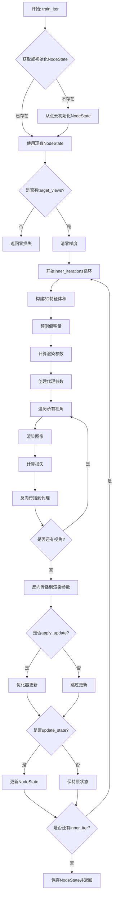

# StreetForward Trainer 流程图与数据结构说明

本文档详细梳理了 `StreetForwardTrainer` 的训练流程、数据结构和关键组件。

## 目录
1. [整体架构](#整体架构)
2. [训练流程](#训练流程)
3. [3D特征体积构建详细流程](#3d特征体积构建详细流程) ⭐
4. [数据结构详解](#数据结构详解)
5. [关键组件说明](#关键组件说明)
6. [梯度反向传播机制](#梯度反向传播机制)

---

## 整体架构

StreetForwardTrainer 实现了基于代理（Proxy）的多视角梯度累积的前馈式 3D Gaussian Splatting 训练器。

### 核心设计理念

- **NodeState 作为分离缓冲区**：每个 `(scene_id, segment_id)` 维护一个 `NodeState`，存储分离的 Gaussian 参数
- **前馈预测**：通过 3D 特征体积预测偏移量（offsets）
- **代理参数渲染**：使用代理参数进行渲染，实现多视角梯度累积
- **单次反向传播**：每个迭代只进行一次反向传播

### 架构图

```
┌─────────────────────────────────────────────────────────────┐
│                    StreetForwardTrainer                      │
├─────────────────────────────────────────────────────────────┤
│                                                               │
│  ┌──────────────────┐         ┌──────────────────┐          │
│  │   NodeState      │         │   Batch Input    │          │
│  │  (Detached)      │         │  - scene_id      │          │
│  │  - means         │         │  - segment_id    │          │
│  │  - scales_log    │         │  - pointcloud    │          │
│  │  - quats         │         │  - target_views  │          │
│  │  - opacity_logit │         │  - gt_images     │          │
│  │  - sh_dc         │         └──────────────────┘          │
│  │  - sh_rest       │                    │                  │
│  └──────────────────┘                    │                  │
│           │                              │                  │
│           └──────────┬───────────────────┘                  │
│                      │                                      │
│           ┌──────────▼──────────┐                          │
│           │  train_iter()        │                          │
│           └──────────┬───────────┘                          │
│                      │                                      │
│    ┌─────────────────┼─────────────────┐                   │
│    │                 │                 │                    │
│    ▼                 ▼                 ▼                    │
│ ┌─────────┐   ┌──────────┐   ┌──────────┐                 │
│ │ 3D Vol  │   │ Offsets  │   │  Render  │                 │
│ │ Builder │──▶│ Predict  │──▶│  & Loss  │                 │
│ └─────────┘   └──────────┘   └──────────┘                 │
│                                                               │
│  ┌──────────────────────────────────────────────┐           │
│  │  Neural Networks                              │           │
│  │  - sparse_conv: 3D特征提取                    │           │
│  │  - mlp_offset_pos: 位置偏移预测               │           │
│  │  - mlp_conv: 尺度与旋转偏移预测               │           │
│  │  - mlp_opacity: 不透明度偏移预测              │           │
│  │  - gaussion_decoder: SH系数偏移预测           │           │
│  └──────────────────────────────────────────────┘           │
└─────────────────────────────────────────────────────────────┘
```

---

## 训练流程

### 主训练循环流程图



### 详细步骤说明

#### 1. 初始化阶段 (`_get_or_init_node_state`)

**输入数据：**
- `batch["scene_id"]`: 场景ID
- `batch["segment_id"]`: 片段ID
- `batch["pointcloud"]`: 点云数据（可以是字典或点云对象）

**处理流程：**
```
点云数据 → 提取坐标和颜色 → 计算初始尺度 → 生成随机四元数 → 创建NodeState
```

**关键操作：**
- 使用 k-NN 计算邻居距离，初始化尺度
- 将 RGB 颜色转换为球谐函数（SH）的 DC 分量
- 所有参数初始化为分离（detached）状态

#### 2. 3D 特征体积构建

**步骤：**
```
NodeState.means (分离) 
  ↓
construct_sparse_tensor() 
  → sparse_feat [N, 3] (RGB特征)
  → vol_dim [3] (体积维度)
  → valid_coords [N, 3] (有效坐标)
  ↓
sparse_conv() 
  → feat_3d [N, outdim] (3D特征)
  ↓
sparse_to_dense_volume() 
  → dense_volume [1, C, D, H, W] (密集体积)
  ↓
permute(0, 4, 3, 1, 2) 
  → dense_volume [1, C, H, W, D] (调整维度顺序)
```

**数据维度说明：**
- `sparse_feat`: `[N, 3]` - N个点的RGB特征
- `feat_3d`: `[N, outdim]` - 经过稀疏卷积后的3D特征（默认outdim=32）
- `dense_volume`: `[1, C, H, W, D]` - 密集化的3D特征体积

#### 3. 特征插值

**步骤：**
```
NodeState.means 
  ↓
get_grid_coords() 
  → grid_coords [N, 3] (归一化网格坐标，范围[-1, 1])
  ↓
interpolate_features() 
  → feat_3d_crop [N, outdim] (每个点对应的3D特征)
```

**关键函数：**
- `get_grid_coords()`: 将世界坐标转换为体积网格的归一化坐标
- `interpolate_features()`: 使用双线性插值从密集体积中提取每个点的特征

#### 4. 偏移量预测 (`_predict_offsets`)

**输入：**
- `feat_3d_crop`: `[N, outdim]` - 每个点的3D特征

**输出：**
```python
{
    "offset_pos": [N, 3],        # 位置偏移
    "offset_scales": [N, 3],     # 尺度对数偏移
    "offset_quat": [N, 4],       # 四元数偏移（wxyz格式）
    "offset_opacity": [N, 1],    # 不透明度对数偏移
    "offset_sh": [N, 3*num_sh],  # SH系数偏移（包含DC和rest）
}
```

**MLP 网络结构：**
- `mlp_offset_pos`: `outdim → 64 → 32 → 3`
- `mlp_conv`: `outdim → 64 → 32 → 7` (3个尺度 + 4个四元数)
- `mlp_opacity`: `outdim → 64 → 32 → 1`
- `gaussion_decoder`: `outdim → 64 → 32 → 3*num_sh`

**约束：**
- `offset_pos`: 通过 `tanh` 限制在 `[-offset_max, offset_max]` 范围内
- `offset_quat`: 归一化为单位四元数

#### 5. 渲染参数计算 (`_render_params_from_offsets`)

**计算过程：**
```
NodeState (分离) + Offsets (可微) → Render Params (可微)
```

**具体计算：**
- `means_r = node_state.means + offset_pos`
- `scales_log_r = node_state.scales_log + offset_scales`
- `quats_r = normalize(quat_multiply(node_state.quats, offset_quat))`
- `opacity_logit_r = node_state.opacity_logit + offset_opacity`
- `sh_dc_r = node_state.sh_dc + offset_sh[:, :3]`
- `sh_rest_r = node_state.sh_rest + offset_sh[:, 3:].view(N, num_sh-1, 3)`

**转换：**
- `scales_r = exp(scales_log_r)`
- `opacities_r = sigmoid(opacity_logit_r)`
- `colors_r = cat([sh_dc_r, sh_rest_r], dim=1)` → `[N, num_sh, 3]`

#### 6. 代理参数创建 (`_create_proxy_params`)

**目的：** 创建可微的代理参数，用于多视角梯度累积

**操作：**
```python
proxy = render_param.detach().requires_grad_(True)
```

**关键点：**
- 代理参数从渲染参数中分离（detach），但重新启用梯度
- 这样可以在多个视角上累积梯度，然后一次性反向传播到渲染参数

#### 7. 多视角渲染与损失计算

**循环结构：**
```python
for view, gt_img in zip(target_views, gt_images):
    # 1. 准备相机参数
    viewmat = get_viewmat(c2w)  # [1, 4, 4]
    K = ...                     # [1, 3, 3]
    
    # 2. 渲染
    render, alpha, _ = renderer(
        means=proxies["means_p"],
        quats=proxies["quats_p"],
        scales=proxies["scales_p"],
        opacities=proxies["opacities_p"],
        colors=proxies["colors_p"],
        ...
    )
    
    # 3. 计算损失
    rgb = render[:, ..., :3]  # [H, W, 3]
    loss = compute_loss(rgb, gt_img) / view_count
    loss.backward()  # 梯度累积到代理参数
```

**损失函数：**
- `L2 Loss`: `mean((pred_rgb - gt_image) ** 2)`
- 每个视角的损失除以视角数量，实现平均

#### 8. 梯度反向传播机制

**两步反向传播：**

**第一步：** 从代理参数到渲染参数
```python
torch.autograd.backward(
    tensors=render_tensors,      # [means_r, scales_r, quats_r, opacities_r, colors_r]
    grad_tensors=proxy_grads     # 从代理参数收集的梯度
)
```

**第二步：** 从渲染参数到网络参数（自动）
- 通过 `offset_*` 参数链
- 最终更新所有 MLP 和 sparse_conv 的参数

#### 9. 状态更新

**条件：** `update_state == True`

**操作：**
```python
with torch.no_grad():
    node_state.means.copy_(render_params["means_r"].detach())
    node_state.scales_log.copy_(render_params["scales_log_r"].detach())
    node_state.quats.copy_(render_params["quats_r"].detach())
    node_state.opacity_logit.copy_(render_params["opacity_logit_r"].detach())
    node_state.sh_dc.copy_(render_params["sh_dc_r"].detach())
    node_state.sh_rest.copy_(render_params["sh_rest_r"].detach())
```

**注意：** 所有更新都是分离的（detached），保持 NodeState 作为缓冲区

---

## 3D特征体积构建详细流程

本节深入讲解代码533-550行的详细实现，这是整个训练流程中的核心部分。

### 代码片段

```533:550:models/trainers/streetforward.py
            sparse_feat, vol_dim, valid_coords = self.construct_sparse_tensor(
                raw_coords=means_s.clone(),
                feats=anchor_rgb,
                Bbx_max=self.bbx_max,
                Bbx_min=self.bbx_min,
                voxel_size=self.voxel_size,
            )
            feat_3d = self.sparse_conv(sparse_feat)
            dense_volume = self.sparse_to_dense_volume(
                sparse_tensor=feat_3d,
                coords=valid_coords,
                vol_dim=vol_dim,
            ).unsqueeze(dim=0)
            dense_volume = dense_volume.permute(0, 4, 3, 1, 2)

            grid_coords = self.get_grid_coords(means_s, self.bbx_min, vol_dim, self.voxel_size)
            feat_3d_crop = self.interpolate_features(grid_coords, dense_volume)
```

### 输入数据准备

在执行这段代码之前，需要准备以下数据：

#### 1. `means_s` - 分离的位置参数

```python
means_s = node_state.means  # [N, 3]
```

**数据说明：**
- **来源：** 从 `NodeState` 中获取，代表 N 个 Gaussian 的中心位置
- **类型：** `torch.Tensor`
- **形状：** `[N, 3]`，其中 N 是点的数量，3 表示 (x, y, z) 坐标
- **特性：** **分离的（detached）**，不参与梯度计算，作为稳定的参考点
- **坐标系：** 世界坐标系

**示例值：**
```python
means_s = tensor([[10.5, 2.3, 25.1],
                  [11.2, 2.4, 25.3],
                  ...])
```

#### 2. `anchor_rgb` - RGB 颜色特征

```python
anchor_rgb = _sh_to_rgb(node_state.sh_dc)  # [N, 3]
```

**数据说明：**
- **来源：** 从 `NodeState.sh_dc` 转换而来，`sh_dc` 是球谐函数的 DC（直流）分量
- **转换函数：** `_sh_to_rgb()`
  ```python
  c0 = 0.28209479177387814  # SH基函数的归一化常数
  rgb = sh * c0 + 0.5
  ```
- **形状：** `[N, 3]`，表示 N 个点的 RGB 颜色
- **值域：** RGB 值通常在 [0, 1] 范围内
- **用途：** 作为 3D 特征体积的初始特征（用于稀疏卷积）

**数据流：**
```
NodeState.sh_dc [N, 3] (SH DC分量，可负值)
  ↓ _sh_to_rgb()
anchor_rgb [N, 3] (RGB颜色，范围[0,1])
```

#### 3. `self.bbx_min` 和 `self.bbx_max` - 边界框

```python
bbx_min = tensor([-20.0, -20.0, -20.0])  # 默认值
bbx_max = tensor([20.0, 4.8, 70.0])      # 默认值
```

**数据说明：**
- **类型：** `torch.Tensor`
- **形状：** `[3]`，表示 (x_min, y_min, z_min) 或 (x_max, y_max, z_max)
- **用途：** 定义 3D 特征体积的空间范围
- **坐标系：** 世界坐标系

#### 4. `self.voxel_size` - 体素大小

```python
voxel_size = 0.1  # 默认值（米）
```

**数据说明：**
- **类型：** `float`
- **含义：** 每个体素的物理尺寸（单位：米）
- **用途：** 将连续空间离散化为体素网格

---

### 步骤1：构建稀疏张量 (`construct_sparse_tensor`)

#### 函数调用

```python
sparse_feat, vol_dim, valid_coords = self.construct_sparse_tensor(
    raw_coords=means_s.clone(),  # [N, 3]
    feats=anchor_rgb,             # [N, 3]
    Bbx_max=self.bbx_max,         # [3]
    Bbx_min=self.bbx_min,         # [3]
    voxel_size=self.voxel_size,   # float
)
```

**关键点：**
- 使用 `means_s.clone()` 而不是 `means_s`，确保不修改原始数据

#### 函数实现（nerfstudio 版本）

**主要流程：**

1. **提取边界框值（转换为CPU标量）**
   ```python
   X_MIN = Bbx_min[0].cpu().item()
   X_MAX = Bbx_max[0].cpu().item()
   Y_MIN = Bbx_min[1].cpu().item()
   Y_MAX = Bbx_max[1].cpu().item()
   Z_MIN = Bbx_min[2].cpu().item()
   Z_MAX = Bbx_max[2].cpu().item()
   ```

2. **转换为numpy数组（需要detach）**
   ```python
   if isinstance(raw_coords, torch.Tensor):
       raw_coords = raw_coords.detach().cpu().numpy()
   if isinstance(feats, torch.Tensor):
       feats = feats.detach().cpu().numpy()
   ```
   **注意：** 必须 `detach()`，因为这些张量可能带有梯度信息

3. **计算体积维度**
   ```python
   bbx_max = np.array([X_MAX, Y_MAX, Z_MAX])
   bbx_min = np.array([X_MIN, Y_MIN, Z_MIN])
   vol_dim = (bbx_max - bbx_min) / voxel_size  # 例如: [400, 248, 900]
   vol_dim = vol_dim.astype(int).tolist()      # [D, H, W] 格式
   ```
   **示例计算：**
   ```python
   # 假设 bbx_max = [20, 4.8, 70], bbx_min = [-20, -20, -20], voxel_size = 0.1
   vol_dim = ([20, 4.8, 70] - [-20, -20, -20]) / 0.1
           = [40, 24.8, 90] / 0.1
           = [400, 248, 900]  # D=400, H=248, W=900
   ```

4. **将坐标相对于边界框原点**
   ```python
   raw_coords -= np.array([X_MIN, Y_MIN, Z_MIN]).astype(int)
   ```
   **示例：**
   ```python
   # 原始坐标 [10.5, 2.3, 25.1]
   # 减去 bbx_min [-20, -20, -20]
   # 得到 [30.5, 22.3, 45.1]
   ```

5. **体素化（voxelization）- 关键步骤！**
   ```python
   coords, indices = sparse_quantize(raw_coords, voxel_size, return_index=True)
   ```
   **功能：** 将多个点映射到同一个体素，返回唯一的体素坐标和索引
   
   **工作原理：**
   ```python
   # 伪代码示例
   voxel_coords = floor(raw_coords / voxel_size)  # 离散化
   unique_coords, indices = unique(voxel_coords, return_inverse=True)
   ```
   
   **示例：**
   ```python
   # 假设 voxel_size = 0.1
   raw_coords = [[10.53, 2.34, 25.17],  # 点1
                 [10.56, 2.35, 25.18],  # 点2 - 与点1在同一体素
                 [11.23, 2.41, 25.32]]  # 点3
   
   # 体素化后
   coords = [[105, 23, 251],  # 体素1 (点1和点2合并)
             [112, 24, 253]]  # 体素2 (点3)
   indices = [0, 0, 1]  # 点1和点2都映射到体素0，点3映射到体素1
   ```
   
   **结果：** M ≤ N，因为可能有多个点映射到同一体素

6. **转换为torch张量并添加batch维度**
   ```python
   coords = torch.tensor(coords, dtype=torch.int).cuda()  # [M, 3]
   zeros = torch.zeros(coords.shape[0], 1).cuda()         # [M, 1]
   coords = torch.cat((zeros, coords), dim=1).to(torch.int32)  # [M, 4] - [B, X, Y, Z]
   ```
   **格式说明：** `[B, X, Y, Z]`，其中 `B=0` 表示batch维度

7. **根据索引选择特征**
   ```python
   feats = torch.tensor(feats[indices], dtype=torch.float).cuda()  # [M, 3]
   ```
   **注意：** 体素化后，如果多个点映射到同一体素，特征会被选择（通常使用第一个点的特征）

8. **创建SparseTensor**
   ```python
   sparse_feat = SparseTensor(feats, coords=coords)
   ```
   **数据结构：**
   - `sparse_feat.feats`: `[M, 3]` - RGB特征
   - `sparse_feat.coords`: `[M, 4]` - 体素坐标 `[B, X, Y, Z]`

9. **返回结果**
   ```python
   return sparse_feat, vol_dim, coords[:, 1:]  # coords[:, 1:] = [X, Y, Z]
   ```

#### 输出数据

##### 1. `sparse_feat` - 稀疏特征张量

**类型：** `SparseTensor` (torchsparse库)

**结构：**
- `sparse_feat.feats`: `[M, 3]` - RGB特征
- `sparse_feat.coords`: `[M, 4]` - 体素坐标 `[B, X, Y, Z]`

**数据说明：**
- `M` 是唯一体素的数量（M ≤ N，因为可能有重复体素）
- 特征维度为 3（RGB颜色）
- 只存储有数据的体素，节省内存

##### 2. `vol_dim` - 体积维度

**类型：** `List[int]` 或 `torch.Tensor`

**格式：** `[D, H, W]` （深度、高度、宽度）

**计算：**
```python
vol_dim = (bbx_max - bbx_min) / voxel_size
```

**示例值：**
```python
vol_dim = [400, 248, 900]  # D=400, H=248, W=900
```

##### 3. `valid_coords` - 有效坐标

**类型：** `torch.Tensor`

**形状：** `[M, 3]` - `[X, Y, Z]` 格式（去掉了batch维度）

**用途：** 后续用于将稀疏特征转换回密集体积

---

### 步骤2：稀疏卷积 (`sparse_conv`)

#### 函数调用

```python
feat_3d = self.sparse_conv(sparse_feat)  # SparseTensor → SparseTensor
```

#### 网络结构（SparseCostRegNet）

**输入：** `SparseTensor` with features `[M, 3]` (RGB)

**网络架构：**

```
输入: [M, 3] RGB特征
  ↓
conv0: BasicSparseConvolutionBlock(3 → outdim)  # outdim默认32
  → [M, 32]
  ↓
下采样路径:
conv1: BasicSparseConvolutionBlock(32 → 16, stride=2)
  → [M1, 16] (体素数量减少)
  ↓
conv2: BasicSparseConvolutionBlock(16 → 16)
  → [M1, 16]
  ↓
conv3: BasicSparseConvolutionBlock(16 → 32, stride=2)
  → [M2, 32] (体素数量进一步减少)
  ↓
conv4: BasicSparseConvolutionBlock(32 → 32)
  → [M2, 32]
  ↓
conv5: BasicSparseConvolutionBlock(32 → 64, stride=2)
  → [M3, 64]
  ↓
conv6: BasicSparseConvolutionBlock(64 → 64)
  → [M3, 64]
  ↓
上采样路径（带残差连接）:
conv7: BasicSparseDeconvolutionBlock(64 → 32, stride=2)
  → [M2, 32] + conv4的残差
  ↓
conv9: BasicSparseDeconvolutionBlock(32 → 16, stride=2)
  → [M1, 16]
  ↓
conv11: BasicSparseDeconvolutionBlock(16 → outdim, stride=2)
  → [M, outdim] (恢复到原始体素数量)
```

**关键点：**
- 使用**稀疏卷积**，只在有数据的体素上计算，高效
- **U-Net 风格**结构：下采样提取特征，上采样恢复分辨率
- **残差连接**：`conv4 + conv7`，保留细节信息
- 最终输出与输入具有**相同的体素坐标**（相同数量的体素）

#### 输出数据

**`feat_3d` - 3D特征**

**类型：** `SparseTensor`

**结构：**
- `feat_3d.feats`: `[M, outdim]` - 3D特征（默认outdim=32）
- `feat_3d.coords`: `[M, 4]` - 体素坐标（与输入相同）

**数据说明：**
- 特征维度从 3（RGB）扩展到 outdim（默认32）
- 每个体素现在有更丰富的特征表示

---

### 步骤3：稀疏转密集 (`sparse_to_dense_volume`)

#### 函数调用

```python
dense_volume = self.sparse_to_dense_volume(
    sparse_tensor=feat_3d,      # SparseTensor [M, outdim]
    coords=valid_coords,        # [M, 3]
    vol_dim=vol_dim,            # [D, H, W]
).unsqueeze(dim=0)              # [1, D, H, W, C]
```

#### 函数实现（nerfstudio 版本）

```python
def sparse_to_dense_volume(sparse_tensor, coords, vol_dim, default_val=0):
    c = sparse_tensor.shape[-1]  # outdim (例如32)
    coords = coords.to(torch.int64)
    
    # 1. 限制坐标在有效范围内（防止越界）
    coords[:, 0] = coords[:, 0].clamp(0, vol_dim[0] - 1)  # D维度
    coords[:, 1] = coords[:, 1].clamp(0, vol_dim[1] - 1)  # H维度
    coords[:, 2] = coords[:, 2].clamp(0, vol_dim[2] - 1)  # W维度
    
    # 2. 创建密集体积（全部初始化为default_val）
    device = sparse_tensor.device
    dense = torch.full(
        [vol_dim[0], vol_dim[1], vol_dim[2], c],  # [D, H, W, C]
        float(default_val),
        device=device
    )
    
    # 3. 将稀疏特征填入对应位置
    dense[coords[:, 0], coords[:, 1], coords[:, 2]] = sparse_tensor
    # coords[:, 0]是D索引，coords[:, 1]是H索引，coords[:, 2]是W索引
    
    return dense  # [D, H, W, C]
```

#### 关键操作详解

##### 1. 索引操作

```python
dense[coords[:, 0], coords[:, 1], coords[:, 2]] = sparse_tensor
```

**工作原理：**
- 使用**高级索引**（advanced indexing）
- `coords[:, 0]` 是 D 维度的索引数组
- `coords[:, 1]` 是 H 维度的索引数组
- `coords[:, 2]` 是 W 维度的索引数组

**示例：**
```python
# 假设 coords = [[10, 20, 30], [15, 25, 35]]
# sparse_tensor = [[f1_0, f1_1, ...], [f2_0, f2_1, ...]]

# 等价于：
dense[10, 20, 30] = [f1_0, f1_1, ...]  # 将特征填入体素(10,20,30)
dense[15, 25, 35] = [f2_0, f2_1, ...]  # 将特征填入体素(15,25,35)

# 其他位置保持 default_val (0)
```

##### 2. `unsqueeze(dim=0)`

```python
dense_volume = dense.unsqueeze(dim=0)  # [D, H, W, C] → [1, D, H, W, C]
```

**目的：** 添加 batch 维度，便于后续操作

#### 输出数据

**`dense_volume` - 密集体积**

**形状：** `[1, D, H, W, C]`

**数据说明：**
- 大部分位置为 `default_val`（通常为 0）
- 只有 `coords` 指定的位置有实际特征值
- 这是一个**稀疏的密集表示**（sparse dense representation）

---

### 步骤4：维度重排 (`permute`)

#### 函数调用

```python
dense_volume = dense_volume.permute(0, 4, 3, 1, 2)
# [1, D, H, W, C] → [1, C, W, D, H]
```

#### 维度变换详解

**原始维度：** `[1, D, H, W, C]`
- `0`: batch维度 (1)
- `1`: D (深度)
- `2`: H (高度)
- `3`: W (宽度)
- `4`: C (特征通道)

**目标维度：** `[1, C, W, D, H]`
- `0`: batch维度 (1)
- `1`: C (特征通道)
- `2`: W (宽度)
- `3`: D (深度)
- `4`: H (高度)

**维度映射：**
```
索引映射: 0→0, 4→1, 3→2, 1→3, 2→4
```

**为什么需要这个变换？**

PyTorch 的 `grid_sample` 函数期望输入格式为 `[B, C, D, H, W]`，但我们的数据是 `[B, D, H, W, C]`。通过这个变换，我们将特征通道移到第二个维度。

**注意：** 实际代码中变换后的格式是 `[1, C, W, D, H]`，这与 `grid_sample` 的要求不完全匹配。这可能是代码中的一个问题，或者 `grid_sample` 的实际行为与文档有所不同。

---

### 步骤5：计算网格坐标 (`get_grid_coords`)

#### 函数调用

```python
grid_coords = self.get_grid_coords(
    means_s,           # [N, 3] - 原始点坐标（世界坐标系）
    self.bbx_min,      # [3] - 边界框最小值
    vol_dim,           # [D, H, W] - 体积维度
    self.voxel_size,   # float - 体素大小
)
```

#### 函数实现

```python
def get_grid_coords(
    self, position_w: torch.Tensor, bbx_min: torch.Tensor, vol_dim, voxel_size: float
) -> torch.Tensor:
    # 1. 将坐标相对于边界框原点
    pts = position_w - bbx_min.to(position_w.device)  # [N, 3]
    
    # 2. 转换为体素索引（浮点数索引）
    x_index = pts[..., 0] / voxel_size  # [N] - W方向索引
    y_index = pts[..., 1] / voxel_size  # [N] - H方向索引
    z_index = pts[..., 2] / voxel_size  # [N] - D方向索引
    
    # 3. 确保vol_dim是torch.Tensor
    if isinstance(vol_dim, (list, tuple)):
        vol_dim = torch.tensor(vol_dim, device=position_w.device, dtype=torch.float32)
    elif not isinstance(vol_dim, torch.Tensor):
        vol_dim = torch.tensor(vol_dim, device=position_w.device, dtype=torch.float32)
    else:
        vol_dim = vol_dim.to(position_w.device).float()
    
    # 4. 提取体积维度
    w_dim, h_dim, d_dim = vol_dim[2], vol_dim[1], vol_dim[0]
    # vol_dim是[D, H, W]格式，所以：
    # - vol_dim[0] = D (深度)
    # - vol_dim[1] = H (高度)
    # - vol_dim[2] = W (宽度)
    
    # 5. 归一化到[-1, 1]范围（grid_sample的要求）
    x_norm = x_index / (w_dim - 1).clamp(min=1.0) * 2 - 1  # [N]
    y_norm = y_index / (h_dim - 1).clamp(min=1.0) * 2 - 1  # [N]
    z_norm = z_index / (d_dim - 1).clamp(min=1.0) * 2 - 1  # [N]
    
    # 6. 堆叠成坐标张量
    grid_coords = torch.stack([x_norm, y_norm, z_norm], dim=-1)  # [N, 3]
    return grid_coords
```

#### 关键操作详解

##### 1. 坐标变换

**步骤1：相对坐标**
```python
pts = position_w - bbx_min
# 例如: [10.5, 2.3, 25.1] - [-20.0, -20.0, -20.0] = [30.5, 22.3, 45.1]
```

**步骤2：体素索引**
```python
x_index = pts[..., 0] / voxel_size  # W方向
y_index = pts[..., 1] / voxel_size  # H方向
z_index = pts[..., 2] / voxel_size  # D方向
# 例如: 30.5 / 0.1 = 305
```

**步骤3：归一化**
```python
x_norm = (x_index / (w_dim - 1)) * 2 - 1
# 例如: (305 / (900 - 1)) * 2 - 1 = 0.321... (在[-1, 1]范围内)
```

**归一化公式：**
```
normalized = (index / (dim - 1)) * 2 - 1
```

**边界情况：**
- `index = 0` → `normalized = -1`
- `index = dim-1` → `normalized = 1`
- `index = (dim-1)/2` → `normalized = 0`

#### 输出数据

**`grid_coords` - 归一化网格坐标**

**形状：** `[N, 3]`

**格式：** `[x_norm, y_norm, z_norm]`，每个值在 `[-1, 1]` 范围内

**坐标系：**
- `x_norm`: W方向（宽度）
- `y_norm`: H方向（高度）
- `z_norm`: D方向（深度）

**注意：** 这里使用的是 `[x, y, z]` 顺序，对应 `[W, H, D]` 维度。

---

### 步骤6：特征插值 (`interpolate_features`)

#### 函数调用

```python
feat_3d_crop = self.interpolate_features(grid_coords, dense_volume)
# grid_coords: [N, 3]
# dense_volume: [1, C, W, D, H] (经过permute后)
# 输出: [N, C]
```

#### 函数实现

```python
def interpolate_features(
    self, grid_coords: torch.Tensor, feature_volume: torch.Tensor
) -> torch.Tensor:
    # 1. 扩展grid_coords维度以匹配grid_sample的要求
    # grid_sample需要: [B, N, 1, 1, 3] 格式
    grid_coords_expanded = grid_coords[None, None, None, ...]  # [1, 1, 1, N, 3]
    
    # 2. 使用三线性插值从体积中提取特征
    feature = torch.nn.functional.grid_sample(
        feature_volume,           # [1, C, W, D, H] - 输入体积
        grid_coords_expanded,     # [1, 1, 1, N, 3] - 采样坐标
        mode="bilinear",          # 双线性插值（3D中实际是三线性插值）
        align_corners=True,       # 对齐角点（与归一化坐标对应）
        padding_mode="zeros",     # 边界外填充0
    )
    # 输出: [1, C, 1, 1, N]
    
    # 3. 重塑并转置
    return feature[0, :, 0, 0, :].T  # [1, C, 1, 1, N] → [C, N] → [N, C]
```

#### 关键操作详解

##### 1. `grid_sample` - 网格采样

**函数签名：**
```python
torch.nn.functional.grid_sample(
    input,      # [B, C, D_in, H_in, W_in] - 输入体积
    grid,       # [B, D_out, H_out, W_out, 3] - 采样网格
    mode,       # "bilinear" | "nearest"
    align_corners,  # True | False
    padding_mode,   # "zeros" | "border" | "reflection"
)
```

**在我们的代码中：**
- `input`: `[1, C, W, D, H]` - 特征体积
- `grid`: `[1, 1, 1, N, 3]` - 采样坐标（每个点一个坐标）

**插值模式：**
- `mode="bilinear"`: 在3D空间中使用**三线性插值**
- `align_corners=True`: 确保 `-1` 和 `1` 对应体积的边界

**工作原理：**
1. 对于每个 `grid_coords[i] = [x, y, z]`
2. 在 `feature_volume` 中找到对应的位置
3. 使用周围8个体素的加权平均计算插值特征

**数学公式（三线性插值）：**
```
对于坐标 (x, y, z)，找到8个相邻体素：
- (x0, y0, z0), (x1, y0, z0), (x0, y1, z0), (x1, y1, z0)
- (x0, y0, z1), (x1, y0, z1), (x0, y1, z1), (x1, y1, z1)

插值特征 = Σ(权重_i × 特征_i)
权重基于距离计算
```

##### 2. 维度变换

**输入：** `grid_coords` - `[N, 3]`

**扩展：** `grid_coords_expanded = grid_coords[None, None, None, ...]`
- `[N, 3]` → `[1, 1, 1, N, 3]`
- 添加了 batch 和空间维度

**输出：** `feature` - `[1, C, 1, 1, N]`
- 第一个 `1`: batch维度
- `C`: 特征通道
- `1, 1`: 空间维度（因为我们只采样N个点）
- `N`: 点的数量

**最终输出：** `feature[0, :, 0, 0, :].T`
- `[0, :, 0, 0, :]` → `[C, N]` (去掉batch和空间维度)
- `.T` → `[N, C]` (转置)

#### 输出数据

**`feat_3d_crop` - 每个点的3D特征**

**形状：** `[N, C]` 其中 `C = outdim` (默认32)

**数据说明：**
- 每个原始点（`means_s`）现在都有一个对应的3D特征
- 特征通过三线性插值从密集体积中提取
- 这些特征将用于后续的偏移量预测

---

### 完整数据流总结

```
输入:
  means_s: [N, 3] - 点位置（世界坐标）
  anchor_rgb: [N, 3] - RGB特征
  bbx_min: [3] - 边界框最小值
  bbx_max: [3] - 边界框最大值
  voxel_size: float - 体素大小

步骤1: construct_sparse_tensor
  → sparse_feat: SparseTensor([M, 3], [M, 4]) - 稀疏特征
  → vol_dim: [D, H, W] - 体积维度
  → valid_coords: [M, 3] - 有效体素坐标

步骤2: sparse_conv
  → feat_3d: SparseTensor([M, C], [M, 4]) - 3D特征（C=32）

步骤3: sparse_to_dense_volume
  → dense_volume: [D, H, W, C]
  → unsqueeze: [1, D, H, W, C]

步骤4: permute
  → dense_volume: [1, C, W, D, H]

步骤5: get_grid_coords
  → grid_coords: [N, 3] - 归一化坐标 [-1, 1]

步骤6: interpolate_features
  → feat_3d_crop: [N, C] - 每个点的3D特征

输出:
  feat_3d_crop: [N, C] - 用于后续偏移量预测
```

### 关键设计点

1. **稀疏到密集的转换：** 先使用稀疏卷积（高效），再转换为密集体积（便于插值）
2. **体素化：** 多个点可能映射到同一体素，减少计算量
3. **特征提取：** 通过稀疏卷积提取丰富的3D特征表示
4. **特征插值：** 使用三线性插值从体积中提取每个点的特征
5. **内存效率：** 稀疏表示节省内存，只在需要时转换为密集表示

---

## 数据结构详解

### 1. NodeState

**定义：**
```python
@dataclass
class NodeState:
    means: torch.Tensor          # [N, 3] - Gaussian中心位置
    scales_log: torch.Tensor     # [N, 3] - 尺度的对数（3个轴）
    quats: torch.Tensor          # [N, 4] - 旋转四元数（wxyz格式）
    opacity_logit: torch.Tensor  # [N, 1] - 不透明度的logit值
    sh_dc: torch.Tensor          # [N, 3] - 球谐函数DC分量（RGB）
    sh_rest: torch.Tensor        # [N, num_sh-1, 3] - 球谐函数高阶分量
```

**特性：**
- 所有张量都是分离的（detached），不参与梯度计算
- 每个 `(scene_id, segment_id)` 对应一个 NodeState
- 存储在 `self.node_states: Dict[Tuple[int, int], NodeState]` 中

**初始化：**
- `means`: 从点云坐标初始化
- `scales_log`: 基于 k-NN 距离计算（`log(clamp(avg_dist, min=1e-3))`）
- `quats`: 随机生成单位四元数
- `opacity_logit`: 初始化为 `logit(0.1)`
- `sh_dc`: 从点云颜色转换（`(rgb - 0.5) / c0`）
- `sh_rest`: 初始化为零

### 2. Batch 输入数据

**结构：**
```python
batch = {
    "scene_id": int,                    # 场景ID
    "segment_id": int,                  # 片段ID
    "pointcloud": Union[dict, object],   # 点云数据
    "target_views": List[View],         # 目标视角列表
    "gt_images": List[torch.Tensor],    # 真实图像列表 [H, W, 3]
}
```

**点云格式：**
- **字典格式：**
  ```python
  {
      "background": np.ndarray  # [N, 6] - [x, y, z, r, g, b]
  }
  ```
- **对象格式：** 需有 `points` 和 `colors` 属性

**View 对象：**
- `camtoworlds`: `[4, 4]` 或 `[B, 4, 4]` - 相机到世界变换矩阵
- `Ks` 或 `K`: `[3, 3]` 或 `[B, 3, 3]` - 相机内参矩阵

### 3. 中间数据流

#### 3D 特征体积构建阶段

| 变量名 | 形状 | 说明 |
|--------|------|------|
| `means_s` | `[N, 3]` | 从NodeState获取的位置（分离） |
| `anchor_rgb` | `[N, 3]` | 从SH DC分量转换的RGB |
| `sparse_feat` | `[N, 3]` | 稀疏特征（RGB） |
| `vol_dim` | `[3]` | 体积维度 `[D, H, W]` |
| `valid_coords` | `[N, 3]` | 有效体素坐标 |
| `feat_3d` | `[N, outdim]` | 稀疏卷积后的3D特征 |
| `dense_volume` | `[1, C, H, W, D]` | 密集化的3D特征体积 |

#### 偏移量预测阶段

| 变量名 | 形状 | 说明 |
|--------|------|------|
| `grid_coords` | `[N, 3]` | 归一化网格坐标 `[-1, 1]` |
| `feat_3d_crop` | `[N, outdim]` | 每个点插值得到的3D特征 |
| `offset_pos` | `[N, 3]` | 位置偏移（受offset_max限制） |
| `offset_scales` | `[N, 3]` | 尺度对数偏移 |
| `offset_quat` | `[N, 4]` | 四元数偏移（归一化） |
| `offset_opacity` | `[N, 1]` | 不透明度对数偏移 |
| `offset_sh` | `[N, 3*num_sh]` | SH系数偏移（扁平化） |

#### 渲染参数阶段

| 变量名 | 形状 | 说明 |
|--------|------|------|
| `means_r` | `[N, 3]` | 渲染用的位置（可微） |
| `scales_log_r` | `[N, 3]` | 渲染用的尺度对数（可微） |
| `scales_r` | `[N, 3]` | 渲染用的尺度 `exp(scales_log_r)` |
| `quats_r` | `[N, 4]` | 渲染用的四元数（归一化，可微） |
| `opacity_logit_r` | `[N, 1]` | 渲染用的不透明度对数（可微） |
| `opacities_r` | `[N]` | 渲染用的不透明度 `sigmoid(opacity_logit_r)` |
| `sh_dc_r` | `[N, 3]` | 渲染用的SH DC分量（可微） |
| `sh_rest_r` | `[N, num_sh-1, 3]` | 渲染用的SH高阶分量（可微） |
| `colors_r` | `[N, num_sh, 3]` | 完整的SH系数 `[sh_dc, sh_rest]` |

#### 代理参数阶段

| 变量名 | 形状 | 说明 |
|--------|------|------|
| `means_p` | `[N, 3]` | 代理位置（分离但可微） |
| `scales_p` | `[N, 3]` | 代理尺度（分离但可微） |
| `quats_p` | `[N, 4]` | 代理四元数（分离但可微） |
| `opacities_p` | `[N]` | 代理不透明度（分离但可微） |
| `colors_p` | `[N, num_sh, 3]` | 代理颜色（分离但可微） |

#### 渲染输出阶段

| 变量名 | 形状 | 说明 |
|--------|------|------|
| `render` | `[1, H, W, 4]` | 渲染结果（RGB + alpha） |
| `alpha` | `[1, H, W]` | 累积不透明度 |
| `rgb` | `[H, W, 3]` | RGB图像 |
| `loss` | `scalar` | 单个视角的损失 |
| `total_loss_val` | `float` | 所有视角的累积损失（标量） |

---

## 关键组件说明

### 1. 稀疏卷积网络 (SparseConv)

**作用：** 从稀疏点云特征构建3D特征表示

**实现：**
- **主要实现：** `nerfstudio.model_components.sparse_conv.SparseCostRegNet`
- **回退实现：** `_FallbackSparseConv` (简单MLP)

**输入/输出：**
- 输入：`[N, 3]` - RGB特征
- 输出：`[N, outdim]` - 3D特征（默认outdim=32）

### 2. 体积构建函数

#### `construct_sparse_tensor`
- 将点云坐标和特征转换为稀疏张量格式
- 返回：`(sparse_feat, vol_dim, valid_coords)`

#### `sparse_to_dense_volume`
- 将稀疏特征转换为密集体积
- 输入：`[N, C]` 稀疏特征
- 输出：`[H, W, D, C]` 密集体积

### 3. 渲染器 (Renderer)

**实现：**
- **主要实现：** `gsplat.rendering.rasterization`
- **回退实现：** `_default_renderer` (用于测试)

**输入参数：**
- `means`: `[N, 3]` - Gaussian中心
- `quats`: `[N, 4]` - 旋转四元数（wxyz）
- `scales`: `[N, 3]` - 尺度
- `opacities`: `[N]` - 不透明度
- `colors`: `[N, num_sh, 3]` - SH系数
- `viewmats`: `[1, 4, 4]` - 视图矩阵（世界到相机）
- `Ks`: `[1, 3, 3]` - 相机内参

**输出：**
- `render`: `[1, H, W, 4]` - RGB + alpha
- `alpha`: `[1, H, W]` - 累积不透明度

### 4. 辅助函数

#### 四元数操作
- `_random_quat_tensor()`: 生成随机单位四元数（wxyz格式）
- `_quat_multiply()`: 四元数乘法
- `_normalize_quat()`: 四元数归一化

#### 球谐函数转换
- `_rgb_to_sh()`: RGB → SH DC分量
- `_sh_to_rgb()`: SH DC分量 → RGB
- `_num_sh_bases()`: 计算SH基函数数量

#### 坐标转换
- `get_viewmat()`: 相机到世界 → 世界到相机（视图矩阵）
- `get_grid_coords()`: 世界坐标 → 体积网格归一化坐标

#### 距离计算
- `_pairwise_neighbor_distances()`: 使用sklearn的k-NN计算邻居距离（内存高效）

---

## 梯度反向传播机制

### 代理参数机制

**设计目的：** 实现多视角梯度累积，同时避免重复构建计算图

**工作流程：**

```
1. 创建代理参数（从渲染参数分离，但启用梯度）
   render_params → proxies (detach + requires_grad=True)

2. 多视角渲染与梯度累积
   for view in target_views:
       render(proxies) → loss → loss.backward()
       # 梯度累积到 proxies.grad

3. 反向传播到渲染参数
   autograd.backward(render_tensors, proxy_grads)
   # 将代理梯度传播到渲染参数

4. 自动反向传播到网络参数
   render_params ← offsets ← MLPs ← sparse_conv
   # PyTorch自动计算梯度链
```

### 梯度流图

```
gt_image
  ↓
loss (L2)
  ↓
rgb (renderer输出)
  ↓
proxies (代理参数)
  ├─ means_p.grad
  ├─ scales_p.grad
  ├─ quats_p.grad
  ├─ opacities_p.grad
  └─ colors_p.grad
  ↓ (autograd.backward)
render_params (渲染参数)
  ├─ means_r
  ├─ scales_r
  ├─ quats_r
  ├─ opacities_r
  └─ colors_r
  ↓ (自动反向传播)
offsets (偏移量)
  ├─ offset_pos ← mlp_offset_pos
  ├─ offset_scales ← mlp_conv
  ├─ offset_quat ← mlp_conv
  ├─ offset_opacity ← mlp_opacity
  └─ offset_sh ← gaussion_decoder
  ↓
feat_3d_crop (3D特征)
  ↓
dense_volume
  ↓
feat_3d ← sparse_conv
  ↓
sparse_feat
  ↓
网络参数更新
```

### 关键设计点

1. **NodeState 分离：** NodeState 始终保持分离状态，不参与梯度计算，作为稳定的参数缓冲区

2. **代理参数桥接：** 代理参数作为 NodeState 和可微计算图之间的桥梁，实现梯度传递

3. **单次反向传播：** 每个 inner_iteration 只进行一次完整的反向传播，避免内存累积

4. **梯度累积：** 多个视角的梯度在代理参数上累积，然后一次性反向传播

---

## 配置参数

### Model 配置

```python
model:
  offset_max: 0.1              # 位置偏移的最大值
  sh_degree: 1                   # 球谐函数度数
  voxel_size: 0.1                # 体素大小
  max_iterations: 1              # 内部迭代次数
  bbx_min: [-20.0, -20.0, -20.0] # 边界框最小值
  bbx_max: [20.0, 4.8, 70.0]     # 边界框最大值
  sparseConv_outdim: 32          # 稀疏卷积输出维度
```

### Optimizer 配置

```python
optimizer:
  lr: 1e-3                       # 学习率
  eps: 1e-15                     # Adam epsilon
  weight_decay: 0.0              # 权重衰减
```

### 其他配置

```python
log_images: False                # 是否保存渲染图像（节省GPU内存）
```

---

## 总结

StreetForwardTrainer 通过以下关键机制实现了高效的前馈式 3DGS 训练：

1. **分离的 NodeState：** 作为稳定的参数缓冲区，避免梯度干扰
2. **3D 特征体积：** 通过稀疏卷积构建空间特征表示
3. **偏移量预测：** 使用 MLP 从 3D 特征预测参数偏移
4. **代理参数机制：** 实现多视角梯度累积
5. **单次反向传播：** 每个迭代只进行一次完整的梯度更新

这种设计既保证了训练效率，又实现了多视角监督的有效利用。
