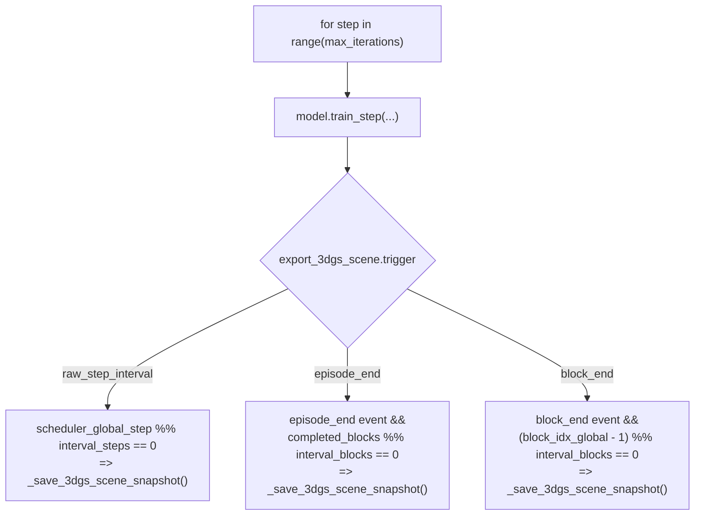

# StreetForward 训练日志：周期性导出完整 3DGS 场景 — 实现方案

> 状态：**已实现**（方案 A，三种 trigger 全支持）。修改集中在多场景训练循环 v4，Stage 5.4 经 v8 wrapper 自动受益。

本文档说明在 [tools/train_minimal_streetforward_stage4_3_multi_scene_v4.py](../../tools/train_minimal_streetforward_stage4_3_multi_scene_v4.py) 主训练循环（v8 入口 [tools/train_minimal_streetforward_stage4_3_multi_scene_v8.py](../../tools/train_minimal_streetforward_stage4_3_multi_scene_v8.py) 与 Stage 5.4 入口 [tools/train_minimal_streetforward_stage5_4_multi_scene_v8.py](../../tools/train_minimal_streetforward_stage5_4_multi_scene_v8.py) 均为 wrapper，最终调 `base.main()`）中，按与 `logging.image_interval_blocks` 对齐的 block/step/episode 节奏，把「当前已优化后的、可还原渲染的」3DGS 场景状态写入磁盘。

## 背景与目标

- **现状**：`logging.image_interval_blocks`（或与 `logging.image_trigger` 组合）在 `block_end` / `raw_step_interval` / `episode_end` 等模式下触发 `_save_train_monitor_triplets(...)`，将训练视角的 pred/gt 等 PNG 写入 `log_dir/images/...`。
- **目标**：增加一类配置，**与 PNG 触发节奏对齐但完全独立**地，把「当前已优化后的、可还原渲染的」3DGS 场景状态写入磁盘（与 PNG 日志并列，而非替代）。
- **关键 API**：
  - 模型导出：`MinimalStreetForwardStage4_5.export_3dgs_state(batch_or_key, *, include_hidden, rigid_export_frame_idx)`（[models/streetforward/minimal_trainer_stage4_5.py:1437](../../models/streetforward/minimal_trainer_stage4_5.py)）。Stage 5.x 通过继承自动可用。
  - 落盘：`save_3dgs_state(path, state)`（[tools/streetforward_test_export.py](../../tools/streetforward_test_export.py)，本质是 `torch.save` 字典）。

## 「完整场景」在代码中的含义

`export_3dgs_state(batch_or_key, *, include_hidden=False, rigid_export_frame_idx=None)` 返回一个 **CPU tensor 字典**，包括：

- `cache_key`：`scene_id` / `segment_id`（多场景缓存键）。
- `coordinate_frame`、`rigid_export_frame_idx`：刚体分支世界系对齐说明。
- `branches`：`bg`、`distant`、`rigid_local`、`rigid_world` 等分支的 `means`、`scales_log`、`quats`、`opacity_logit`、`sh_dc`、`sh_rest`。
- `include_hidden=True` 时附加 `hidden`（与 validation 中 `render_views_from_scene_state` 前导出一致）。

**注意**：当前导出元数据里仍可能标记为 `stage4_5_no_sky` 等历史字符串；若产品化需要，可在后续单独增加 Stage5 元数据覆盖，**不属于本功能的最小闭环**。Stage 4.6+ 训练管线以「无独立 sky 高斯分支」为主；如未来某 Stage 在 `export_3dgs_state` 中扩展 `branches.sky`，本方案的落盘格式（同一 `torch.save` 字典）即可兼容。

## 配置（YAML 最终格式）

遵循仓库中 **fast-fail、非必要不设默认值** 的倾向：未显式开启即 **不导出**，避免无意中写满磁盘。

在配置 `logging:` 下与 `image_interval_blocks` 并列：

```yaml
logging:
  image_interval_blocks: 300
  export_3dgs_scene:
    enable: true
    interval_blocks: 300
    subdir: scene_3dgs_snapshots
    trigger: block_end          # block_end | raw_step_interval | episode_end
    include_hidden: false
```

校验（fast-fail，仅在 `enable=true` 时执行）：

| 字段 | 类型 | 约束 |
|------|------|------|
| `enable` | bool | 必填；缺省或 `false` 时整块视为禁用，零 IO |
| `interval_blocks` | int | 必填且 `>= 1` |
| `subdir` | str | 必填非空 |
| `trigger` | str | 必填，∈ `{block_end, raw_step_interval, episode_end}` |
| `include_hidden` | bool | 必填，必须为 `bool`（不接受隐式转换） |

`enable=false` 或整个 `export_3dgs_scene` 缺省时：完全无副作用、零额外 IO。

## 触发逻辑



`interval_steps = interval_blocks * scheduler.steps_per_block`，与 `image_trigger_interval_steps` 公式一致；门控判定也与 PNG 监控保持一致，便于"图与场景同节奏"对齐。

## 代码改动

### `tools/train_minimal_streetforward_stage4_3_multi_scene_v4.py`

1. **顶部 import**：

   ```python
   from tools.streetforward_test_export import save_3dgs_state
   ```

2. **新增模块级常量与两个私有函数**（紧贴 `_save_train_monitor_triplets` 之后）：

   ```python
   _EXPORT_3DGS_SCENE_TRIGGER_MODES = ("block_end", "raw_step_interval", "episode_end")

   def _parse_export_3dgs_scene_cfg(cfg, scheduler_steps_per_block) -> Optional[Dict[str, Any]]:
       """缺省/enable=false -> None；否则 fast-fail 校验，返回 dict 含 interval_steps。"""
       ...

   def _save_3dgs_scene_snapshot(*, model, minimal_batch, log_dir, subdir,
                                  block_idx_global, step, include_hidden) -> None:
       """调用 model.export_3dgs_state 并 save_3dgs_state 到 log_dir/subdir/。"""
       ...
   ```

3. **在 `main()` 中**（image_trigger 解析处之后）解析新配置并打日志。
4. **在三个 image trigger 分支旁**加并列调用，仅当 `export_3dgs_scene_cfg is not None and export_3dgs_scene_cfg["trigger"] == <mode>` 时触发 `_save_3dgs_scene_snapshot`。

### 无需改动

- 模型类（`MinimalStreetForwardStage5_4`、`MinimalStreetForwardStage5_4_Production`、`MinimalStreetForwardStage4_5`）：`export_3dgs_state` 已通过继承可用。
- 其他 stage YAML：仅 [configs/minimal_streetforward_stage5_4_production_multi_scene_v8.yaml](../../configs/minimal_streetforward_stage5_4_production_multi_scene_v8.yaml) 默认启用。

## 落盘文件命名

`{log_dir}/{subdir}/scene_{scene_id:03d}_seg_{segment_id:03d}_block_{block_idx_global:06d}_step_{step:08d}.pt`

- `scene_id` / `segment_id` 取自 `minimal_batch`，与 `export_3dgs_state` 内部 `_batch_key(batch)` 保持一致。
- `block_idx_global` 在 `block_end` 模式来自 `step_events` 的当前事件；`raw_step_interval` / `episode_end` 模式来自 `scheduler_info`。
- `step` 为训练循环 `for step in range(max_iterations)` 计数。

多场景多段切换时不会出现静默覆盖；同一 (scene, segment) 多次落盘按 block/step 时间序累计。

## 性能与正确性

- `export_3dgs_state` 内部对所有 tensor `detach().cpu()`；落盘后不影响梯度图。
- 调用时机为 `train_step` 完成之后，导出的是「该步反传与 optimizer 已更新后的状态」。
- 大模型下 `torch.save` 可能阻塞数秒；首版同步写盘并 `logger.info` 写入路径与耗时，可后续优化为后台线程队列。
- 不强制 `model.eval()`：导出已 `detach`；当前管线无 BN/Dropout 影响。

## 测试建议

- **单元级**：Mock `model.export_3dgs_state` 返回小字典，断言在模拟 `block_end` 事件且 interval 命中时 `save_3dgs_state` 被调用、文件名包含 `scene_id`/`segment_id`/`block`/`step`。
- **集成级**：短跑若干 step + 小 `interval_blocks`，加载保存的 `.pt`，用 `render_views_from_scene_state` + `convert_batch_to_minimal_format` 的 eval batch 做一次渲染对比（与 validation 路径对齐）。
- **fast-fail 测试**：缺 `interval_blocks` / 非法 `trigger` / `include_hidden` 类型错误，应直接 `ValueError`。

## 验收标准

- 配置缺省或 `enable=false`：训练行为与磁盘 IO 与改前完全一致。
- 配置开启：在指定 trigger 与 interval 下，文件数与触发次数可预测；`.pt` 可被 `torch.load` 且结构与 `export_3dgs_state` 文档一致。
- 多场景切换 segment 后，文件名能区分不同 (scene, segment)，避免静默覆盖。
- 任一字段缺失或非法：抛 `ValueError`（fast-fail）。

## 不在本次范围

- 后台线程异步落盘（首版同步写盘 + 日志耗时）。
- PLY 可视化（`save_3dgs_ply` 已被 disable，PLY 无法保留全部 3DGS 参数）。
- Stage 元数据字段（`stage="stage4_5_no_sky"`）的修正。

## 小结

| 项目 | 说明 |
|------|------|
| 核心 API | `model.export_3dgs_state` + `save_3dgs_state` |
| 修改主文件 | [tools/train_minimal_streetforward_stage4_3_multi_scene_v4.py](../../tools/train_minimal_streetforward_stage4_3_multi_scene_v4.py) |
| 触发位点 | 与 `_save_train_monitor_triplets` 三处分支并列 |
| 配置风格 | 显式 `enable` + interval + `subdir` + `trigger` + `include_hidden`；缺省禁用 |
| 模型/YAML | Stage5_4 仅改 YAML；模型仅在扩展导出内容时需改 |
