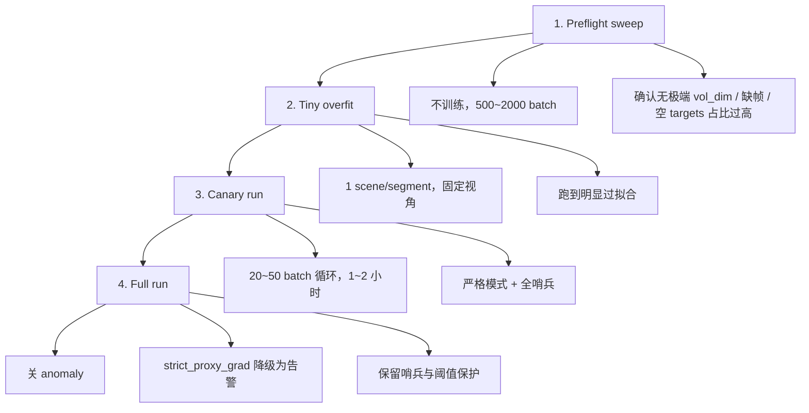

# StreetForward 日志系统更新方案

本文档基于 `docs/trainers/StreetForward_Flow.md` 与 `docs/trainers/StreetForward_Formal_Training_Gap_Analysis.md`，讨论正式训练场景下 StreetForward 的日志系统更新方案。目标是将「单 batch 跑通」升级成「长跑不翻车」，通过**训练前体检 + 训练中哨兵 + 长尾压力测试**，解决可观测性与调试缺口。

> **背景**：`StreetForward_Formal_Training_Gap_Analysis.md` 2.5 节指出：
> - Hyperparameter 追踪：⚠️ 部分
> - 梯度范数监控：❌ 无
> - 学习率记录：❌ 无 → 当前已有 `train/lr`、`train/grad_norm`，但缺分模块 grad norm
> - 异常 batch 处理：⚠️ 弱
>
> 正式训练需：**移除 debug 相关日志**，改为**记录并测试**本方案中的哨兵指标与压力测试。

---

## 目录

1. [缺口与策略概览](#一缺口与策略概览)
2. [长尾隐患清单](#二长尾隐患清单)
3. [训练前：数据/形状/显存扫雷](#三训练前数据形状显存扫雷)
4. [训练前：极小数据过拟合验证](#四训练前极小数据过拟合验证)
5. [训练前 50 step：严格模式](#五训练前-50-step严格模式)
6. [10 个单元/集成测试](#六十个单元集成测试)
7. [训练中哨兵指标](#七训练中哨兵指标)
8. [训练流程分阶段隔离](#八训练流程分阶段隔离)
9. [日志系统具体改动](#九日志系统具体改动)

---

## 一、缺口与策略概览

### 1.1 当前日志状态（参考 `trainer.py` / `proxy_rendering_mixin.py`）

| 内容 | 当前实现 | 正式训练调整 |
|------|----------|--------------|
| loss / lr | `_log_to_tensorboard` 写入 `train/total_loss`、`train/lr` | 保留 |
| grad_norm | `_last_grad_norm` 可选写入 | 扩展为分模块 grad norm |
| proxy grad | `_grad_or_zero` 静默吞 None，`_last_proxy_grad_norms` 未写入 TB | 加 `strict_proxy_grad` 开关；哨兵记录 proxy grad norm |
| debug 日志 | `logger.debug`（cache 清理等）、`logger.warning`（proxy grad None） | 移除或降级，正式训练不输出 |
| 体积/显存 | 无 | 新增 vol_dim、dense 元素数、max_memory_allocated |
| mask/分支 | 无 | 新增 mask_update_rigid.mean、idx_tgt_rigid 统计 |
| 数值健康 | 无 | 新增 render_params、offsets 统计 |

### 1.2 整体策略

- **训练前**：不训练、只前向的扫雷 + 极小数据过拟合
- **训练中**：前 50 step 严格模式（anomaly、None 当 error）；全程哨兵指标
- **正式训练**：关 anomaly、`strict_proxy_grad` 降级为告警，保留哨兵与阈值保护

---

## 二、长尾隐患清单

结合 StreetForward 架构（NodeState 分离 + Proxy 多视角累积 + Rigid 变换 + GRU 缓存），以下 6 类为最常见长尾隐患：

| # | 隐患 | 表现 | 应对 |
|---|------|------|------|
| 1 | **dense_volume 规模 OOM** | `vol_dim≈[400,248,900]` 时 dense `[1,C,D,H,W]` 可达十 GB 级；单 batch 不炸 ≠ 全数据不炸 | 构建体积前估算显存/元素数，设 VMAX 硬阈值 assert；统计 vol_dim |
| 2 | **坐标维度/permute/grid_sample 错位** | 文档中 `dense_volume` 出现过 `[1,C,W,D,H]` 等不一致；单 batch 能学但收敛慢、易崩 | 体素点特征回读一致性测试 |
| 3 | **Proxy 梯度为 None** | `_grad_or_zero` 静默吞 None；某些 target 分支把图断了不报错 | 前 N step 把 None 当 error；加 `strict_proxy_grad` |
| 4 | **Rigid 可见性 gate 导致梯度覆盖率下降** | `idx_tgt_rigid` 子集、`mask_update_rigid` gate 让有效更新点比例随 batch 波动 | 记录 mask 命中率、子集大小、每类 offsets 统计 |
| 5 | **h_cache 与点集对齐** | N_rigid/N_bg 变化时 `h_old` 与点顺序错配，训练偶尔发散 | 缓存对齐校验：同一 `(scene,segment)` 点数/point_ids hash 不一致时 reset cache |
| 6 | **world↔local offsets 变换错误** | `_transform_offsets_world_to_local` 轴顺序、quat 乘法、frame_idx 映射出错 | 可逆一致性测试：world→local→world 误差应很小 |

---

## 三、训练前：数据/形状/显存扫雷

**目的**：不训练、只前向，跑 dataloader 前几百到几千个 batch，做全数据扫雷。

### 3.1 统计项

| 统计项 | 说明 |
|--------|------|
| `N_bg, N_rigid, N_distant` | 各类点数 |
| `num_targets` | target 数量 |
| `vol_dim` | 体积维度 `[D,H,W]` |
| `M` | 稀疏体素数 |
| `prod(vol_dim)` | dense 元素数估算 |
| `mask_src_rigid.mean()` | rigid 在 source 可见比例 |
| `mask_update_rigid.mean()` | 可更新 rigid 比例 |
| `idx_tgt_rigid[i].numel()` | 每个 target 可见 rigid 数 |
| 空 targets / 空点集 / dynamic_info 缺帧 / frame_id 映射失败 | 异常检查 |

### 3.2 硬阈值

- `prod(vol_dim) > VMAX`：跳过 / 缩小 voxel_size / 缩小 bbx / 改用更稀疏插值（至少 fail fast）
- `num_targets == 0`：确认在训练分布中占比不高，避免静默零损失

### 3.3 脚本形态

- 独立脚本（`tools/preflight_sweep_streetforward.py`）
- 输入：与训练相同的 config + dataloader
- 输出：统计 CSV/JSON + 是否触发阈值的报告

---

## 四、训练前：极小数据过拟合验证

**目的**：选 1 个 scene/segment + 固定 1 source + 2~3 target，固定随机性，跑 200~2000 step，验证正确性。

### 4.1 通过标准

- loss 明显下降，PSNR 上升（至少能过拟合到很低的 L2/L1）
- offsets 统计合理（非全 0，非爆）
- 每个模块都有梯度：sparse_conv、fusion、各 offset head、GRU 相关层

### 4.2 过拟合失败常见原因

- 坐标/维度顺序错
- proxy backward 链断
- gate 把更新全关了
- 2D/3D 特征与点对齐错

---

## 五、训练前 50 step：严格模式

仅在前 50~200 step 开启：

| 开关 | 行为 |
|------|------|
| `torch.autograd.set_detect_anomaly(True)` | 检测异常梯度 |
| NaN/Inf 检测 | loss、render_params、proxy grads、offsets 任一出现则 raise |
| Proxy grad 为 None | 在 `strict_proxy_grad=True` 时，对 means/scales/quats/opacities/colors 任一 None 直接 raise |
| 分支 grad norm | 记录并打印一次：bg/rigid/distant、各参数的 grad norm |

### 5.1 `strict_proxy_grad` 设计

- **当前**：`_grad_or_zero` 对 None 用 zeros 替代，仅 warning
- **建议**：增加 `strict_proxy_grad` 配置项
  - `True`（前 50 step）：任一 None 即 raise
  - `False`（正式训练）：保持 `_grad_or_zero`，但哨兵记录并告警

---

## 六、10 个单元/集成测试

### A. 体积与插值一致性（抓 permute/grid_sample 错位）

| # | 测试 | 验证点 |
|---|------|--------|
| 1 | 构造小 vol_dim [8,8,8]，在已知坐标塞入向量 v，采样同一点 | 输出≈v |
| 2 | 沿 x/y/z 各移动 1 voxel 后采样 | 位置变化符合预期，抓轴交换 |

### B. Rigid 变换一致性（抓 frame/quat 顺序错）

| # | 测试 | 验证点 |
|---|------|--------|
| 3 | identity 实例位姿 | local→world 应等于 local（误差 < 1e-6） |
| 4 | world offsets → local → world | round-trip 误差应很小 |
| 5 | quat 归一化 | `||q||≈1`，乘法顺序与约定一致 |

### C. Proxy 多视角梯度累积正确性

| # | 测试 | 验证点 |
|---|------|--------|
| 6 | view1/view2 分别 backward 得 grad1/grad2；再一起 backward 得 grad12 | `grad12≈grad1+grad2`（允许数值误差） |

### D. Gate 与 h_cache 对齐

| # | 测试 | 验证点 |
|---|------|--------|
| 7 | `mask_update_rigid` 全 False | offsets 全为 0，`h_new==h_old` |
| 8 | 点数变化 | 会 reset cache 或至少 assert |

### E. 梯度覆盖率

| # | 测试 | 验证点 |
|---|------|--------|
| 9 | 代表 batch 反传一次 | sparse_conv、feature_fusion、mlp_offset_pos/mlp_conv/mlp_opacity/gaussion_decoder、GRU 层 grad norm > 0 或非 None |
| 10 | `update_state=False` 与 `True` 各跑一遍 | 无 copy_/detach 导致图残留或内存泄漏 |

---

## 七、训练中哨兵指标

每个 iter（或每 N iter）记录以下标量，出现长尾可快速定位。

### 7.1 数据/分支覆盖

| 指标 | 说明 |
|------|------|
| `num_targets` | target 数量 |
| `N_bg, N_rigid, N_distant` | 各类点数 |
| `mask_update_rigid.mean()` | rigid 可更新比例 |
| `idx_tgt_rigid[i].numel()` | 各 target 可见 rigid 数（分布/均值） |

### 7.2 数值健康

| 指标 | 说明 |
|------|------|
| `means_r` 范围 | min/max |
| `scales_log_r` 范围 | min/max |
| `opacities_r` min/max | |
| `||quats_r||` 偏离 1 的均值 | |
| offsets：offset_pos、offset_scales、omega 的 mean/std/max | |

### 7.3 梯度健康（分模块）

| 指标 | 说明 |
|------|------|
| proxy grads | means/scales/quats/opacities/colors 的 grad norm |
| network grads | sparse_conv、各 head、GRU 层的 grad norm |

### 7.4 性能/显存

| 指标 | 说明 |
|------|------|
| `prod(vol_dim)` | |
| dense 元素数估算 | |
| `torch.cuda.max_memory_allocated()` | |

### 7.5 告警阈值（示例）

- 任一指标 **掉到 0**、**NaN**、**暴涨** → 日志告警
- 可配置：`sentinel_alert_on_nan: true`、`sentinel_alert_on_grad_zero: true` 等

---

## 八、训练流程分阶段隔离



| 阶段 | 用途 |
|------|------|
| 1. Preflight sweep | 不训练，扫 500~2000 batch，确认无极端 vol_dim、缺帧、空 targets 占比过高 |
| 2. Tiny overfit | 1 scene/segment 固定视角，跑到明显过拟合 |
| 3. Canary run | 随机 20~50 batch 循环 1~2 小时，开严格模式 + 全哨兵 |
| 4. Full run | 关 anomaly、strict_proxy_grad 降级为告警，保留哨兵与阈值保护 |

---

## 九、日志系统具体改动

### 9.1 移除/降级（正式训练）

| 位置 | 当前 | 调整 |
|------|------|------|
| `node_state_mixin.py` | `logger.debug("Clearing node_states cache...")` | 正式训练时禁 debug 或改为 trace 级别 |
| `proxy_rendering_mixin.py` | `logger.warning("Proxy gradient for {name} is None...")` | 在 `strict_proxy_grad=False` 时改为可选告警，或写入哨兵不打印 |
| `checkpoint_mixin.py` | `logger.debug(...)` | 同上 |

### 9.2 新增：哨兵记录与 TensorBoard

在 `_log_to_tensorboard` 或独立 `_log_sentinel_metrics` 中，当 `tb_log_every` 时写入：

```python
# 数据/分支（来自 _train_inner_iteration 或 _parse_targets）
tb_writer.add_scalar("sentinel/num_targets", num_targets, step)
tb_writer.add_scalar("sentinel/N_bg", N_bg, step)
tb_writer.add_scalar("sentinel/N_rigid", N_rigid, step)
tb_writer.add_scalar("sentinel/N_distant", N_distant or 0, step)
tb_writer.add_scalar("sentinel/mask_update_rigid_mean", mask_update_rigid.mean().item(), step)
# idx_tgt_rigid 可记录均值或各 target 的列表

# 体积/显存（来自 _build_3d_feature_volume 或 construct_sparse_tensor 输出）
tb_writer.add_scalar("sentinel/vol_dim_prod", prod(vol_dim), step)
tb_writer.add_scalar("sentinel/dense_elements_est", prod(vol_dim) * C, step)
if torch.cuda.is_available():
    tb_writer.add_scalar("sentinel/max_memory_allocated_gb", torch.cuda.max_memory_allocated() / 1e9, step)

# 梯度（来自 _backward_to_render_params 的 grad_report + 各模块 grad norm）
for name, norm in _last_proxy_grad_norms.items():
    tb_writer.add_scalar(f"sentinel/proxy_grad_{name}", norm, step)
# 各模块 grad norm 需在 backward 后遍历 named_parameters 计算
```

### 9.3 新增：strict_proxy_grad 与异常处理

在 `proxy_rendering_mixin.py` 的 `_backward_to_render_params` 中：

```python
strict = getattr(self, "strict_proxy_grad", False)

def _grad_or_zero(proxy_tensor, name):
    grad = proxy_tensor.grad
    if grad is None:
        if strict:
            raise RuntimeError(f"Proxy gradient for {name} is None in strict mode.")
        # 否则原有逻辑：warning + zeros
```

配置项建议：`training.strict_proxy_grad: true`（前 50 step），`false`（full run）。

### 9.4 插桩位置一览（最小侵入）

| 模块 | 插桩点 | 产出 |
|------|--------|------|
| `trainer._train_inner_iteration` | 入口/出口 | N_bg/N_rigid/N_distant、num_targets、mask_update_rigid.mean、idx_tgt_rigid 统计 |
| `feature_volume_mixin._build_3d_feature_volume` | 得到 vol_dim 后 | vol_dim、prod(vol_dim)、dense 元素数 |
| `proxy_rendering_mixin._backward_to_render_params` | 反传前 | proxy grad norms；strict 时 None→raise |
| `trainer`（optimizer.step 前） | 计算 grad norm | 总 grad norm + 分模块 grad norm |
| `trainer._log_to_tensorboard` | 扩展 | 写入上述 sentinel 标量 |

### 9.5 配置建议

```yaml
# configs/streetforward/multi_scene.yaml 建议补充

training:
  strict_proxy_grad: false    # 前 50 step 可设 true
  strict_proxy_grad_steps: 50 # 严格模式持续步数
  detect_anomaly_steps: 50    # anomaly 检测持续步数
  sentinel:
    enabled: true
    log_every: 1              # 每 N step 记录哨兵
    alert_on_nan: true
    alert_on_grad_zero: false # 可配置哪些指标为 0 时告警
  # 正式训练时关闭 debug 日志
  log_level: info             # debug | info | warning
```

---

## 十、与现有文档的衔接

- **StreetForward_Flow.md**：本方案的插桩点与 `_train_inner_iteration`、`_build_3d_feature_volume`、`_backward_to_render_params` 等流程一一对应。
- **StreetForward_Formal_Training_Gap_Analysis.md**：本方案直接弥补 2.5 节可观测性与调试缺口，并扩展为长尾压力测试与哨兵体系。
- **Golden Baseline**：preflight、tiny overfit、哨兵指标均应与 Golden Batch 回归兼容；可在 baseline 中设 `sentinel.enabled: false`、`strict_proxy_grad: false` 以保证回归通过。

---

## 十一、总结

| 类别 | 内容 |
|------|------|
| **移除** | debug 日志、正式训练时不必要的 proxy grad warning 刷屏 |
| **新增** | 哨兵指标（数据/分支、数值、梯度、显存）、strict_proxy_grad、anomaly 前 50 step |
| **测试** | 10 个单元/集成测试、preflight sweep、tiny overfit、canary run |
| **流程** | Preflight → Tiny overfit → Canary run → Full run |

按本方案实施后，可从「单 batch 跑通」升级到「长跑可观测、可定位、可复现」的正式训练体系。
