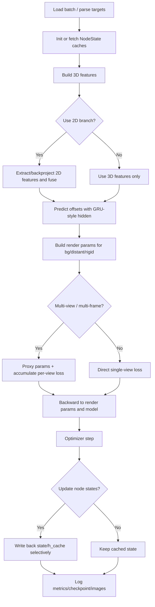

# StreetForward Minimal Trainers Usage（Stage1 -> Stage4.2）

本文档基于以下实现梳理最小训练器演进，并形成后续阶段可直接复用的使用规范：

- `models/streetforward/minimal_trainer_stage1.py`
- `models/streetforward/minimal_trainer_stage1_1.py`
- `models/streetforward/minimal_trainer_stage2_0.py`
- `models/streetforward/minimal_trainer_stage2_1.py`
- `models/streetforward/minimal_trainer_stage2_2.py`
- `models/streetforward/minimal_trainer_stage3_1.py`
- `models/streetforward/minimal_trainer_stage3_2.py`
- `models/streetforward/minimal_trainer_stage3_2d.py`
- `models/streetforward/minimal_trainer_stage3_3.py`
- `models/streetforward/minimal_trainer_stage4_0.py`
- `models/streetforward/minimal_trainer_stage4_1.py`
- `models/streetforward/minimal_trainer_stage4_2.py`

并参考 `docs/trainers/StreetForward_Flow.md` 的整体设计说明（两者实现细节以代码为准）。

---

## 1. 阶段总览表（流程、数据、功能、组件、日志、测试、配置）

| Stage | 核心流程增量 | 关键数据/状态 | 主要功能 | 关键组件 | 日志与指标 | 测试/排障点 | 配置系统重点 |
|---|---|---|---|---|---|---|---|
| `stage1` | 单视图：`pointcloud -> bg state -> 3D feat -> offsets -> render -> L1` | `NodeStateBackground` | 最小可训背景分支 | `sparse_conv` + offset heads | 基础 `loss` | 缺 `pointcloud/targets/segment_aabb` 快速失败 | `model.*` 扁平键，`dataset.segment_aabb` |
| `stage1_1` | 在 stage1 上加入 GRU-style hidden | `h_cache_bg`, `param_embed` | 跨 step 记忆 + 参数条件偏移预测 | `_predict_offsets_gru`, `_normalize_params_for_embed` | 同 stage1，附带状态缓存 | 点数签名变化触发 hidden reset | 新增 `param_embed_dim`, `offset_gru_hidden_dim` |
| `stage2_0` | 单参数多视图监督：一次 params，多 target 平均 loss | `pred_rgbs/gt_images` 列表 | 多视图一致性监督 | 覆写 `forward/train_step` | `num_targets` | target 为空快速失败 | 基本继承 stage1_1 |
| `stage2_1` | proxy 梯度桥接，多视图逐视角 backward 到 proxy | `proxies_*` | 稳定多视图梯度累积 | `_create_proxy_params`, `_backward_to_render_params_bg` | 多视图 loss | train/eval 双路径可对照定位 | 继承上阶段 |
| `stage2_2` | batched multi-view render（同分辨率） | batched `viewmats/Ks` | 提升渲染吞吐 | `_render_multi_view` + fallback | 同 stage2_0 | 尺寸不一致自动回退 | 继承上阶段 |
| `stage3_2d` | 引入 `bg + distant` + 强制 2D 分支 | `source_views/source_images`, `h_cache_{bg,distant}` | 2D/3D 融合、远景建模 | `ImageFeatureExtractor`, `FeatureFusion` | `num_gaussians_*`, `num_source_views` | 缺 source 数据直接失败 | `feat_2d_channels/downscale`，点数上限可配 |
| `stage3_1` | 在 3_2d 上加入 sky 合成 | `viewdirs`, `rgb_sky` | 可学习天空，减少背景欠拟合 | `SkyCubemap`, `_composite_sky` | sky 合成后 loss | `viewdirs` 尺寸强校验 | `model.sky.{resolution,init_value}` |
| `stage3_2` | 多项复合损失（rgb/ssim/mask/entropy） | `sky_mask`, `egocar_mask`, `opacity` | 从像素重建到结构化监督 | `_valid_loss_mask_from_target`, `_mask_bce` | 输出分项损失 | `opacity_loss_type` 严格限制 | `losses.*` 必填权重 |
| `stage3_3` | bg/distant 分支配置与偏移头解耦 | `model.branches.{bg,distant}` | 分支独立初始化/约束/步长/冻结策略 | `_parse_branch_cfg`, distant 独立 heads | 同 3_2（更利于 ablation） | `_require_key` 强约束配置完整性 | 分支 schema 化，fast-fail |
| `stage4_0` | 新增 rigid 分支（局部坐标 -> 世界变换） | `NodeStateRigid`, `dynamic_info`, `frame_idx` | 动态刚体建模（MVP） | `_transform_rigid_to_world`, `_predict_offsets_gru_rigid` | `rigid_valid_ratio` 等统计 | frame/camera 对齐强校验 | `model.branches.rigid` 新增 |
| `stage4_1` | 多目标帧 rigid selective update | `mask_update`, `S/U` 子集索引, `num_target_frames` | 跨帧 rigid 训练与冻结混合渲染 | `_build_rigid_world_for_frame`, 子集映射与合并 | `num_rigid_update/loss_effective_frames` | 无有效监督帧时警告 + 零损失 | 新增 `rigid.src_backproject_support_min` |
| `stage4_2` | source 一次回投（`bg+distant+rigid_S`）+ bg/distant update mask | `mask_update_{bg,distant,rigid}`, `acc_w_*`, `writeback_idx_*` | 降低无支撑点漂移并减少 2D 流程重复 | `_compute_2d_features_all_branches_once`, masked hidden/RMS/writeback | 保留 stage4_1 键并新增 `num_bg_update`/`num_distant_update` 等 | 配置缺失新键 fast-fail；验证 one-pass 计数与写回比例 | 新增 `bg/distant.src_backproject_support_min` 与 selective-update 键 |

---

## 2. 统一流程图（按最新 Stage4.1 抽象，低阶段是子集）



---

## 3. 关键数据与组件（按工程分层）

| 分层 | 关键对象 | 作用 | 常见错误信号 |
|---|---|---|---|
| 状态层 | `NodeStateBackground/NodeStateDistant/NodeStateRigid` | 持久化高斯参数缓存，跨 step 复用 | shape 不一致、frame 映射错误 |
| 特征层 | `sparse_conv`, `ImageFeatureExtractor`, `FeatureFusion` | 3D 体素特征 + 2D 反投影融合 | 缺 `source_views/source_images`、2D/3D维度不匹配 |
| 偏移层 | `mlp_offset_pos/mlp_conv/mlp_opacity/gaussion_decoder` + GRU 模块 | 从融合特征预测几何/外观偏移 | 偏移爆炸、quat 异常（常由配置上限不合理导致） |
| 渲染层 | `_render_single_view`, `_render_multi_view`, sky compositing | 将 render params 变成监督图像 | 分辨率不一致、viewdirs 缺失 |
| 反传层 | proxy params + `_backward_to_render_params*` | 多视角梯度累积与桥接 | proxy grad 为 None、部分分支不更新 |
| 配置层 | `config.model`, `config.losses`, `config.training`, `model.branches.*` | 控制阶段能力、loss 和更新策略 | 缺键直接 fast-fail（预期行为） |

---

## 4. 日志体系（建议统一观察面板）

训练脚本（`tools/train_minimal_streetforward_stage*.py`）已具备较完整日志机制，建议固定观察：

- 基础：`loss`, `mse`, `psnr_mean`
- 重指标：`ssim_mean`, `lpips_mean`（按 `heavy_metric_interval`）
- 结构统计：
  - `num_gaussians_bg`, `num_gaussians_distant`, `num_gaussians_rigid`
  - Stage4.1 重点：`num_rigid_src_feat_valid`, `num_rigid_update`, `num_target_frames`, `loss_effective_frames`
- 持久化：
  - `metrics_history.jsonl`
  - 可选 TensorBoard（`logging.use_tensorboard=true`）
  - 周期 ckpt（`training.save_checkpoint_freq`）

---

## 5. 测试策略（结合 fast-fail 与深度学习实践）

### 5.1 快速冒烟（每次改 trainer 后必跑）

```bash
conda run -n drivestudio-new env PYTHONPATH=/root/drivestudio-coding \
python tools/train_minimal_streetforward_stage4_1.py \
  --config_file configs/minimal_streetforward_stage4_1.yaml \
  --max_steps 1 \
  --overfit_batch_path <your_overfit_batch.pt>
```

同理可替换为 `stage1/2_2/3_3/4_0` 脚本进行分阶段冒烟。

### 5.2 回归矩阵（建议）

- 配置校验：删除必填键，确认 fast-fail 报错信息准确。
- 数值稳定性：检查 `loss` 是否 `NaN/Inf`，`psnr` 是否单调上升（短窗口）。
- 分支有效性：
  - 仅 bg（stage1_1）
  - bg+distant（stage3_3）
  - bg+distant+rigid（stage4_1）
- 数据契约：`viewdirs/sky_mask/egocar_mask/frame_idx` 形状错配应立即失败。

### 5.3 可视化回归

- 监控 `pred/gt/error` 三联图（脚本已支持周期保存）。
- 对 rigid 场景重点看跨帧一致性与“拖影”。

---

## 6. 配置系统用法（后续阶段可直接复用）

### 6.1 配置分层建议

- 全局模型参数：`model.{sh_degree, voxel_size, feat_2d_* , use_fused_cuda_backproject_v2, param_embed_dim, offset_gru_*}`
- 分支参数：`model.branches.{bg,distant,rigid}`
  - `init`：初始化策略（`scale_init`, `opacity_init`）
  - `limits`：偏移上限（安全边界）
  - `eta`：参数更新步长（学习速率整形）
  - `mlp`：分支输入来源与冻结策略
- 损失：`losses.{rgb,ssim,mask,opacity_entropy}`
- 训练：`training.{max_iterations, log_interval, save_checkpoint_freq, view_selection}`
- 评估与日志：`eval.*`, `logging.*`

### 6.2 最佳实践（工程 + 深度学习）

- 优先 fast-fail：关键键缺失直接抛错，不做静默默认补齐。
- 先锁定上限再调步长：先稳定 `limits.*`，再细调 `eta.*`。
- 分支独立调参：
  - `bg` 以几何稳定为先；
  - `distant` 通常更保守（小 `offset_max`、低 `eta.means`）；
  - `rigid` 先保证可见性筛选正确，再放开更新幅度。
- 2D 分支启用时强制检查 source 输入，不建议在 trainer 内“自动兜底”。
- 多目标帧下优先观察有效监督帧比例，而不是只看总 loss。

---

## 7. 分阶段 Usage 模板（可直接改命令）

### Stage1 / Stage1.1（单分支基线）

```bash
conda run -n drivestudio-new env PYTHONPATH=/root/drivestudio-coding \
python tools/train_minimal_streetforward_stage1_1.py \
  --config_file configs/minimal_streetforward_stage1_1.yaml \
  --overfit_batch_path <your_overfit_batch.pt>
```

### Stage2.x（多视图）

```bash
conda run -n drivestudio-new env PYTHONPATH=/root/drivestudio-coding \
python tools/train_minimal_streetforward_stage2_2.py \
  --config_file configs/minimal_streetforward_stage2_2.yaml \
  --overfit_batch_path <your_overfit_batch.pt>
```

### Stage3.x（2D + sky + 复合损失 + 分支解耦）

```bash
conda run -n drivestudio-new env PYTHONPATH=/root/drivestudio-coding \
python tools/train_minimal_streetforward_stage3_3.py \
  --config_file configs/minimal_streetforward_stage3_3.yaml \
  --overfit_batch_path <your_overfit_batch.pt>
```

### Stage4.x（rigid 动态分支）

```bash
conda run -n drivestudio-new env PYTHONPATH=/root/drivestudio-coding \
python tools/train_minimal_streetforward_stage4_1.py \
  --config_file configs/minimal_streetforward_stage4_1.yaml \
  --overfit_batch_path <your_overfit_batch.pt>
```

```bash
conda run -n drivestudio-new env PYTHONPATH=/root/drivestudio-coding \
python tools/train_minimal_streetforward_stage4_2.py \
  --config_file configs/minimal_streetforward_stage4_2.yaml \
  --overfit_batch_path <your_overfit_batch.pt>
```

---

## 8. 迁移路线建议（后续阶段开发时按此执行）

1. 先在 `stage1_1` 验证数据契约与 GRU hidden 稳定性。  
2. 升级 `stage2_2` 验证多视图吞吐与平均监督收益。  
3. 升级 `stage3_3` 验证 2D 融合和分支解耦收益（Ablation：bg-only vs bg+distant）。  
4. 升级 `stage4_1` 验证 rigid 可见性筛选与 selective update 的有效帧占比。  
5. 升级 `stage4_2` 验证 bg/distant 支撑掩码、one-pass 回投与 masked writeback 的稳定性收益。  
6. 每阶段至少保留：1-step smoke、100-step short run、核心指标 jsonl 对比。  

这条路线可以最大化复用已有脚本与配置，且便于快速定位“数据问题 / 配置问题 / 建模问题”三类故障。
