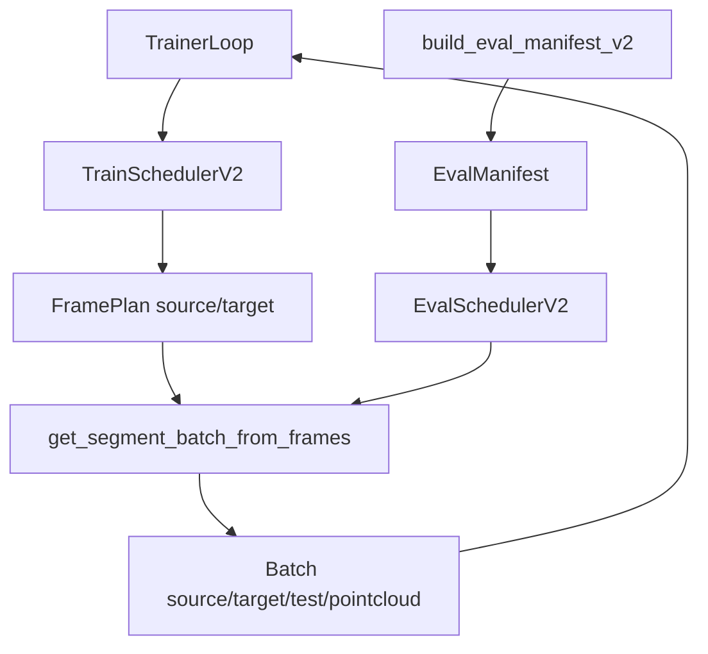

# StreetForward Scheduler V2 设计总览（基于 `MultiSceneDatasetV2`）

本文档是 `datasets/multi_scene_dataset_v2.py` 的系统设计说明，聚焦“为什么这么设计、机制如何协同、工程上如何用”。

关联文档：

- `docs/dataloader/MultiSceneDataset_V2_Usage.md`
- `docs/trainers/StreetForward_Scheduler_V2_Usage.md`

---

## 1. 设计理念

`MultiSceneDatasetV2` 的核心不是“重写一个数据集”，而是把训练调度从 dataset 内部剥离出来，形成 **显式 frame 计划 -> 显式 batch 组装** 的路径。

目标分为四条：

- **语义正确**：target 必须显式包含 source frame（`target[0] == source`）。
- **随机性分层**：epoch/segment block/step 三层随机，而不是每步全随机。
- **可复现评估**：eval manifest 固定 source/target/test。
- **fast-fail**：配置、输入、状态不合法时直接报错，不做隐式兜底。

---

## 2. 总体架构



解释：

- `TrainSchedulerV2` 只负责计划与推进。
- `MultiSceneDatasetV2` 只负责把显式 frame 计划组装成 batch。
- `EvalSchedulerV2` 与训练采样解耦，保证 deterministic。

---

## 3. 关键机制

### 3.1 显式 frame 组 batch：`get_segment_batch_from_frames`

接口：

```python
get_segment_batch_from_frames(
    scene_id: int,
    segment_id: int,
    source_frame_idx: int,
    target_frame_indices: List[int],
    include_test: bool = False,
    test_frame_indices: Optional[List[int]] = None,
) -> Dict[str, Any]
```

关键规则：

- `target_frame_indices` 不能为空。
- `target_frame_indices[0]` 必须等于 `source_frame_idx`。
- source/target frame 必须属于该 segment。
- 当传入 `test_frame_indices` 时，test 会被显式覆盖，避免旧随机路径污染 eval。

实现策略：

- 复用 v1 的 batch 组装主干（图像加载、点云、dynamic_info、坐标系转换）。
- 通过“按 keyframe 的 frame 计划”接管 source/target 选择，不依赖调用顺序。
- 对 test 提供 `_overwrite_test_views_from_explicit_frames(...)`，确保 eval manifest 真正生效。

### 3.2 训练调度：`TrainSchedulerV2`

状态字段：

- `epoch_idx`, `global_step`
- `epoch_plan`, `plan_cursor`
- `current_segment_state`（含 `local_step`、`source_frame`、`source_block_step`）

核心算法：

- `steps_per_segment = clamp(round(alpha * num_keyframes), min_steps, max_steps)`
- source 固定 `source_hold_steps` 步
- 每步重采样 extra target，且 target 首帧固定 source

epoch 行为：

- `next_batch()`：epoch 结束自动滚到下一 epoch（适合持续训练）。
- `next_batch_in_epoch()`：只在当前 epoch 内取 batch，边界抛 `StopIteration`（适合每 epoch 做 val/ckpt）。
- `has_epoch_ended()`：显式查询 epoch 边界。

### 3.3 评估调度：`build_eval_manifest_v2` + `EvalSchedulerV2`

manifest 条目：

```python
{
  "scene_id": int,
  "segment_id": int,
  "source_frame_idx": int,
  "target_frame_indices": List[int],  # target[0] is source
  "test_frame_indices": List[int],
}
```

deterministic 策略：

- source：中间 keyframe 的中间 frame
- target：`target[0]=source`，其余从其他 keyframe 顺序取中间 frame
- test：按固定均匀策略采样上限数量

`EvalSchedulerV2.next_batch()` 会把 `test_frame_indices` 传到 dataset，确保 test 视图固定。

### 3.4 scene 管理对齐

`TrainSchedulerV2.build_epoch_plan()` 默认基于 `dataset.scene_training_queue`（必要时先初始化），而不是直接裸扫 `train_scene_ids`，与 dataset 的“有效场景管理”保持一致。

---

## 4. 关键接口文档

### 4.1 `MultiSceneDatasetV2`

- `get_segment_batch_from_frames(...)`  
  显式 frame 组 batch，v2 主入口。
- `create_train_scheduler_v2(...) -> TrainSchedulerV2`  
  训练调度器工厂。
- `build_eval_manifest_v2(...) -> List[Dict]`  
  生成固定评估清单。
- `create_eval_scheduler_v2(...) -> EvalSchedulerV2`  
  评估调度器工厂。

### 4.2 `TrainSchedulerV2`

- `start_new_epoch()`：重建 epoch plan
- `next_batch()`：跨 epoch 持续取 batch
- `next_batch_in_epoch()`：epoch 内取 batch，边界抛 `StopIteration`
- `has_epoch_ended()`：是否到达当前 epoch 末
- `get_current_info()`：返回当前状态快照（日志友好）

### 4.3 `EvalSchedulerV2`

- `next_batch()`：按 manifest 固定顺序返回 batch
- `reset()`：重置 cursor
- `__len__()`：manifest 大小

---

## 5. 关键数据与组件

| 类别 | 关键对象 | 说明 |
|---|---|---|
| 数据集 | `MultiSceneDatasetV2` | v2 外观层，复用 v1 组装能力并施加 v2 采样契约 |
| 训练调度 | `TrainSchedulerV2` | epoch plan、source hold、target 采样、状态推进 |
| 评估调度 | `EvalSchedulerV2` | 固定 manifest 的顺序评估 |
| 评估数据 | `eval_manifest` | source/target/test 的确定性描述 |
| 批次字段 | `batch['source'/'target'/'test']` | 训练/评估输入输出统一容器 |
| 关键约束 | `target[0]==source` | v2 的核心监督语义 |

---

## 6. 配置映射（以 one-segment v2 配置为例）

文件：`configs/minimal_streetforward_stage4_1_one_segment_v2.yaml`

关键字段：

- `dataset.num_source_keyframes`：v2 期望为 1
- `dataset.num_target_keyframes`：与训练目标视角规模一致
- `scheduler_v2.alpha_steps_per_keyframe`
- `scheduler_v2.min_steps_per_segment`
- `scheduler_v2.max_steps_per_segment`
- `scheduler_v2.source_hold_steps`
- `scheduler_v2.num_target_frames_total`
- `scheduler_v2.target_include_source`（必须 true）
- `one_segment.scene_id` / `one_segment.segment_id`

建议：

- 一开始训练不稳可先降低 `num_target_frames_total`，再逐步提高。

---

## 7. 日志建议与可观测性

建议记录两层日志：

- step 级：
  - `global_step`
  - `epoch_idx`
  - `scene_id`
  - `segment_id`
  - `segment_local_step`
  - `segment_step_budget`
  - `source_frame_idx`
  - `source_block_step`
- epoch 级：
  - train 均值 loss
  - fast val 指标
  - full val 指标

作用：

- 观察 source 切换是否造成 loss 抖动。
- 判断是否某些 segment 长期难学。
- 判断“指标变化”是模型变化还是采样噪声。

---

## 8. Fast-Fail 约束清单

- `alpha_steps_per_keyframe <= 0` -> 报错
- `min_steps_per_segment < 1` -> 报错
- `max_steps_per_segment < min_steps_per_segment` -> 报错
- `source_hold_steps < 1` -> 报错
- `num_target_frames_total < 1` -> 报错
- `target_include_source is False` -> 报错
- `target_frame_indices` 为空 -> 报错
- `target_frame_indices[0] != source_frame_idx` -> 报错
- frame 不属于指定 segment -> 报错
- eval manifest 重复/非法项 -> 报错

---

## 9. 已知取舍与后续演进

当前版本的工程取舍：

- 优先复用 v1 的 batch 组装主干，避免重写大规模数据装配逻辑。
- v2 主价值在“采样语义与评估可复现”而非推翻所有基础设施。

可演进方向：

- 把 `get_segment_batch_from_frames` 进一步从“复用路径”演进到“纯显式路径”（彻底去除内部 patch 依赖）。
- 增加单元测试覆盖：epoch 边界、manifest test 固定、异常路径 fast-fail。
- 在 trainer 层统一使用 `next_batch_in_epoch()` 驱动 epoch 级 val/ckpt/lr。

---

## 10. 一句话结论

`MultiSceneDatasetV2 + TrainSchedulerV2 + EvalSchedulerV2` 的组合，把 StreetForward 训练从“隐式随机采样”升级为“显式、可控、可复现”的调度体系：训练随机性分层、监督语义清晰、评估真正固定。
