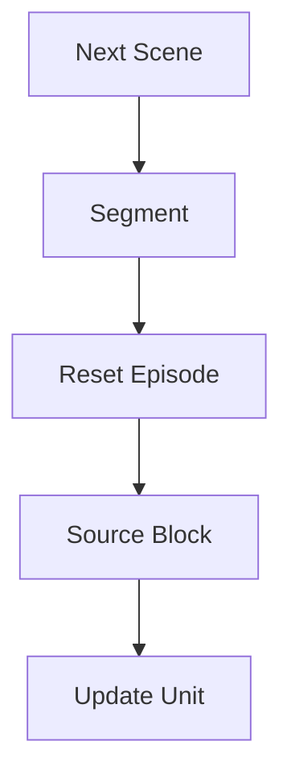

# StreetForward TrainSchedulerV4 设计文档

本文档描述 StreetForward 在 **single-src-image + multi-target-images** 训练协议下的 **TrainSchedulerV4** 调度方案。V4 强调：src 必须按「先随机 `(keyframe, cam)`，再随机 `frame`」；target 采用最简单、最稳的随机协议；层级为 **`U → B → R → S → N`**。调度器对外输出的基本原语是 **`(frame_idx, cam_id)` 图像引用**（`source_image_ref` / `target_image_refs`），见 §14。本版**不讨论** preload / cache。

**相关阅读**：

- 数据层次与术语：`docs/dataloader/MultiSceneDataset_Usage.md`
- 数据集 batch 组装（实现参考，多为 **frame 级** 历史接口）：`datasets/multi_scene_dataset.py`、`datasets/multi_scene_dataset_v2.py`（如 `get_segment_batch_from_frames`）；V4 调度契约以 **image_ref** 为准，见 §14。
- 前代调度与时间尺度：`docs/dataloader/MultiSceneDataset_V3_Usage.md`、`docs/trainers/StreetForward_Scheduler_V2_Design.md`

---

## 1. 目标

TrainSchedulerV4 用于 segment 内训练调度，目标是：

1. 单步训练使用 **1 张 src 图像 + 多张 target 图像**。
2. 在 segment 内组织训练，使 source 的迭代优化具有明确的 **block** 语义。
3. 通过 **reset** 控制 node state 的时间范围，避免 segment 内无限漂移。
4. 保证 src 与 target 有一定重叠，但又不退化为完全相同的监督。
5. 在不引入复杂 pose / visibility / overlap 统计的前提下，给出一套简单、可实现、可 debug 的随机采样协议。

---

## 2. 非目标

本版 V4 **不处理**：

- preload / cache 设计
- 复杂的几何重叠评分
- 动态实例可见性变化量驱动的采样
- 多种 scheduler policy 并存的复杂框架

本版首先追求：语义清晰、实现简单、行为稳定、日志可解释。

---

## 3. 与数据层术语对齐

与 `MultiSceneDataset_Usage.md` 一致，数据层次为：

```text
Scene（场景）
  └── Segment（段）
        └── Keyframe（关键帧）
              └── Frame（时间步，多相机）
                    └── Image（单张图，由 frame + cam 标识）
```

V4 调度在 **segment** 内操作：在 episode 窗口内选取 keyframe / camera / frame，再交给数据集侧组装 batch。

**调度器对外契约是图像级，不是裸 `frame_idx` 列表。** 单张图由 **`(frame_idx, cam_id)`** 唯一确定；同一 `frame_idx` 下多相机并存，只传 frame 无法唯一指定图像，也容易误实现成「取该 frame 下所有相机」，退化为 frame 级语义。V4 要求调度器输出 **`source_image_ref` / `target_image_refs`**（§14）；数据集若仍封装 v2 的 `get_segment_batch_from_frames`，应在 **内部** 把 image_ref 解析为张量布局或兼容层，而不是把「仅 frame 列表」当作调度器主接口。

---

## 4. 基本原则

### 4.1 训练单元原则

每个训练 step 使用：

- 1 张 `src image`
- `n` 张 `target images`

其中 target 集合满足：

- `target[0]` 为 src 自身（与 v2 约定一致）
- 其余 target 与 src **来自不同 keyframe**
- src 与其他 target 尽量保持一定重叠（通过「同 cam、近 keyframe」等简单规则近似）

### 4.2 src 采样原则

src 采样必须满足：

1. **先随机选一个 `(keyframe, cam)`**
2. **再在该 `(keyframe, cam)` 下随机选一个 `frame`**
3. 由 `(frame_idx, cam_id)` 唯一确定 src 对应 **`Image`**（`frame_idx` 用全局或 segment-local 编码由数据集约定，但与 `cam_id` 成对出现，缺一不可）

### 4.3 block 原则

一个 **B（source block）** 内：

- `src` 固定
- `targets` 固定
- 连续训练若干步，完成对该 src 的局部迭代优化

### 4.4 reset 原则

一个 **R（reset episode）** 内：

- 开始时 reset node states / hidden cache
- 之后遍历一批 source blocks
- episode 内不再次 reset

---

## 5. 层级定义：U → B → R → S → N



### 5.1 U：Update Unit

最小的「状态同步时间单位」。

- 一个 `U` 包含若干 raw training steps。
- 每个 `U` 结束时允许执行一次 node-state write-back / state sync。

最简单实现可设 `state_write_interval_steps = 1`，即 1 个 raw step = 1 个 U。

### 5.2 B：Source Block

一个 source block 表示：**固定一张 src 图像和一组 targets，连续训练 `K_u` 个 U**。block 内不更换 src 与 target 集合，使模型对给定 src 做局部迭代，而非每步换监督。

### 5.3 R：Reset Episode

一个 reset episode 表示：在局部 keyframe 范围内 **reset 一次状态**，然后遍历 **`R_kf * c`** 个 source 候选。

- `R_kf`：该 episode 覆盖的 keyframe 数
- `c`：相机数
- 候选对总数：`|P| = R_kf * c`，对应 `(keyframe, cam)` 无放回遍历（顺序随机打乱）

### 5.4 S：Segment

Segment 是训练中的主要场景单元；segment 内点云 / dynamic_info / keyframe 组织不变，训练围绕该 segment 的 node states 展开。一个 segment 内执行多个 reset episodes。

### 5.5 N：Next Scene

Scene 切换层；切换后训练对象换到下一场景。

---

## 6. 数据层次与调度对象

```text
segment
  └── keyframes: k_0, k_1, ..., k_{M-1}
        └── frames in keyframe k
              └── cameras: cam_0, cam_1, ..., cam_{c-1}
```

- `M`：segment 中 keyframe 数
- `c`：相机数
- `frames(k)`：keyframe `k` 中可用的 frame 集合
- `img(k, f, cam)`：由 keyframe、frame、camera 唯一确定的一张图像（实现上映射到数据集内的 frame 索引与相机 id）

---

## 7. V4 核心采样设计

### 7.1 R episode 的 keyframe 选择

为便于 src 与 target 重叠且无需几何统计，**不**在整段 segment 上离散乱采 keyframe，而采用：

> **先随机选一个局部连续 keyframe 窗口。**

对每个 reset episode：

1. 在 segment 的 keyframe 序列中随机选窗口起点 `k_start`。
2. 构造长度为 `R_kf` 的连续窗口 `W = [k_start, ..., k_start + R_kf - 1]`。
3. 若越界则 **裁剪或平移** 窗口，保证长度为 `R_kf`。

效果：episode 内 keyframe 时序接近，src 与 extra target 更容易自然重叠；规则简单、无额外统计量。

### 7.2 如何选择下一张 src 图像

**Step 1**：在窗口 `W` 内构造候选对  
`P = {(k, cam) | k ∈ W, cam ∈ Cameras}`，`|P| = R_kf * c`。

**Step 2**：`P_shuffled = shuffle(P)`（无放回顺序）。

**Step 3**：每个新 source block 取 `P_shuffled` 中下一个 `(k_src, cam_src)`。

**Step 4**：从 `frames(k_src)` 中随机选 frame：  
`f_src ~ Uniform(frames(k_src))`，src 为 `img(k_src, f_src, cam_src)`。

此即：**先 `(keyframe, cam)`，再 `frame`**，而不是先 frame 再 cam，也不是直接均匀抽一张图。

### 7.3 如何为 src 选择 target

设总 target 数为 `T_total`，则 `targets = [src] + extras`，`T_extra = T_total - 1`。

#### 7.3.1 `target[0]` 固定为 src

始终 `target_0 = src`，提供当前视角锚定监督，避免 block 内完全失去当前视角约束。

#### 7.3.2 extras 的基本来源

extras 需满足：keyframe 与 src 不同；尽量与 src 重叠；逻辑简单。默认策略：

> **extras 优先从 episode 窗口内其他 keyframe 采样，且与 src 使用相同 cam。**

即 src 为 `(k_src, f_src, cam_src)` 时，extras 优先来自 `(k_tgt ≠ k_src, cam = cam_src)`，并在各 `k_tgt` 下随机选 frame。

#### 7.3.3 extras 采样步骤

1. **主候选 keyframe 集**：`K_candidate = W \ {k_src}`。
2. **按与 `k_src` 的 keyframe 距离分组**（距离 1、2、…），采样时 **优先近距组**，组内随机。
3. 对每个选中的 `k_tgt`：`f_tgt ~ Uniform(frames(k_tgt))`，得到 `img(k_tgt, f_tgt, cam_src)`。

#### 7.3.4 不足时的补齐

若窗口内 keyframe 不足以凑够 `T_extra`：

- **方案 A**：从 segment 内、窗口外的 **近邻** keyframe 补（仍 `cam = cam_src`，`k_tgt ≠ k_src`）。
- **方案 B**：仍不足则对 **非 src 的 keyframe** 允许 **有放回** 采样，但每次重新随机 `frame`，以保证 target 总数固定且「extras 与 src 不同 keyframe」仍成立。

---

## 8. 为何 target 默认「同 cam + 不同 keyframe」

- 与 src 视角一致，易重叠；无需 camera overlap 图或额外 pose/可见性计算。
- 跨 camera 多视角约束较弱，可作为后续增强，不作为 V4 默认复杂度。

---

## 9. block / reset / segment 的执行语义

### 9.1 B：Source Block

每个 block 固定 src 与 targets，持续 `K_u` 个 U。若每个 U 对应 `state_write_interval_steps` 个 raw step，则 block 内 raw 步数为：

`K_raw = K_u * state_write_interval_steps`

### 9.2 R：Reset Episode

每个 episode：

1. reset node states / hidden cache
2. 采样连续窗口 `W`
3. 构造 `P`，shuffle 得 `P_shuffled`
4. 对 `P_shuffled` 中每个 `(kf, cam)`：选 frame → 构造 src → 采样 targets → 执行一个 source block

Episode 内 block 数：`B_ep = R_kf * c`（与候选对数相同）。

### 9.3 S：Segment

设每 segment 执行 `E_seg` 个 episodes，则：

- `B_seg = E_seg * R_kf * c`
- `U_seg = B_seg * K_u`
- `Steps_seg = B_seg * K_u * state_write_interval_steps`

---

## 10. 配置项建议

```yaml
scheduler_v4:
  enable: true

  time_base:
    state_write_interval_steps: 1

  source_block:
    updates_per_block: 2

  reset_episode:
    keyframes_per_episode: 3
    episodes_per_segment: 2
    keyframe_window_policy: random_contiguous_window
    pair_order_policy: shuffle_without_replacement

  target_sampling:
    total_target_images: 4
    include_src: true
    extra_target_policy: same_cam_different_keyframe
    prefer_nearby_keyframes: true
    fallback_expand_to_segment: true
    fallback_with_replacement: true
```

### 10.1 推荐默认值（第一版）

| 配置项 | 建议值 | 含义（简述） |
|--------|--------|----------------|
| `state_write_interval_steps` | `1` | 每 raw step 同步一次 state |
| `updates_per_block` | `2` | 每个 src block 训练 2 个 U |
| `keyframes_per_episode` | `3` | 每 episode 覆盖 3 个 keyframe |
| `episodes_per_segment` | `2` | 每 segment 2 个 reset episodes |
| `total_target_images` | `4` | 1 src + 3 extras |

训练偏保守时可改为：`updates_per_block: 1`，`keyframes_per_episode: 2`，`total_target_images: 3`。

---

## 11. 日志设计

### 11.1 segment begin

建议字段：`scene_id`、`segment_id`、`num_keyframes`、`episodes_per_segment`、`keyframes_per_episode`、`updates_per_block`、`targets_total`。

### 11.2 reset episode begin

建议字段：`scene_id`、`segment_id`、`episode_idx`、`selected_keyframe_window`、`num_pairs`（= `R_kf * c`）、`state_reset: true`。

### 11.3 source block begin

建议字段：`scene_id`、`segment_id`、`episode_idx`、`block_idx_in_episode`、`src_keyframe`、`src_cam`、`src_frame`、`target_keyframes`、`target_frames`、`target_cams`。

### 11.4 source block end

建议字段：`scene_id`、`segment_id`、`episode_idx`、`block_idx_in_episode`、`mean_loss`、`mean_psnr`、`num_updates_in_block`。

---

## 12. 主流程伪代码

```python
for scene in scene_order:
    for segment in segment_order(scene):

        log_segment_begin(...)

        for episode_idx in range(E_seg):

            reset_node_states()
            clear_hidden_cache()

            W = sample_random_contiguous_keyframe_window(
                segment_keyframes, length=R_kf
            )

            pair_list = []
            for kf in W:
                for cam in cameras:
                    pair_list.append((kf, cam))

            random.shuffle(pair_list)

            log_episode_begin(
                scene_id=scene,
                segment_id=segment,
                episode_idx=episode_idx,
                selected_keyframe_window=W,
            )

            for block_idx, (kf_src, cam_src) in enumerate(pair_list):

                f_src = random_choice(frames(kf_src))
                src = make_image(kf_src, f_src, cam_src)

                targets = [src]

                extra_targets = sample_extra_targets(
                    src_keyframe=kf_src,
                    src_cam=cam_src,
                    episode_window=W,
                    total_extra=T_total - 1,
                    prefer_nearby_keyframes=True,
                    fallback_expand_to_segment=True,
                    fallback_with_replacement=True,
                )

                targets.extend(extra_targets)

                log_block_begin(...)

                for u in range(K_u):
                    for _ in range(state_write_interval_steps):
                        batch = build_batch(src, targets, scene, segment)
                        train_one_step(batch)

                    writeback_node_state()

                log_block_end(...)
```

`build_batch` 应接收 **图像引用**：`source_image_ref = (frame_idx, cam_id)`，`target_image_refs = [source_image_ref, ...]`（extras 为不同 keyframe 的同 cam 或其它策略）。数据集侧再映射为张量；若底层仍只有 v2 的 frame 列表 API，须在 **数据集内部** 做适配（例如按 `cam_id` 取单路视图），避免调度器只传 `frame_idx` 导致歧义或隐式「整帧多相机」展开。

---

## 13. 设计合理性小结

| 要点 | 说明 |
|------|------|
| src 随机顺序 | 严格「先 `(keyframe, cam)` 再 `frame`」 |
| block | 固定 src+targets，局部迭代 |
| reset | 每 episode 开头一次，对应局部 keyframe 回合 |
| target | 「同 cam、不同 keyframe」的随机 extras，易实现、易扩展（后续可替换 `sample_extra_targets`） |

---

## 14. 实现侧接口建议（图像级原语，高优先级）

V4 的调度对象是 **单张图像**，不是「一个时间步上的整帧」。因此调度器与 trainer 之间的 **主契约** 应为：

```text
source_image_ref = (frame_idx, cam_id)
target_image_refs = [(frame_idx, cam_id), ...]   # 长度 T_total；必须 target_image_refs[0] == source_image_ref
```

其中 `frame_idx` 与数据集里该 segment 使用的索引空间一致（全局或 segment-local 均可，但与工程约定一致）；`cam_id` 与 `MultiSceneDataset` / 场景元数据中的相机编号一致。

**为何不能仅以 `source_frame_idx` + `target_frame_indices` 作为调度器输出：**

1. **无法唯一确定图像**：同一 `frame_idx` 对应多张图（多相机），缺少 `cam_id` 时监督视图不明确。
2. **容易误导实现**：调用方可能默认「给一个 frame，数据集展开所有相机」，语义回到 **frame 级**，与 V4 全文强调的 **先 `(keyframe, cam)` 再 `frame`、按张图调度** 相冲突。

**与旧接口的关系**：`MultiSceneDatasetV2.get_segment_batch_from_frames(...)` 等 API 若以 frame 为主参数，可视为 **数据集内部实现细节** 或兼容层：在 **数据集或 batch 构建器内部** 根据 `(frame_idx, cam_id)` 解析出需要的张量切片、或拆成「单 cam 的 frame 列表」再调用旧函数；**调度器本身**仍只产出 `source_image_ref` / `target_image_refs`。

---

## 15. 一句话定义

**TrainSchedulerV4**：在每个 segment 内执行若干 reset episode；每个 episode 随机选一个连续 keyframe 窗口，将窗口内 `R_kf * c` 个 `(keyframe, cam)` 打乱后无放回遍历；每个 source block 先固定 `(keyframe, cam)` 再随机 `frame` 得到 src，再按「同 cam、不同 keyframe」采样 extras，使 `target[0]=src`，并在固定 src–target 组上执行 `K_u` 个 U 的迭代优化。

---

## 16. 与 V3 的差异（仅作定位）

- **V3**（见 `MultiSceneDataset_V3_Usage.md`）强调 `S/K/R` 等宏观量多为 **派生、确定性**，并与 segment 预算、target hold 等联动。
- **V4** 本版刻意采用 **显式随机** 的连续窗口与 `(kf, cam)` 洗牌，优先 **可落地与可解释**；若未来需要与 V3 的预算公式统一，可在不改变「先 pair 后 frame」的前提下增加派生层约束。
