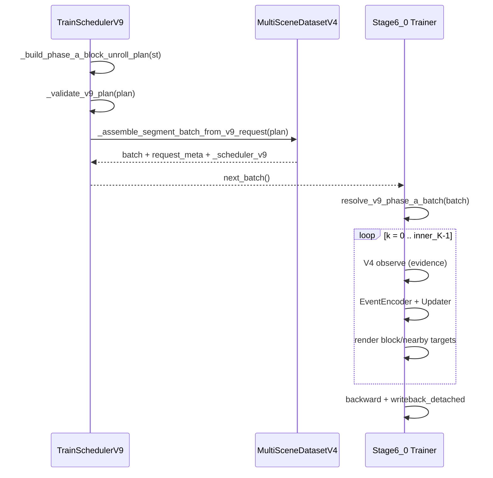

# StreetForward Stage6.0 Phase A 与 TrainScheduler V9 实现说明

## 文档目标

本文基于当前**暂存区（staged）改动**，说明：

1. `TrainSchedulerV9` 如何把训练 batch 拆成 **evidence / render-loss / query** 等角色；
2. `MinimalStreetForwardStage6_0` 如何在 **Phase A（block-local unroll）** 中消费这些 batch；
3. 各子模块（`LocalGSState`、Event Encoder、Posterior Updater、Role Resolver）如何协作。

阅读前提：熟悉 V7/V8 的 episode traversal（`step_major`、`blocks_per_episode`）。V9 **复用 V8 的遍历状态机**，但**完全接管 target 角色语义**，不再使用 V8 的 visited-frame target 扩展。

---

## 1. 暂存区改动总览

| 路径 | 性质 | 作用 |
|------|------|------|
| `datasets/train_scheduler_v9.py` | 修改 | P0 约束校验、`request_meta` 增强、batch 组装强制走 V9 专用路径 |
| `configs/stage6_0_phase_a.yaml` | 新增 | Phase A 端到端训练配置（`scheduler_v9` + `model.stage6_0`） |
| `models/streetforward/minimal_trainer_stage6_0.py` | 新增 | Stage6.0 Phase A 训练器 |
| `models/streetforward/stage6_0/*` | 新增 | 局部 GS 状态、事件编码、后验更新、V9 角色解析、损失 |
| `tools/train_minimal_streetforward_stage6_0_multi_scene_v9.py` | 新增 | 入口脚本（注入 `build_train_scheduler_v9_from_cfg`） |
| `tests/test_train_scheduler_v9.py` | 修改 | 覆盖 P0 校验与 `flat_non_evidence_refs` |
| `tests/test_minimal_stage6_0_phase_a.py` | 新增 | Resolver / 模块梯度 / forward 冒烟 |

**规模**：约 13 个文件、+2700 行（以 Phase A P0 为主，Phase B 配置占位但未在本 trainer 中执行）。

---

## 2. 架构总览

```text
MultiSceneDatasetV4
    └── _assemble_segment_batch_from_v9_request(v9_plan)
            ├── source_views / source_images  ← evidence refs（去重）
            └── targets[]                     ← block_loss + nearby_loss refs（带 role）

TrainSchedulerV9 (extends TrainSchedulerV8)
    ├── V8: episode 遍历、block 切换、preload hints
    └── V9: ViewSetRolloutBatchV9 + StepPlanV9 + request_meta（角色 + leakage_check）

MinimalStreetForwardStage6_0
    ├── resolve_v9_phase_a_batch(batch)  → 每步 evidence/target 索引
    ├── for k in inner_K:
    │       observe (V4 fused, no_grad) → EventEncoder → ContextAdapter → PosteriorUpdater
    │       render loss (block + nearby) + delta L2
    └── block_end_detached writeback → 持久 NodeState
```

**一句话**：Scheduler 决定「哪些 `(frame, cam)` 用于更新证据、哪些只用于渲染监督」；Trainer 在 **同一 block 内** 对局部 Gaussian 状态做 `inner_K` 步展开，每步用 evidence 观测、对 block/nearby target 算 loss。

---

## 3. TrainSchedulerV9

### 3.1 设计定位

```text
TrainSchedulerV9 = TrainSchedulerV8 的 episode traversal
                 + 显式 RefRole 拆分（evidence / block_loss / nearby_loss / prefix_loss / query_label / aux_loss）
                 + Phase A: block-local inner unroll
                 + Phase B: viewset rollout（本暂存区 trainer 未实现）
```

继承关系：`TrainSchedulerV9` → `TrainSchedulerV8` → `TrainSchedulerV7`。

初始化时**故意削弱 V8 target 语义**：

- `total_target_frames=1`
- `near_random_supervision_cfg={"enable": False}`
- `aux_feature_splat_targets_cfg={"enable": False}`

这样 V8 父类只负责「走到哪个 block、source frame 是谁」，**不再**生成 V8 风格的 visited target 列表。

### 3.2 核心数据结构

**`ImageRef`**：`(frame_idx, cam_idx)`。

**`RefRoleV9`**（逻辑角色）：

| 角色 | Phase A | Phase B | 训练语义 |
|------|---------|---------|----------|
| `evidence` | ✓ | ✓ | 允许更新证据（source 观测） |
| `block_loss` | ✓ | — | 仅渲染监督（source 帧全相机） |
| `nearby_loss` | ✓ | — | 同 keyframe 邻帧监督 |
| `prefix_loss` | — | ✓ | 前缀轨迹渲染监督 |
| `query_label` | — | ✓ | 标签-only，不进 evidence |
| `aux_loss` | 可选 | 可选 | 辅助 loss |

**`StepPlanV9`**：单个 inner step 的角色 ref 列表 + 帧索引摘要。

**`ViewSetRolloutBatchV9`**：一次 `next_batch()` 的完整计划：

- `inner_K`：本 batch 内展开步数（随机采样）
- `steps[]`：每步 `StepPlanV9`
- `*_refs_by_step`：按步拆分的 ref 列表（trainer 直接消费）
- `query_label_refs` / `aux_loss_refs`：batch 级（Phase B）
- `request_meta` / `leakage_check`：组装后写入 batch

### 3.3 两种 Phase

#### Phase A：`phase_A_block_local_unroll`

在**当前 scheduler step 固定的 source frame** 上，采样 `inner_K ∈ phase_a_inner_K_choices`（默认 `[2,4,6]`），每步：

1. **Evidence**：source frame 的**全部相机** → `evidence_refs`
2. **Block loss**：同一 source frame 全相机 → `block_loss_refs`（policy=`source_frame_all_cams`）
3. **Nearby loss**（可选）：同 keyframe 内邻帧，**仅最后一步**附加（`apply_final_step_only=true`）

邻帧采样 `_sample_phase_a_nearby_frames`：

1. 按 `adjacent_radius` 在 keyframe 帧序列里取左右邻帧；
2. 不足时用 `random_fill` 在同 keyframe 内补齐；
3. 排除 source 与已有 block_loss 帧；
4. `insufficient_policy=skip` 时候选不足则少采，不 fail。

**P0 硬约束**（构造时 `raise ValueError`）：

- `phase_A.mode=block_local_unroll`
- `repeat_block_iteration=true`
- `source_frame_policy=fixed_for_scheduler_step`
- nearby **不得**并入 evidence / source_image_refs / history
- `leakage_check.enable=true`

#### Phase B：`phase_B_viewset_rollout`

在 episode 内随机选 `K` 个 block 作为 event，每步：

- Evidence = 该 event 的 source frame
- **Prefix loss** = 当前帧 + 已写入帧中随机历史帧（`current_plus_random_previous`）
- Rollout 结束后在 event 时间跨度内采样 **held-out query** 帧（`heldout_inside_event_span`）

Phase B 要求 `reset_vsm_on_episode_end=true`、`vsm_scope=bg_static`。本暂存区 **未** 实现 Phase B trainer，但 scheduler 与 `request_meta` 已预留。

### 3.4 `request_meta` 与防泄漏

`_build_request_meta_v9` 产出 trainer/dataset 共用的元数据：

| 字段 | 含义 |
|------|------|
| `flat_evidence_refs` | 所有步 evidence 去重 |
| `flat_render_loss_refs` | block + nearby + prefix 去重（带 `target_image_roles`） |
| `flat_non_evidence_refs` | render + query + aux（**不含** evidence） |
| `flat_loss_refs` | 兼容字段，等同 `flat_non_evidence_refs`（注释标明勿当纯 render 监督） |
| `source_image_refs` | 同 evidence |
| `role_policy` | 各角色 `update_only` / `loss_only` / `label_only` |
| `mask_policy` | Phase A/B 各 mask 名 |
| `leakage_check` | 重叠计数、role 数量是否一致 |

`_validate_v9_plan` 在 materialize / next_batch 前检查：

- Phase A 无 query/prefix；Phase B 无 nearby
- nearby/query/aux 与 evidence 无交集（可配置）
- Phase A nearby 帧必须在 source keyframe 内
- train ref 不得来自 test split（若 dataset 支持 `validate_image_ref`）

### 3.5 Batch 组装路径（暂存区重要变更）

**之前**：`_batch_from_v9_plan` 可 fallback 到 `_assemble_segment_batch_from_image_refs(flat_evidence, flat_render_loss)`。

**现在**：**必须**存在 `dataset._assemble_segment_batch_from_v9_request`，否则 fast-fail。

`MultiSceneDatasetV4._assemble_segment_batch_from_v9_request` 逻辑：

1. 展平并去重 `evidence_refs`、`block+ nearby+ prefix`（带 role）
2. 调用 `_assemble_segment_batch_from_image_refs(evidence, loss_refs, ...)`
3. 写回 `request_meta`：`assembly_mode=image_ref_v9`、by-step refs、roles
4. 附加 `batch["_scheduler_v9"] = dataclasses.asdict(plan)`

Trainer **必须**用 `resolve_v9_phase_a_batch` 读 by-step 字段，不能只靠扁平 `target_image_refs`。

### 3.6 与训练循环的衔接

- `next_batch()`：plan → validate → assemble → 推进 block/episode 游标（与 V8 相同）
- `materialize_current_batch_without_advance()`：peek，带 `_scheduler_v9_peek=True`

`configs/stage6_0_phase_a.yaml` 中典型调度：

- `execution.block_order: step_major`
- `step_major_switch_interval_steps: 4`（每 4 个 global step 换一个 block）
- `phase_A.block.inner_K_choices: [2, 4, 6]`

---

## 4. Stage6.0 Phase A Trainer

### 4.1 类关系与刻意不启用的能力

`MinimalStreetForwardStage6_0(MinimalStreetForwardStage5_4)`：

| 复用 | 禁用 |
|------|------|
| V4 fused 2D 特征 / obs_code 测量 | `history_memory` |
| 多分支 GS 渲染（bg / distant / rigid） | `update_gate` |
| NodeState 初始化与 writeback | `view_transient` |
| | VSM、QueryDecoder |
| | Stage5.3/5.4 的 `train_step` 递推路径 |

**可训练参数**仅：`stage6_event_encoder`、`stage6_current_context_adapter`、`stage6_posterior_updater`。

V4 测量前端 **全部 `requires_grad=False`**，`detach_v4_outputs=true`，`source_evidence_grad_mode=no_grad_v4`。

父类初始化时通过 `_compat_stage5_4_config` 注入假的 `scheduler_v8` 块，只为满足 Stage5.4 构造；运行时要求 `scheduler_v9.enable=true` 且 `scheduler_v8.enable=false`。

### 4.2 `resolve_v9_phase_a_batch`（`v9_role_resolver.py`）

把 batch 中的 `request_meta` / `_scheduler_v9` 解析为 `ResolvedV9PhaseABatch`：

- 校验 `scheduler_version=v9`、`phase=phase_A_block_local_unroll`、`assembly_mode=image_ref_v9`
- 拒绝 `prefix_loss_refs`、`query_label_refs`
- 将每步 `evidence_*` / `block_*` / `nearby_*` ref 映射到 `batch["source_views"]` / `batch["targets"]` 的下标
- 校验 `target_image_roles ⊆ {block_loss, nearby_loss}`
- **防泄漏**：`nearby` ref 不得出现在 `evidence` 集合中

Trainer `forward()` 只通过该 resolver 获取每步索引，避免误用扁平 loss 列表。

### 4.3 `LocalGSState`（`local_gs_state.py`）

Block 内的**可微 Gaussian 副本**：

- 从持久 `NodeState*` clone 出 `LocalBranchState`（means/scales/quat/opacity/SH + `hidden`）
- `apply_delta(DeltaPack)`：按分支施加 PosteriorUpdater 输出的增量（含 quat 复合、clamp）
- `writeback_detached`：block 结束后把 detached 结果写回持久 node state（`block_end_detached`）
- `local_G_no_detach_between_steps`：inner 步之间 **不** detach local 状态，梯度可跨步传播

Rigid 分支保留 `rigid_template` 用于世界坐标变换与 `point_ids` 路由。

### 4.4 单步前向：`observe → encode → update → render loss`

```text
for k in 0..inner_K-1:
    1. _observe_v4_measurement(evidence indices, source_frame_idx)
         → feat_2d_*, acc_w_*, obs_code_*（全 detach）
    2. Stage6EventEncoder → EventPack（per-point event 向量）
    3. CurrentContextAdapter → ContextPack（ctx = f(event)，近恒等初始化）
    4. Stage6PosteriorUpdater(event, ctx) → DeltaPack
    5. local_state.apply_delta(delta)
    6. L_block  = render_loss(block_target_indices[k])
    7. L_nearby = w_nearby(k) * render_loss(nearby_target_indices[k])
    8. L_reg    = delta_l2_weight * ||delta||^2
    9. L_k      = step_gamma^(K-1-k) * (w_block * L_block + L_nearby + L_reg)
```

**Event Encoder 输入（每点）**：`z`（2D 特征）、`acc_w`、`obs_code`、`view_code`（Phase A 为零占位）、`param_embed`（GS 参数切片）、`branch_embed`。

**Posterior Updater**：`concat(event, ctx)` → MLP trunk → 各参数 head；输出经 `tanh` + `max_step_*` clamp；distant 分支 P0 默认不更新 means/scales/quat（配置校验）。

**渲染损失**（`phase_a_losses.py`）：masked L1 + 可选 SSIM；mask `non_sky_non_egocar` 与 scheduler `mask_policy` 对齐。

**Nearby 权重**：`nearby_weight * min(global_step / warmup_steps, 1)`，且仅 `k == K-1` 时非零（与 scheduler `apply_final_step_only` 一致）。

### 4.5 `train_step` 与日志

- `optimizer`：三组 AdamW，lr 可 per-module 配置
- `grad_clip` 默认开启
- 返回 `phaseA/loss_*`、`phaseA/block_psnr_k*` 等标量
- `build_phase_b_export_checkpoint()`：导出 measurement 前端 + event/updater 权重，供未来 Phase B 冻结初始化（文档性 API，Phase B trainer 未在本 PR）

### 4.6 配置锚点（`configs/stage6_0_phase_a.yaml`）

```yaml
scheduler_v9:
  phase: phase_A_block_local_unroll
  phase_A:
    block:
      inner_K_choices: [2, 4, 6]
    nearby_supervision:
      apply_final_step_only: true

model:
  stage: "6_0"
  phase: phase_A_block_local_unroll"
  stage6_0:
    base_measurement: { type: stage5_4_v4, detach_v4_outputs: true }
    local_rollout: { writeback_policy: block_end_detached }

losses:
  phase_a:
    block_render: { weight: 1.0, step_gamma: 0.8 }
    nearby_render: { weight: 0.25, warmup_steps: 2000 }
```

---

## 5. 端到端数据流（Phase A）



---

## 6. 测试与运行

**Scheduler 测试**（`tests/test_train_scheduler_v9.py`）：

- Phase A/B plan 结构、nearby 仅末步、query 与 evidence 不重叠
- P0 非法配置拒绝
- `flat_non_evidence_refs` 与 role 计数

**Trainer 测试**（`tests/test_minimal_stage6_0_phase_a.py`）：

- Resolver 索引映射与多种非法 batch
- Event/Updater 梯度可达
- LocalGSState apply/writeback

**启动训练**：

```bash
python tools/train_minimal_streetforward_stage6_0_multi_scene_v9.py \
  --config configs/stage6_0_phase_a.yaml
```

---

## 7. 与 V8 文档的对照

| 维度 | V8 | V9 Phase A |
|------|----|------------|
| Target 来源 | 当前 + visited episode frames | 固定 roles：block=source 帧，nearby=邻帧 |
| 展开 | 每 scheduler step 一次 forward | 每 batch `inner_K` 步 local unroll |
| 状态更新 | Stage5.x 全链路 | 仅 PosteriorUpdater 改 local_G |
| Query | 无 | Phase B 才有 |
| Batch meta | `target_image_refs` | + `*_refs_by_step` + `role_policy` + leakage |

更完整的 V8 遍历语义见 [`TrainScheduler_V8_Design.md`](../dataloader/TrainScheduler_V8_Design.md)。

---

## 8. 后续扩展（未在暂存区实现）

1. **Phase B trainer**：消费 `prefix_loss_refs_by_step`、`query_label_refs`、VSM reset；
2. **Phase A**：`apply_every_step` 的 nearby、nearby 并入 evidence；
3. **Phase B**：非 `heldout_inside_event_span` 的 query 策略。

当前代码对以上路径多为 **构造期或 resolver 层 fast-fail**，避免半实现状态 silently 训练。

---

## 9. 关键文件索引

| 组件 | 文件 |
|------|------|
| Scheduler V9 | `datasets/train_scheduler_v9.py` |
| Dataset 组装 | `datasets/multi_scene_dataset_v4.py` → `_assemble_segment_batch_from_v9_request` |
| V9 工厂 | `tools/train_minimal_streetforward_stage4_3_v9_common.py` → `build_train_scheduler_v9_from_cfg` |
| Phase A Trainer | `models/streetforward/minimal_trainer_stage6_0.py` |
| Role 解析 | `models/streetforward/stage6_0/v9_role_resolver.py` |
| 局部状态 | `models/streetforward/stage6_0/local_gs_state.py` |
| 事件 / 更新 | `stage6_0/event_encoder.py`, `posterior_updater.py` |
| 损失 | `stage6_0/phase_a_losses.py` |
| 配置 | `configs/stage6_0_phase_a.yaml` |
