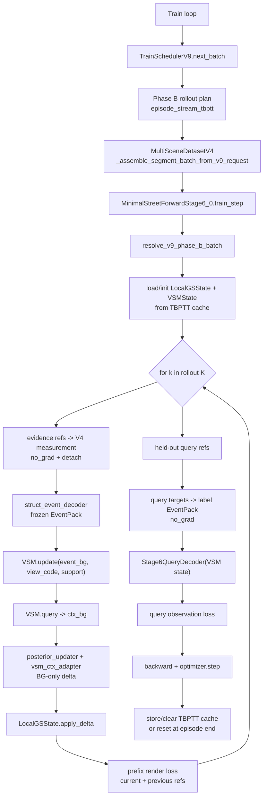

# StreetForward Stage6_0 Phase B 流程梳理

本文参考 `models/streetforward/minimal_trainer_stage6_0.py` 与 `configs/stage6_0_phase_b.yaml`，梳理 Stage 6_0 Phase B 的训练流程、关键数据结构、主要组件，并对比 Stage 5_4、Stage 6_0 Phase A 与 Phase B。

---

## 1. Phase B 定位

Stage 6_0 Phase B 的配置入口是：

- `model.stage: "6_0"`
- `model.phase: "phase_B_viewset_rollout"`
- `scheduler_v9.phase: phase_B_viewset_rollout`

它不是继续训练 Stage 5_4 的 GRU/history/update gate 主链，也不是 Phase A 的 block-local updater 训练。Phase B 的核心目标是：

1. 使用冻结的 Stage 5_4 V4 measurement + 冻结的 `struct_event_decoder` 产生 BG event。
2. 将 episode 内多步 evidence event 写入 `Stage6ViewSetMemory`。
3. 通过 VSM query context 调制冻结 base 的 posterior updater，只训练 VSM、query decoder、`vsm_ctx_adapter`。
4. 用 prefix render loss 约束已观测 prefix 的可渲染状态，用 held-out query observation loss 约束 VSM 对未写入视角的预测能力。

---

## 2. 端到端流程




一次 `train_step` 的主线：

1. `scheduler_v9` 选取一段 episode 内的 event blocks，生成 `evidence_refs_by_step`、`prefix_loss_refs_by_step`、`query_label_refs` 与 `request_meta.tbptt`。
2. dataset 将 evidence 装入 `source_views/source_images`，将 prefix 装入 `targets`，将 query label 装入 `query_targets/query_label`。
3. trainer 使用 `resolve_v9_phase_b_batch` 做角色、顺序、泄漏 fast-fail 校验。
4. 每个 rollout step 用 evidence 计算 frozen V4 measurement 与 frozen struct event，再更新 VSM、查询 VSM context、更新 BG local state。
5. 每步渲染 prefix refs，最后对 held-out query refs 计算 query observation label，训练 VSM 与 query 相关模块。
6. strict TBPTT 下，中间 chunk 只写入 `stage6_phase_b_tbptt_cache`；last chunk 才允许清 cache 并配合 scheduler reset。

---

## 3. Scheduler V9 Phase B

当前 `configs/stage6_0_phase_b.yaml` 的关键调度参数：


| 配置                                                 | 值                                          | 含义                                           |
| -------------------------------------------------- | ------------------------------------------ | -------------------------------------------- |
| `block.steps_per_block`                            | `1`                                        | strict `episode_stream_tbptt` 要求每个 block 一步  |
| `episode.blocks_per_episode`                       | `12`                                       | 单个 episode 最多 12 个 event block               |
| `rollout.mode`                                     | `episode_stream_tbptt`                     | 顺序流式展开，跨 batch 由 TBPTT cache 承接              |
| `rollout.K_choices`                                | `[2, 4]`                                   | 初始 rollout chunk 长度                          |
| `rollout.curriculum`                               | `20k: [4,6]`, `60k: [6,8]`, `120k: [8,12]` | 随训练推进增加长程依赖                                  |
| `rollout.sample_event_frames`                      | `sequential_blocks_in_episode`             | 以 episode block 顺序推进                         |
| `rollout.event_order`                              | `chronological`                            | event 按时间顺序写入 VSM                            |
| `prefix_render.policy`                             | `current_plus_random_previous`             | 每步监督当前帧，并抽样历史已写入帧                            |
| `prefix_render.intermediate_views` / `final_views` | `2` / `3`                                  | 中间步和最后步的 prefix frame 数上限                    |
| `query_observation.query_frame_policy`             | `heldout_inside_event_span`                | 在 event span 内采样未写入帧作为 query label           |
| `query_observation.cameras_per_frame`              | `all_cams`                                 | query frame 使用所有相机                           |
| `masks.*`                                          | `valid_non_sky_non_egocar_non_dynamic`     | evidence/prefix/query 均排除 sky、egocar、dynamic |


### 3.1 Phase A vs Phase B Scheduler 差异


| 维度                   | Phase A Scheduler                                                             | Phase B Scheduler                                                              |
| -------------------- | ----------------------------------------------------------------------------- | ------------------------------------------------------------------------------ |
| `scheduler_v9.phase` | `phase_A_block_local_unroll`                                                  | `phase_B_viewset_rollout`                                                      |
| 核心抽象                 | 在一个 block/source frame 内做 local unroll                                        | 在一个 episode 内采样或顺序推进多个 event blocks                                            |
| rollout 来源           | `phase_A.block.inner_K_choices`                                               | `phase_B.rollout.K_choices` + `curriculum`                                     |
| 当前配置 K               | `[2,4,6,8]` 等概率采样                                                             | 初始 `[2,4]`，20k/60k/120k 后逐步到 `[8,12]`                                          |
| block 数              | `blocks_per_episode=8`                                                        | `blocks_per_episode=12`                                                        |
| event frame 选择       | 每个 scheduler step 固定当前 block 的 source frame，K 次重复使用                           | strict TBPTT 下从 episode cursor 开始顺序选 K 个 block/source frame                    |
| source frame policy  | `fixed_for_scheduler_step`                                                    | `sequential_blocks_in_episode` + `chronological`                               |
| role 输出              | `evidence`、`block_loss`、`nearby_loss`                                         | `evidence`、`prefix_loss`、`query_label`                                         |
| evidence 语义          | 每个 inner step 看到同一个 source frame 的 all cams                                   | 每个 rollout step 写入一个新的 event frame all cams                                    |
| render supervision   | 每步 `block_loss` 是 source frame all cams；final step 可加 `nearby_loss`           | 每步 `prefix_loss` 是当前 frame + 已写入历史 frame 的子集                                   |
| held-out query       | Scheduler 禁止输出 query refs                                                     | Scheduler 在 event span 内采样未写入 frame 作为 `query_label`                           |
| 历史/记忆语义              | 不跨 batch 维护 scheduler rollout 记忆；状态靠 trainer 的 local unroll 和 block writeback | Scheduler 输出 TBPTT meta，trainer 必须跨 batch cache `LocalGSState + VSMState`      |
| reset 边界             | `reset_policy=episode_end`，Phase A local rollout 每个 batch 内自洽                 | strict TBPTT 只允许 last chunk/episode end reset；非 last chunk 必须 cache continuity |
| 泄漏重点                 | `nearby_loss` 不得进入 evidence，Phase A 不允许 prefix/query                          | `query_label` 不得进入 evidence/source/target，也不得与已写 VSM refs 重叠                   |
| dataset 组装           | evidence -> `source_views`；block/nearby -> `targets`                          | evidence -> `source_views`；prefix -> `targets`；query -> `query_targets`        |


Phase B 的角色语义：


| 角色            | batch 位置                         | 作用                            | 是否写 VSM | 是否算 render loss | 是否作为 query label |
| ------------- | -------------------------------- | ----------------------------- | ------- | --------------- | ---------------- |
| `evidence`    | `source_views` / `source_images` | 产生 V4 measurement 和 BG event  | 是       | 否               | 否                |
| `prefix_loss` | `targets`                        | 渲染监督当前与历史 prefix              | 否       | 是               | 否                |
| `query_label` | `query_targets` / `query_label`  | 生成 held-out observation label | 否       | 否               | 是                |


泄漏约束由 scheduler、dataset、resolver、trainer 多层校验：

- `query_label_refs` 不得进入 evidence/source/target。
- `query_label_refs` 不得与已写入 VSM 的 refs 重叠。
- Phase B 禁止 `block_loss_refs` 与 `nearby_loss_refs`。
- strict TBPTT 要求 chunk 连续、event frame 跨 chunk 严格递增，非首 chunk 必须 cache hit。

---

## 4. 关键数据

### 4.1 `request_meta`

`scheduler_v9` 在 `request_meta` 中写入以下 Phase B 关键字段：


| 字段                                             | 形状/类型                      | 说明                                                           |
| ---------------------------------------------- | -------------------------- | ------------------------------------------------------------ |
| `scheduler_version` / `scheduler_phase`        | string                     | 必须是 `v9` / `phase_B_viewset_rollout`                         |
| `inner_K`                                      | int                        | 本次 rollout chunk 的 step 数                                    |
| `evidence_refs_by_step`                        | `List[List[(frame, cam)]]` | 每步 evidence refs，后续映射到 `source_views`                        |
| `prefix_loss_refs_by_step`                     | `List[List[(frame, cam)]]` | 每步 prefix render refs，后续映射到 `targets`                        |
| `query_label_refs`                             | `List[(frame, cam)]`       | held-out query label refs，后续映射到 `query_targets`              |
| `source_image_refs`                            | `List[(frame, cam)]`       | 去重后的 evidence refs                                           |
| `target_image_refs` / `target_image_roles`     | refs + role list           | Phase B 中 role 必须全部是 `prefix_loss`                           |
| `flat_evidence_refs` / `flat_render_loss_refs` | refs                       | resolver 用于确认 batch 展平结果与 by-step refs 一致                    |
| `role_policy` / `role_groups`                  | dict/list                  | 明确 update-only、loss-only、label-only 的权限                      |
| `tbptt`                                        | dict                       | strict TBPTT 的 chunk index、event frames、prior written frames |
| `leakage_check`                                | dict                       | query/evidence/aux overlap 统计与策略开关                           |


### 4.2 `ResolvedV9PhaseBBatch`

`resolve_v9_phase_b_batch` 将 `request_meta` 映射到 trainer 可直接消费的 batch indices：


| 字段                                | 说明                                         |
| --------------------------------- | ------------------------------------------ |
| `inner_K`                         | rollout step 数                             |
| `evidence_refs_by_step`           | 每步 source refs                             |
| `prefix_loss_refs_by_step`        | 每步 prefix render refs                      |
| `query_label_refs`                | held-out query refs                        |
| `evidence_source_indices_by_step` | evidence ref 到 `batch["source_views"]` 的下标 |
| `prefix_target_indices_by_step`   | prefix ref 到 `batch["targets"]` 的下标        |
| `query_target_indices`            | query ref 到 `batch["query_targets"]` 的下标   |
| `request_meta`                    | 原始 meta，供 TBPTT 与日志继续使用                    |


### 4.3 TBPTT cache

trainer 使用 `(scene_id, segment_id, episode_id, stream_id)` 作为 key，保存：


| 字段                     | 说明                                                     |
| ---------------------- | ------------------------------------------------------ |
| `local_G`              | detached `LocalGSState`，保存当前 BG/distant/rigid local 状态 |
| `vsm`                  | detached `Stage6VSMState`                              |
| `written_refs`         | 已写入 VSM 的 evidence refs，用于 query 泄漏检查                  |
| `last_event_frame_idx` | 上一 chunk 的最大 event frame                               |
| `next_chunk_idx`       | 下一次期望的 TBPTT chunk index                               |


当前配置 `stage6_0.local_rollout.writeback_policy=tbptt_cache_only`，因此 Phase B 不把中间 local rollout 状态直接写回持久 node state，而是依赖 TBPTT cache 保持流式状态。

### 4.4 Phase B TBPTT vs Phase A 迭代

Phase A 的 `inner_K` 更像是一次 batch 内的局部优化展开：scheduler 给同一个 block/source frame，trainer 在内存里连续做 K 次 measurement -> event -> posterior update -> render loss。这个 K 步链条在一次 `train_step` 内完整反传，结束后按 `block_end_detached` 把 local state detached 写回 node state。下一次 batch 不依赖上一次 Phase A inner loop 的计算图，也没有 VSM 的跨 batch 记忆。

Phase B 的 TBPTT 是 episode 流式训练：一个 episode 的 12 个 event block 可能被拆成多个 chunk，每个 chunk 是一次 `train_step`。每个 chunk 内只对当前 K 个 event 做反传；chunk 结束后把 `LocalGSState` 和 `Stage6VSMState` detach 后放进 `stage6_phase_b_tbptt_cache`，下一个 chunk 再从 cache 继续。这就是 truncated BPTT：保留状态连续性，但截断跨 chunk 的梯度。


| 维度                  | Phase A inner iteration                        | Phase B strict TBPTT                                     |
| ------------------- | ---------------------------------------------- | -------------------------------------------------------- |
| 一个 `train_step` 的含义 | 完整的 block-local K 步 unroll                     | episode stream 的一个 chunk                                 |
| K 步是否跨 batch        | 不跨 batch                                       | episode 可跨多个 batch/chunk                                 |
| K 步 source          | 同一 source frame 重复观测                           | K 个按时间推进的 event frames                                   |
| 状态初始化               | 从 persistent node state clone 出 `LocalGSState` | 首 chunk 从 node state 初始化，后续 chunk 从 TBPTT cache 恢复       |
| 状态保存                | step 末可 detached writeback 到 node state        | 非 last chunk detached 保存到 TBPTT cache                    |
| 梯度范围                | 覆盖当前 batch 内全部 K 步                             | 只覆盖当前 chunk，跨 chunk 状态 detach                            |
| 记忆模块                | 无 VSM                                          | VSM state 随 episode chunk 流式更新                           |
| loss 时机             | 每步 `block_loss`，通常 final step 加 `nearby_loss`  | 每步 `prefix_loss`，chunk 末加 held-out `query_loss`          |
| 泄漏检查目标              | nearby 不能进 evidence                            | query 不能进 evidence/source/target，也不能命中已写 VSM refs        |
| reset 语义            | episode end 可 reset node state                 | strict 模式下只有 last chunk/episode end 才能 reset/cache clear |


直观理解：

- Phase A 训练的是“同一个局部 block 被连续修正 K 次后能不能变好”。
- Phase B 训练的是“一个 episode 里按时间看到多帧 evidence 后，VSM 能否把这些观测压进记忆，并支持后续 BG 更新与 held-out query 预测”。

---

## 5. 关键组件


| 组件                               | 文件                                                      | Phase B 职责                                                               |
| -------------------------------- | ------------------------------------------------------- | ------------------------------------------------------------------------ |
| `TrainSchedulerV9`               | `datasets/train_scheduler_v9.py`                        | 生成 Phase B rollout plan、prefix/query refs、TBPTT meta 与 leakage metadata  |
| `MultiSceneDatasetV4`            | `datasets/multi_scene_dataset_v4.py`                    | 按 V9 plan 组装 source/target/query 三类 batch 数据                             |
| `resolve_v9_phase_b_batch`       | `models/streetforward/stage6_0/v9_role_resolver.py`     | fast-fail 校验角色、顺序、泄漏，并建立 refs 到 batch 下标的映射                              |
| `MinimalStreetForwardStage6_0`   | `models/streetforward/minimal_trainer_stage6_0.py`      | 执行 Phase B forward、loss、optimizer、TBPTT cache 管理                         |
| `Stage6RoutedStructEventDecoder` | `models/streetforward/stage6_0/struct_event_decoder.py` | 冻结的 near xCPE / far MLP event 生成器                                        |
| `Stage6ViewSetMemory`            | `models/streetforward/stage6_0/vsm.py`                  | 对 BG event 做 token/proto/global memory update，并为当前/query view 提供 context |
| `Stage6QueryDecoder`             | `models/streetforward/stage6_0/vsm.py`                  | 从 VSM query context 预测 held-out BG event、visibility、support、obs code     |
| `Stage6PosteriorUpdater`         | `models/streetforward/stage6_0/posterior_updater.py`    | Phase B 冻结 base，仅训练 `vsm_ctx_adapter`，通过 VSM context 调制 BG delta         |
| `LocalGSState`                   | `models/streetforward/stage6_0/local_gs_state.py`       | 保存 rollout 内可微局部 Gaussian 状态                                             |


Phase B 的 trainability 在 trainer 初始化后强制收敛到较小范围：


| 模块                                  | Phase B 状态                |
| ----------------------------------- | ------------------------- |
| V4 measurement frontend             | 冻结，`no_grad_v4`，输出 detach |
| `struct_event_decoder`              | 冻结                        |
| `posterior_updater` base            | 冻结                        |
| `posterior_updater.vsm_ctx_adapter` | 可训练，LR `3e-4`             |
| `Stage6ViewSetMemory`               | 可训练，LR `1e-3`             |
| `Stage6QueryDecoder`                | 可训练，LR `1e-3`             |
| distant / rigid updater scope       | P0 禁用，仅 BG 更新             |


---

## 6. Loss 与日志

Phase B 的总 loss：

```text
L = Σ_k step_weight(k) * (prefix_weight * L_prefix(k) + L_delta_reg(k))
    + query_weight(global_step) * L_query
```

关键配置：


| Loss               | 配置                                 | 说明                                                             |
| ------------------ | ---------------------------------- | -------------------------------------------------------------- |
| prefix render      | `weight=1.0`, `l1=0.8`, `ssim=0.2` | 每步对 prefix refs 做静态区域渲染监督                                      |
| prefix step weight | `late_heavy_linear`                | 后续 rollout step 权重更高                                           |
| query observation  | `weight=0.05`, `warmup_steps=5000` | warmup 后监督 held-out query                                      |
| query event        | `event_bg_weight=1.0`              | 预测 BG event                                                    |
| query visible      | `visible_weight=0.2`               | 预测 BG visibility                                               |
| query support      | `support_weight=0.2`               | 预测 support log                                                 |
| query obs code     | `obs_code_weight=0.1`              | 预测 V4 obs code                                                 |
| regularization     | `delta_norm_weight=0.001`          | 仅 delta norm，Phase B 不启用 Phase A 的 opacity/sh/scale barrier 组合 |


主要日志面包括：

- `phase_b/prefix_*`: prefix loss、L1、SSIM、PSNR、valid ratio。
- `phase_b/query_*`: query loss、event L1、visible BCE/acc、support/obs code L1。
- `phase_b/vsm_*`: token usage、router entropy、update count、ctx norm。
- `phase_b/tbptt_*`: cache hit、cache size、chunk idx、last chunk 标志。
- `phase_b/leak/*`: query 与 evidence/written refs 的 overlap 计数。
- `stage6/inner_K`、`phase_b/rollout_K`: 当前 rollout chunk 长度。

---

## 7. Stage 5_4 vs Stage 6_0 Phase B


| 维度         | Stage 5_4 Production                                                                 | Stage 6_0 Phase B                                                         |
| ---------- | ------------------------------------------------------------------------------------ | ------------------------------------------------------------------------- |
| 配置入口       | `model.stage: "5_4"`                                                                 | `model.stage: "6_0"`, `model.phase: phase_B_viewset_rollout`              |
| Scheduler  | `scheduler_v8`                                                                       | `scheduler_v9` Phase B                                                    |
| Episode 结构 | `steps_per_block=12`, `blocks_per_episode=5`, `total_target_frames=3`                | `steps_per_block=1`, `blocks_per_episode=12`, rollout `K` 由 curriculum 控制 |
| Target 语义  | source + visited episode frames，另有 `near_random`                                     | evidence / prefix_loss / query_label 三角色分离                                |
| 时序状态       | GRU hidden + history memory + update gate + view transient                           | `Stage6ViewSetMemory` + `LocalGSState` + TBPTT cache                      |
| 观测前端       | V4 fused backproject，`obs_code` 输入 struct/far/GRU/history gate                       | 复用 V4，但 Phase B 冻结并 detach measurement                                    |
| 结构解码       | `struct_decoder` 输出 `gru_input`                                                      | `struct_event_decoder` 输出 EventPack，Phase B 中冻结                           |
| 更新器        | Stage 5 recurrent update 主链                                                          | `posterior_updater` base 冻结，仅 `vsm_ctx_adapter` 可训                        |
| 可训练范围      | 2D frontend、struct decoder、gate/history、recurrent update 等按 optimizer group 训练       | 仅 VSM、QueryDecoder、VSM ctx adapter                                        |
| 分支范围       | BG / distant / rigid 都在 Stage 5 主链中参与                                                | P0 仅 BG 更新，distant/rigid updater scope 禁用                                 |
| Loss       | RGB/SSIM/mask 等 target render loss，target view weights 区分 source/visited/near_random | prefix render loss + query observation loss + delta norm                  |
| 防泄漏        | 主要依赖 V8 target 构造                                                                    | 显式 `leakage_check`、role policy、resolver、TBPTT written refs 校验             |
| 写回策略       | block/episode 状态按 Stage 5 runtime 规则维护                                               | strict TBPTT 中间 chunk 只写 cache，episode end/reset 时清理                      |
| 主要训练目的     | 生产主模型的多视角 recurrent Gaussian 更新                                                      | 训练 view-set memory 对多步 evidence 的聚合与 held-out query 预测能力                  |


---

## 8. Phase A vs Phase B


| 维度                                | Stage 6_0 Phase A                                        | Stage 6_0 Phase B                                     |
| --------------------------------- | -------------------------------------------------------- | ----------------------------------------------------- |
| 配置文件                              | `configs/stage6_0_phase_a.yaml`                          | `configs/stage6_0_phase_b.yaml`                       |
| `model.phase`                     | `phase_A_block_local_unroll`                             | `phase_B_viewset_rollout`                             |
| 训练目标                              | 学习 struct event -> posterior updater 的 local unroll 更新能力 | 学习 VSM 聚合多步 evidence，并通过 VSM context/query 预测支撑 BG 更新 |
| Scheduler mode                    | block-local unroll                                       | episode stream TBPTT                                  |
| Block/Episode                     | `blocks_per_episode=8`, `steps_per_block=1`              | `blocks_per_episode=12`, `steps_per_block=1`          |
| K 采样                              | `inner_K_choices=[2,4,6,8]`                              | 初始 `[2,4]`，curriculum 到 `[8,12]`                      |
| Evidence                          | 单 block 内固定 source frame                                 | episode 内顺序 event frames                              |
| Render supervision                | `block_loss` 每步 + final-step `nearby_loss`               | `prefix_loss` 每步，当前 + 历史已写入帧                          |
| Query supervision                 | 禁用                                                       | 启用 held-out query observation                         |
| VSM                               | 禁用                                                       | 启用，scope=`bg_static`                                  |
| QueryDecoder                      | 禁用                                                       | 启用                                                    |
| `posterior_updater.input_vsm_ctx` | `false`                                                  | `true`                                                |
| Measurement frontend              | `from_scratch` 配置中 residual/fusion 可训，DINO/V4 lift 禁训    | 完全冻结，`source_evidence_grad_mode=no_grad_v4`           |
| Struct event decoder              | 可训练                                                      | 冻结                                                    |
| Posterior updater                 | 可训练，BG/distant/rigid scope 可启用                           | base 冻结，仅 VSM ctx adapter 可训；P0 仅 BG                  |
| Local state writeback             | `block_end_detached`                                     | `tbptt_cache_only`                                    |
| Loss 组成                           | `block_render + nearby_render + delta_regularization`    | `prefix_render + query_observation + delta_norm`      |
| Mask                              | `non_sky_non_egocar`                                     | `valid_non_sky_non_egocar_non_dynamic`                |
| Validation                        | `validation_v9.enable=true`，Phase A runner 已配置           | `validation_v9.enable=false`，trainer fast-fail 要求关闭   |
| 主要风险点                             | updater/struct decoder 的局部展开稳定性                          | TBPTT 连续性、query 泄漏、VSM collapse、prefix/query 目标错位     |


---

## 9. 阅读顺序建议

1. `configs/stage6_0_phase_b.yaml`：先看 `scheduler_v9.phase_B`、`model.stage6_0`、`losses.phase_b`、`optimizer.lr`。
2. `datasets/train_scheduler_v9.py`：看 `_build_phase_b_rollout_plan`、`_select_event_blocks_sequential`、`_build_request_meta_v9`。
3. `datasets/multi_scene_dataset_v4.py`：看 `_assemble_segment_batch_from_v9_request`。
4. `models/streetforward/stage6_0/v9_role_resolver.py`：看 `resolve_v9_phase_b_batch`。
5. `models/streetforward/minimal_trainer_stage6_0.py`：看 `_forward_phase_b` 与 `_train_step_phase_b`。
6. `models/streetforward/stage6_0/vsm.py`：看 `Stage6ViewSetMemory` 与 `Stage6QueryDecoder`。

