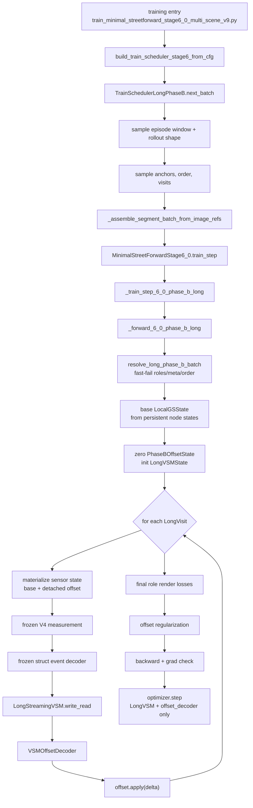

# StreetForward Stage6_0 Phase B Long 当前流程梳理

本文参考 `models/streetforward/minimal_trainer_stage6_0.py`、`configs/stage6_0_phase_b.yaml`、`datasets/train_scheduler_long_phase_b.py` 与 `models/streetforward/stage6_0/phase_b_long/`，梳理当前 Stage 6 Phase B 的训练流程、关键组件与数据结构。

当前主线是 `model.phase: "6_0_phase_b"` + `scheduler_long_phase_b.version: long_v1`。仓库里仍保留旧的 `phase_B_viewset_rollout` / `scheduler_v9` Phase B 路径，但当前配置与 trainer 分支走的是 Long Phase B。

---

## 1. 当前 Phase B 定位

Long Phase B 的目标不是继续训练 Stage 5_4 主链，也不是旧 Phase B 的 query decoder / prefix loss / TBPTT cache。它的核心目标是：

1. 复用并冻结 Phase A 导出的 measurement frontend、`struct_event_decoder`、`param_obs_codec` 与 posterior updater base。
2. 对一个 episode window 采样多个 anchor frame，每个 anchor 可重复观测若干次，得到一段 Long rollout。
3. 每个 rollout step 用 frozen V4 measurement + frozen struct event 生成 BG / rigid / distant event。
4. 用 `LongStreamingVSM` 以 selective SSM 形式写入观测事件，并读出 BG / rigid memory。
5. 用 `VSMOffsetDecoder` 将 VSM readout 解码成可累积的 `PhaseBOffsetState`。
6. 只在 rollout 结束后对 final history / final current 的 recon 与 NVS refs 做 render loss，再加 offset regularization。

当前 Long V1 明确禁用：

- `model.stage6_0.phase_b_long.query_decoder.enable`
- `losses.phase_b_long.query_observation.enable`
- `losses.phase_b_long.per_step_prefix_render.enable`
- `losses.phase_b_long.nearby_render.enable`
- distant offset decoding（`distant.mode` 必须是 `frozen_render_only`）
- old V9 的 `prefix_loss_refs_by_step`、`query_label_refs`、`block_loss_refs_by_step`

---

## 2. 端到端流程



一次训练 step 的具体含义：

1. `TrainSchedulerLongPhaseB` 选定一个 `LongEpisodeWindow`，包含 `scene_id`、`segment_id`、`frame_pool`、`cam_pool`、rigid/distant meta 与 rollout budget。
2. scheduler 按 `rollout_shapes_schedule` 采样 shape，例如 `r2_a2`、`r4_a4`、`r4_a8`、`r8_a4`，其中 `inner_K = repeats_per_anchor * anchors_per_rollout`。
3. scheduler 从 window 的 frame pool 里采样 anchor frames，再按 chronological / reverse / random 排序策略得到 rollout order。
4. 每个 anchor 选择 evidence camera，并展开成 `LongVisit` 序列；每个 visit 对应一个 `(frame_idx, cam_idx)` evidence ref。
5. scheduler 采样最终监督 refs：history anchors 的 recon/NVS，以及 terminal anchor 的 current recon/NVS。
6. dataset 按 image refs 组装 batch，evidence refs 进入 `source_views`，final refs 进入 `targets`，并把完整 meta 写入 `request_meta` 与 `_scheduler_long_phase_b`。
7. trainer 解析 batch、逐 visit 写 VSM、累积 offset，最后渲染 final roles，反传只更新 Long VSM 与 offset decoder。

---

## 3. 配置入口

当前 `configs/stage6_0_phase_b.yaml` 的主入口：

| 配置 | 当前值 | 含义 |
| --- | --- | --- |
| `model.stage` | `"6_0"` | 使用 Stage6_0 trainer |
| `model.phase` | `"6_0_phase_b"` | 进入 Long Phase B 分支 |
| `scheduler_long_phase_b.enable` | `true` | 使用 Long scheduler |
| `scheduler_long_phase_b.version` | `long_v1` | 当前 Long V1 协议 |
| `scheduler_long_phase_b.phase` | `6_0_phase_b` | scheduler 与 model phase 必须一致 |
| `validation_long_phase_b.enable` | `true` | 使用 Long validation |
| `validation_v9.enable` | 必须关闭 | Long Phase B 不走 V9 validation |

初始化依赖：

| 配置 | 作用 |
| --- | --- |
| `initialization.phase_b_from_phase_a.enable` | 从 Phase A checkpoint 初始化 |
| `export_type: stage6_0_phase_a_for_phase_b` | 推荐的 Phase A export 类型 |
| `load_modules.measurement_frontend` | 加载 frozen V4 measurement frontend |
| `load_modules.struct_event_decoder` | 加载 frozen event decoder |
| `load_modules.param_obs_codec` | 加载 param/obs 编码权重 |
| `load_modules.posterior_updater_base` | 加载 frozen posterior updater base；Long V1 forward 不使用 updater 更新 local state |
| `train_new_modules.long_vsm` | 训练新 Long VSM |
| `train_new_modules.offset_decoder` | 训练新 offset decoder |

trainability 在 `_configure_stage6_trainability_after_module_init()` 里强制收敛：

| 模块 | Long Phase B 状态 |
| --- | --- |
| V4 measurement frontend | 冻结，`no_grad_v4`，输出 detach |
| `stage6_struct_event_decoder` | 冻结 |
| `stage6_posterior_updater` | 冻结，Long V1 forward 不走 updater |
| `stage6_vsm` / `stage6_query_decoder` | 旧 Phase B 模块，当前配置不启用 |
| `stage6_long_vsm` | 可训练 |
| `stage6_long_offset_decoder` | 可训练 |

optimizer 只会为 `long_vsm` 与 `offset_decoder` 建立有效参数组；当前配置二者 LR 都是 `3.0e-4`，其他 Stage6 相关 LR 为 `0.0`。

---

## 4. Scheduler Long Phase B

`TrainSchedulerLongPhaseB` 是独立于 V8/V9 block 语义的 Long scheduler。它把一次训练样本定义为一个 Long rollout，而不是一个 V9 block。

### 4.1 Episode Window

`LongEpisodeWindow` 是采样池：

| 字段 | 说明 |
| --- | --- |
| `scene_id` / `segment_id` | 当前训练 scene 与 segment |
| `frame_pool` | 当前 window 可采样的 frame 列表 |
| `cam_pool` | segment 的相机列表 |
| `segment_start_frame` / `segment_end_frame` | 用于归一化时间编码 |
| `rigid_meta` | rigid long memory 与 stable id 约束 |
| `distant_meta` | distant 分支模式，当前为 `frozen_render_only` |
| `rollout_budget` | 一个 window 内可产生多少个 rollout |

当前配置的关键 window 策略：

| 配置 | 当前值 | 含义 |
| --- | --- | --- |
| `frames_per_window` | `24` | 每个 window 最多覆盖 24 帧 |
| `min_frames_required` | `8` | 少于 8 帧 fast-fail |
| `frame_pool_policy` | `contiguous_window` | 从 segment 里取连续帧池 |
| `rollout_budget_per_episode` | `4` | 一个 episode window 内采样 4 个 rollout |

### 4.2 Rollout Shape 与 Anchor

`LongRolloutShape` 由 `repeats_per_anchor` 和 `anchors_per_rollout` 决定：

```text
inner_K = repeats_per_anchor * anchors_per_rollout
```

当前 schedule：

| start step | shapes |
| --- | --- |
| `0` | `r2_a2` |
| `1000` | `r4_a4` |
| `5000` | `r4_a8` / `r8_a4` / `r6_a5` |

anchor 采样约束：

| 配置 | 当前值 | 说明 |
| --- | --- | --- |
| `policy` | `random_without_replacement` | anchor frame 不重复采样 |
| `min_temporal_span` | `6` | anchor 跨度至少 6 帧 |
| `max_temporal_span` | `48` | anchor 跨度最多 48 帧 |
| `min_pairwise_gap` | `1` | anchor 间至少间隔 1 |
| `order_prob_schedule` | step 递进到更多 random | 训练后期主要打乱时序顺序 |

每个 `LongVisit` 记录一个具体观测 step：

| 字段 | 说明 |
| --- | --- |
| `step_idx` | rollout 内 step index |
| `anchor_id` | rollout order 下的 anchor id |
| `frame_idx` / `cam_idx` | evidence 图像 ref |
| `repeat_idx` | 同一个 anchor 的第几次重复观测 |
| `rollout_order_rank` | 当前观测在 rollout order 中的位置 |
| `chronological_rank` | 当前 frame 在时间顺序中的位置 |
| `visit_pos_code` | `step_idx` 归一化编码 |
| `frame_time_code` | frame 在 segment span 中的归一化时间 |
| `chronological_rank_code` | chronological rank 归一化 |
| `repeat_idx_code` | repeat index 归一化 |

这些 time codes 会作为 `visit_time_code` 传给 `LongStreamingVSM.write_read()`，与 event、view code、support、valid mask 一起进入 selective SSM。

### 4.3 Evidence 与 Final Supervision

当前 Long V1 每个 visit 只使用一个 evidence ref：

```text
evidence_refs_by_step[k] = [(frame_idx, cam_idx)]
source_image_refs = dedupe(flatten(evidence_refs_by_step))
```

final supervision 分四个 split role：

| role | 来源 | 作用 |
| --- | --- | --- |
| `final_history_recon` | 非 terminal history anchors 的 evidence cams | 已观测历史帧重建 |
| `final_history_nvs` | 非 terminal history anchors 的 held-out cams | 历史帧新视角 |
| `final_current_recon` | terminal anchor 的 evidence cams | 最终当前帧重建 |
| `final_current_nvs` | terminal anchor 的 held-out cams | 最终当前帧新视角 |

当前配置要求 `required_final_roles: [final_current_recon, final_current_nvs]`，history role 可以在没有足够 history anchor 时为空。

为防止 NVS 退化成 evidence camera，scheduler 会统计 `nvs_fallback_to_evidence_cam_ratio`，当前配置 `max_nvs_fallback_ratio: 0.25`，超过则 fail-fast。

---

## 5. Batch 与 Metadata

Long scheduler 通过 `_assemble_segment_batch_from_image_refs()` 组装 batch：

| batch 字段 | 来源 | 用途 |
| --- | --- | --- |
| `source_views` / `source` | `source_image_refs` | evidence 图像，供 V4 measurement 使用 |
| `targets` / `target` | `target_image_refs` | final render supervision |
| `query_targets` | 空 | Long V1 不使用 query label |
| `request_meta` | scheduler meta 合并 dataset meta | trainer 的主协议 |
| `_scheduler_long_phase_b` | `request_meta` 拷贝 | resolver 兼容读取 |

关键 `request_meta` 字段：

| 字段 | 说明 |
| --- | --- |
| `scheduler_version` | 必须是 `long_v1` |
| `scheduler_phase` | 必须是 `6_0_phase_b` |
| `assembly_mode` | 必须是 `image_ref_long_v1` |
| `inner_K` | rollout step 数 |
| `shape_name` | 当前 rollout shape 名 |
| `repeats_per_anchor` / `anchors_per_rollout` | shape 参数 |
| `anchor_order_mode` | `chronological` / `reverse` / `random` |
| `anchor_frames_chronological` | 时间顺序的 anchor frames |
| `anchor_frames_rollout_order` | 实际写入 VSM 的顺序 |
| `visits` | 完整 `LongVisit` 列表 |
| `evidence_refs_by_step` | 每步 evidence refs |
| `source_image_refs` | 展平去重 evidence refs |
| `target_image_refs` | final supervision refs |
| `target_image_roles` | split final role |
| `query_label_refs` | 必须为空 |
| `prefix_loss_refs_by_step` | 必须为空 |
| `nearby_loss_refs_by_step` | 必须为空 |
| `block_loss_refs_by_step` | 必须为空 |
| `tbptt` | 当前 V1 为 `{enable: false, reset_vsm_per_rollout: true, reset_offset_per_rollout: true}` |

`resolve_long_phase_b_batch()` 会 fast-fail 校验这些协议：

- `scheduler_version == "long_v1"`
- `scheduler_phase == "6_0_phase_b"`
- `assembly_mode == "image_ref_long_v1"`
- `inner_K >= 1`
- `evidence_refs_by_step` 长度等于 `inner_K`，且每步非空
- `query_label_refs` 必须为空
- prefix / nearby / block loss refs 必须为空
- `target_image_roles` 只能来自 `LONG_TARGET_ROLES`
- coarse role `final_history` / `final_current` 会被拒绝，必须使用 split recon/NVS role
- batch 中 `source_views` / `targets` 的顺序必须与 meta refs 一致
- `step_block_indices` 被禁止，Long V1 使用 `LongVisit` anchor metadata

---

## 6. Trainer Forward 细节

入口分支：

```text
train_step()
  if stage6_phase == PHASE_B_LONG_NAME:
      _train_step_6_0_phase_b_long()
```

`_forward_6_0_phase_b_long()` 的核心状态：

| 状态 | 说明 |
| --- | --- |
| `base_state` | 从 persistent BG / distant / rigid node states 构造并 detach 的 `LocalGSState` |
| `offset` | `PhaseBOffsetState.zeros_like(base_state)`，本 rollout 内累积 |
| `vsm_state` | `LongStreamingVSM.init_state()`，本 rollout 内从零开始 |
| `roles` | `ResolvedLongPhaseBBatch`，包含 visits、indices、role refs 与 meta |

每个 visit 的 forward：

1. `materialize_phase_b_state(base_state, offset.detach_for_sensor(), target_frame_idx=frame_idx)` 生成 sensor state。
2. `_phase_b_long_clamp_sensor_state_to_aabb()` 将 sensor state 限制到 frozen xCPE 可接受的 AABB。
3. `_observe_v4_measurement()` 在 `torch.no_grad()` 下用 source evidence ref 计算 V4 measurement。
4. `_build_stage6_event_from_measurement()` 用 frozen struct decoder 生成 `EventPack`。
5. `_event_with_default_view_code()` 与 `_detach_event_pack()` 保证 event 不把梯度传回 measurement/struct。
6. `stage6_long_vsm.write_read()` 写入 BG / rigid event 并返回 `LongVSMReadPack`。
7. `stage6_long_offset_decoder(read=read_pack)` 生成 `LongOffsetDelta`。
8. `offset.apply(delta, frame_idx=frame_idx, rigid_meta=roles.rigid_meta)` 累积 offset。

`LongStreamingVSM` 当前包含：

| 分支 | 当前行为 |
| --- | --- |
| BG | dense memory，所有 BG rows 维护 selective SSM hidden state |
| rigid stable rows | 通过 stable id 对应到全局 rigid memory，跨 visit 累积 |
| rigid unstable rows | 不写全局 persistent memory，用当前 frame snapshot 形式保存 |
| distant | 只记录 event 统计，不产生 readout；`frozen_render_only` |

`VSMOffsetDecoder` 当前输出：

| 分支 | 输出 |
| --- | --- |
| BG | means、scales、opacity、sh_dc offset |
| rigid | means_local、scales、opacity、sh_dc offset |
| distant | 禁用；若 read_distant 非空会 fail-fast |

`PhaseBOffsetState` 的 materialization 规则：

- BG offset 直接加到 base BG branch。
- distant 默认保持 base distant，不做 offset。
- rigid stable rows 使用全局 rigid offsets。
- rigid unstable rows 按 `target_frame_idx` 查 `rigid_frame_snapshots`；没有 snapshot 的 rows 作为 fallback 统计。

---

## 7. Loss 与训练日志

Long Phase B 的训练 loss：

```text
L = sum_role(weight_role * final_render_loss(role))
    + offset_reg_weight * offset_regularization(offset)
```

role loss 在 rollout 结束后计算：

| role | 默认权重 | 默认 mask | 说明 |
| --- | --- | --- | --- |
| `final_history_recon` | 来自 history render cfg | `non_sky_non_egocar` | history evidence camera 重建 |
| `final_history_nvs` | 来自 history render cfg | `non_sky_non_egocar` | history held-out camera NVS |
| `final_current_recon` | 来自 current render cfg | `non_sky_non_egocar` | terminal evidence camera 重建 |
| `final_current_nvs` | 来自 current render cfg | `non_sky_non_egocar` | terminal held-out camera NVS |

当前配置中 history 与 current 的 render weight 都是 `1.0`，`l1_weight=0.8`，`ssim_weight=0.2`。

offset regularization：

| 项 | 当前权重 |
| --- | --- |
| outer `offset_regularization.weight` | `1.0e-4` |
| `bg_means_l2` | `1.0` |
| `rigid_means_l2` | `1.0` |
| `opacity_l2` | `0.1` |
| `scales_l2` | `0.1` |

训练 step 会强制检查梯度：

- `grad/stage6_long_vsm_sum` 必须非零
- `grad/stage6_long_offset_decoder_sum` 必须非零
- gradient norm 会按训练配置做 clip 与 non-finite 检查

主要日志前缀：

| 前缀 | 内容 |
| --- | --- |
| `phase_b_long/loss_total` | 总 loss |
| `phase_b_long/final_*` | 各 final role 的 loss / psnr / l1 / ssim / num_refs |
| `phase_b_long/offset_*` | offset norm 与 regularization |
| `phase_b_long/k{k}/vsm_*` | 每个 visit 的 VSM 写入统计 |
| `phase_b_long/k{k}/offset_*` | 每个 visit 的 delta norm |
| `grad/stage6_long_*` | Long trainable group 梯度检查 |
| `memory/*` | CUDA memory 统计 |

---

## 8. Validation Long Phase B

Long validation 使用 `validation_long_phase_b`，由 `build_validation_plan_long_phase_b()` 生成 specs，再经 `materialize_validation_long_phase_b_batch()` 转成与训练同协议的 image-ref batch。

当前 validation 维度：

| 配置 | 当前值 | 说明 |
| --- | --- | --- |
| `interval_T_values` | `[1, 2, 4, 8]` | 每隔 T 帧取 evidence |
| `repeats_per_evidence_frame` | `4` | 每个 evidence frame 重复写入次数 |
| `evidence_cams_per_frame` | `1` | 每个 evidence frame 的 evidence camera 数 |
| `order.primary` | `chronological` | 主顺序 |
| `order.extra_orders` | `reverse`, `random_seeded` | 额外顺序鲁棒性 |
| `segment.max_frames_per_segment` | `80` | 每 segment 最大评估帧数 |

validation target buckets：

| bucket | 说明 |
| --- | --- |
| `reconstruction` | evidence frame + evidence camera |
| `nvs_same_frame` | evidence frame + held-out cameras |
| `temporal_nvs` | non-evidence frames + sampled cameras |
| `segment_all` | 上述 buckets 的去重合集，最多 `max_render_refs` |

`validate_long_phase_b()` 会跑三类 ablation：

| ablation | 说明 |
| --- | --- |
| `normal` | 正常 VSM readout |
| `zero_vsm` | 将 VSM readout 置零 |
| `shuffle_vsm` | 打乱 VSM readout rows |

最终输出 `val_long/*` 指标，包括各 bucket 的 PSNR / L1 / SSIM / LPIPS，以及 zero/shuffle 相对 normal 的 PSNR gain。

---

## 9. 与旧 Phase B V9 的关键差异

| 维度 | 旧 `phase_B_viewset_rollout` | 当前 `6_0_phase_b` Long V1 |
| --- | --- | --- |
| scheduler | `scheduler_v9.phase_B` | `scheduler_long_phase_b` |
| 训练样本 | episode stream / TBPTT chunk | standalone Long rollout |
| memory | `Stage6ViewSetMemory` | `LongStreamingVSM` |
| 输出头 | query decoder + posterior updater ctx adapter | `VSMOffsetDecoder` |
| 状态更新 | VSM context 调制 posterior updater，更新 `LocalGSState` | VSM readout 解码 offset，累积 `PhaseBOffsetState` |
| per-step loss | prefix render loss | 无 |
| final/query loss | held-out query observation | final history/current recon/NVS render |
| query labels | 使用 `query_label_refs` | 必须为空 |
| TBPTT cache | strict TBPTT cache | 当前 meta 显式 `enable: false`，rollout 内 reset |
| trainable params | VSM、query decoder、vsm ctx adapter | Long VSM、offset decoder |
| distant | 可参与旧 VSM/decoder 语义 | V1 只允许 frozen render |

因此阅读 `minimal_trainer_stage6_0.py` 时要注意两个 Phase B 分支：

```text
PHASE_B_NAME       = "phase_B_viewset_rollout"  # old V9 Phase B
PHASE_B_LONG_NAME  = "6_0_phase_b"              # current Long Phase B
```

当前 `configs/stage6_0_phase_b.yaml` 走的是 `PHASE_B_LONG_NAME`。

---

## 10. 关键文件索引

| 文件 | 职责 |
| --- | --- |
| `configs/stage6_0_phase_b.yaml` | 当前 Long Phase B 训练、scheduler、validation、optimizer 配置 |
| `tools/train_minimal_streetforward_stage6_0_multi_scene_v9.py` | Stage6 训练入口；根据配置选择 V9 scheduler 或 Long scheduler |
| `datasets/train_scheduler_long_phase_b.py` | Long scheduler；生成 window、rollout、visits、image refs 与 request meta |
| `datasets/validation_long_phase_b.py` | Long validation plan 与 validation batch materialization |
| `models/streetforward/minimal_trainer_stage6_0.py` | Stage6_0 trainer；当前 Long Phase B forward/train/validation 入口 |
| `models/streetforward/validation_long_phase_b_runner.py` | Long validation inference、ablation 与 metrics |
| `models/streetforward/stage6_0/phase_b_long/types.py` | Long 数据结构定义 |
| `models/streetforward/stage6_0/phase_b_long/resolver.py` | Long batch resolver 与协议 fast-fail |
| `models/streetforward/stage6_0/phase_b_long/streaming_vsm.py` | `LongStreamingVSM` 与 selective SSM branch |
| `models/streetforward/stage6_0/phase_b_long/offset_decoder.py` | `VSMOffsetDecoder` |
| `models/streetforward/stage6_0/phase_b_long/offset_state.py` | `PhaseBOffsetState` 与 materialization |
| `models/streetforward/stage6_0/phase_b_long/losses.py` | final render loss 与 offset regularization |

