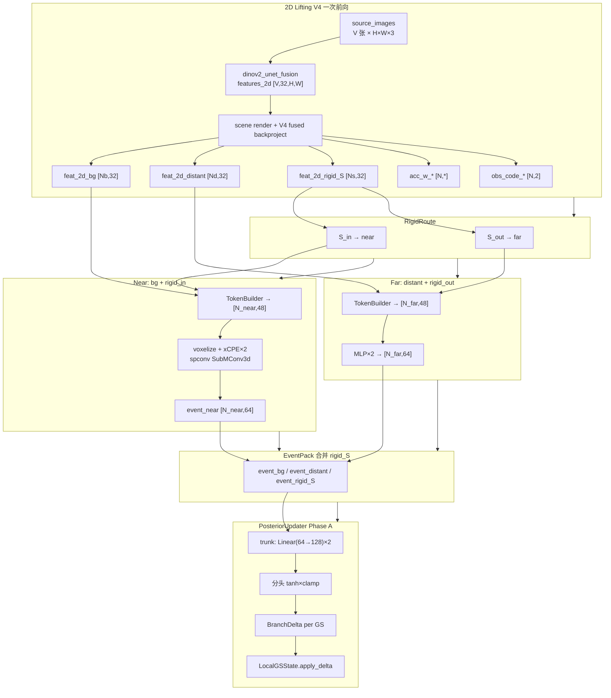

# StreetForward Stage6_0 + TrainScheduler V9 实现说明

本文基于**当前暂存区（staged）改动**、`datasets/train_scheduler_v9.py` 与相关 trainer/dataset 代码，梳理 Phase A 训练主线、关键机制与数据结构，并用表格对比 **Stage5_4 vs Stage6_0**、**Scheduler V8 vs V9**。

---

## 1. 暂存区改动概览

分支 `sky`，暂存 8 个文件（约 **+1319 / -306** 行），核心是把 Stage6 Phase A 的「事件表示」从 **concat-MLP EventEncoder** 迁到 **结构化 Struct Event Decoder（near xCPE + far point MLP）**。

| 文件 | 变更性质 |
|------|----------|
| `configs/stage6_0_phase_a.yaml` | `struct_event_decoder` 取代 `event_encoder`/`param_encoder`；`event_encoder.enable=false`；优化器 LR 分组调整 |
| `models/streetforward/stage6_0/struct_event_decoder.py` | **新增**：`Stage6RoutedStructEventDecoder`、`Stage6NearXcpeEventDecoder`、`Stage6FarMLPEventDecoder`、`Stage6ParamObsCodec` |
| `models/streetforward/minimal_trainer_stage6_0.py` | 测量 → struct decoder → posterior updater；`from_scratch` 可训 2D frontend |
| `models/streetforward/stage6_0/__init__.py` | 导出新模块 |
| `event_encoder.py` / `phase_a_losses.py` / `posterior_updater.py` | 小改以适配 `event_dim=48`（与 token 同维）、无 `current_ctx` |
| `tests/test_minimal_stage6_0_phase_a.py` | 覆盖 struct path、配置 fast-fail、`from_scratch` |

**未在暂存区、但与本文强相关：**

- `datasets/train_scheduler_v9.py`（已在仓库）
- `models/streetforward/stage6_0/v9_role_resolver.py`
- `datasets/multi_scene_dataset_v4.py` 中 `_assemble_segment_batch_from_v9_request`

工作区另有 **已删除未暂存** 的旧文档：`docs/trainers/StreetForward_Stage6_0_Phase_A_V9_Implementation.md`（本文件为其替代/更新版）。

---

## 2. 端到端数据流（Phase A）

```mermaid
flowchart LR
  subgraph sched [TrainSchedulerV9 Phase A]
    S[state: block / episode] --> P[ViewSetRolloutBatchV9]
    P --> M[request_meta + role refs]
  end
  subgraph data [MultiSceneDatasetV4]
    M --> A["_assemble_segment_batch_from_v9_request"]
    A --> B["source_views / targets / request_meta"]
  end
  subgraph train [MinimalStreetForwardStage6_0]
    B --> R[resolve_v9_phase_a_batch]
    R --> U["inner_K unroll"]
    U --> V4[V4 measurement on evidence]
    V4 --> SD[Stage6RoutedStructEventDecoder]
    SD --> PU[Stage6PosteriorUpdater]
    PU --> LG[LocalGSState.apply_delta]
    LG --> L["block_loss + nearby_loss render"]
  end
  sched --> data --> train
```



**一个 `next_batch()` 在 Phase A 的含义：**

1. V9 在**当前 block** 上采样 `inner_K ∈ {2,4,6}`，每步固定同一 `source_frame`（evidence），`block_loss` = 该帧全相机。
2. **仅最后一步**可附加 `nearby_loss`（同 keyframe 邻帧，且不得进入 evidence）。
3. Dataset 把 plan 压成 `source_image_refs`（evidence）与带角色的 `target_image_refs`（`block_loss` / `nearby_loss`）。
4. Trainer 对 `k=0..K-1` 循环：V4 观测 → 结构事件 → 后验 delta → 渲染监督；`step_gamma` 对较早步降权。

---

## 3. 关键组件

### 3.1 TrainSchedulerV9（`datasets/train_scheduler_v9.py`）

继承 `TrainSchedulerV8`，**复用 V8 的 episode 遍历与 step_major 状态机**，但：

- 关闭 V8 的 `near_random_supervision`、`aux_feature_splat_targets`；
- `total_target_frames=1` 仅用于兼容父类初始化；
- **由 V9 自己生成** `ViewSetRolloutBatchV9`，再经 dataset 组装 batch。

**Phase（二选一）：**

| Phase | 调度语义 | 典型 loss 角色 |
|-------|----------|----------------|
| `phase_A_block_local_unroll` | 单 block 内 K 步展开，source 固定 | `evidence` + `block_loss` +（末步）`nearby_loss` |
| `phase_B_viewset_rollout` | episode 内随机 K 个 event block，时间序 | `evidence` + `prefix_loss` + `query_label`（为 Phase B 预留） |

**核心 dataclass：**

- `StepPlanV9`：每步的 `evidence_*` / `block_loss_*` / `nearby_*` / `prefix_*` / `query_*` refs 与 frame 索引。
- `ViewSetRolloutBatchV9`：整次 rollout（`inner_K`、`steps`、按步 ref 列表、`request_meta`、`leakage_check`）。
- `RefRoleV9`：`evidence` | `block_loss` | `nearby_loss` | `prefix_loss` | `query_label` | `aux_loss`。

**泄漏检查（P0 强制开启）：** nearby/query/aux 不得与 evidence 重叠；Phase A 禁止 prefix/query；组装后写入 `request_meta.leakage_check`。

### 3.2 Dataset 组装（`MultiSceneDatasetV4._assemble_segment_batch_from_v9_request`）

- `evidence_refs` → `batch["source_*"]`（`source_image_refs`）
- `block + nearby + prefix`（Phase A 仅前两者）→ `targets` + `target_image_roles`
- `query_label_refs` / `aux_loss_refs` 单独字段
- `assembly_mode = "image_ref_v9"`，`_scheduler_v9` 写入完整 plan dict

### 3.3 Stage6 Trainer（`minimal_trainer_stage6_0.py`）

- **父类**：`MinimalStreetForwardStage5_4`（仅复用 V4 反投影、`obs_code`、渲染工具）。
- **显式禁用**：`history_memory`、`update_gate`、`view_transient` 的训练路径；不跑 5_3 GRU 主循环。
- **`resolve_v9_phase_a_batch`**：把 `request_meta` / `_scheduler_v9` 解析为每步 source/target 在 batch 内的下标。
- **`LocalGSState`**：块内可写 Gaussian 状态；episode/block 末 `writeback_detached` 回 `node_state_*`。

### 3.4 Struct Event Decoder（暂存新增 `struct_event_decoder.py`）

| 子模块 | 输入点 | 机制 | 输出 |
|--------|--------|------|------|
| `Stage6ParamObsCodec` | 17 维归一化 GS 参数 + obs_code + support + branch embed | MLP，默认 detach 测量 | `param_obs` 向量（默认 24 维） |
| `Stage6NearXcpeEventDecoder` | bg + rigid **in**（near 路由） | voxelize + spconv xCPE residual | 每点 `event_dim`（默认 64） |
| `Stage6FarMLPEventDecoder` | distant + rigid **out** | per-point token + MLP | 每点 event |
| `Stage6RoutedStructEventDecoder` | `near_in` + `far_in` + `RigidRoute` | 合并为 `EventPack` | 供 `Stage6PosteriorUpdater` |

与 Stage5_3 的 `struct_decoder`（输出 GRU 输入）不同：此处输出 **event 张量**，经 **posterior updater** 直接产生 `DeltaPack`。

### 3.5 Posterior Updater

- Phase A：`input_current_ctx=false`，仅 `event` → 分分支 delta（geometry/appearance 等 scope 可配置）。
- `event_dim` 与 struct decoder 对齐（暂存配置 **64**，旧 EventEncoder 为 96）。

---

## 4. 关键数据与 batch 字段

### 4.1 ImageRef 与角色策略

```text
ImageRef = (frame_idx, cam_id)
```

`request_meta.role_policy`（V9 生成）：

| 角色 | 更新 evidence | 渲染 loss | query 标签 |
|------|---------------|-----------|------------|
| evidence | ✓ | ✗ | ✗ |
| block_loss / nearby_loss / prefix_loss | ✗ | ✓ | ✗ |
| query_label | ✗ | ✗ | ✓ |

### 4.2 Trainer 侧 `ResolvedV9PhaseABatch`

| 字段 | 含义 |
|------|------|
| `inner_K` | 本 batch 展开步数 |
| `evidence_refs_by_step[k]` | 第 k 步源视角 refs |
| `block_loss_refs_by_step[k]` | 第 k 步 block 监督 refs |
| `nearby_loss_refs_by_step[k]` | 第 k 步 nearby（Phase A 通常仅末步非空） |
| `*_source_indices_by_step` / `*_target_indices_by_step` | 映射到 `batch["source_views"]` / `batch["targets"]` 下标 |

### 4.3 测量张量（V4，来自 Stage5_4）

每步 evidence 上一次性计算：

- `feat_2d_{bg,distant,rigid_S}`、`acc_w_*`、`obs_{bg,distant,rigid_S}`（`obs_code` 维数 2）
- `route`：`S_in` / `S_out` 划分 rigid 近/远

`phase_a_mode`：

| 模式 | V4 梯度 | 可训模块 |
|------|---------|----------|
| `updater_only` | `no_grad_v4`，detach 特征 | struct decoder + posterior（+ 可选 measurement LR=0） |
| `from_scratch` | `train_2d_detach_alpha` | 上述 + `residual_unet` / `fusion_neck`（`measurement_frontend` LR） |

### 4.4 Loss 组成（Phase A）

```text
L = Σ_k γ^(K-1-k) · [ w_block · L_block(k) + w_near(k) · L_nearby(k) + λ · L_delta_reg(k) ]
```

- `w_near`：仅 `nearby_final_step_only` 且 global_step warmup 后非零。
- mask：`non_sky_non_egocar`（与 scheduler `phase_A.masks` 一致）。

---

## 5. 对比表：Stage5_4 vs Stage6_0

| 维度 | Stage5_4 | Stage6_0（Phase A，含暂存改动） |
|------|----------|----------------------------------|
| **定位** | 生产向完整 StreetForward 一步（继承 5_3） | Phase A：块内 local unroll + 后验更新，为 Phase B 铺路 |
| **调度器** | 通常 **V8**（visited episode targets） | 强制 **V9 Phase A**（`inner_K`、角色拆分） |
| **时序模型** | GRU + history_memory + update_gate | **无** GRU/history/gate 训练路径 |
| **结构解码** | `model.struct_decoder` → **GRU 输入** | `stage6_0.struct_event_decoder` → **event** → posterior |
| **观测** | V4 `obs_code`（dim=2）+ 可选注入 struct/far/gru | 同 V4；`Stage6ParamObsCodec` 替代原 `param_encoder` 摘要 |
| **Event 维度** | 走 5_3 fused 维（非单一 event_dim） | 统一 **event_dim=64** |
| **状态** | 全局 `node_state_*` + 历史缓存 | 块内 **`LocalGSState`**，block 末 detached writeback |
| **监督** | V8 target 帧集合（visited + 扩展） | 每步 **block_loss**（source 全 cam）+ 末步 **nearby_loss** |
| **VSM / Query** | 视配置 | Phase A **禁止** |
| **配置 stage** | `model.stage: "5_4"` | `model.stage: "6_0"`，`model.phase: phase_A_block_local_unroll` |
| **train_step** | 5_3 完整 pipeline（多阶段 loss） | 自定义：仅 forward 内 unroll + 单一 optimizer |

---

## 6. 对比表：TrainScheduler V8 vs V9

| 维度 | V8 | V9 |
|------|----|----|
| **继承** | V7 traversal + `step_major` | **extends V8**，复用状态机 |
| **Episode 窗口** | `W = E`（无 future rolling target） | 同（底层仍 `blocks_per_episode`） |
| **Target 语义** | **visited episode frames** 动态扩展 | Phase A：**按角色固定 refs**（非 visited 集合语义） |
| **单步输出** | 扁平 `source` + `target_image_refs` | `ViewSetRolloutBatchV9` + 分步 `*_refs_by_step` |
| **展开** | `steps_per_block` 驱动 block 重复 | Phase A 额外 **`inner_K`** 每 batch 采样 |
| **Nearby** | `near_random_supervision`（可选，并入 target） | **`nearby_loss` 角色**，禁止进 evidence；末步-only 等 P0 约束 |
| **Phase B** | 无内建 | `prefix_loss` + `query_label`（held-out）、VSM reset 策略 |
| **泄漏防护** | 依赖 target 构造逻辑 | 显式 **`leakage_check`** + `validate_v9_plan` |
| **Dataset API** | `_assemble_segment_batch_from_image_refs` | **`_assemble_segment_batch_from_v9_request`** + `assembly_mode=image_ref_v9` |
| **Preload** | block/episode warm | 额外 **`warm_v9_role_refs`**（按角色 refs 预热） |
| **Trainer 消费** | 5_x 按 target 列表训练 | Stage6 **`resolve_v9_phase_a_batch`** 解析角色 |

**语义对照（Phase A 一步）：**

```text
V8:  source = 当前 block source frame
      target = visited frames in episode（可含历史 block 的 source）

V9:  evidence = 当前 block 固定 source（全 cam）
      block_loss = 同一帧（全 cam，监督用）
      nearby_loss = 同 keyframe 其它帧（仅 inner 最后一步，且 ∉ evidence）
```

---

## 7. 配置与入口

- 主配置：`configs/stage6_0_phase_a.yaml`
  - `scheduler_v9.*`：Phase A block/nearby/masks/leakage
  - `model.stage6_0.struct_event_decoder`：near xcpe / far point_mlp / token / param_obs_codec
  - `optimizer.lr`：`struct_event_decoder_near|far`、`param_obs_codec`、`posterior_updater`、`measurement_frontend`

- 测试：`tests/test_minimal_stage6_0_phase_a.py`、`tests/test_train_scheduler_v9.py`

---

## 8. 阅读顺序建议

1. `datasets/train_scheduler_v9.py` — `_build_phase_a_block_unroll_plan`、`_build_request_meta_v9`
2. `datasets/multi_scene_dataset_v4.py` — `_assemble_segment_batch_from_v9_request`
3. `models/streetforward/stage6_0/v9_role_resolver.py`
4. `models/streetforward/minimal_trainer_stage6_0.py` — `forward` / `train_step`
5. `models/streetforward/stage6_0/struct_event_decoder.py` — 暂存核心新增

---

## 9. Phase B 预留（未在暂存 trainer 中实现训练）

Scheduler V9 `phase_B_viewset_rollout` 与配置中 `phase_B.*` 已定义：`prefix_loss`、`query_label`、VSM scope；Stage6 配置保留 `posterior_updater.phase_b_hooks`、`query_decoder`、`vsm` 等开关，但 Phase A trainer **fast-fail 禁止** 启用。Phase B 训练需另接 `resolve_v9_phase_b` 与对应 forward（当前仓库以 Phase A 为主）。

---

## 10. 2D Lifting → Near xCPE / Far MLP → Event → Δ（Stage6_0）

本节只讲 **单步 unroll** 内、在 evidence 源视角上的测量与更新链。符号：\(N_b,N_d,N_r\) 为 bg/distant/rigid 全点数；\(N_s=|S|\) 为当前源帧可见 rigid 源点；\(N_{in},N_{out}\) 为 rigid 路由 inside/outside 子集。

**默认配置维度**（`configs/stage6_0_phase_a.yaml`）：`feat_2d_channels=32`，`sh_degree=1`，`event_dim=token_dim=48`，`param_obs` 输出 24，`stage_hidden_dim=48`，updater trunk `hidden_dim=96`。

### 10.1 总结构图



**Phase A 无 `ctx` 路径**：`current_context_adapter.enable=false`，`posterior_updater.input_current_ctx=false`，`ctx_vsm=None`。Updater 的输入 **`ctx_in = event`**（不是单独的 ctx 张量）。

### 10.2 阶段 A：2D Lifting（与 5_4 共用测量前端）

入口：`MinimalStreetForwardStage6_0._observe_v4_measurement` → `_compute_2d_features_all_branches_once_routed`（继承自 4_6/5_4 链路）。

| 步骤 | 模块 | 输入形状 | 输出形状 | 说明 |
|------|------|----------|----------|------|
| 渲染 CNN 输入 | `_render_source_scene_only_for_cnn` | 多 cam RGB + mask | `features_2d` **[V, 32, H, W]** | DINOv2+UNet fusion，`out_channels=32` |
| 场景反投影 | `AlphaTWeightExtractorV4` + fused CUDA | `gaussians_scene` 拼接 bg+distant+rigid@S | 见下表 | `return_obs_code=True` |
| 按分支切分 | slice by `num_bg, num_distant, num_rigid_S` | `[N_total, 32]` | 分支张量 | `N_total = N_b + N_d + N_s` |

**反投影 per-Gaussian 输出（Stage6 默认 `detach_v4_outputs` 时特征/obs/acc 可 detach）：**

| 张量 | 形状 | 语义 |
|------|------|------|
| `feat_2d_bg` | `[N_b, 32]` | 源视角聚合的 2D 特征 |
| `feat_2d_distant` | `[N_d, 32]` | 同上 |
| `feat_2d_rigid_S` | `[N_s, 32]` | 仅源帧可见 rigid 点 |
| `acc_w_bg` / `acc_w_distant` / `acc_w_rigid_S` | `[N_*]` 或 `[N_*,1]` | 反投影累积权重（support） |
| `obs_code_*` | `[N_*, 2]` | V4 的 per-point 观测码（α、t 等，dim=2） |

**Rigid 路由（与 5_4 相同）：**

| 集合 | 大小 | 解码器 |
|------|------|--------|
| `route.S` | `N_s` | 源帧可见 rigid 索引 |
| `route.S_in` + `inside_mask_S` | `N_in` | **Near**（与 bg 一起 xCPE） |
| `route.S_out` | `N_out` | **Far** MLP（与 distant 一起） |

### 10.3 阶段 B：组装 `Stage6StructInput`

| 路径 | `coords` 来源 | `split_0` | `split_1` | 点数 `N` |
|------|---------------|-----------|-----------|----------|
| **near_in** | bg.means + rigid world@S_in | `N_b` | `N_in` | `N_b + N_in` |
| **far_in** | distant.means + rigid world@S_out | `N_d` | `N_out` | `N_d + N_out` |

每点共享字段（near/far 各自拼接）：

| 字段 | 形状 | 备注 |
|------|------|------|
| `feat_2d` | `[N, 32]` | 无效点可 `zero_invalid_2d_feat` |
| `acc_w` | `[N]` | support |
| `obs_code` | `[N, 2]` | 进入 ParamObsCodec，不直接加在 feat 上 |
| `branch_id` | `[N]` long | near/far 内 **0=distant/bg侧, 1=rigid侧**（各路径局部编码） |
| `params_for_embed` | 字典，每键 `[N, *]` | 由 `_build_params_for_embed` / rigid world 版本生成 |

**`normalize_params_for_embed` → `param_vec`：**

| 分量 | 维数 |
|------|------|
| means_norm | 3 |
| rot6d | 6 |
| scales_norm | 3 |
| opacity_norm | 1 |
| sh_dc | 3 |
| sh_rest_energy | 1 |
| **合计 `raw_param_dim`** | **17** |

### 10.4 阶段 C：`Stage6ParamObsCodec`（near/far 共享权重）

| 输入 | 形状 |
|------|------|
| `param_vec` | `[N, 17]` |
| `obs_code` | `[N, 2]` |
| `support` | `[N, 2]` = `[log1p(acc_w), (acc_w>0)]` |
| `branch_embed(branch_id)` | `[N, 4]` |

| 运算 | 形状 |
|------|------|
| `cat` → MLP | `[N, 25]` → `[N, 24]` |
| 输出 **`param_obs`** | **`[N, 24]`** |

### 10.5 阶段 D：`Stage6StructTokenBuilder` → per-point token

对各分支 **相加** 再 `LayerNorm`（配置全为 true）：

| 支路 | 投影 |
|------|------|
| `feat_2d` | Linear(32 → **48**) |
| `param_obs` | Linear(24 → **48**) |
| support | Linear(2→4) → GELU → Linear(4 → **48**) |
| branch | Embedding(2,4) → Linear(4 → **48**) |

| 输出 | 形状 |
|------|------|
| **`token` / `point_feat`** | **`[N, 48]`** |

**有效点掩码：** `valid = (acc_w > support_threshold_branch)`，阈值来自 `meta.support_threshold_*`。

### 10.6 阶段 E-Near：xCPE（仅 near_in）

| 步骤 | 张量形状 | 说明 |
|------|----------|------|
| 点特征 | `[N_near, 48]` | 上一步 token |
| voxel `scatter_mean` | `[N_vox, 48]` | `voxel_size=0.25`，AABB 内网格 |
| xCPE block ×2 | `[N_vox, 48]` → 点域 residual | `SubMConv3d k=3` + 点侧 Linear |
| 点特征更新 | `[N_near, 48]` | `point_feat += scale * voxel_delta[inverse]` |
| **`event_norm`** | `[N_near, 48]` → **`[N_near, 48]`** | xCPE 后仅 `LayerNorm(48)`，无额外 MLP 扩维 |

输出切片：`event_bg [N_b,48]`，`event_rigid_in [N_in,48]`（若有）。

### 10.7 阶段 E-Far：Point MLP（仅 far_in）

| 步骤 | 形状 |
|------|------|
| token（同 builder + ParamObsCodec） | `[N_far, 48]` |
| MLP | `[N_far, 48]` → **`[N_far, 48]`** | 中间维默认 48，`event_dim==token_dim` |

输出切片：`event_distant [N_d,48]`，`event_rigid_out [N_out,48]`。

### 10.8 阶段 F：`EventPack`（rigid 拼回 S 轴）

| 字段 | 形状 |
|------|------|
| `event_bg` | `[N_b, 64]` |
| `event_distant` | `[N_d, 64]` 或 None |
| `event_rigid` / `event_rigid_S` | `[N_s, 64]` | `inside→near`, `outside→far` 填回 |
| `valid_*` / `support_*` / `obs_code_*` | 与 event 同行 |

### 10.9 阶段 G：PosteriorUpdater → `BranchDelta` → 状态

**Phase A 输入：** `event` 各分支 `[N_branch, 64]`，`ctx_current=None`，`ctx_vsm=None`。

| 模块 | 输入 → 输出 |
|------|-------------|
| `trunk` | `[N, 48]` → `[N, 96]`（2× Linear+LN+GELU） |
| `noop` | `[N, 1]` sigmoid；`gate = 1 - noop` |
| `head_means` | `[N, 3]`，`gate * 0.25 * tanh(·)` |
| `head_scales` | `[N, 3]`，`gate * 0.08 * tanh(·)` |
| `head_quat` | `[N, 3]` 轴角，`gate * 0.08 * tanh(·)` |
| `head_opacity` | `[N, 1]` |
| `head_sh` | `[N, 12]` | `sh_degree=1` → bases=4，×3 |
| `head_hidden` | `[N, 48]` | 写入 `LocalBranchState.hidden` |
| `head_confidence` | `[N, 1]` | 监督用统计，不进几何累加 |

**`LocalGSState.apply_delta`（每分支）：**

| 状态量 | 更新 |
|--------|------|
| `means` | `+ delta.means` |
| `scales_log` | `+ delta.scales_log` |
| `quats` | `quat_multiply(q, axis_angle_to_quat(delta))` |
| `opacity_logit` | `+ delta.opacity_logit` |
| `sh_dc` / `sh_rest` | 从 `delta.sh [N,12]` 拆成 DC + rest |
| `hidden` | `+ delta.hidden` **`[N,32]`** |

Rigid 子集 delta 先按 `route.S` 索引，再 **`_expand_branch_delta` 填回** `[N_r, ·]`。

**`branch_scope`（Phase A 默认）：** distant 不更新 means/scales/quat，只更新 opacity+SH；bg/rigid 几何+外观全开（见 yaml）。

### 10.10 与 Stage5_4 对比（同一段 pipeline）

| 环节 | Stage5_4 | Stage6_0 Phase A |
|------|----------|------------------|
| **2D 前端** | 同 V4 lifting + `obs_code [N,2]` | 同；可选 `from_scratch` 训 UNet/fusion |
| **obs 注入 feat** | **`feat_2d += CurrentObsEmbed(obs)`**（struct/far/gru/gate 分路） | **不注入**；obs 进 `ParamObsCodec` |
| **GS 参数进结构头** | Token 内 **Linear(17→param_embed→channels)** | **ParamObsCodec：17+obs+support+branch → 24** |
| **Near 输出** | `StreetForwardXCPEDecoder` → **`feat [N,64]`**（`fused_in_dim=sparse32+feat32`） | xCPE → **`event [N,64]`** |
| **Far 输出** | `FarBranchMLPStructDecoder` → **`feat [N,64]`**（可 +history_embed 16） | MLP → **`event [N,64]`**（无 history） |
| **Token 宽度** | `channels=64`（5_4 prod cfg） | **`token_dim=48`** |
| **下游** | **GRU**(`feat64`+`h48`) → offset 网络 → 直接改 `node_state` | **PosteriorUpdater**：`event64` → **Δ** → **`LocalGSState`** |
| **ctx** | `h_old`、history、view_transient 进 gate/GRU | Phase A **无 ctx**；`event` 即 updater 输入 |
| **时序** | block 级 GRU + history_memory | block 内 **K 步** local unroll，无 GRU |
| **训练范围** | 全链路一步 `train_step` | 仅 measurement + struct_event + posterior（父类 GRU 不跑） |

**结构对比（简图）：**

```text
Stage5_4:
  lift → (feat+obs_embed) → struct_near/far → feat_64 ─┬→ GRU(h_48) → offsets → node_state
                                                        └→ update_gate(history, view, …)

Stage6_0 Phase A:
  lift → feat_32 + obs_2 (分离) → ParamObsCodec → token_48
       → near_xCPE / far_MLP → event_64 → PosteriorUpdater → Δ → LocalGSState
```

### 10.11 配置与代码索引

| 主题 | 文件 |
|------|------|
| 2D + V4 反投影 | `minimal_trainer_stage4_6.py` `_compute_2d_features_all_branches_once_routed` |
| 5_4 obs 加 feat | `minimal_trainer_stage5_4.py` `_apply_obs_feat_add` |
| Stage6 测量 + 组装输入 | `minimal_trainer_stage6_0.py` `_observe_v4_measurement`, `_build_stage6_struct_input_*` |
| Token / xCPE / far / 路由合并 | `stage6_0/struct_event_decoder.py` |
| Event → Δ | `stage6_0/posterior_updater.py` |
| 状态写回 | `stage6_0/local_gs_state.py` |
| 17 维参数归一化 | `struct_decoders/common.py` `normalize_params_for_embed` |
